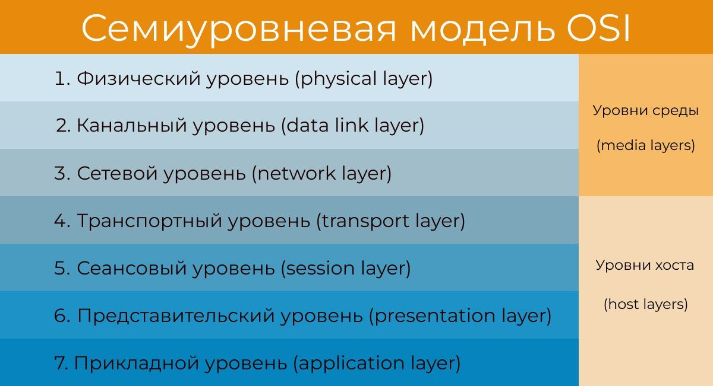
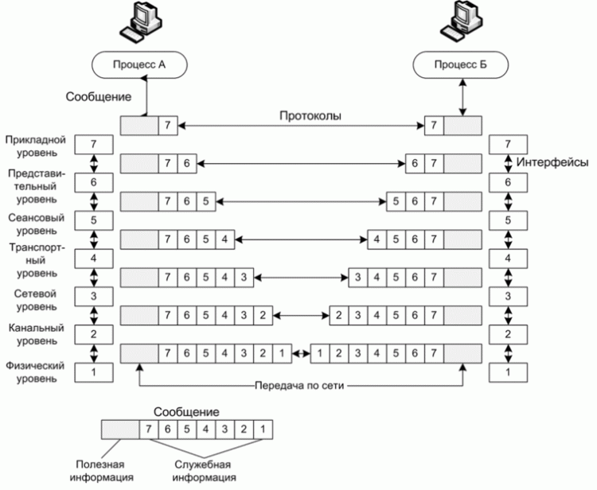
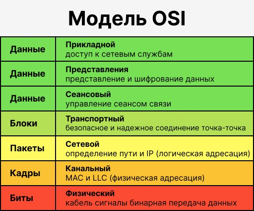
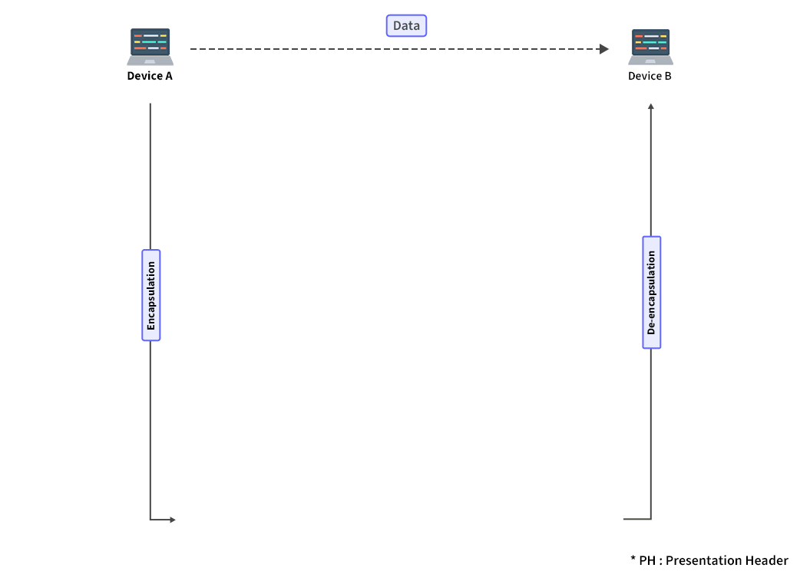

# Сетевая модель OSI

## Общие сведения

Сетевая модель OSI (The Open Systems Interconnection model) — сетевая модель стека сетевых протоколов OSI/ISO. Посредством данной модели различные сетевые устройства могут взаимодействовать друг с другом. Модель определяет различные уровни взаимодействия систем, каждый из которых выполняет определённые функции.

> **Модель OSI** — эталонная модель взаимодействия открытых систем, описывающая семь уровней сетевого взаимодействия от физической передачи сигналов до работы приложений.

> **Стек протоколов** — иерархически организованный набор сетевых протоколов, где протоколы каждого уровня используют функции нижележащего уровня.

Модель OSI была разработана в конце 1970-х годов для поддержания разнообразных методов компьютерных сетей, которые в то время конкурировали за применение в крупных национальных сетевых взаимодействиях во Франции, Великобритании и США. В 1980-х годах она стала рабочим продуктом группы взаимодействия открытых систем Международной организации по стандартизации (ISO). Модель не смогла дать полное описание сети и не получила поддержку архитекторов на заре Интернета, который впоследствии нашёл отражение в менее предписывающем TCP/IP, в основном под руководством Инженерного совета Интернета (IETF).

Рис. 1 — Диаграмма уровней сетевой модели OSI

---

## Стандарты

Модель OSI, определённая в серии стандартов ISO/IEC 7498, состоит из следующих частей:

- ISO/IEC 7498-1 — базовая модель;
- ISO/IEC 7498-2 — архитектура безопасности;
- ISO/IEC 7498-3 — наименования и адресация;
- ISO/IEC 7498-4 — система менеджмента.

ISO/IEC 7498-1 также опубликован в качестве Рекомендации МСЭ-Т X.200. Некоторые спецификации протокола также были доступны в рамках других Рекомендаций МСЭ-Т серии X. Эквивалентные стандарты ISO и ISO/IEC для модели OSI были доступны в ISO. Не все из них бесплатны.

---

## Основные принципы

<mark><strong>Протоколы связи позволяют структуре на одном хосте взаимодействовать с соответствующей структурой того же уровня на другом хосте.</strong></mark>

> **Хост** — <mark><strong>устройство, являющееся конечной точкой сетевого взаимодействия (клиент или сервер), в отличие от промежуточных устройств (маршрутизаторов, коммутаторов).</strong></mark>

> **PDU (Protocol Data Unit)** — протокольный блок данных, единица информации, передаваемая между сущностями одного уровня.

> **SDU (Service Data Unit)** — сервисный блок данных, единица информации, передаваемая между соседними уровнями внутри одной системы.

На каждом уровне $N$ два объекта обмениваются блоками данных (PDU) с помощью протокола данного уровня на соответствующих устройствах. Каждый PDU содержит блок служебных данных (SDU), связанный с верхним или нижним протоколом.

Обработка данных двумя взаимодействующими OSI-совместимыми устройствами происходит следующим образом:

1. Передаваемые данные составляются на самом верхнем уровне передающего устройства (уровень $N$) в протокольный блок данных (PDU).
2. PDU передаётся на уровень $N-1$, где он становится сервисным блоком данных (SDU).
3. На уровне $N-1$ SDU объединяется с верхним, нижним или обоими уровнями, создавая слой $N-1$ PDU. Затем он передаётся в слой $N-2$.
4. Процесс продолжается до достижения самого нижнего уровня, с которого данные передаются на принимающее устройство.
5. На приёмном устройстве данные передаются от самого низкого уровня к самому высокому в виде серии SDU, последовательно удаляясь из верхнего или нижнего колонтитула каждого слоя до достижения самого верхнего уровня, где принимаются последние данные.

---

## Уровни модели OSI

### Общая таблица уровней

| Уровень | Тип данных (PDU) | Функции | Примеры | Оборудование |
|---------|-------------------|---------|---------|--------------|
| **7. Прикладной** (application) | Данные | Доступ к сетевым службам | HTTP, FTP, POP3, SMTP, WebSocket | Хосты (клиенты сети), межсетевой экран |
| **6. Представления** (presentation) | Данные | Представление и шифрование данных | EBCDIC, ASCII | Хосты |
| **5. Сеансовый** (session) | Данные | Управление сеансом связи | RPC, PAP, L2TP, gRPC | Хосты |
| **4. Транспортный** (transport) | Сегменты / Датаграммы | Прямая связь между конечными пунктами и надёжность | TCP, UDP, SCTP, порты | Хосты |
| **3. Сетевой** (network) | Пакеты | Определение маршрута и логическая адресация | IPv4, IPv6, IPsec, AppleTalk, ICMP | Маршрутизатор, сетевой шлюз, межсетевой экран |
| **2. Канальный** (data link) | Биты / Кадры | Физическая адресация | PPP, IEEE 802.22, Ethernet, DSL, ARP, сетевая карта | Сетевой мост, коммутатор, точка доступа |
| **1. Физический** (physical) | Биты | Работа со средой передачи, сигналами и двоичными данными | USB, RJ (витая пара, коаксиальный, оптоволоконный), радиоканал | Концентратор, повторитель |

В литературе наиболее часто принято начинать описание уровней модели OSI с седьмого уровня — прикладного, на котором пользовательские приложения обращаются к сети. Модель OSI заканчивается первым уровнем — физическим, на котором определены стандарты, предъявляемые независимыми производителями к средам передачи данных:

- тип передающей среды (медный кабель, оптоволокно, радиоэфир и др.);
- тип модуляции сигнала;
- сигнальные уровни логических дискретных состояний (нули и единицы).

<mark><strong>Любой протокол модели OSI должен взаимодействовать либо с протоколами своего уровня, либо с протоколами на единицу выше и/или ниже своего уровня.</strong></mark> Взаимодействия с протоколами своего уровня называются горизонтальными, а с уровнями на единицу выше или ниже — вертикальными. Любой протокол модели OSI может выполнять только функции своего уровня и не может выполнять функций другого уровня, что не выполняется в протоколах альтернативных моделей.

<mark><strong>Каждому уровню с некоторой долей условности соответствует свой операнд — логически неделимый элемент данных, которым на отдельном уровне можно оперировать в рамках модели</strong></mark> и используемых протоколов:

- на физическом уровне мельчайшая единица — бит;
- на канальном уровне информация объединена в кадры;
- на сетевом — в пакеты (датаграммы);
- на транспортном — в сегменты.

Любой фрагмент данных, логически объединённых для передачи — кадр, пакет, датаграмма — считается сообщением. Именно сообщения в общем виде являются операндами сеансового, представления и прикладного уровней.

К базовым сетевым технологиям относятся физический и канальный уровни.

### ПРИМЕР

Мы можем понять, как данные проходят через модель OSI, с помощью примера, приведённого ниже. Предположим, что человек A отправляет электронное письмо своему другу — человеку B.

Шаг 1: Человек A работает с почтовым приложением, таким как Gmail, Outlook и т. п. Пишет письмо, которое хочет отправить. (Это происходит на прикладном уровне.)

Шаг 2: На уровне <mark><strong>представления</strong></mark> почтовое приложение подготавливает данные к передаче: <mark>шифрует их и форматирует для отправки.</mark>

Шаг 3: На <mark><strong>сеансовом</strong></mark> уровне <mark>устанавливается соединение между отправителем и получателем в интернете.</mark>

Шаг 4: На <mark><strong>транспортном</strong></mark> уровне данные письма <mark>разбиваются на более мелкие сегменты. К ним добавляются порядковый номер и информация для проверки ошибок</mark>, чтобы обеспечить надёжность передачи.

Шаг 5: На <mark><strong>сетевом</strong></mark> уровне <mark>выполняется адресация пакетов, чтобы найти наилучший маршрут</mark> для передачи.

Шаг 6: На <mark><strong>канальном</strong></mark> уровне <mark>пакеты данных инкапсулируются в кадры, затем добавляется MAC-адрес для локальных устройств</mark>, после чего выполняется проверка на наличие ошибок с помощью средств обнаружения ошибок.

Шаг 7: На <mark><strong>физическом</strong></mark> уровне кадры <mark>передаются в виде электрических или оптических сигналов по физической среде передачи</mark>, например по кабелю Ethernet или через WiFi.

После того как письмо достигает получателя, то есть человека B, процесс пойдёт в обратном направлении, и содержимое письма будет расшифровано. В итоге письмо отобразится в почтовом клиенте человека B.

---

### Прикладной уровень (7)

> **Прикладной уровень** —<mark><strong> верхний уровень модели, обеспечивающий взаимодействие пользовательских приложений с сетью.</strong></mark>

Функции:

- позволяет приложениям использовать сетевые службы: удалённый доступ к файлам и базам данных, пересылка электронной почты;
- отвечает за передачу служебной информации;
- предоставляет приложениям информацию об ошибках;
- формирует запросы к уровню представления.

<mark><strong>Протоколы прикладного уровня:</strong></mark> RDP, HTTP, SMTP, SNMP, POP3, FTP, XMPP, OSCAR, Modbus, SIP, TELNET и другие.

<mark><strong>Определения протокола прикладного уровня и уровня представления очень размыты, и принадлежность протокола к тому или иному уровню (например, протокола HTTPS) зависит от конечного сервиса</strong></mark>, который предоставляет приложение.

> В том случае, если протокол HTTPS используется для просмотра некой простой интернет-страницы через браузер, его можно рассматривать как протокол прикладного уровня. Если же протокол HTTPS используется как низкоуровневый протокол для передачи финансовой информации, например, по протоколу ISO 8583, то протокол HTTPS будет являться протоколом уровня представления, а протокол ISO 8583 — протоколом уровня приложения. То же касается иных протоколов прикладного уровня.

---

### Уровень представления (6)

> **Уровень представления** — <mark><strong>уровень, обеспечивающий преобразование протоколов и кодирование/декодирование данных.</strong></mark>

Запросы приложений, полученные с прикладного уровня, на уровне представления преобразуются в формат для передачи по сети, а полученные из сети данные преобразуются в формат приложений. <mark><strong>На этом уровне может осуществляться сжатие/распаковка или шифрование/дешифрование, а также перенаправление запросов другому сетевому ресурсу, если они не могут быть обработаны локально.</strong></mark>

Уровень представления обычно представляет собой промежуточный протокол для преобразования информации из соседних уровней. Это позволяет осуществлять обмен между приложениями на разнородных компьютерных системах прозрачным для приложений образом. Уровень представления обеспечивает форматирование и преобразование кода. Форматирование кода используется для того, чтобы гарантировать приложению поступление информации для обработки, которая имела бы для него смысл. При необходимости этот уровень может выполнять перевод из одного формата данных в другой.

<mark><strong>Уровень представления имеет дело не только с форматами и представлением данных, но также занимается структурами данных, которые используются программами. Таким образом, уровень 6 обеспечивает организацию данных при их пересылке.</strong></mark>

Чтобы понять, как это работает, представим, что имеются две системы. Одна использует для представления данных расширенный двоичный код обмена информацией EBCDIC (например, мейнфрейм компании IBM), а другая — американский стандартный код обмена информацией ASCII (его использует большинство других производителей компьютеров). Если этим двум системам необходимо обменяться информацией, то нужен уровень представления, который выполнит преобразование и осуществит перевод между двумя различными форматами.

Другой функцией уровня представления является шифрование данных, которое применяется в тех случаях, когда необходимо защитить передаваемую информацию от доступа несанкционированными получателями. Чтобы решить эту задачу, процессы и коды, находящиеся на уровне представления, должны выполнить преобразование данных. На этом уровне существуют и другие подпрограммы, которые сжимают тексты и преобразовывают графические изображения в битовые потоки, так, что они могут передаваться по сети.

<mark><strong>Стандарты уровня представления также определяют способы представления графических изображений:</strong></mark>

- формат PICT — формат изображений, применяемый для передачи графики QuickDraw между программами;
- формат TIFF — тэгированный формат файлов изображений, обычно используется для растровых изображений с высоким разрешением;
- стандарт JPEG, разработанный Объединённой экспертной группой по фотографии (Joint Photographic Expert Group).

<mark><strong>Существует другая группа стандартов уровня представления, которая определяет представление звука и кинофрагментов:</strong></mark>

- MIDI (англ. Musical Instrument Digital Interface) — интерфейс электронных музыкальных инструментов для цифрового представления музыки;
- MPEG — стандарт, разработанный Экспертной группой по кинематографии, используемый для сжатия и кодирования видеороликов на компакт-дисках, хранения в оцифрованном виде и передачи со скоростями до 1,5 Мбит/с;
- QuickTime — стандарт, описывающий звуковые и видеоэлементы для программ, выполняемых на компьютерах Macintosh и PowerPC.

Протоколы уровня представления: AFP — Apple Filing Protocol, ICA — Independent Computing Architecture, LPP — Lightweight Presentation Protocol, NCP — NetWare Core Protocol, NDR — Network Data Representation, XDR — eXternal Data Representation, X.25 PAD — Packet Assembler/Disassembler Protocol.

---

### Сеансовый уровень (5)

> **Сеансовый уровень** — <mark><strong>уровень, обеспечивающий поддержание сеанса связи и позволяющий приложениям взаимодействовать между собой длительное время.</strong></mark>

Уровень управляет:

- созданием/завершением сеанса;
- обменом информацией;
- синхронизацией задач;
- определением права на передачу данных;
- поддержанием сеанса в периоды неактивности приложений.

Протоколы сеансового уровня: H.245 (Call Control Protocol for Multimedia Communication), ISO-SP (OSI Session Layer Protocol (X.225, ISO 8327)), iSNS (Internet Storage Name Service), L2F (Layer 2 Forwarding Protocol), L2TP (Layer 2 Tunneling Protocol), NetBIOS (Network Basic Input Output System), PAP (Password Authentication Protocol), PPTP (Point-to-Point Tunneling Protocol), RPC (Remote Procedure Call Protocol), RTCP (Real-time Transport Control Protocol), SMPP (Short Message Peer-to-Peer), SCP (Session Control Protocol), ZIP (Zone Information Protocol), SDP (Sockets Direct Protocol).

---

### Транспортный уровень (4)

> **Транспортный уровень** — <mark><strong>уровень, предназначенный для обеспечения надёжной передачи данных от отправителя к получателю.</strong></mark>

При этом у<mark><strong>ровень надёжности может варьировать в широких пределах.</strong></mark> Существует множество классов протоколов транспортного уровня: от протоколов, предоставляющих только основные транспортные функции (например, функции передачи данных без подтверждения приёма), до протоколов, которые:

- гарантируют доставку в пункт назначения нескольких пакетов данных в надлежащей последовательности;
- мультиплексируют несколько потоков данных;
- обеспечивают механизм управления потоками данных;
- гарантируют достоверность принятых данных.

Например, <mark><strong>UDP ограничивается контролем целостности данных в рамках одной датаграммы</strong></mark> и не исключает возможности потери пакета целиком, дублирования пакетов или нарушения порядка получения пакетов данных.<mark><strong> TCP обеспечивает надёжную непрерывную передачу данных, исключающую потерю данных, нарушение порядка их поступления или дублирование; может перераспределять данные, разбивая большие порции данных на фрагменты и наоборот, склеивая фрагменты в один пакет.</strong></mark>

Протоколы транспортного уровня: ATP (AppleTalk Transaction Protocol), CUDP (Cyclic UDP), DCCP (Datagram Congestion Control Protocol), FCP (Fibre Channel Protocol), IL (IL Protocol), NBF (NetBIOS Frames protocol), NCP (NetWare Core Protocol), SCTP (Stream Control Transmission Protocol), SPX (Sequenced Packet Exchange), SST (Structured Stream Transport), TCP (Transmission Control Protocol), UDP (User Datagram Protocol).

---

### Сетевой уровень (3)

> **Сетевой уровень** — <mark><strong>уровень, предназначенный для определения пути передачи данных.</strong></mark>

Отвечает за:

- <mark><strong>трансляцию логических адресов и имён в физические</strong></mark>;
- <mark><strong>определение кратчайших маршрутов;</strong></mark>
- отслеживание неполадок и «заторов» в сети.

<mark><strong>Протоколы сетевого уровня маршрутизируют данные от источника к получателю.</strong></mark> Работающие на этом уровне устройства (маршрутизаторы) условно называют устройствами третьего уровня (по номеру уровня в модели OSI).

Протоколы сетевого уровня: IP/IPv4/IPv6 (Internet Protocol), IPX (Internetwork Packet Exchange, протокол межсетевого обмена), X.25 (частично этот протокол реализован на уровне 2), CLNP (сетевой протокол без организации соединений), IPsec (Internet Protocol Security).

Протоколы маршрутизации: RIP (Routing Information Protocol), OSPF (Open Shortest Path First).

---

### Канальный уровень (2)

> **Канальный уровень** — <mark><strong>уровень, предназначенный для обеспечения взаимодействия сетей на физическом уровне и контроля ошибок, которые могут возникнуть.</strong></mark>

Полученные с физического уровня данные, представленные в битах, канальный уровень упаковывает в кадры, проверяет их на целостность и, если нужно, исправляет ошибки (либо формирует повторный запрос повреждённого кадра) и отправляет на сетевой уровень. Канальный уровень может взаимодействовать с одним или несколькими физическими уровнями, контролируя и управляя этим взаимодействием.

Спецификация IEEE 802 разделяет этот уровень на два подуровня:

- **MAC** (англ. media access control) — <mark><strong>регулирует доступ к разделяемой физической среде;</strong></mark>
- **LLC** (англ. logical link control) — <mark><strong>обеспечивает обслуживание сетевого уровня.</strong></mark>

<mark><strong>На этом уровне работают коммутаторы, мосты и другие устройства. Эти устройства используют адресацию второго уровня</strong></mark> (по номеру уровня в модели OSI).

Протоколы канального уровня: ARCnet, ATM, Controller Area Network (CAN), Econet, IEEE 802.3 (Ethernet), Ethernet Automatic Protection Switching (EAPS), Fiber Distributed Data Interface (FDDI), Frame Relay, High-Level Data Link Control (HDLC), IEEE 802.2 (предоставляет функции LLC для подуровня IEEE 802 MAC), Link Access Procedures, D channel (LAPD), IEEE 802.11 wireless LAN, LocalTalk, Multiprotocol Label Switching (MPLS), Point-to-Point Protocol (PPP), Point-to-Point Protocol over Ethernet (PPPoE), Serial Line Internet Protocol (SLIP, устарел), StarLan, Token ring, Unidirectional Link Detection (UDLD), X.25, ARP.

При разработке стеков протоколов на этом уровне решаются задачи помехоустойчивого кодирования. К таким способам кодирования относятся код Хемминга, блочное кодирование, код Рида — Соломона.

В программировании этот уровень представляет драйвер сетевой платы, в операционных системах имеется программный интерфейс взаимодействия канального и сетевого уровней между собой. Это не новый уровень, а просто реализация модели для конкретной ОС. Примеры таких интерфейсов: ODI, NDIS, UDI.

---

### Физический уровень (1)

> **Физический уровень** — <mark><strong>нижний уровень модели, который определяет метод передачи данных, представленных в двоичном виде, от одного устройства (компьютера) к другому.</strong></mark>

Составлением таких методов занимаются разные организации, в том числе: Институт инженеров по электротехнике и электронике, Альянс электронной промышленности, Европейский институт телекоммуникационных стандартов и другие. <mark><strong>Осуществляют передачу электрических или оптических сигналов в кабель или в радиоэфир и, соответственно, их приём и преобразование в биты данных в соответствии с методами кодирования цифровых сигналов.</strong></mark>

На этом уровне также работают концентраторы, повторители сигнала и медиаконвертеры.

<mark><strong>Функции физического уровня реализуются на всех устройствах, подключённых к сети.</strong></mark> Со стороны компьютера функции физического уровня выполняются сетевым адаптером или последовательным портом. К физическому уровню относятся физические, электрические и механические интерфейсы между двумя системами. <mark><strong>Физический уровень определяет такие виды сред передачи данных, как оптоволокно, витая пара, коаксиальный кабель, спутниковый канал передач данных и т. п</strong></mark>.<mark><strong> Стандартными типами сетевых интерфейсов, относящимися к физическому уровню, являются:</strong></mark> V.35, RS-232, RS-485, RJ-11, RJ-45, разъёмы AUI и BNC.

При разработке стеков протоколов на этом уровне решаются задачи синхронизации и линейного кодирования. К таким способам кодирования относятся код NRZ, код RZ, MLT-3, PAM5, Манчестер II.

Протоколы физического уровня: IEEE 802.15 (Bluetooth), IRDA, EIA RS-232, EIA-422, EIA-423, RS-449, RS-485, DSL, ISDN, SONET/SDH, 802.11 Wi-Fi, Etherloop, GSM Um radio interface, ряд протоколов МСЭ-Т G.hn, TransferJet, ARINC 818, G.hn/G.9960, Modbus Plus.

---

## Соответствие модели OSI и других моделей сетевого взаимодействия

Поскольку наиболее востребованными и практически используемыми стали протоколы (например TCP/IP), разработанные с использованием других моделей сетевого взаимодействия, далее описано возможное включение отдельных протоколов других моделей в различные уровни модели OSI.

### Семейство TCP/IP

Семейство TCP/IP имеет три транспортных протокола:

- **TCP** — полностью соответствует OSI, обеспечивает проверку получения данных;
- **UDP** — отвечает транспортному уровню только наличием порта, обеспечивает обмен датаграммами между приложениями, не гарантирует получения данных;
- **SCTP** — разработан для устранения некоторых недостатков TCP, в него добавлены некоторые новшества.

В семействе TCP/IP есть ещё около двухсот протоколов, самым известным из которых является служебный протокол ICMP, используемый для внутренних нужд обеспечения работы; остальные также не являются транспортными протоколами.

### Семейство IPX/SPX

В семействе IPX/SPX порты появляются в протоколе сетевого уровня IPX, обеспечивая обмен датаграммами между приложениями (операционная система резервирует часть сокетов для себя). Протокол SPX, в свою очередь, дополняет IPX всеми остальными возможностями транспортного уровня в полном соответствии с OSI.

В качестве адреса хоста IPX использует идентификатор, образованный из четырёхбайтного номера сети (назначаемого маршрутизаторами) и MAC-адреса сетевого адаптера.

---

## FAQ

**Вопрос 1: Почему модель OSI до сих пор изучают, если на практике используется TCP/IP?**

Модель OSI предоставляет эталонную концептуальную структуру для понимания принципов сетевого взаимодействия. Она разделяет функции сети на чёткие уровни, что облегчает обучение, документирование и диагностику. Несмотря на то, что TCP/IP стал де-факто стандартом, модель OSI остаётся полезным инструментом для описания и сопоставления различных протоколов.

**Вопрос 2: В чём главное отличие модели OSI от модели TCP/IP?**

Модель OSI состоит из семи уровней и была разработана как теоретическая эталонная модель до появления конкретных протоколов. Модель TCP/IP имеет четыре уровня и была создана на основе уже существующих протоколов. Кроме того, модель OSI строже разделяет функции уровней, тогда как в TCP/IP некоторые функции объединены (например, уровни представления и сеансовый отсутствуют как отдельные).

**Вопрос 3: Почему протокол HTTPS может относиться к разным уровням модели OSI?**

Это связано с тем, что принадлежность протокола к уровню зависит от контекста его использования. Если HTTPS используется как конечный сервис (просмотр веб-страницы), он выступает как протокол прикладного уровня. Если же HTTPS служит транспортным механизмом для другого протокола (например, ISO 8583), он выполняет функции уровня представления. Это показывает условность границ между верхними уровнями модели.

**Вопрос 4: Что означает термин «операнд» в контексте модели OSI?**

Операнд — это логически неделимый элемент данных, с которым оперируют на конкретном уровне модели. Например, на физическом уровне операндом является бит, на канальном — кадр, на сетевом — пакет, на транспортном — сегмент. На верхних уровнях (сеансовом, представления, прикладном) операндом является сообщение.

**Вопрос 5: Какие устройства работают на канальном уровне?**

На канальном уровне работают коммутаторы (свитчи), сетевые мосты и точки доступа. Эти устройства используют MAC-адресацию и оперируют кадрами данных.

**Вопрос 6: Чем отличается PDU от SDU?**

PDU (Protocol Data Unit) — это блок данных, которым обмениваются сущности одного уровня на разных устройствах. SDU (Service Data Unit) — это блок данных, передаваемый между соседними уровнями внутри одной системы. Когда PDU передаётся на нижележащий уровень, он становится SDU для этого уровня, который добавляет к нему свою служебную информацию, формируя новый PDU.