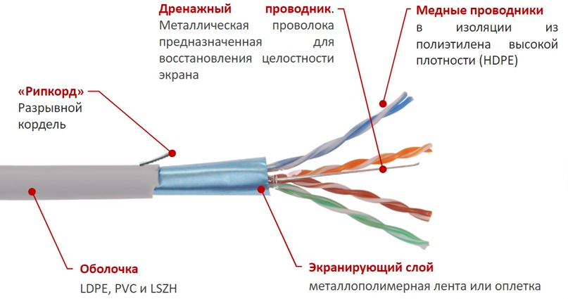
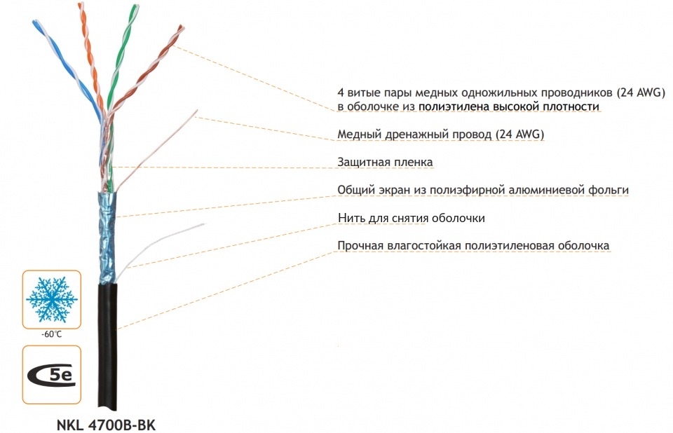

# Витая пара: устройство, принцип работы и классификация

**Витая пара** — 

1. это <mark><strong>кабель связи</strong></mark>, 
2. состоящий <mark><strong>из двух или более пар изолированных медных проводников</strong></mark>
3. <mark><strong>скрученных с определённым шагом.</strong></mark>

<mark><strong>Скручивание выполняется для снижения электромагнитных помех</strong></mark> и перекрёстных наводок между соседними парами и внешними источниками.

Наряду с витой парой в сетях передачи данных применяются два **других типа кабелей:**

| Коаксиальный кабель                                                                                                                                                                               | **Оптический кабель**                                                                                                                 |
|---------------------------------------------------------------------------------------------------------------------------------------------------------------------------------------------------|---------------------------------------------------------------------------------------------------------------------------------------|
|                                                                                                                                                                       |                                                                                                             |
| коаксиальный кабель сам по себе не бывает «аналоговым» или «цифровым» — это просто тип конструкции. А вот применять его действительно можно для передачи как аналоговых, так и цифровых сигналов. | <mark><strong>Кабель на основе оптоволокна, передающий данные с помощью световых импульсов</strong></mark>, а не электрического тока. |

Кабели типа <mark><strong>«витая пара» широко применяются для передачи симметричных (дифференциальных) сигналов.</strong></mark> Такой метод передачи известен с ранних этапов развития телеграфии и радиосвязи. Преимущества симметричной передачи — улучшенное отношение сигнал/шум и снижение перекрёстных помех, особенно важные в высокоскоростных системах с широкой полосой пропускания.

<table><tr><td>

симметричных (дифференциальных) сигналов - это способ передачи информации, при котором используются не один, а два проводника, и полезным сигналом является разность электрических потенциалов между ними.

</td></tr></table>

Поскольку для телефонных аппаратов или компьютеров часто требуется несколько одновременных подключений, витая пара может включать две и более пар в одном кабеле.

---

## 1. Принцип работы витой пары

<mark><strong>При протекании электрического тока по проводнику вокруг него возникает круговое магнитное поле.</strong></mark> В прямом (нескрученном) кабеле магнитные поля всех проводников складываются, что усиливает паразитное излучение и восприимчивость к внешним помехам.

В витой паре проводники каждой пары скручены между собой. Благодаря этому:

- <mark><strong>магнитные поля двух проводников одной пары направлены противоположно и взаимно компенсируются</strong></mark>;
- <mark><strong>внешние электромагнитные наводки наводят в обоих проводниках синфазные токи</strong></mark>, которые затем подавляются при дифференциальном приёме сигнала;
- <mark><strong>уменьшается паразитное излучение самой пары</strong></mark>, что снижает перекрёстные наводки на соседние пары.

Таким образом, скручивание проводников — ключевой механизм обеспечения помехозащищённости витой пары.

---

## 2. Типы витой пары

1. По наличию и типу <mark><strong>экранирования</strong></mark> витая пара делится на **две основные группы:** 
   1. <mark><strong>неэкранированная</strong></mark> и 
   2. <mark><strong>экранированная.</strong></mark>

2. <mark><strong>По категории</strong></mark>: категория определяет, какую скорость и частоту сигнала может пропустить кабель без потерь. Чем выше категория, тем чаще витки и качественнее материалы.
3. <mark><strong>По форме сечения:</strong></mark> Круглый(solid),Плоский (Flat), Многожильный(Patch Cord).

### 2.1 Экранирование

#### 2.1.1 Неэкранированная витая пара (UTP)

> **UTP (Unshielded Twisted Pair)** —<mark><strong> витая пара без какого-либо дополнительного экранирования.</strong></mark>

Особенности:

- <mark><strong>наиболее распространённый</strong></mark> тип кабеля для локальных сетей;
- <mark><strong>меньшие габариты и масса</strong></mark> по сравнению с экранированными аналогами;
- <mark><strong>простая прокладка и монтаж</strong></mark>, особенно в ограниченных пространствах;
- <mark><strong>низкая стоимость</strong></mark>;
- <mark><strong>не требует заземления экрана</strong></mark>;
- <mark><strong>достаточная скорость передачи</strong></mark> данных для большинства офисных и домашних применений.

**Недостаток** — <mark><strong>более высокая чувствительность к внешним электромагнитным помехам</strong></mark> по сравнению с экранированными типами.

#### 2.1.2. Экранированная витая пара

<mark><strong>Экранирование применяется для защиты от электромагнитных помех.</strong></mark> В качестве экранов используются фольга и металлическая оплетка.

Экранирование решает две задачи:

- устраняет ёмкостную связь между парами и внешними источниками помех;
- совместно со скручиванием <mark><strong>обеспечивает максимальную помехозащищённость.</strong></mark>

#### 2.1.3. Типовые обозначения экранированной витой пары:

Обозначение типа строится по принципу **X/YTP**, где:
*   **X** — тип общего экрана (вокруг всех пар сразу).
*   **Y** — тип индивидуального экрана (вокруг каждой пары).
*   **TP** — Twisted Pair (витая пара).
*   Буквы: **U** = Unshielded (нет), **F** = Foiled (фольга), **S** = Screened (оплетка/сетка).

Неэкранированная пара

| Обозначение | Общий экран | Экран отдельных пар | Описание и особенности |
|:---:|:---:|:---:|---|
| **U/UTP** | Нет (U) | Нет (UTP) | **Самый распространенный тип.** Обычный кабель в ПВХ-оболочке без какой-либо металлической защиты. Максимально гибкий, легкий, дешевый и простой в монтаже (не требует заземления). Используется в квартирах и офисах, где нет сильных электромагнитных полей. Плохо подходит для прокладки рядом с силовыми кабелями 220/380В. |
| **F/UTP** | Фольга (F) | Нет (UTP) | **Общий экран из фольги.** Все пары обернуты одним слоем алюминиевой фольги (обычно с дренажным проводом для контакта). Защищает от внешних наводок. Дешевле, чем S/FTP, но фольга хрупкая на излом. Требует заземления экрана, иначе фольга работает как антенна и усиливает помехи. |
| **SF/UTP** | Оплетка (S) + Фольга (F) | Нет (UTP) | **Двойной общий экран.** Поверх фольги добавлена медная оплетка (сетка). Обеспечивает отличную защиту от внешних помех и механическую прочность. Самый толстый и жесткий из неэкранированных попарно кабелей. Используется в промышленности. Сложнее обжимать, нужно заземлять. |

Экранированные пара

| Обозначение | Общий экран | Экран отдельных пар | Описание и особенности |
|:---:|:---:|:---:|---|
|**S/FTP** | Оплетка (S) | Фольга (FTP) | **Максимальная защита.** Каждая пара отдельно обернута фольгой (защита от перекрестных помех между парами *внутри* кабеля), плюс общая медная оплетка (защита от *внешних* помех). Толстый, тяжелый, дорогой и самый сложный в монтаже. Применяется в дата-центрах, на радиостанциях, рядом с мощным оборудованием. |
| **F/FTP** | Фольга (F) | Фольга (FTP) | **Двойная фольга.** Каждая пара в фольге + общий фольгированный экран. Полная защита от перекрестных и внешних помех, но при этом более гибкий и дешевый, чем вариант с медной оплеткой (S/FTP). Часто используется для кабелей категории 7 (Cat 7). Требует аккуратного монтажа, чтобы не порвать фольгу. |
| **U/FTP** | Нет (U) | Фольга (FTP) | **Индивидуальное экранирование пар.** Защищает только от перекрестных помех (NEXT), но не защищает от внешних наводок. Встречается реже остальных. Применяется в специфических случаях, когда нужно сохранить гибкость кабеля, но исключить влияние пар друг на друга (например, при параллельной передаче разных сигналов). |

### Что важно запомнить при выборе:
1.  **Заземление:** Кабели с общим экраном (**F**, **S**, **SF**) работают только при подключении экрана к земле с одной стороны (обычно на стороне патч-панели или роутера). Если экран не заземлен, он может собирать помехи и ухудшать сигнал.
2.  **Коннекторы:** Для экранированных кабелей (**FTP, STP**) нельзя использовать обычные пластиковые коннекторы. Нужны коннекторы в металлическом корпусе, иначе цепь экрана разорвется.
3.  **Толщина:** Экранированные кабели (особенно **SF/UTP** и **S/FTP**) имеют больший внешний диаметр. Их сложнее протягивать в узких кабель-каналах, и они имеют больший радиус изгиба.

> **UTP (Unshielded Twisted Pair)** —<mark><strong> витая пара без какого-либо дополнительного экранирования.</strong></mark>
> **FTP (Foiled Twisted Pair)** — <mark><strong>витая пара с экраном из фольги.</strong></mark>  
> **STP (Shielded Twisted Pair)** — <mark><strong>витая пара с экранированием</strong></mark> (в общем смысле), часто с оплёткой.

<mark><strong>Экранированные кабели чаще применяются для прокладки между зданиями и в условиях повышенных электромагнитных помех.</strong></mark>

---

### 2.2 Категории витой пары

<mark><strong>Категория определяет частотный диапазон и максимальную скорость передачи данных.</strong></mark>

| Категория | Частота, МГц | Макс. скорость                           | Макс. длина, м | Типичное применение                       |
|-----------|--------------|------------------------------------------|----------------|-------------------------------------------|
| Cat.1     | 0,1          | —                                        | —              | Телефония (POTS), ISDN                    |
| Cat.2     | 1            | до 4 Мбит/с                              | —              | Token Ring 4 Мбит/с                       |
| Cat.3     | 16           | до 10 Мбит/с                             | 100            | Ethernet 10BASE-T                         |
| Cat.4     | 20           | до 16 Мбит/с                             | 100            | Token Ring 16 Мбит/с                      |
| Cat.5     | 100          | до 100 Мбит/с                            | 100            | Fast Ethernet                             |
| Cat.5e    | 100          | до 1 Гбит/с                              | 100            | Gigabit Ethernet                          |
| Cat.6     | 250          | до 1 Гбит/с; 10 Гбит/с (до 55 м)         | 55 / 100       | Gigabit Ethernet, 10GBASE-T (ограниченно) |
| Cat.6a    | 500          | до 10 Гбит/с                             | 100            | 10GBASE-T                                 |
| Cat.7     | 600          | до 10 Гбит/с                             | 100            | Дата-центры, промышленные сети            |
| Cat.7a    | 1000         | до 10 Гбит/с; 40 Гбит/с (короткие линии) | 100            | Специализированные сети                   |
| Cat.8.1   | 1600–2000    | 25–40 Гбит/с                             | 30             | Дата-центры                               |
| Cat.8.2   | 1600–2000    | 25–40 Гбит/с                             | 30             | Дата-центры, совместимость с Class II     |

**Примечания**

- Категория 5 <mark><strong>считается устаревшей</strong></mark> и не рекомендуется для новых инсталляций.
- Категория 6a обеспечивает вдвое большую полосу пропускания по сравнению с Cat.6 и поддержку 10GBASE-T на полной длине 100 м.
- Категории 8.1 и 8.2 ориентированы на применение в дата-центрах, длина сегмента ограничена 30 метрами.

---

### 2.3 Конструкция проводников

|         Тип кабеля          |                                  Строение жилы                                   | Основное применение                                                     | Особенности и монтаж                                                                                                                                                                                   |
|:---------------------------:|:--------------------------------------------------------------------------------:|-------------------------------------------------------------------------|--------------------------------------------------------------------------------------------------------------------------------------------------------------------------------------------------------|
|     **Круглый (Solid)**     |                     Одна цельная медная проволока (монолит)                      | Стационарная прокладка (в стенах, потолках, кабель-каналах, розетках)   | Лучшая проводимость и минимальное затухание сигнала. Плохо гнется, при частых перегибах может сломаться. Идеален для линий до 100 метров.                                                              |
|     **Плоский (Flat)**      | Одна цельная или многожильная проволока, уложенная в один ряд в плоской оболочке | Скрытая прокладка под ковром, обоями, в дверных проемах или узких щелях | Удобен для прокладки в местах, где круглый кабель будет заметен или мешать. Меньше защищен от помех из-за нестандартного расположения пар.                                                             |
| **Многожильный (Stranded)** |                  Пучок из 7 (или более) тонких медных волосков                   | Патч-корды (короткие шнуры от розетки к ПК, от роутера к компьютеру)    | Очень гибкий и эластичный. Выдерживает многократные изгибы и скручивания. Затухание сигнала выше, чем у монолита, поэтому не рекомендуется для длинных трасс (работает только на коротких дистанциях). |

---

## 4. Конструкция кабеля

| Элемент конструкции | Описание | Назначение и особенности |
|:---:|---|---|
| **Внешняя оболочка (Jacket)** | Верхний слой изоляции из ПВХ (PVC), полиэтилена (PE) или малогорючего компаунда (LSZH) | Защищает кабель от механических повреждений, влаги и ультрафиолета. Материал определяет место прокладки: ПВХ — для помещений, полиэтилен — для улицы, LSZH — для мест с требованиями пожаробезопасности (не выделяет ядовитый дым при горении). |
| **Общий экран** | Слой фольги и/или медной оплетки, обернутый вокруг всех пар вместе | Защищает сигнал от внешних электромагнитных помех (от силовых кабелей, трансформаторов, радиочастот). Присутствует только в экранированных типах (F/UTP, S/FTP и др.). Требует заземления. |
| **Экран пары** | Фольга, обернутая вокруг каждой отдельной пары проводников | Устраняет перекрестные наводки (NEXT) — когда сигнал из одной пары мешает другой паре внутри того же кабеля. Используется в кабелях высоких категорий (Cat 6a и выше) и в типах F/FTP, S/FTP. |
| **Дренажный провод (Drain Wire)** | Неизолированный луженый медный проводник, идущий вдоль всего кабеля под экраном | Обеспечивает непрерывный электрический контакт с фольгой. Служит для удобного подключения экрана к контакту заземления в коннекторе или патч-панели (паять или обжимать саму фольгу сложно). |
| **Витая пара (Twisted Pair)** | Два изолированных проводника, свитые между собой с определенным шагом скрутки | Защита от помех. Благодаря скрутке, наводки на оба провода пары приходят в противофазе и взаимно гасятся (принцип дифференциальной передачи). Чем выше категория кабеля, тем чаще и неравномернее шаг скрутки. |
| **Изоляция проводника** | Пластиковая оболочка (обычно полиэтилен) вокруг каждой медной жилы | Предотвращает короткое замыкание между проводами. Цветовая маркировка изоляции (оранжевый, зеленый, синий, коричневый и их белые пары) служит для правильной расшивки кабеля по схемам T568A или T568B. |
| **Медный проводник (Conductor)** | Токопроводящая жила | Передает электрический сигнал. Может быть монолитной (одна проволока — для стационарной прокладки) или многожильной (пучок волосков — для гибких патч-кордов). Материал — чистая медь (эталон) или омедненный алюминий/сталь (дешевые аналоги, хуже по характеристикам). |
| **Разделительный крест (Cross-filler / Separator)** | Пластиковый крестообразный профиль внутри кабеля (обычно в Cat 6 и выше) | Физически разделяет пары между собой по разным секторам. Это увеличивает толщину кабеля, но значительно снижает перекрестные наводки и сохраняет геометрию пар при изгибах. Также добавляет прочности на разрыв. |
| **Разрывная нить (Ripcord)** | Тонкая капроновая или кевларовая нить, проложенная под оболочкой | Позволяет монтажнику легко разрезать внешнюю оболочку кабеля, не повредив внутренние пары. Достаточно потянуть за нить, чтобы оболочка разошлась вдоль. |
| **Несущий трос (Messenger)** | Стальной трос, запрессованный в оболочку (в специальных уличных кабелях) | Используется для прокладки кабеля по воздуху (между столбами, зданиями). Принимает на себя всю нагрузку от веса и растяжения, чтобы медные жилы не порвались. |

#### Разрывная нить

> **Разрывная нить** — тонкая капроновая или полиэфирная нить, расположенная под внешней оболочкой кабеля.

<mark><strong>Она используется для удобной разделки оболочки:</strong></mark> при протягивании нити вдоль кабеля формируется продольный разрез, позволяющий снять оболочку без повреждения изоляции жил.

<mark><strong>Чтобы воспользоваться разрывной нитью</strong></mark>, нужно:

1. <mark><strong>Сделать небольшой надрез на краю внешней оболочки кабеля.</strong></mark>
2. <mark><strong>Поддеть нить пальцем или инструментом.</strong></mark>
3. <mark><strong>Потянуть за нить — она сделает ровный продольный разрез на изоляции</strong></mark>, открывая доступ к внутренним жилам.

<mark><strong>Этот метод позволяет избежать повреждения изоляции проводников при разделке</strong></mark>, особенно на длинных участках

#### Дренажный провод

> **Дренажный провод** — <mark><strong>неизолированный проводник, проходящий вдоль всей длины экранированного кабеля и контактирующий с фольгированным экраном.</strong></mark>

Его назначение:

- <mark><strong> обеспечивает электрическую непрерывность экрана даже при повреждении фольги</strong></mark>;
- служит для <mark><strong>подключения экрана к системе заземления</strong></mark>;
- <mark><strong>отводит наведённые токи.</strong></mark>

#### Материалы оболочки

| Материал               | Обозначение | Назначение                                                                     |
|------------------------|-------------|--------------------------------------------------------------------------------|
| Поливинилхлорид        | PVC (ПВХ)   | Внутренняя прокладка                                                           |
| Полиэтилен             | PE          | Внешняя прокладка, устойчивость к УФ и влаге                                   |
| Low Smoke Zero Halogen | LSZH        | Места массового скопления людей; низкое дымовыделение, отсутствие галогенов    |
| Low Smoke Low Toxic    | LSLTx       | Медицинские и образовательные учреждения; низкая токсичность продуктов горения |

---

## 4. Маркировка витой пары

Маркировка кабеля содержит ключевую информацию для правильного выбора.

Типовая структура маркировки:

1. производитель;
2. тип экранирования;
3. количество пар;
4. категория;
5. тип проводника (одножильный / многожильный);
6. тип оболочки;
7. цвет.

Дополнительно может указываться:

- калибр проводников по стандарту AWG;
- материал проводника;
- длина в бухте;
- пригодность для наружной прокладки.

**Пример:** стандартная бухта витой пары содержит 305 метров, что соответствует 1000 футам.

<strong>Про бухты</strong>
<table><tr><td>

**Бухта** — это форма упаковки кабеля, при которой он намотан в виде большого кольца (цилиндра) на заводе или в катушку, без использования жесткого барабана (или с ним, если катушка маленькая и вложена в коробку).

Применительно к витой паре, под словом «бухта» чаще всего подразумевают **заводскую коробку** (картонную катушку), внутри которой кабель уложен кольцами и вытягивается через специальное отверстие.

### Почему стандарт именно 305 метров?
Стандарт длины **305 метров** (1000 футов) пришел из американской системы измерений, так как стандарты Ethernet (IEEE) и телекоммуникаций (TIA/EIA) исторически разрабатывались в США.

*   **Максимум для сети:** По стандарту, длина горизонтальной подсистемы (от коммутатора до розетки) не должна превышать 90-100 метров. Запас в 305 метров позволяет нарезать кабель на **3 полноценные линии по 100 метров** (+ небольшой запас на обрезку) или на большее количество коротких линий.
*   **Удобство логистики:** 305 метров — это оптимальный вес (примерно 8-12 кг в зависимости от категории), который удобно переносить, хранить и транспортировать.
*   **Терминология:** Иногда 305-метровую упаковку называют **"катушкой"** (reel) или **"коробкой"** (pull box), а **"бухтой"** (coil) называют моток без коробки. Но в обиходе эти понятия часто смешивают.

### Виды упаковки:
1.  **Бухта в пленке (Coil):** Просто моток кабеля, перетянутый стяжками или пленкой. Самый дешевый вид упаковки. Используется для коротких длин (25, 50, 100 м) в хозяйственных магазинах.
2.  **Коробка (Pull Box):** Картонный барабан или коробка, где кабель уложен особым образом («восьмеркой»). Из такой упаковки кабель легко вытягивать за свободный конец, и он не путается. Самый популярный формат для монтажников.
3.  **Деревянный/пластиковый барабан:** Используется для больших длин (500 м и более) и тяжелых магистральных кабелей.

</td></tr></table>

---

## 5. Применение витой пары

Основные области применения:

- телефонные линии передачи голоса и данных;
- локальные вычислительные сети (Ethernet);
- структурированные кабельные системы зданий;
- системы видеонаблюдения (IP-камеры);
- передача питания по технологии PoE.

Максимальная длина сегмента витой пары в стандартных сетях Ethernet составляет 100 метров. Это ограничение связано со временем распространения сигнала: минимальный кадр данных должен полностью помещаться в кабеле, чтобы передающая сторона могла обнаружить коллизию до завершения передачи.

---

## FAQ

**Какой кабель лучше выбрать для домашнего интернета?**

Оптимальный выбор — медный четырёхпарный неэкранированный кабель (UTP) категории 5e. Он поддерживает скорость до 1 Гбит/с и подходит для большинства домашних сценариев. Для запаса на будущее можно использовать Cat.6 или Cat.6a.

**Есть ли напряжение в кабеле витая пара?**

При использовании технологии PoE (Power over Ethernet) по витой паре передаётся питание. Согласно стандарту IEEE 802.3af, номинальное напряжение составляет 48 В постоянного тока, максимальная мощность — 15,4 Вт, ток — до 400 мА. Диапазон напряжения — от 36 до 57 В.

**Как соединить два отрезка витой пары?**

Для обжатых кабелей проще всего использовать проходной адаптер RJ45-RJ45 (8P8C). Для необжатых жил применяются соединительные модули с IDC-контактами, обеспечивающие надёжное соединение без пайки.

**Как проверить кабель витая пара?**

Наиболее надёжный способ — с помощью LAN-тестера. Один конец кабеля подключается к передатчику (TX), другой — к приёмнику (RX). Тестер проверяет целостность всех жил и правильность разводки.

**Сколько жил используется в витой паре?**

Для скоростей до 100 Мбит/с используются четыре жилы (две пары), обычно оранжевая и зелёная. Для Gigabit Ethernet (1000 Мбит/с) задействуются все четыре пары (восемь жил).