# Витая пара: устройство, принцип работы и классификация

**Витая пара** — 

1. это <mark><strong>кабель связи</strong></mark>, 
2. состоящий <mark><strong>из двух или более пар изолированных медных проводников</strong></mark>
3. <mark><strong>скрученных с определённым шагом.</strong></mark>

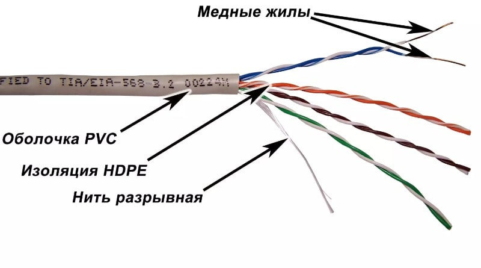

<mark><strong>Скручивание выполняется для снижения электромагнитных помех</strong></mark> и перекрёстных наводок между соседними парами и внешними источниками.

Наряду с витой парой в сетях передачи данных применяются два **других типа кабелей:**

| Коаксиальный кабель                                                                                                                                                                               | **Оптический кабель**                                                                                                                 |
|---------------------------------------------------------------------------------------------------------------------------------------------------------------------------------------------------|---------------------------------------------------------------------------------------------------------------------------------------|
| 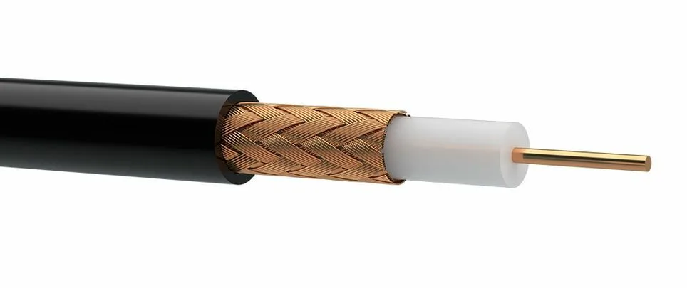                                                                                                                                                                      | 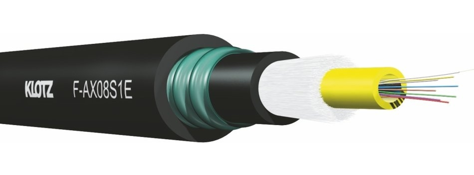                                                                                                            |
| коаксиальный кабель сам по себе не бывает «аналоговым» или «цифровым» — это просто тип конструкции. А вот применять его действительно можно для передачи как аналоговых, так и цифровых сигналов. | <mark><strong>Кабель на основе оптоволокна, передающий данные с помощью световых импульсов</strong></mark>, а не электрического тока. |

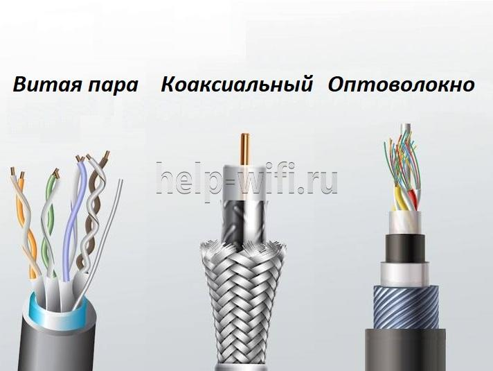

Кабели типа <mark><strong>«витая пара» широко применяются для передачи симметричных (дифференциальных) сигналов.</strong></mark> Такой метод передачи известен с ранних этапов развития телеграфии и радиосвязи. Преимущества симметричной передачи — улучшенное отношение сигнал/шум и снижение перекрёстных помех, особенно важные в высокоскоростных системах с широкой полосой пропускания.

<table><tr><td>

симметричных (дифференциальных) сигналов - это способ передачи информации, при котором используются не один, а два проводника, и полезным сигналом является разность электрических потенциалов между ними.

</td></tr></table>

Поскольку для телефонных аппаратов или компьютеров часто требуется несколько одновременных подключений, витая пара может включать две и более пар в одном кабеле.

---

## 1. Принцип работы витой пары

<mark><strong>При протекании электрического тока по проводнику вокруг него возникает круговое магнитное поле.</strong></mark> В прямом (нескрученном) кабеле магнитные поля всех проводников складываются, что усиливает паразитное излучение и восприимчивость к внешним помехам.

В витой паре проводники каждой пары скручены между собой. Благодаря этому:

- <mark><strong>магнитные поля двух проводников одной пары направлены противоположно и взаимно компенсируются</strong></mark>;
- <mark><strong>внешние электромагнитные наводки наводят в обоих проводниках синфазные токи</strong></mark>, которые затем подавляются при дифференциальном приёме сигнала;
- <mark><strong>уменьшается паразитное излучение самой пары</strong></mark>, что снижает перекрёстные наводки на соседние пары.

Таким образом, скручивание проводников — ключевой механизм обеспечения помехозащищённости витой пары.

---

## 2. Типы витой пары

По наличию и типу экранирования витая пара делится на **две основные группы:** 
1. <mark><strong>неэкранированная</strong></mark> и 
2. <mark><strong>экранированная.</strong></mark>

### 2.1. Неэкранированная витая пара (UTP)

> **UTP (Unshielded Twisted Pair)** —<mark><strong> витая пара без какого-либо дополнительного экранирования.</strong></mark>

Особенности:

- <mark><strong>наиболее распространённый</strong></mark> тип кабеля для локальных сетей;
- <mark><strong>меньшие габариты и масса</strong></mark> по сравнению с экранированными аналогами;
- <mark><strong>простая прокладка и монтаж</strong></mark>, особенно в ограниченных пространствах;
- <mark><strong>низкая стоимость</strong></mark>;
- <mark><strong>не требует заземления экрана</strong></mark>;
- <mark><strong>достаточная скорость передачи</strong></mark> данных для большинства офисных и домашних применений.

**Недостаток** — <mark><strong>более высокая чувствительность к внешним электромагнитным помехам</strong></mark> по сравнению с экранированными типами.

### 2.2. Экранированная витая пара

<mark><strong>Экранирование применяется для защиты от электромагнитных помех.</strong></mark> В качестве экранов используются фольга и металлическая оплетка.

Экранирование решает две задачи:

- устраняет ёмкостную связь между парами и внешними источниками помех;
- совместно со скручиванием <mark><strong>обеспечивает максимальную помехозащищённость.</strong></mark>

Типовые обозначения экранированной витой пары:

| Обозначение | Общий экран              | Экран отдельных пар | Фото                  |
|-------------|--------------------------|---------------------|-----------------------|
| U/UTP       | нет (U)                  | нет (UTP)           | 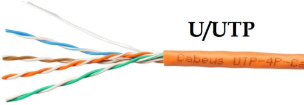  |
| F/UTP       | фольга (F)               | нет (UTP)           | 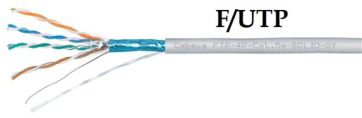  |
| SF/UTP      | оплётка (S) + фольга (F) | нет (UTP)           | 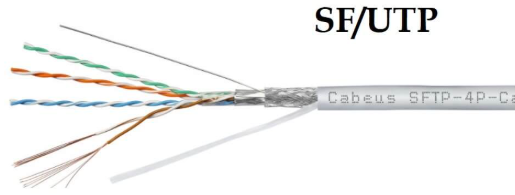 |
| S/FTP       | оплётка (S)              | фольга (FTP)        | 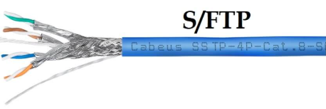  |
| F/FTP       | фольга (F)               | фольга (FTP)        | 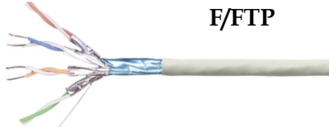  |
| U/FTP       | нет (U)                  | фольга (FTP)        | 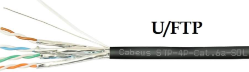  |

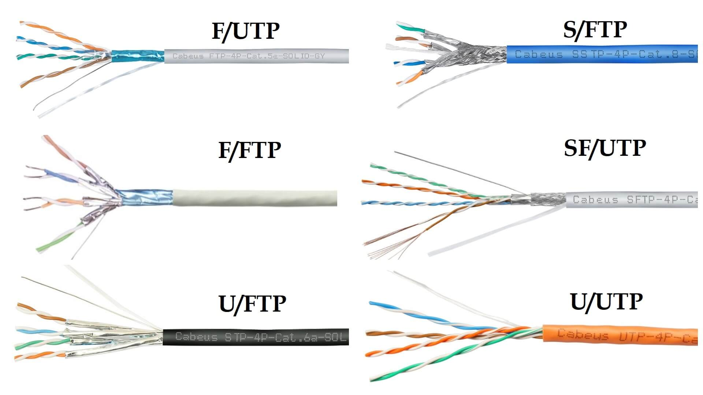

> **UTP (Unshielded Twisted Pair)** —<mark><strong> витая пара без какого-либо дополнительного экранирования.</strong></mark>
> **FTP (Foiled Twisted Pair)** — <mark><strong>витая пара с экраном из фольги.</strong></mark>  
> **STP (Shielded Twisted Pair)** — <mark><strong>витая пара с экранированием</strong></mark> (в общем смысле), часто с оплёткой.

<mark><strong>Экранированные кабели чаще применяются для прокладки между зданиями и в условиях повышенных электромагнитных помех.</strong></mark>

#### Дренажный провод

> **Дренажный провод** — <mark><strong>неизолированный проводник, проходящий вдоль всей длины экранированного кабеля и контактирующий с фольгированным экраном.</strong></mark>

Его назначение:

- <mark><strong> обеспечивает электрическую непрерывность экрана даже при повреждении фольги</strong></mark>;
- служит для <mark><strong>подключения экрана к системе заземления</strong></mark>;
- <mark><strong>отводит наведённые токи.</strong></mark>

---

## 3. Категории витой пары

<mark><strong>Категория определяет частотный диапазон и максимальную скорость передачи данных.</strong></mark>

| Категория | Частота, МГц | Макс. скорость                           | Макс. длина, м | Типичное применение                       |
|-----------|--------------|------------------------------------------|----------------|-------------------------------------------|
| Cat.1     | 0,1          | —                                        | —              | Телефония (POTS), ISDN                    |
| Cat.2     | 1            | до 4 Мбит/с                              | —              | Token Ring 4 Мбит/с                       |
| Cat.3     | 16           | до 10 Мбит/с                             | 100            | Ethernet 10BASE-T                         |
| Cat.4     | 20           | до 16 Мбит/с                             | 100            | Token Ring 16 Мбит/с                      |
| Cat.5     | 100          | до 100 Мбит/с                            | 100            | Fast Ethernet                             |
| Cat.5e    | 100          | до 1 Гбит/с                              | 100            | Gigabit Ethernet                          |
| Cat.6     | 250          | до 1 Гбит/с; 10 Гбит/с (до 55 м)         | 55 / 100       | Gigabit Ethernet, 10GBASE-T (ограниченно) |
| Cat.6a    | 500          | до 10 Гбит/с                             | 100            | 10GBASE-T                                 |
| Cat.7     | 600          | до 10 Гбит/с                             | 100            | Дата-центры, промышленные сети            |
| Cat.7a    | 1000         | до 10 Гбит/с; 40 Гбит/с (короткие линии) | 100            | Специализированные сети                   |
| Cat.8.1   | 1600–2000    | 25–40 Гбит/с                             | 30             | Дата-центры                               |
| Cat.8.2   | 1600–2000    | 25–40 Гбит/с                             | 30             | Дата-центры, совместимость с Class II     |

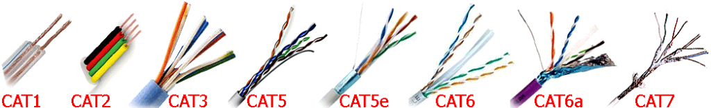

**Примечания**

- Категория 5 <mark><strong>считается устаревшей</strong></mark> и не рекомендуется для новых инсталляций.
- Категория 6a обеспечивает вдвое большую полосу пропускания по сравнению с Cat.6 и поддержку 10GBASE-T на полной длине 100 м.
- Категории 8.1 и 8.2 ориентированы на применение в дата-центрах, длина сегмента ограничена 30 метрами.

---

## 4. Материалы оболочки

| Материал               | Обозначение | Назначение                                                                     |
|------------------------|-------------|--------------------------------------------------------------------------------|
| Поливинилхлорид        | PVC (ПВХ)   | Внутренняя прокладка                                                           |
| Полиэтилен             | PE          | Внешняя прокладка, устойчивость к УФ и влаге                                   |
| Low Smoke Zero Halogen | LSZH        | Места массового скопления людей; низкое дымовыделение, отсутствие галогенов    |
| Low Smoke Low Toxic    | LSLTx       | Медицинские и образовательные учреждения; низкая токсичность продуктов горения |

#### Разрывная нить

> **Разрывная нить** — тонкая капроновая или полиэфирная нить, расположенная под внешней оболочкой кабеля.

<mark><strong>Она используется для удобной разделки оболочки:</strong></mark> при протягивании нити вдоль кабеля формируется продольный разрез, позволяющий снять оболочку без повреждения изоляции жил.

<mark><strong>Чтобы воспользоваться разрывной нитью</strong></mark>, нужно:

1. <mark><strong>Сделать небольшой надрез на краю внешней оболочки кабеля.</strong></mark>
2. <mark><strong>Поддеть нить пальцем или инструментом.</strong></mark>
3. <mark><strong>Потянуть за нить — она сделает ровный продольный разрез на изоляции</strong></mark>, открывая доступ к внутренним жилам.

<mark><strong>Этот метод позволяет избежать повреждения изоляции проводников при разделке</strong></mark>, особенно на длинных участках

---

## 5. Конструкция проводников

| Тип проводника | Конструкция | Особенности | Применение |
|---|---|---|---|
| Одножильный | Цельная медная жила | Низкое сопротивление, стабильность сигнала на больших расстояниях, жёсткость | Магистральные линии, стационарная прокладка в стенах и кабель-каналах |
| Многожильный | Множество тонких медных проволок, скрученных вместе | Высокая гибкость, устойчивость к изгибам, большее затухание | Патч-корды, коммутационные шнуры, короткие подвижные соединения |

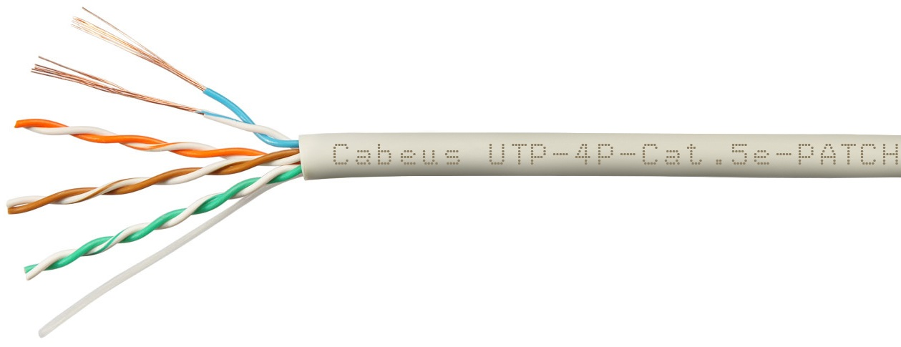

---

## 6. Маркировка витой пары

Маркировка кабеля содержит ключевую информацию для правильного выбора.

Типовая структура маркировки:

1. производитель;
2. тип экранирования;
3. количество пар;
4. категория;
5. тип проводника (одножильный / многожильный);
6. тип оболочки;
7. цвет.

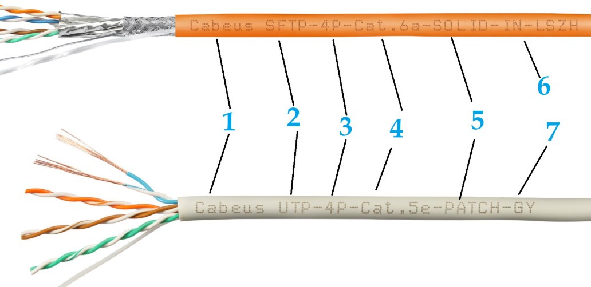

Дополнительно может указываться:

- калибр проводников по стандарту AWG;
- материал проводника;
- длина в бухте;
- пригодность для наружной прокладки.

**Пример:** стандартная бухта витой пары содержит 305 метров, что соответствует 1000 футам.

---

## 7. Применение витой пары

Основные области применения:

- телефонные линии передачи голоса и данных;
- локальные вычислительные сети (Ethernet);
- структурированные кабельные системы зданий;
- системы видеонаблюдения (IP-камеры);
- передача питания по технологии PoE.

Максимальная длина сегмента витой пары в стандартных сетях Ethernet составляет 100 метров. Это ограничение связано со временем распространения сигнала: минимальный кадр данных должен полностью помещаться в кабеле, чтобы передающая сторона могла обнаружить коллизию до завершения передачи.

---

## FAQ

**Какой кабель лучше выбрать для домашнего интернета?**

Оптимальный выбор — медный четырёхпарный неэкранированный кабель (UTP) категории 5e. Он поддерживает скорость до 1 Гбит/с и подходит для большинства домашних сценариев. Для запаса на будущее можно использовать Cat.6 или Cat.6a.

**Есть ли напряжение в кабеле витая пара?**

При использовании технологии PoE (Power over Ethernet) по витой паре передаётся питание. Согласно стандарту IEEE 802.3af, номинальное напряжение составляет 48 В постоянного тока, максимальная мощность — 15,4 Вт, ток — до 400 мА. Диапазон напряжения — от 36 до 57 В.

**Как соединить два отрезка витой пары?**

Для обжатых кабелей проще всего использовать проходной адаптер RJ45-RJ45 (8P8C). Для необжатых жил применяются соединительные модули с IDC-контактами, обеспечивающие надёжное соединение без пайки.

**Как проверить кабель витая пара?**

Наиболее надёжный способ — с помощью LAN-тестера. Один конец кабеля подключается к передатчику (TX), другой — к приёмнику (RX). Тестер проверяет целостность всех жил и правильность разводки.

**Сколько жил используется в витой паре?**

Для скоростей до 100 Мбит/с используются четыре жилы (две пары), обычно оранжевая и зелёная. Для Gigabit Ethernet (1000 Мбит/с) задействуются все четыре пары (восемь жил).