Принято. Я интегрировал третий текст в общее руководство, дополнив его практическими советами по выбору материалов, подготовке к обжиму, а также описанием «секретного» метода доводки контактов с помощью отвёртки. Итоговый документ объединяет все три источника в единое, логичное и структурированное пособие.

---

# Полное руководство по обжиму и монтажу витой пары: от теории до практики

## 1. Термины и определения

> **Витая пара (Twisted Pair)** — тип кабеля, состоящий из одной или нескольких пар изолированных медных проводников, скрученных между собой с определённым шагом. Скрутка используется для уменьшения влияния электромагнитных помех.

> **Дифференциальная передача сигнала** — метод передачи, при котором сигнал подаётся на два провода пары в противофазе. Помеха, воздействующая на оба провода одинаково, вычитается приёмником, что позволяет эффективно подавлять внешние наводки.

> **Волновое сопротивление (Импеданс)** — отношение напряжения к току в бегущей волне, распространяющейся по линии. Для витой пары стандарт определяет значение $100 \pm 15$ Ом. Отклонение приводит к отражению сигнала и ухудшению характеристик канала.

> **Категория кабеля (Cat)** — <mark><strong>стандарт, определяющий частотный диапазон и пропускную способность кабеля.</strong></mark> Например, Cat5e — до 100 МГц (гигабит на 100 м), Cat6 — до 250 МГц (10 гигабит до 55 м).

> **CCA (Copper Clad Aluminum)** — алюминиевый проводник с медным покрытием. Не соответствует стандартам TIA/EIA, имеет высокое сопротивление, хрупок и опасен при использовании с PoE.

> **Патч-корд (Patch cord)** — <mark><strong>соединительный кабель с коннекторами на обоих концах, используемый для подключения активного оборудования</strong></mark> (компьютеров, свитчей, роутеров) к сети.

> **Схема обжима T568A/T568B** — <mark><strong>стандарты распределения цветовых пар по контактам разъёма RJ-45.</strong></mark> В России и СНГ доминирует стандарт T568B.

> **Прямой кабель (Straight-through)** —<mark><strong> кабель, обжатый по одному стандарту (T568B или T568A) с обоих концов.</strong></mark> Используется <mark><strong>для соединения разных типов устройств</strong></mark> (компьютер — свитч).

> **Перекрёстный кабель (Crossover)** — кабель, обжатый <mark><strong>по стандарту T568A с одного конца и T568B — с другого.</strong></mark> Используется<mark><strong> для соединения однотипных устройств</strong></mark> (компьютер — компьютер). В современных гигабитных сетях с поддержкой Auto-MDI/X практически не применяется.

> **NEXT (Near-End Crosstalk)** — переходное затухание на ближнем конце; помеха, возникающая в одной паре от сигнала, передаваемого по соседней паре в том же конце кабеля.

> **Return Loss** — возвратные потери, часть сигнала, которая отражается обратно к источнику из-за неоднородностей волнового сопротивления кабеля.

> **PoE (Power over Ethernet)** — <mark><strong>технология передачи электропитания по тому же кабелю, что и данные.</strong></mark> Стандарты 802.3af/at обеспечивают мощность до 30 Вт на порт.

---

## 2. Когда самостоятельно обжимать кабель имеет смысл

Самостоятельное изготовление патч-кордов оправдано в следующих случаях:

- Вы делаете ремонт и прокладываете сеть в квартире или доме (розетки, переходы между этажами).
- Вам нужны кабели нестандартной длины, которые сложно найти в продаже.
- Вы устанавливаете систему видеонаблюдения, где кабель проходит через узкие отверстия или под крышей, и готовый патч-корд с коннекторами просто невозможно протянуть без их повреждения.
- Вы хотите контролировать качество каждого соединения.

Экономическая целесообразность:
- Бухта Cat5e (100 м) — ≈ 4000 руб.
- 100 коннекторов — ≈ 800 руб.
- Инструмент (кримпер + стриппер + тестер) — ≈ 5000 руб.
- Итого: ≈ 9800 руб.

Готовый патч-корд длиной 2 м стоит ≈ 180 руб. Чтобы окупить инструмент, нужно изготовить около 64 патч-кордов. Если вам нужно 3–5 штук — покупайте готовые. Если вы прокладываете сеть в квартире с 10 розетками и множеством патч-кордов разной длины — однозначно выгоднее делать самому.

---

## 3. Выбор кабеля

### 3.1 Категории: маркетинг и реальность

Выбор категории кабеля напрямую зависит от ваших задач.

- **Cat5e** — <mark><strong>стандарт де-факто.</strong></mark> Обеспечивает работу на скорости 1 Гбит/с на длине до 100 метров. Этого достаточно для 99% офисных и домашних сетей.
- **Cat6** — имеет пластиковую крестовину, разделяющую пары, и более высокую частоту (250 МГц). Может обеспечить 10 Гбит/с, но только на расстоянии до 55 метров. Обжимать его сложнее из-за более толстых жил, для него часто требуются специальные коннекторы.
- **Cat6A** — промышленный стандарт для дата-центров, обеспечивает 10 Гбит/с на 100 метров. В быту и типовом офисе его применение избыточно.
- **Cat7 и выше** — для обычных пользователей и большинства бизнес-задач не нужны. Высокая стоимость и сложность монтажа не дают прироста производительности в типовых сценариях.

> **Важно:** Более <mark><strong>90% кабеля категории Cat6, продаваемого на маркетплейсах по низкой цене, является подделкой.</strong></mark> Чаще всего это CCA.

### 3.2 Конструкция жилы: Solid vs. Stranded

- **Solid (одножильный)** — жила <mark><strong>состоит из одной цельной медной проволоки.</strong></mark> Жёсткий, ломается на изгибах. Используется <mark><strong>для **стационарной прокладки**</strong></mark> (в стенах, коробах). Дешевле и идеально подходит для розеток и патч-панелей.
- **Stranded (многожильный)** — жила состоит <mark><strong>из множества тонких медных проволочек.</strong></mark> Гибкий, эластичный.<mark><strong> Используется для **патч-кордов** (соединительных шнуров)</strong></mark>, которые постоянно перегибаются.

**Критично:** <mark><strong>Для Solid и Stranded кабеля используются **разные коннекторы**.</strong></mark> Контакты в коннекторе для многожильного кабеля раздвигают и обжимают пучок проводников, а для одножильного — прорезают изоляцию и врезаются в монолитную жилу. Использование несовместимых коннекторов гарантирует плохой контакт.

### 3.3 Подделки: как распознать CCA

CCA (Copper Clad Aluminum) — алюминий в тонкой медной оболочке. Это брак, который нельзя использовать.

- **Цена:** Бухта качественной медной витой пары (305 м) стоит дорого. Слишком низкая цена — первый признак CCA.
- **Вес:** Медная бухта значительно тяжелее алюминиевой.
- **Надрез:** Снимите изоляцию с жилы и слегка поцарапайте её. Если внутри белый металл — это алюминий.
- **Маркировка:** Надписи на оболочке часто не соответствуют действительности. Покупайте кабель только у официальных дистрибьюторов (Cabeus, Hyperline, LANmaster, SkyNet).

**Последствия использования CCA:**
1.  Высокое сопротивление и, как следствие, падение скорости и большое затухание.
2.  Хрупкость — жила ломается при изгибе.
3.  **Опасность при использовании PoE.** Алюминий греется сильнее меди. При мощности 30 Вт плохой контакт на CCA может нагреться до температур, вызывающих оплавление изоляции и пожар.

---

## 4. Инструмент: на чём нельзя экономить

Качественный монтаж сетевой инфраструктуры невозможен без правильного инструмента. Ниже представлен базовый набор, который обеспечит надежность соединений и сэкономит ваши нервы.

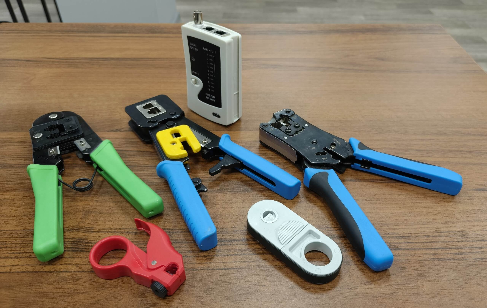

*   **Кримпер (обжимные клещи)**
    *   **Задача:** <mark><strong>Обжим модульных коннекторов RJ-45 на кабеле.</strong></mark>
    *   **Как выбрать:** Отдавайте предпочтение моделям с храповым механизмом. Этот узел отвечает за дозированное усилие: храповик должен отпускать инструмент только после полного врезания контактных ножей в жилы. Экономия на этом инструменте критична — дешевые клещи чаще всего дают брак из-за недожатия или перелома контактов.

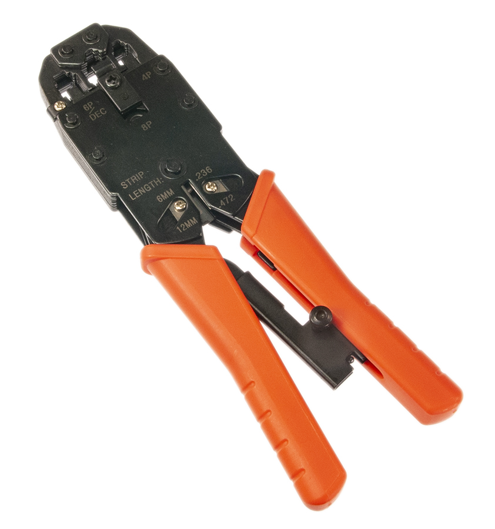

рис. HT-2008R с храповым механизмом

*   **Стриппер (инструмент для съема изоляции)**
    *   **Задача:** Аккуратное удаление внешней оболочки витой пары.
    *   **Как выбрать:** Идеальный выбор — автоматический стриппер с возможностью регулировки глубины реза. Он снимает верхний слой, не травмируя хрупкую изоляцию внутренних жил. Использование обычного ножа в этом деле — риск появления микроцарапин на меди, которые в будущем приведут к обрывам.

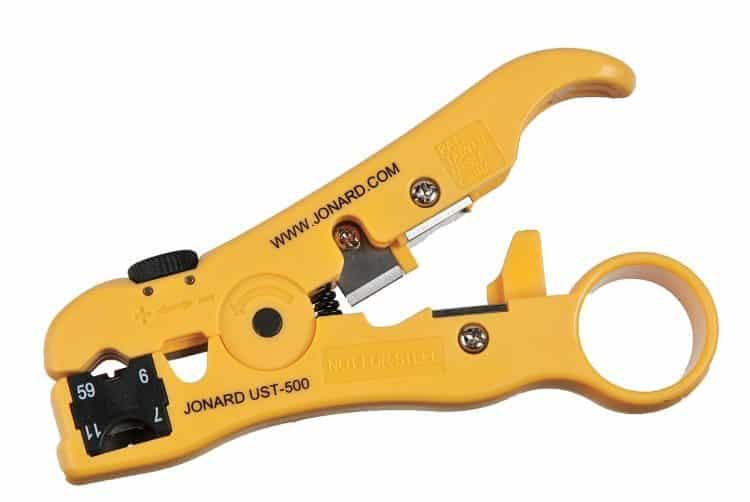

*   **Кабельный тестер**
    *   **Задача:** <mark><strong>Проверка физической целостности линии и корректности распиновки.</strong></mark>
    *   **Как выбрать:** Базового двухблочного тестера (Master + Remote) достаточно, чтобы выявить обрыв или короткое замыкание. Однако для профессиональной диагностики лучше взять прибор, определяющий *Split Pair* (перепутанные пары). Это коварная ошибка, при которой простая прозвонка показывает «цельность», но сеть отказывается работать на высоких скоростях.

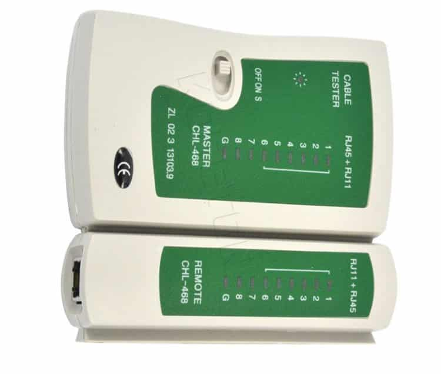

*   **Кроссовый инструмент (Impact-инструмент)**
    *   **Задача:** Заделка провода в контакты розеток и патч-панелей.
    *   **Как выбрать:** Берите исключительно ударную (impact) версию. Она работает по принципу рычага: одним четким движением вы одновременно прорезаете изоляцию жилы, обкусываете лишний хвостик и надежно фиксируете провод в контакте.

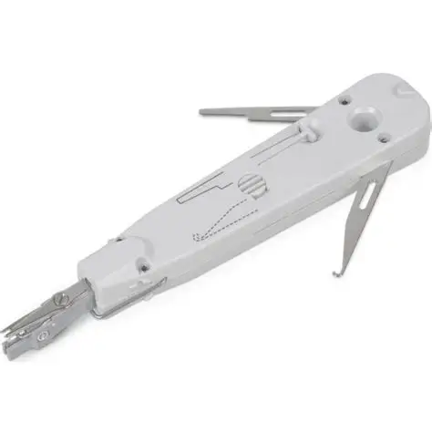

---
## 5. Подготовка кабеля к обжиму

### 5.1 Снятие внешней изоляции

Существует два основных способа снять внешнюю оболочку с витой пары.

**Способ 1 — с помощью стриппера (рекомендуемый):**
- Настройте стриппер на глубину реза, равную толщине оболочки.
- Вставьте кабель, сожмите рукоятки и проверните инструмент вокруг кабеля.
- Снимите отрезок оболочки длиной 2,5–3 см (примерно полторы длины коннектора).
- **Контролируйте:** <mark><strong>ножи не должны касаться изоляции цветных жил. Если вы видите насечки — отрежьте этот кусок и начните заново.</strong></mark>

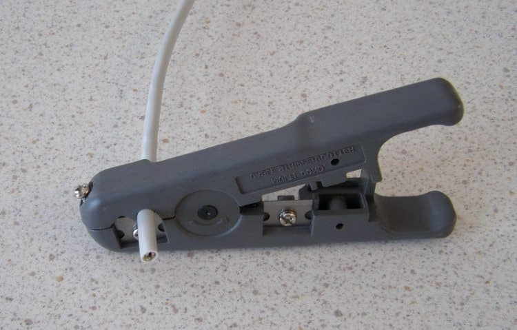

**Способ 2 — с помощью нейлоновой разрывной нити:**
- У многих кабелей (особенно Cat5e и выше) под внешней оболочкой проложена нейлоновая нить.
- Сделайте ножницами или ножом небольшой надрез на оболочке в 2–3 см от края.
- Захватите нейлоновую нить и потяните её с усилием вдоль кабеля. Нить прорежет оболочку по всей длине.
- Отрежьте освободившийся кусок оболочки.
- Этот метод безопасен для жил, поскольку нить не повреждает их изоляцию.

|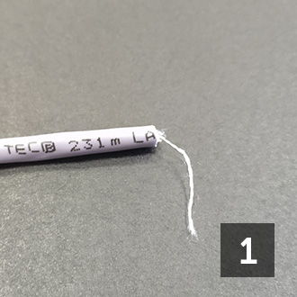   | 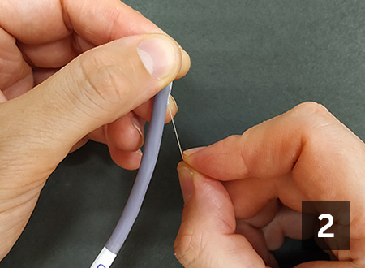  | 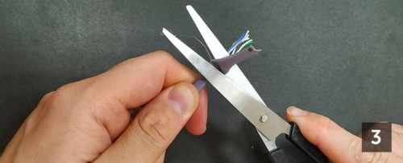  |
|---|---|---|

**Способ 3 — ножом или ножницами (не рекомендуется):**
- Делайте круговой надрез, стараясь не коснуться жил.
- Снимите оболочку.
- **Риск:** при малейшей неосторожности вы повредите изоляцию жил, что приведёт к короткому замыканию или ухудшению характеристик кабеля.

ИТОГ ФАЗЫ:

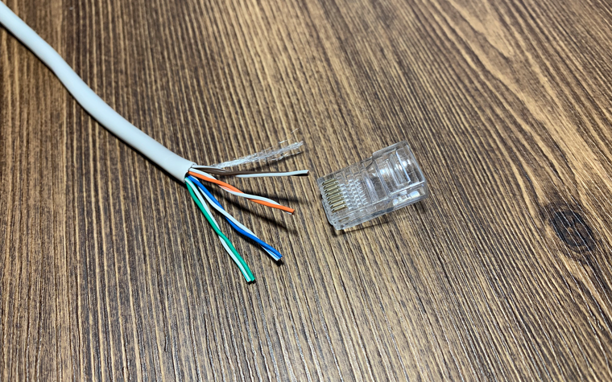

### 5.2 Раскладка и выравнивание жил

- Раскрутите пары на минимально необходимую длину. Длина раскрученного участка **не должна превышать 13–15 мм**. Участки, оставшиеся под оболочкой, должны сохранять заводскую скрутку — это критично для помехоустойчивости.
- Распрямите жилы, разложите их по порядку согласно выбранной схеме (см. раздел 6).
- Плотно прижмите все жилы друг к другу пальцами у края оболочки, чтобы зафиксировать порядок.

### 5.3 Примерка и резка

- Возьмите коннектор и примерьте к нему подготовленный пучок. Ориентиры:
    - Внешняя оболочка кабеля должна заходить внутрь коннектора на 5–6 мм и доходить до внутреннего пластикового фиксатора.
    - Жилы должны упираться в переднюю стенку коннектора.

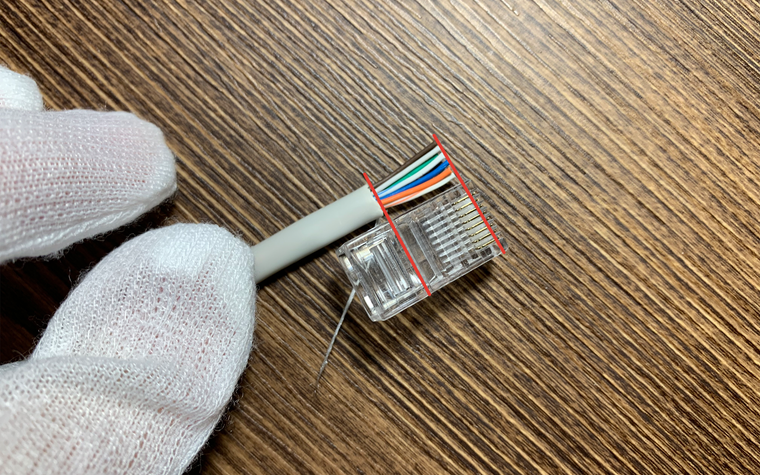

**Если** жилы длинее
  
- Отметьте нужную длину (≈ 12 мм от края оболочки).
- Возьмите острые бокорезы и **ОДНИМ РОВНЫМ ДВИЖЕНИЕМ** отрежьте кончики жил строго перпендикулярно.
- Торцы жил должны находиться в одной плоскости.

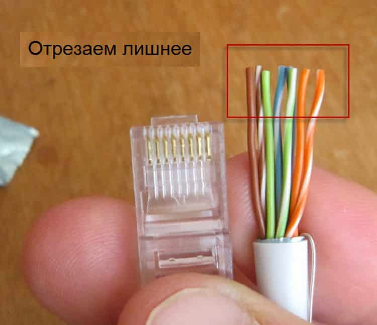

---

## 6. Схемы обжима (распиновка RJ-45)

обжим витой пары действительно определяется двумя независимыми параметрами:

1. Стандарт распиновки (какая схема): T568B,T568A
   2.  Выбираете вы «А» или «Б» — не имеет значения, главное, чтобы внутри вашей локальной сети все было единообразно (обычно везде используют «Б»).
2. Тип кабеля (прямой или кроссовый) — это про способ соединения двух концов между собой.

> **Важное дополнение:** Сегодня эту классификацию часто называют формальностью. <mark><strong>Большинство современного сетевого оборудования (особенно с поддержкой Auto-MDI/X) автоматически определяет тип кабеля и подстраивается.</strong></mark> Однако при монтаже серьезных инфраструктурных сетей по-прежнему строго соблюдают правило: *«Все патч-корды — только прямые (B-to-B), а кроссовер — только при явной необходимости по техзаданию»*.

### 6.1 Прямая распиновка T568B (стандарт для России)

Используется для подключения компьютера к роутеру, свитчу или хабу. Оба конца обжимаются одинаково — по схеме T568B.

**Цветовая схема T568B для контактов 1–8:**

> 1 — **Бело-оранжевый**  
> 2 — **Оранжевый**  
> 3 — **Бело-зелёный**  
> 4 — **Синий**  
> 5 — **Бело-синий**  
> 6 — **Зелёный**  
> 7 — **Бело-коричневый**  
> 8 — **Коричневый**

Прямой кабель: оба конца — T568B.

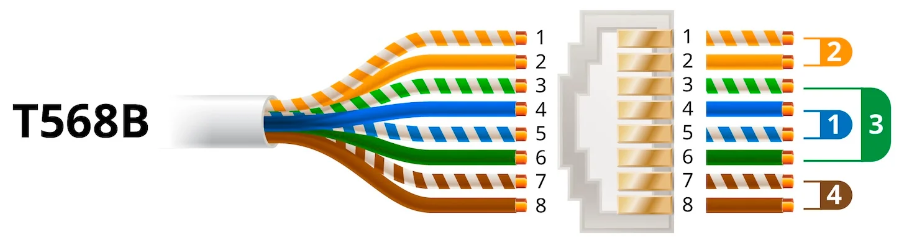

### 6.2 Прямая распиновка T568A

Альтернативный стандарт, используется в некоторых странах Европы и в госсекторе. <mark><strong>В России применяется редко.</strong></mark>

**Цветовая схема T568A для контактов 1–8:**

> 1 — **Бело-зелёный**  
> 2 — **Зелёный**  
> 3 — **Бело-оранжевый**  
> 4 — **Синий**  
> 5 — **Бело-синий**  
> 6 — **Оранжевый**  
> 7 — **Бело-коричневый**  
> 8 — **Коричневый**

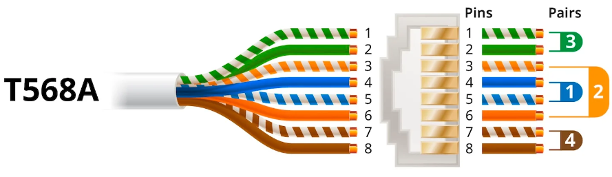

Схемы обжима:

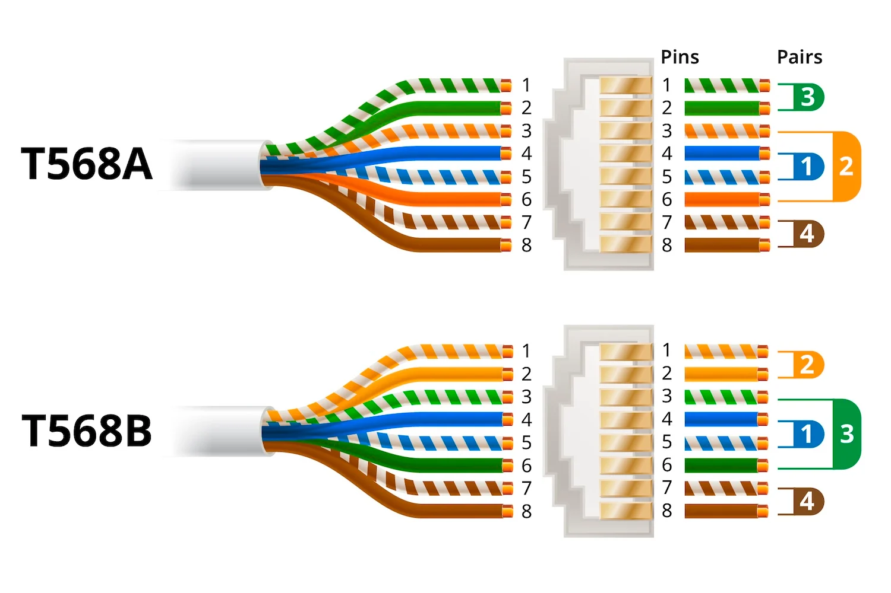

### 6.3 Перекрёстный кабель (Crossover) — T568A / T568B

Раньше использовался для соединения двух компьютеров напрямую или двух свитчей. Один конец обжимается по T568A, другой — по T568B.

<mark><strong>Сегодня всё гигабитное оборудование поддерживает **Auto-MDI/X**, поэтому перекрёстный кабель практически не нужен.</strong></mark> Но если вы подключаете старое оборудование (10/100 Мбит/с) без автоопределения, схема может потребоваться.

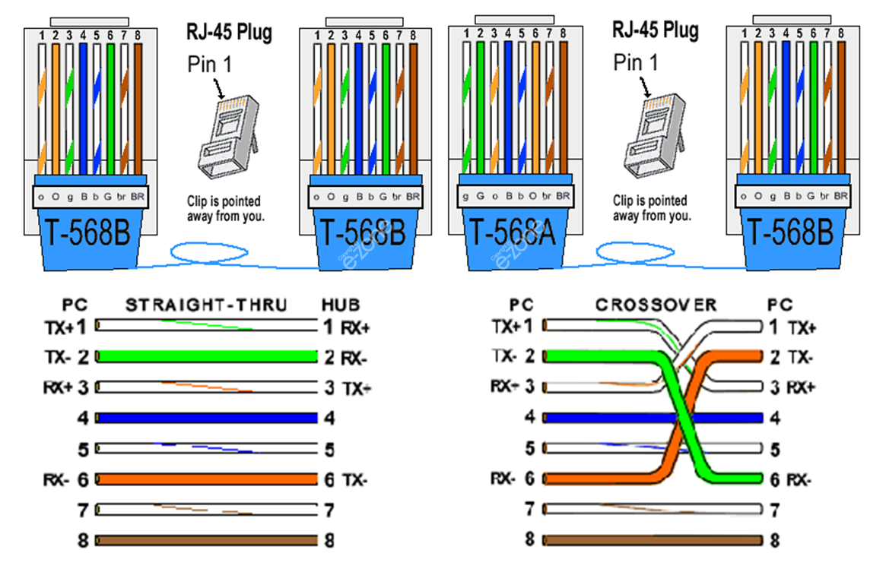

### 6.4 Обжим 4-жильного кабеля (для скорости 100 Мбит/с)

Для сети 100 Мбит/с достаточно двух пар (4 жилы). Используются только контакты 1, 2, 3 и 6.

**Схема T568B для 4 жил:**

> 1 — Бело-оранжевый  
> 2 — Оранжевый  
> 3 — Бело-зелёный  
> 6 — Зелёный

**Схема T568A для 4 жил:**

> 1 — Бело-зелёный  
> 2 — Зелёный  
> 3 — Бело-оранжевый  
> 6 — Оранжевый

**Важно:** При 4-жильном обжиме контакты 4, 5, 7 и 8 остаются незадействованными. Это экономичный вариант для домашних сетей, где не требуется гигабит и не используется PoE.

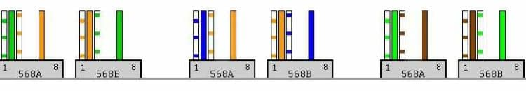

### 6.5 Распиновка для PoE (Power over Ethernet) — стандарт IEEE 802.3af

PoE позволяет передавать питание по тому же кабелю, что и данные. Существует два метода (Mode A и Mode B). Оба используют стандартную распиновку на коннекторах, но питание подаётся по разным парам.

**Метод A (питание по парам данных 1–2 и 3–6):**
- Контакты 1–2: передача данных + питание ($+$V)
- Контакты 3–6: передача данных + питание ($-$V)
- Контакты 4–5, 7–8: не используются для PoE (но могут быть задействованы для Gigabit Ethernet)

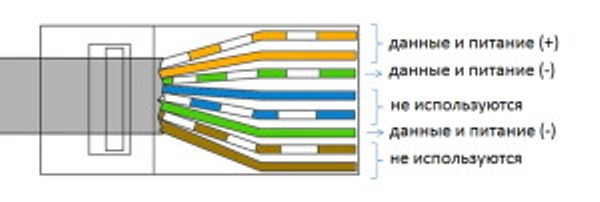

**Метод B (питание по свободным парам 4–5 и 7–8):**
- Контакты 1–2, 3–6: только данные
- Контакты 4–5: питание ($+$V)
- Контакты 7–8: питание ($-$V)

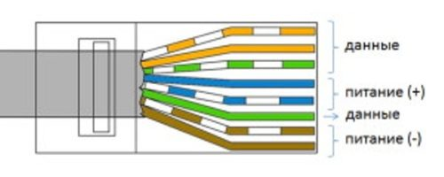

Устройства, поддерживающие PoE, автоматически определяют, какой метод используется. Ваша задача — обеспечить отличный контакт на **всех восьми жилах**, особенно если вы используете PoE+ (до 30 Вт). Плохой контакт под нагрузкой приведёт к нагреву, окислению и выходу порта из строя.

### 6.6 Распиновка для видеонаблюдения (питание по синей и коричневой парам)

В системах видеонаблюдения часто используется упрощённая схема, где питание подаётся по свободным парам:

- Контакты 1, 2, 3, 6: передача данных (стандартная распиновка T568B)
- Контакты 4–5 (синяя пара): $+$V питания
- Контакты 7–8 (коричневая пара): $-$V питания

Эта схема аналогична методу B PoE. **Важно:** подавать напряжение 220 В по витой паре категорически запрещено — кабель на это не рассчитан. Используйте только низковольтное питание (12–48 В) в соответствии со стандартом PoE.

### 6.7 Перекрёстная схема для скорости 1 Гбит/с (гигабитный кроссовер)

Для гигабитной сети все 8 жил работают одновременно на приём и передачу. При соединении двух гигабитных устройств напрямую (без свитча) используется перекрёстная распиновка, задействующая все 4 пары.

| Контакт | Сторона A (T568B) | Сторона B (T568A) |
| :---: | :--- | :--- |
| 1 | Бело-оранжевый | Бело-зелёный |
| 2 | Оранжевый | Зелёный |
| 3 | Бело-зелёный | Бело-оранжевый |
| 4 | Синий | Синий |
| 5 | Бело-синий | Бело-синий |
| 6 | Зелёный | Оранжевый |
| 7 | Бело-коричневый | Бело-коричневый |
| 8 | Коричневый | Коричневый |

Однако, как уже упоминалось, Auto-MDI/X делает эту схему избыточной для большинства современных устройств.

### 6.8 Консольный кабель (Rollover Cable)

Rollover-кабель используется для подключения компьютера к консольному порту (обычно RS-232 / RJ-45) сетевого оборудования (коммутаторов, маршрутизаторов) с целью их настройки. Распиновка на одном конце является полным зеркальным отражением другого.

**Схема Rollover:**

| Контакт (сторона A) | Контакт (сторона B) |
| :---: | :---: |
| 1 | 8 |
| 2 | 7 |
| 3 | 6 |
| 4 | 5 |
| 5 | 4 |
| 6 | 3 |
| 7 | 2 |
| 8 | 1 |

Цвета жил при этом обычно не имеют значения, главное — соблюдать зеркальный порядок. Консольные кабели часто поставляются в комплекте с оборудованием.

---

## 7. Пошаговая инструкция по обжиму коннектора RJ-45

### 7.1 Обжим кримпером (основной метод)

1.  **Отрежьте кабель** нужной длины с небольшим запасом (10–15 %).
2.  **Снимите внешнюю изоляцию** на 2,5–3 см (см. раздел 5.1).

3.  **Раскрутите и распрямите жилы**, разложите их по выбранной схеме (T568B — для прямого кабеля).

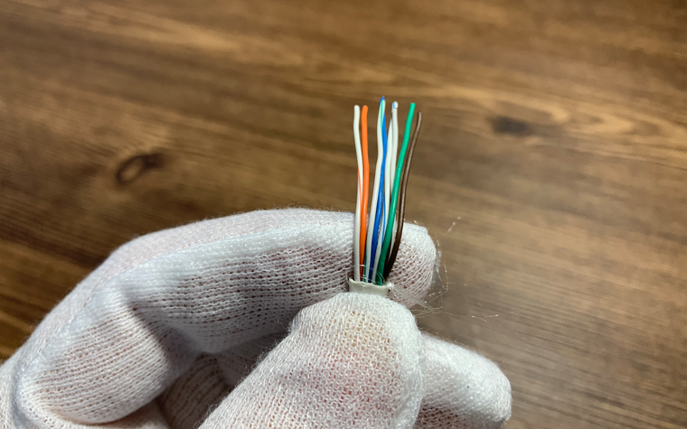

4.  **Выровняйте и отрежьте жилы** ровно, оставляя ≈12 мм от края оболочки.

5.  **Вставьте жилы в коннектор** до упора. Убедитесь, что оболочка зашла под фиксатор.

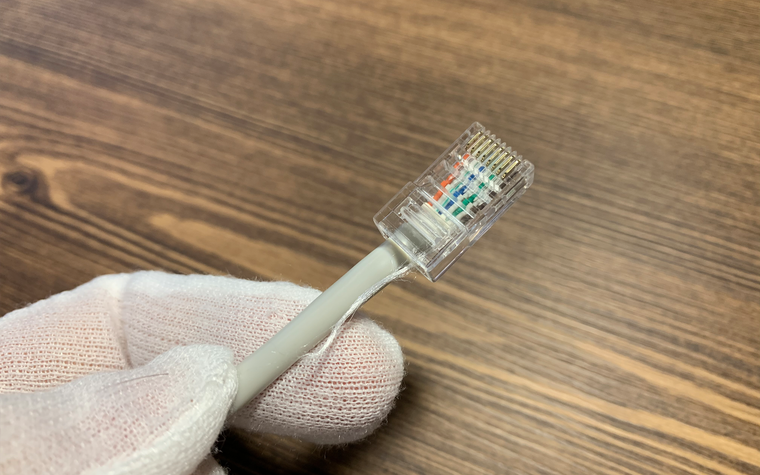

|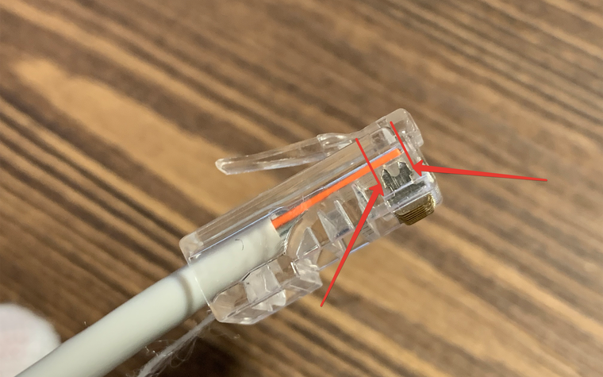   | 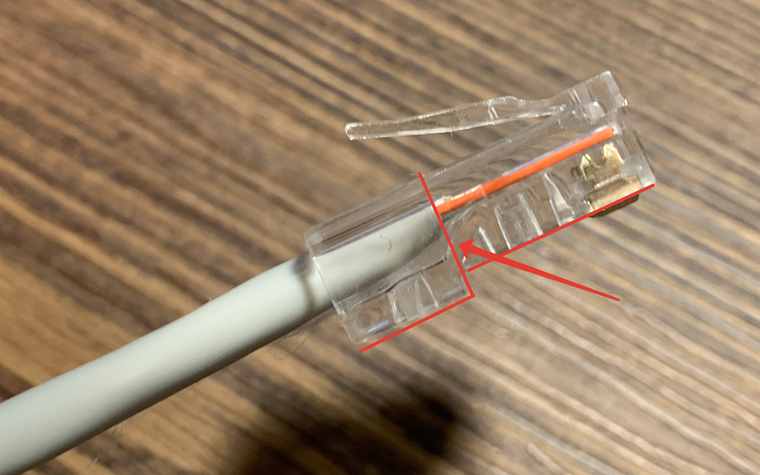  |
|---|---|

6.  **Вставьте коннектор в гнездо кримпера** и сожмите рукоятки до щелчка.

|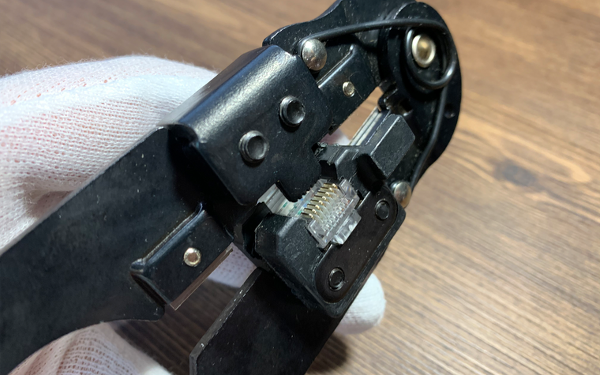   | 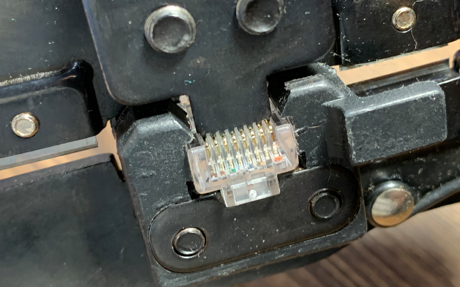  |
|---|---|

7.  **Визуально проверьте:** все 8 контактов должны быть утоплены одинаково.

|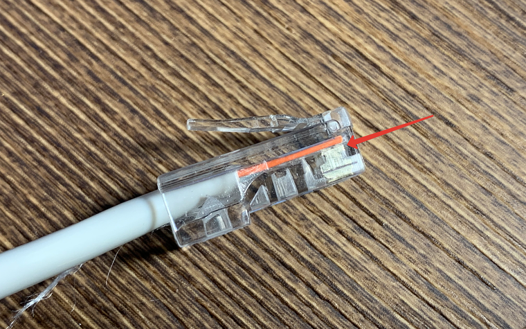   | 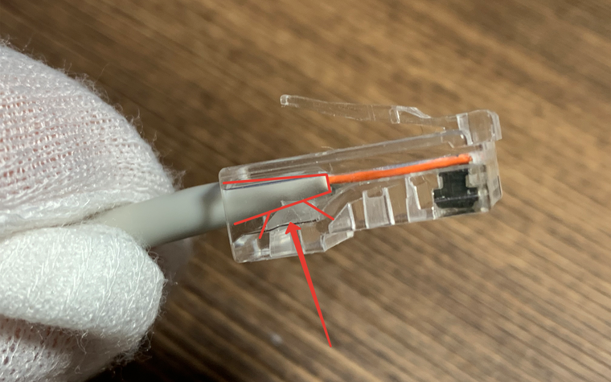  |
|---|---|

Доработка

Бывает, что некоторые зубцы кримпера не достают до каждого контакта в одинаковой степени и оставляют часть пар без контакта. Для этого необходимо настроить обжимную каретку, которая подвижна и регулируется с помощью фиксирующих болтов. Однако, можно быстро исправить положение с помощью секретного инструмента — отвертки. Просто дожимаем нужный контакт плоскостью:

|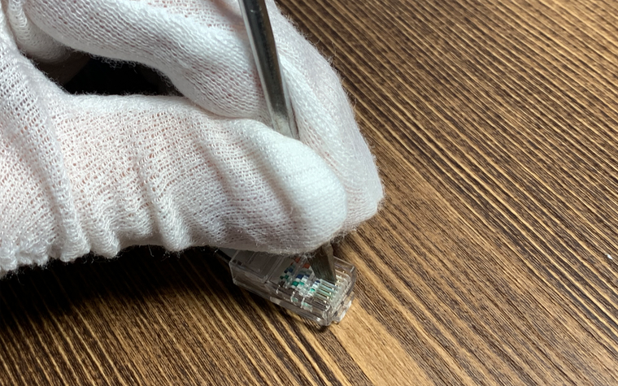  | 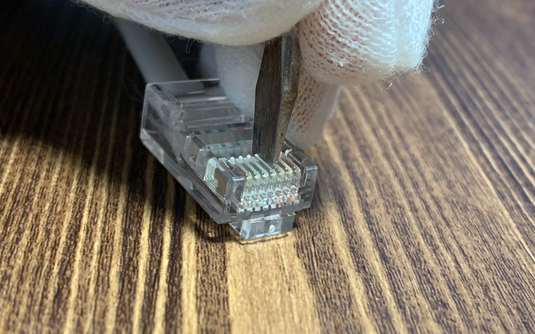  | 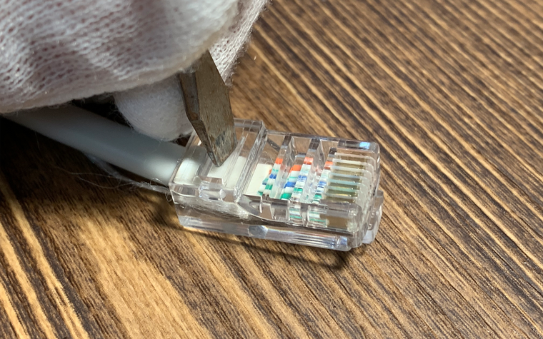  |
|---|---|---|

8.  **Повторите** для второго конца.
9.  **Проверьте тестером** (см. раздел 8).

### 7.2 Обжим отвёрткой (альтернативный метод)

Если кримпера нет под рукой, можно обжать коннектор с помощью плоской отвёртки. Это трудоёмкий процесс, но в полевых условиях он выручает.

**Что понадобится:**
- Кабель нужной длины (с запасом 10–15 %).
- Два коннектора RJ-45 (рекомендуется иметь 4–5 штук на случай ошибки).
- Острый нож, ножницы, плоская отвёртка.

**Пошаговая инструкция:**

1.  Снимите изоляцию на 4–5 см от края кабеля (см. раздел 5.1).
2.  Расправьте и разложите жилы по выбранной схеме. Прижмите их пальцем к лезвию ножа или ножницам и «зачешите» — так они станут ровнее.
3.  Отрежьте лишнее, оставляя 1–1,3 см длины. Торцы должны быть ровными.
4.  Аккуратно вставьте жилы в коннектор до упора.
5.  **Обжим контактов:** придерживая коннектор, возьмите отвёртку с плоским жалом. Поочерёдно надавите на каждый из 8 металлических контактов (золотых ножей) с усилием, достаточным, чтобы они пробили изоляцию жилы и вошли в контакт с медью. Давите плавно, без ударов.
6.  **Фиксация оболочки:** надавите отвёрткой на пластиковый фиксатор (язычок), который должен прижать внешнюю оболочку кабеля.
7.  Повторите для второго конца.
8.  Проверьте работоспособность. Если кабель не работает — отрежьте один конец и попробуйте снова с новым коннектором. По опыту, на это уходит максимум 3–4 коннектора, пока не набьётся рука.

---

## 8. Диагностика и типовые проблемы

| Симптом | Вероятная причина | Проверка | Решение |
| :--- | :--- | :--- | :--- |
| **Нет линка** (индикаторы на сетевых картах не горят) | 1. Обрыв жилы.   2. Раскройка пар (split pair).   3. Несовместимый коннектор (solid/stranded). | 1. Тестер целостности.   2. Визуальная проверка распиновки. | Переобжим с контролем длины и цветов. Замена коннектора на совместимый. |
| **Скорость 100 Мбит вместо 1 Гбит** | Не работает одна из пар (1-2 или 3-6). Гигабиту нужны все 4 пары. | Тестер на целостность всех 8 жил. | Переобжим проблемного конца. Проверка порта. |
| **Прерывистая связь, пинг скачет** | 1. Плохой контакт (недожим, окисление).   2. Внешние помехи (кабель рядом с силовой линией).   3. Механическое повреждение. | 1. Пошевелить кабель у коннектора.   2. Проверить трассу прокладки. | Переобжим. Перепрокладка кабеля с соблюдением правил (пересечение силовых кабелей только под 90°). |
| **Не работает PoE** | Обрыв на жилах, отвечающих за питание (4-5 или 7-8). Высокое сопротивление контакта. | Тестер целостности, мультиметр под нагрузкой. | Переобжим. Замена кабеля CCA на нормальную медь. |
| **Тестер показывает всё ОК, но связи нет** | Раскройка пар (split pair). Простой тестер не видит эту ошибку. | Визуальная проверка: правильно ли вы объединили пары (оранжевый с бело-оранжевым, зелёный с бело-зелёным и т.д.). | Переобжим с тщательным контролем цветов. |

---

## 9. Экспертные советы (из практики)

1.  **Слушайте звук.** При обжиме кримпером хороший коннектор с острыми ножами издаёт едва уловимый высокочастотный хруст — это медь прорезает изоляцию. Глухой удар означает тупые ножи или недостаточное усилие.
2.  **Грейте коннекторы зимой.** Холодный пластик хрупок, фиксатор может лопнуть. Кроме того, медь и пластик имеют разные коэффициенты температурного расширения — обжатый на холоде кабель в тёплом помещении может ослабить контакт.
3.  **Работайте при правильном освещении.** Резкие тени от жил могут обмануть глаз — вам может показаться, что жила дошла до упора, хотя на самом деле она короче на 0,5 мм. Используйте боковой рассеянный свет, кладите кабель на матовую тёмную поверхность.
4.  **Никогда не скручивайте кабель.** Соединение двух кусков витой пары скруткой убивает волновое сопротивление. Используйте розетки или патч-панели.
5.  **Не экономьте на коннекторах.** Дешёвые коннекторы имеют плохую позолоту (или только имитацию позолоты), некачественные ножи и хрупкий пластик. Закупоривание контактов происходит быстрее, и кабель выходит из строя.

---

## 10. FAQ (Часто задаваемые вопросы)

**Вопрос: Обязательно ли использовать профессиональный инструмент, или можно обжать отвёрткой?**
**Ответ:** Отвёрткой можно, но это «аварийный» метод. Качество контакта будет ниже, а риск повредить коннектор — выше. Используйте этот метод только в крайнем случае и переобожмите кабель кримпером при первой возможности.

**Вопрос: Можно ли соединять два куска витой пары скруткой?**
**Ответ:** Категорически нет. Скрутка нарушает волновое сопротивление (100 Ом), что приводит к отражению сигнала, потере скорости и нестабильности. Правильное решение — использовать розетку (джек) или монтажную коробку с клеммами (IDC), но лучше проложить цельный кабель.

**Вопрос: Нужно ли заземлять экранированную витую пару (FTP, S/FTP)?**
**Ответ:** Да, и обязательно. Экран нужно заземлять с **обоих концов** на общую шину заземления. Если этого не сделать, экран превратится в антенну, которая будет только усиливать помехи. В 99% случаев в квартирах и офисах экранированный кабель не нужен, достаточно UTP.

**Вопрос: Какой стандарт выбрать, если я делаю сеть в квартире?**
**Ответ:** Однозначно T568B. Это стандарт для всего оборудования в СНГ. Соблюдайте его на всех розетках и патч-кордах.

**Вопрос: Почему тестер показывает, что все жилы целы, а интернет всё равно не работает?**
**Ответ:** Скорее всего, это **раскройка пар (split pair)**. Простые тестеры не умеют её определять. Вы можете перепутать местами провода внутри пары, например, вместо пары (оранж, бело-оранж) использовать (оранж, бело-зелёный). Схема цела, но передача данных нарушена. Внимательно проверьте распиновку визуально.

**Вопрос: Нужно ли использовать коннекторы той же категории, что и кабель?**
**Ответ:** Да. Для Cat5e используйте коннекторы Cat5e, для Cat6 — Cat6. Коннекторы более высокой категории обычно имеют улучшенную конструкцию для работы на высоких частотах, но они дороже. Для домашнего использования Cat5e с соответствующими коннекторами достаточно.

**Вопрос: Что делать, если я купил кабель CCA?**
**Ответ:** Лучший вариант — вернуть его и купить нормальный медный (CU). Если такой возможности нет, используйте его только для линий без PoE и на коротких расстояниях (до 30–40 м), но помните, что он более хрупкий и хуже держит контакт в коннекторах. Для критичных участков сети CCA неприменим.

**Вопрос: Как часто нужно менять патч-корды?**
**Ответ:** Качественно обжатый патч-корд при аккуратном обращении служит несколько лет. Основные проблемы возникают в месте входа в коннектор (перегиб) и в защёлке. Если защёлка сломалась — замените патч-корд. Если контакты потемнели или окислились — замените. Периодическая проверка тестером помогает выявить проблемы заранее.

**Вопрос: Можно ли использовать 4-жильный кабель для гигабитной сети?**
**Ответ:** Нет. Для 1 Гбит/с необходимы все 8 жил. 4-жильный кабель обеспечивает только 100 Мбит/с.

**Вопрос: Для чего нужен консольный кабель (Rollover)?**
**Ответ:** Для подключения компьютера к консольному порту коммутаторов, маршрутизаторов и другого сетевого оборудования с целью их первоначальной настройки или восстановления. Это не сетевой кабель для передачи данных между обычными устройствами.

**Вопрос: Можно ли подавать питание 220 В по витой паре?**
**Ответ:** Категорически нет. Кабель не рассчитан на такое напряжение. Для питания по кабелю используется только низковольтное питание в рамках стандарта PoE (обычно 12–48 В).
