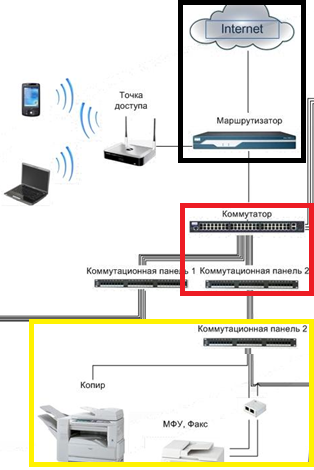
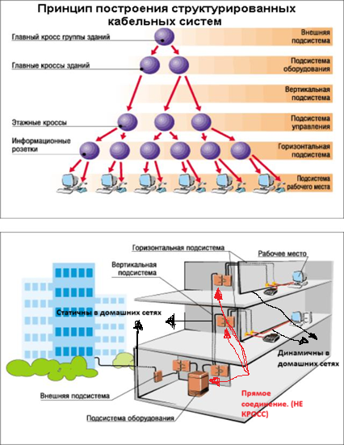

Вот есть СКС



Черная - условная КВМ, крассная - КЗ, жеотая - КЭ (горизонтальная подсистема)



В Кроссвых коммутация производится не через дополнителный кросс, а напрямую

Вот объединённая версия — цельный конспект по теме, без повторов и с логикой «от общего к частному».

---

# Как устроена линия «домового» интернета

## 1. Общая картина

```
[Улица] ──► [Uplink коммутатора]
                  │
            [Коммутатор]
                  │ патч-корд (динамика)
                  ▼
        [Патч-панель узел] ══статика══ [Патч-панель этаж] ──► [Квартира]
```

- **Патч-панель в узле** — точка сбора домовых линий (в квартиры / на этажи).
- **Коммутатор** стоит между внешней линией и домовыми линиями.
- **Патч-панели** — пассивные точки коммутации, сигнал не усиливают.
- **Статичная линия** узел ↔ этаж — постоянный кабель, который «замыкается» на коммутатор при подключении абонента.

## 2. Статичная часть (проложена один раз, не меняется)

```
[Патч-панель в домовом узле] ══постоянный кабель в стояке══ [Патч-панель на этаже]
```

- Пассивная витая пара, проложенная при монтаже дома.
- На обоих концах расшита в патч-панели.
- Существует всегда, независимо от подключения абонентов.

## 3. Динамическая часть (появляется при подключении)

```
[Коммутатор] ──патч-корд──► [Патч-панель узел]
                                   ══статичный кабель══
                                        [Патч-панель этаж] ──кабель──► [Квартира]
```

- **В узле:** патч-корд соединяет порт коммутатора с портом патч-панели (вашей линии).
- **На этаже:** от патч-панели тянется кабель до квартиры.

## 4. Где внешняя линия (с улицы)

- **Оптика** → оптический кросс → медиаконвертер/ONU → патч-корд в uplink-порт коммутатора.
- **Медь** → напрямую в uplink-порт коммутатора (или через отдельную панель/кросс).
- Внешняя линия **не расшивается** в ту же патч-панель, где квартирные линии.

## 5. Коммутация vs кроссировка

Два разных способа соединения в кроссовой:

**Кроссировка (cross-connect)**
- Соединение **патч-кордом** между двумя патч-панелями.
- **Пассивное** — без активного оборудования.
- Сигнал идёт «напрямую»: порт ↔ порт.
- Пример: патч-панель горизонтали ↔ патч-панель магистрали.

**Коммутация (switching)**
- Соединение **через коммутатор**.
- **Активное** — оборудование обрабатывает кадры.
- Сигнал проходит через электронику: порт → коммутатор → порт.
- Пример: патч-панель горизонтали ↔ коммутатор ↔ патч-панель магистрали.

```
Без коммутатора (чистая кроссировка):
[Панель A] ──патч-корд── [Панель B]
1 линия ↔ 1 линия

С коммутатором (коммутация):
[Панель A] ──патч-корд── [Коммутатор] ──патч-корд── [Панель B]
много линий ↔ много линий, коммутатор рулит трафиком
```

## 6. Где появляется коммутатор и сколько их нужно

Коммутатор появляется **в кроссовой**, когда нужно:

1. Объединить много линий в один uplink (агрегация).
2. Раздать интернет на много квартир от одного ввода.
3. Разделить трафик между абонентами (VLAN, изоляция).
4. Согласовать скорости (10/100/1000 Мбит/с).

**Количество коммутаторов:**
- Один коммутатор имеет N портов (обычно 8/16/24/48).
- Если линий больше N — ставят второй коммутатор.
- Коммутаторы соединяются между собой (uplink / trunk), образуя каскад.

```
[Коммутатор 1: 24 порта] ──uplink── [Коммутатор 2: 24 порта]
        │                                    │
   24 линии                             24 линии
```

Формула: **число коммутаторов = ceil(число линий / портов на коммутатор)**, плюс запас на uplink-порты.

## 7. Почему коммутатор именно в домовом узле

```
[Провайдер] ──► [Uplink коммутатора]
                        │
                  [Коммутатор]  ← здесь появляется активка
                        │
              [Патч-панель домового узла]
                        ║ (магистраль в стояке)
              [Патч-панель этажа]
                        │
                  [Квартира]
```

- Один ввод от провайдера нужно раздать на много квартир.
- Коммутатор — точка агрегации.
- Дешевле держать один коммутатор в узле, чем ставить активку на каждом этаже.

**Когда коммутатор появляется на этаже:**
- Если квартир много и кабель от узла до этажа один (экономия на магистрали).
- Тогда на этаже ставят этажный коммутатор, а к нему — квартиры.

```
[Коммутатор в узле] ──1 магистраль── [Коммутатор на этаже] ──► квартиры этажа
```

## 8. Ключевая мысль

| Что | Где | Зачем |
|---|---|---|
| Кроссировка | В кроссовой | Пассивно соединить две линии |
| Коммутация | В кроссовой | Активно раздать/разделить трафик |
| Коммутатор | В кроссовой (узел / этаж) | Агрегация, раздача, изоляция |
| Количество коммутаторов | — | = число линий ÷ порты, с учётом каскада |

## 9. В вашей схеме

- **Коммутатор в домовом узле** — появляется, потому что один ввод провайдера раздаётся на много квартир.
- **Этажная патч-панель** — пассивная точка, коммутатора там нет (если не ставят этажный свитч).
- **Кроссировка** — соединение патч-кордом между панелями.
- **Коммутация** — соединение через коммутатор.

---

Хотите, добавлю этот материал в ту веб-страницу отдельным разделом «Коммутация vs кроссировка» с визуализацией обоих вариантов?