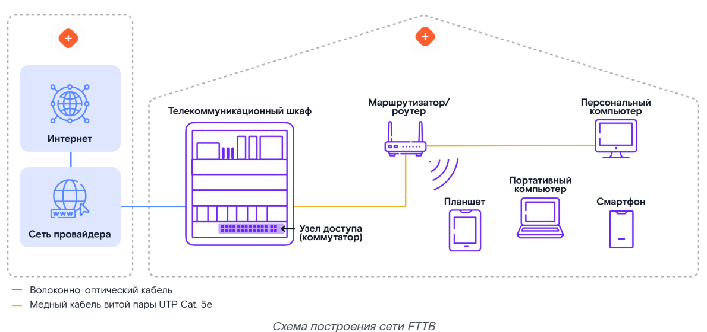
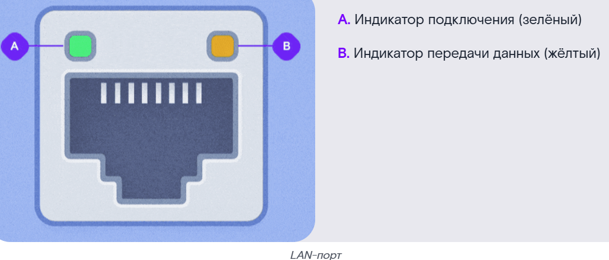
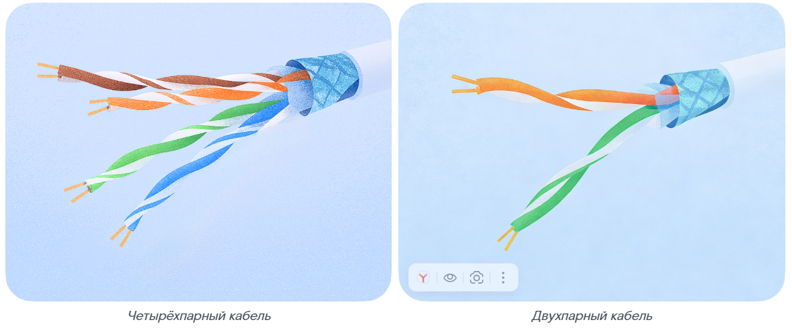
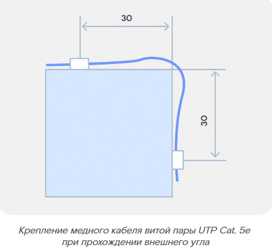
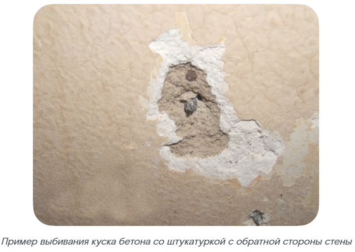
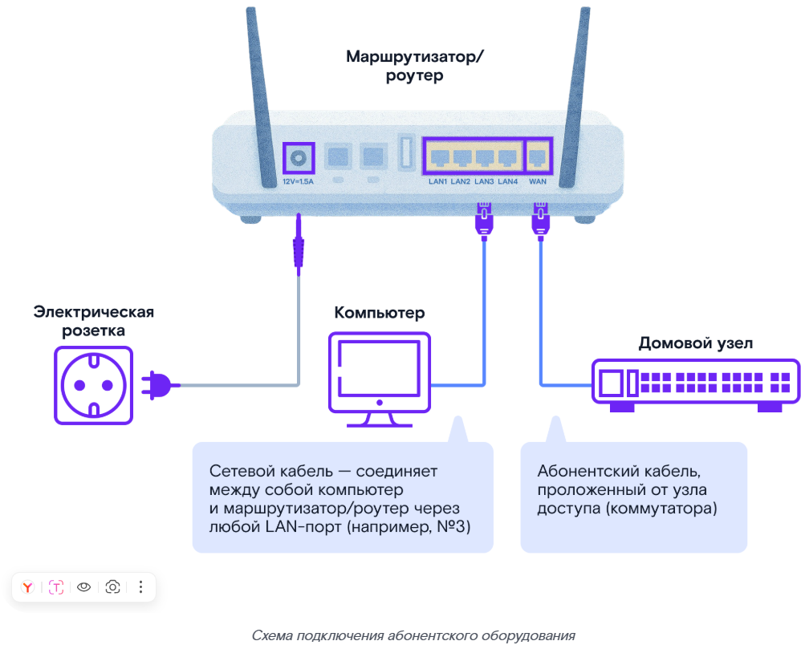
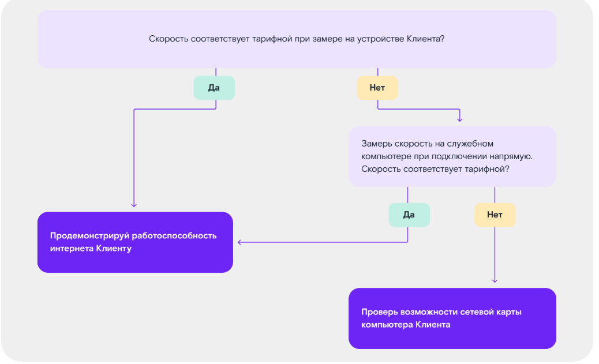

# Технология FTTB: что это?

ПАО «Ростелеком» предоставляет высокоскоростной доступ к интернету по технологии **FTTB** (Fiber To The Building, в переводе с английского — «Оптика до здания»).

> **FTTB (Fiber To The Building)** — технология подключения к интернету, при которой оптический кабель прокладывается до здания (узла доступа), а внутри здания до абонента используется медный кабель витой пары.

## Суть технологии FTTB

### Схема построения сети FTTB

> **Узел доступа (коммутатор)** — сетевое устройство, размещаемое в телекоммуникационном шкафу, обеспечивающее подключение абонентов к сети провайдера через LAN-порты.

> **АО (абонентское оборудование)** — устройство, устанавливаемое у клиента (маршрутизатор/роутер), обеспечивающее подключение оконечных устройств к сети.

Длина кабеля от узла доступа (коммутатора) до АО (абонентского оборудования) не должна превышать **100 м**.

Узел доступа (коммутатор) размещают в антивандальных телекоммуникационных шкафах настенного или напольного типа. Шкаф устанавливают в подъездах домов, других технических и нежилых помещениях.

На узле доступа (коммутаторе) есть от **4 до 48 LAN-портов** для подключения абонентов. У каждого LAN-порта есть два светодиода, по которым можно определить его состояние: наличие подключения и активность передачи данных.

- **A. Индикатор подключения** (зелёный)
- **B. Индикатор передачи данных** (жёлтый)
- **LAN-порт**

### Кабельная инфраструктура

Для построения внутридомовых сетей используется медный кабель витой пары **UTP Cat. 5e**.

> **UTP Cat. 5e (Unshielded Twisted Pair, категория 5e)** — неэкранированная витая пара, кабель для передачи данных, поддерживающий частоты до 100 МГц.

Медный кабель витой пары UTP Cat. 5e может быть двухпарным или четырёхпарным:

| Тип кабеля | Максимальная скорость |
|---|---|
| 2 пары | до 100 Мбит/с |
| 4 пары | до 1000 Мбит/с (1 Гбит/с) |

Работу с данным типом кабеля подробно рассмотрим на практической лабораторной работе.

> **Запомни:** Схема подключения по технологии FTTB включает в себя телекоммуникационный шкаф с узлом доступа (коммутатором), от которого проложен медный кабель витой пары UTP Cat. 5e до оконечных устройств в квартире Клиента.

## Общая схема инсталляции услуги

Инсталляция FTTB требует строгого соблюдения алгоритма. Это гарантия того, что услуга будет работать без сбоев, а тебе не придётся переделывать работу.

### Этап 1. Подготовка

Подробный алгоритм смотри в курсе «Роль и стандарты работы. Выездной технический специалист ПАО Ростелеком».

Этап включает 4 основных шага.

**01. Получение наряда**
- Запусти приложение ЦМ/ММ и посмотри назначенные наряды на день. Рассчитай количество абонентского оборудования.
- Проверь комментарии к наряду.

**02. Сборы**
- Подготовь смартфон, инструменты, оборудование и SIM-карты для инсталляций.
- Получи ключи от телекоммуникационных шкафов.
- Не забудь про запас АО.
- Добавь оборудование в «рюкзак монтажника» в ЦМ/ММ.

**03. Дозвон**
- За 30–60 минут до визита созвонись с Клиентом в ЦМ/ММ: подтверди время визита и сверь адрес с нарядом.
- Удостоверься, что во время проведения работ в квартире будет находиться совершеннолетний.

**04. Выезд**
- Доберись до адреса не позже чем через 10 минут после начала интервала инсталляции.
- Получи доступ во все помещения и ко всему оборудованию, необходимому для проведения работ.

Алгоритм звонка Клиенту и порядок действий в нестандартных ситуациях (Клиент не успевает или не может присутствовать, ты опаздываешь, Клиента нет по адресу, нет доступа к оборудованию) рассматриваются в курсе «Роль и стандарты работы. Выездной технический специалист ПАО Ростелеком».

**Прежде чем отправляться на выезд, проверь наличие:**
- брендированной формы от ПАО «Ростелеком»;
- исправного инструмента;
- рекламной продукции;
- при необходимости — полного пакета документов.

**Далее не забудь:**
- позвонить через приложение ЦМ/ММ Клиенту за 30–60 минут до начала интервала инсталляции, подтвердить визит в назначенное время, сверить адрес выполнения работ;
- прибыть в согласованное с Клиентом время, в рамках интервала инсталляции.

### Этап 2. Встреча с Клиентом или его представителем

Подробный алгоритм смотри в курсе «Роль и стандарты работы. Выездной технический специалист ПАО Ростелеком».

**Приветствие и проверка документов**

01. Поздоровайся, представься, покажи удостоверение и объясни цель визита.
02. Спроси у Клиента, как к нему можно обращаться.
03. Спроси, куда можно повесить верхнюю одежду и где расположить инструменты.
04. Сверь данные Клиента с указанными в наряде.

> Что делать, если у Клиента или его представителя нет актуального паспорта или доверенности, смотри в курсе «Роль и стандарты работы. Выездной технический специалист ПАО Ростелеком».

05. Убедись, что квартира не используется в коммерческих целях.

**Согласование состава услуг**

01. Сверь с Клиентом:
- состав услуг;
- АО;
- размер абонентской платы.
02. Предложи дополнительные услуги/оборудование.
03. Ознакомь Клиента с документами для электронного документооборота.

**Согласование места расположения АО (маршрутизатора/роутера)**

01. Совместно с Клиентом выбери подходящее место для установки АО.

> Требования к установке АО смотри в курсе «Роль и стандарты работы. Выездной технический специалист ПАО Ростелеком».

02. Подключи АО к электросети в предполагаемом месте его установки.
03. Проведи необходимые замеры уровня сигнала Wi-Fi Клиента в ЦМ/ММ — «радиопланирование». Важно, чтобы сигнал был в пределах допустимой нормы.

Подробно тему радиопланирования рассмотрим на практической лабораторной работе.

**Значения соответствия силы сигнала Wi-Fi и его качества:**

| Качество сигнала              | Значение           |
|-------------------------------|--------------------|
| Отличные показатели           | от -35 до -50 дБм  |
| Хорошие показатели            | от -50 до -65 дБм  |
| Удовлетворительные показатели | от -65 до -75 дБм  |
| Плохие показатели             | от -75 до -85 дБм  |
| Неприемлемые значения         | от -85 до -100 дБм |

Если зоны покрытия Wi-Fi или скорости недостаточно для квартиры Клиента, предложи другое месторасположение или дополнительное оборудование. Если Клиент согласен, добавь оборудование в ЦМ/ММ самостоятельно. Если не получается — позвони в НПП (направление поддержки продаж): оператор изменит состав заказа.

Выбирая место для АО, сразу продумай трассу кабеля. Следи, чтобы кабель:
- был в недоступном для детей и животных месте;
- не защемлялся и не передавливался;
- не повреждался острыми предметами;
- не перегибался на углах.

**Согласование плана и времени работ**

01. Поясни Клиенту, какие работы нужны для подключения и сколько времени понадобится.
02. Согласуй с Клиентом трассу прокладки кабеля внутри квартиры и место технологического отверстия (при необходимости).

Если инсталляция производится в присутствии представителя, свяжись с Клиентом и согласуй монтажные работы по телефону.

**Этап завершён. При встрече с Клиентом не забудь:**
- представиться, показать служебное удостоверение;
- использовать бахилы во время выполнения работ;
- согласовать оптимальное место установки АО, трассу прокладки кабеля и технологическое отверстие (при необходимости).

### Этап 3. Монтажные работы

Проводя монтажные работы, соблюдай тишину: шумные работы проводи только в разрешённое по местным законам время.

Детали монтажных работ разберём на практической лабораторной работе.

**01. Поиск узла доступа и определение порта абонента**

Посмотри линейные данные в ЦМ/ММ, найди узел доступа (коммутатор) и определи порт абонента.

**02. Проверка работоспособности узла доступа и порта абонента**

Подключи рабочий ноутбук через короткий патч-корд к абонентскому порту на узле доступа (коммутаторе) или используй цифровой LAN-тестер.

На порту узла доступа (коммутатора) должна появиться индикация.

> **Проблема с ресурсами оборудования доступа.** Если, например, распределительный порт повреждён или уже задействован, то до начала работ свяжись с сотрудником УПЛД (управление проработки линейных данных). Сотрудник проверит порт и, если он занят, попробует забронировать другой.
> - Если получается — вносятся изменения в наряд.
> - Если не получается — свяжись с оператором НПП, чтобы отложить визит, и можешь покидать адрес инсталляции.

> **Важно:** Не задействуй порты, которые не соответствуют маркировке в наряде.

**03. Прокладка медного кабеля витой пары UTP Cat. 5e от узла доступа до квартиры Клиента**

Убедись, что нет препятствий для выполнения монтажа.

- **Препятствий нет** — составь визуальный план прокладки кабеля с использованием измерительной рулетки и анализатора скрытой электрической проводки.
- **Монтаж сложный, нужны дополнительные инструменты/материалы или подмога** — свяжись с оператором НПП для переноса времени визита, и можешь покидать место инсталляции.
- **Другая техническая проблема** — если с ресурсами оборудования доступа всё в порядке, но, например, в МКД забитый стояк или есть следы вандального воздействия — установи признак NRFS* в ЦМ/ММ. Оператор НПП свяжется с Клиентом и сообщит о переносе визита.
- **Монтаж и/или ввод кабеля невозможен** — сообщи об этом оператору НПП для отмены заказа, и можешь покидать адрес инсталляции.

> **NRFS (Not Ready For Sale)** — признак, который устанавливается в случае, когда невозможна инсталляция услуги по другим техническим причинам.

Подробнее с признаком NRFS можно ознакомиться в курсе «Работа с ограничением NRFS при инсталляциях».

> **Важно:** Не используй действующую клиентскую медную проводку (медный кабель витой пары UTP Cat. 5e) для предоставления заказанных услуг. Исключение — наряды с признаком «Лёгкая инсталляция».

**Если Клиент настаивает на использовании его старой проводки:**
- Сделай запись об этом в акте выполненных работ.
- Предупреди, что в таком случае качество услуги не гарантируется.

**Основные правила прокладки кабеля**

Прокладывай кабель закрытым способом в электротехнических коробках, плинтусах или каналах строительных конструкций. Используй лотки (коробы) закрытого типа.

> **Не используй общедомовой пожарный кабель-канал.**

Если кабель приходится прокладывать параллельно другим коммуникациям, соблюдай минимальные расстояния:
- до слаботочных сетей — не менее 10 см;
- до электропроводки — не менее 25 см;
- до труб водоснабжения, отопления и сантехники — не менее 1 м.

**Запрещается:**
- перекручивать и завязывать кабель, оставлять излишки;
- использовать кабель, составленный из нескольких частей с помощью переходников или розеток;
- допускать сильные изгибы и заломы кабеля, продольное и поперечное петлевание и прямые углы;
- прокладывать кабель-канал по потолку (если только не надо обойти препятствия — трубы, ливневые стоки).

Старайся избегать пересечения с другими кабелями.

Если внешняя оболочка повредилась при выполнении монтажных работ, проверь, целы ли внутренние элементы кабеля. Если они повреждены — полностью замени кабель.

Крепления должны быть подходящего размера, чтобы кабель не проскальзывал. Кабель не должен провисать в пролётах между точками крепления.

> **Несоблюдение правил прокладки кабеля может привести к некачественной работе услуги и повторному выезду.**

**Шаг крепления и изгиб трассы**

Крепи кабель каждые **250 мм**, ориентируясь на поверхность.

При изменении направления трассы фиксируй угол поворота креплениями на расстоянии **30 мм** от вершины угла. Соблюдай допустимый радиус изгиба.

> Рис. 1 — Крепление медного кабеля витой пары Cat. 5e при изменении направления прокладки и прохождении внутреннего угла

> Рис. 2 — Крепление медного кабеля витой пары UTP Cat. 5e при прохождении внешнего угла

> **Не крепи кабель в точке вершины угла.**

**04. Оконечивание абонентского кабеля со стороны узла доступа и маркировка**

Проведи оконечивание абонентского кабеля со стороны узла доступа (коммутатора) и промаркируй кабель с указанием номера квартиры и номера порта.

**05. Технологическое отверстие**

Если нет технологического отверстия в квартире Клиента, сделай новое, предварительно проверив скрытую проводку.

Отверстие сверли изнутри квартиры (так как при сверлении с обратной стороны может отколоться значительный фрагмент отделки) в пределах периметра дверной коробки, отступив не больше **15 см**. Не сверли ближе **20 см** от пола и **30 см** от потолка.

> Рис. 3 — Зона, разрешённая для сверления технологического отверстия

> Рис. 4 — Пример выбивания куска бетона со штукатуркой с обратной стороны стены

После выполнения технологического отверстия зашпаклюй стену и восстанови её первоначальный вид.

**06. Прокладка линии по квартире Клиента до АО**

- Заведи кабель в квартиру Клиента через новое или существующее технологическое отверстие.
- Прохождение сквозного отверстия фиксируй креплениями на расстоянии **50 мм** от отверстия.

> Рис. 5 — Крепление медного кабеля витой пары UTP Cat. 5e при прохождении сквозного отверстия через стену

- Проведи медный кабель витой пары UTP Cat. 5e по квартире Клиента.

**Примеры запрещённых трасс:**
- под линолеумом;
- в дверных проёмах;
- поверх плинтусов вблизи пола, если трассу могут повредить дети или домашние животные;
- по участкам, где стоят стулья, шкафы и пр.

Правила прокладки кабеля в квартире такие же, как и при прокладке вне квартиры.

**07. Оконечивание кабеля со стороны АО**

Абонентский кабель можно оконечить коннектором **8P8C** или установить у Клиента розетку.

Детали работы с кабелем разберём на практической лабораторной работе.

**08. Проверка проложенной линии LAN-тестером**

Далее тебе предстоит подключить и настроить АО. Перед переходом к следующему этапу важно:
- проложить абонентскую линию в подъезде с использованием кабель-каналов по вертикальным и горизонтальным линиям (за исключением прокладки в лестничном проёме параллельно лестничному маршу), с отсутствием видимых частей абонентской линии;
- проложить абонентскую линию в квартире.

### Этап 4. Подключение и настройка оборудования

01. В «рюкзаке монтажника» в ЦМ/ММ выбери и привяжи оборудование к наряду.
02. Закрепи маршрутизатор/роутер в вертикальном или горизонтальном положении.

> Если Клиент просит не крепить маршрутизатор/роутер стационарно (например, поставить на стол), сделай отметку об этом в акте выполненных работ.

> Если подключаешь услуги на оборудовании Клиента, предупреди его: качество может быть ниже обычного.

03. Подключи маршрутизатор/роутер к питанию.
04. Подключи маршрутизатор/роутер к абонентской линии.

> Рис. 8 — Схема подключения абонентского оборудования

05. Промаркируй кабель со стороны АО и само оборудование.

С помощью квадратных и прямоугольных наклеек маркируются порты на АО и соответствующие патч-корды:
- **синий цвет** — для портов LAN под Internet;
- **красный цвет** — для портов LAN под IP-TV;
- **жёлтый цвет** — для портов WAN.

**Правила нанесения маркировки:**

Наноси маркировку аккуратно и ровно, только на кабель или оборудование компании.

**Места нанесения:**
- на заднюю панель маршрутизатора/роутера строго над необходимым портом, либо под портом, если маркировка над портом невозможна;
- на подключённый кабель — на расстоянии 50–100 мм от его конца.

> Рис. 9 — Пример промаркированного АО

- Квадрат клеится на заднюю часть маршрутизатора/роутера (над/под портом).
- Прямоугольник клеится на медный кабель витой пары UTP Cat. 5e.

06. Активируй услуги в ЦМ/ММ.

> Если возникнут проблемы — свяжись с руководителем/куратором. Коллеги попробуют решить проблему и сообщат результат.
> Если проблема не решена — сообщи оператору НПП, и можешь покидать адрес. Обязательно переговори с Клиентом.

07. Настрой подключение к интернету на маршрутизаторе/роутере.
08. Подключи дополнительное оборудование, если была допродажа.

Детали подключения и настройки оборудования разберём на практической лабораторной работе.

**После этого можно переходить к следующему этапу. Но сначала проверь, всё ли выполнено:**
- устройство подключено;
- выполнена активация услуг в информационной системе с помощью ЦМ/ММ;
- маршрутизатор/роутер настроен.

### Этап 5. Демонстрация работы услуги

01. Покажи Клиенту наклейку на устройстве с названием сети и паролем для Wi-Fi.

> При наличии дополнительной наклейки в комплекте предложи Клиенту разместить её на видном месте.

02. Подключи к Wi-Fi-сети беспроводное устройство Клиента.
03. Продемонстрируй скорость интернета по кабелю и Wi-Fi.

Протестируй скорость доступа в интернет на своём устройстве и на устройстве Клиента через сервис **epd.qms.ru**, чтобы узнать, насколько она соответствует тарифному плану.

> При использовании ММ проводи замер скорости доступа к сети Интернет по Wi-Fi на своём устройстве.

**Что делать, если фактическая скорость на устройстве Клиента при проводном подключении не соответствует заявленной в тарифном плане:**

> **Как проверить возможности сетевой карты.** Подключи маршрутизатор/роутер и посмотри, изменяется ли статус компьютера. Если линк отсутствует (нет моргания), скорее всего, проблема в патч-корде или сетевой карте. Возьми заведомо рабочий патч-корд и проверь снова. Если ничего не изменилось — причина в сетевой карте. Сетевая карта может выдавать «неопознанную сеть». Тогда потребуется прописать IP-адрес вручную. Если ничего не помогло — сетевая карта неисправна, её нужно заменить.

04. Продемонстрируй работу услуги.

> При выполнении дополнительных платных работ оформи акт с указанием стоимости и добавь работы в наряд через ЦМ/ММ. Если такой возможности нет — согласуй добавление с руководителем/куратором.

**Это предпоследний этап. Не забудь выполнить следующие действия:**
- измерить скорость передачи Wi-Fi через ЦМ/ММ;
- выполнить замер скорости на соответствие с тарифным планом с устройства Клиента на ресурсе **epd.qms.ru**;
- продемонстрировать работу услуги.

### Этап 6. Завершение работ

Подробный алгоритм смотри в курсе «Роль и стандарты работы. Выездной технический специалист ПАО Ростелеком».

01. Помоги Клиенту подписать договор и заполнить Клиентский пакет документов в электронном формате.
02. Расскажи Клиенту про возможности Единого Личного Кабинета (ЕЛК) и мобильного приложения Личный Кабинет (МЛК). Предложи зарегистрироваться или войти в ЕЛК/МЛК.

> С возможностями личного кабинета можно познакомиться в курсе «Мобильный/Личный кабинет».

03. Расскажи Клиенту о:
- программе «Бонус»;
- дополнительных услугах ПАО «Ростелеком» и предложи подходящие сервисы/услуги (сделай допродажу);
- способах устранения типовых неисправностей.
04. Сделай фотофиксацию результатов работ и прикрепи к наряду в ЦМ/ММ.
05. Если были дополнительные платные работы — заполни акт с указанием стоимости работ и материалов, подпиши у Клиента в ЦМ/ММ.
06. Закрой наряд в ЦМ/ММ.
07. Убери мусор и обрезки кабеля как в квартире, так и на лестничной клетке подъезда.
08. Перед уходом спроси Клиента, остались ли у него вопросы.
09. Сообщи Клиенту о завершении работ и оставь рекламные раздаточные материалы (при наличии), расскажи о новых Услугах ПАО «Ростелеком».
10. Расклей внутри подъезда на объектах ПАО «Ростелеком» актуальную брендовую наклейку.
11. Попроси Клиента оценить качество твоей работы.
12. Поблагодари Клиента за выбор ПАО «Ростелеком», пожелай приятного пользования, попрощайся.

**Отлично! Инсталляция завершена. Не забудь выполнить следующие действия:**
- убрать мусор в квартире, в подъезде, появившийся в ходе выполнения работ по подключению услуг;
- спросить у Клиента, не осталось ли вопросов по использованию услуги связи и оборудования, ответить при их наличии;
- сделать фотофиксацию результатов выполнения работ;
- прикрепить фото и скриншоты измерения к наряду в ЦМ/ММ согласно требованиям к фотоотчёту;
- при заключении договора проверить наличие в нём контактных данных Клиента (телефон, адрес электронной почты);
- закрыть наряд в ЦМ/ММ.

## Заключение

Курс пройден. Теперь ты знаешь все этапы подключения и готов к работе.

Для оперативного решения проблем используй **Единый номер поддержки инсталлятора**.

### Волга

**Контактный телефон:** 8 800 707 00 63

**Главный IVR (Первый уровень):**
- Кнопка 1 — меню ФЛ.
- Кнопка 2 — меню ЮЛ.

**Меню ФЛ (Второй уровень):**
- 1 — НТПВС (Инсталляции/3ЛТП). Для получения технической поддержки Инсталляции/3ЛТП.
- 2 — Ключ (Домофон). Для получения технической поддержки по вопросам услуг Ключ.
- 3 — НТПВС Заведение ПГП/ГП. По вопросам, связанным с кабельной и пассивной инфраструктурой.
- 5 — ЦПП/ГПП диспетчерская. Если Клиент отказывается от одной или нескольких услуг.
- 6 — ЦПП/ГПП бэк-офис. Для связи с группой отдела продаж.
- 9 — Технический учёт. Для соединения с сотрудником технического учёта.

---

## FAQ

**Что такое FTTB?**
FTTB (Fiber To The Building) — технология, при которой оптический кабель прокладывается до здания, а внутри здания до абонента используется медный кабель витой пары.

**Какая максимальная длина кабеля от узла доступа до абонентского оборудования?**
Не более 100 метров.

**Сколько LAN-портов может быть на узле доступа?**
От 4 до 48 портов.

**Какой кабель используется для внутридомовых сетей?**
Медный кабель витой пары UTP Cat. 5e.

**Какую скорость поддерживает двухпарный и четырёхпарный кабель?**
Двухпарный — до 100 Мбит/с, четырёхпарный — до 1000 Мбит/с (1 Гбит/с).

**За сколько минут до визита нужно позвонить Клиенту?**
За 30–60 минут до начала интервала инсталляции.

**Что делать, если порт на узле доступа занят или повреждён?**
Свяжись с сотрудником УПЛД. Если порт занят, он попробует забронировать другой. Если не получается — свяжись с оператором НПП для отложения визита.

**Что такое NRFS?**
NRFS (Not Ready For Sale) — признак, устанавливаемый в ЦМ/ММ, когда инсталляция услуги невозможна по техническим причинам.

**Можно ли использовать старую проводку Клиента?**
Нет, за исключением нарядов с признаком «Лёгкая инсталляция». Если Клиент настаивает — сделай запись в акте и предупреди, что качество услуги не гарантируется.

**В каком случае допускается использование действующей клиентской медной проводки для предоставления заказанных услуг?**
Только в нарядах с признаком «Лёгкая инсталляция». В остальных случаях использование действующей клиентской проводки запрещено. Если Клиент настаивает — сделай запись об этом в акте выполненных работ и предупреди, что качество услуги не гарантируется.

**Какие минимальные расстояния при параллельной прокладке кабеля?**
До слаботочных сетей — не менее 10 см, до электропроводки — не менее 25 см, до труб водоснабжения, отопления и сантехники — не менее 1 м.

**Что из перечисленного соответствует правилам прокладки кабеля UTP Cat. 5e?**
Соответствуют: прокладка кабеля в электротехнических коробках, плинтусах или каналах строительных конструкций; недопущение сильных изгибов и заломов кабеля. Не соответствуют: соединение кабеля из нескольких частей через переходники при нехватке длины; использование общедомового пожарного кабель-канала для прокладки кабеля.

**С каким шагом крепится кабель?**
Каждые 250 мм.

**На каком расстоянии от вершины угла фиксируется поворот трассы?**
На расстоянии 30 мм от вершины угла.

**На каком расстоянии от отверстия фиксируется кабель при прохождении сквозного отверстия?**
На расстоянии 50 мм от отверстия.

**Где нужно сверлить новое технологическое отверстие, если его нет в квартире Клиента?**
Отверстие сверлится изнутри квартиры в пределах периметра дверной коробки, отступив не больше 15 см, не ближе 20 см от пола и 30 см от потолка. Перед сверлением обязательно проверь скрытую проводку. После выполнения отверстия зашпаклюй стену и восстанови её первоначальный вид.

**Что нужно сделать после прокладки и оконечивания линии перед переходом к подключению и настройке оборудования?**
Проверить проложенную линию LAN-тестером и убедиться, что абонентская линия проложена корректно: в подъезде — с использованием кабель-каналов по вертикальным и горизонтальным линиям (за исключением прокладки в лестничном проёме параллельно лестничному маршу), с отсутствием видимых частей абонентской линии; в квартире — проложена до АО.

**Что нужно сделать перед проверкой работоспособности узла доступа и порта абонента?**
Посмотреть линейные данные в ЦМ/ММ — найти узел доступа (коммутатор) и определить порт абонента. Затем убедиться в работоспособности узла доступа и порта абонента: подключить рабочий ноутбук через короткий патч-корд к абонентскому порту или использовать цифровой LAN-тестер — на порту должна появиться индикация.

**Какие цвета маркировки используются для портов?**
Синий — LAN под Internet, красный — LAN под IP-TV, жёлтый — WAN.

**На каком расстоянии от конца кабеля наносится маркировка?**
На расстоянии 50–100 мм от конца кабеля.

**Какой сервис используется для замера скорости интернета?**
epd.qms.ru.

**Что делать, если скорость на устройстве Клиента не соответствует тарифу?**
Проверить сетевую карту: подключить маршрутизатор, проверить статус, заменить патч-корд, при необходимости прописать IP-адрес вручную или заменить сетевую карту.

**Что делать после завершения работ?**
Убрать мусор, сделать фотофиксацию, прикрепить фото к наряду, проверить контактные данные в договоре, закрыть наряд в ЦМ/ММ.

**Какой номер поддержки инсталлятора?**
8 800 707 00 63.