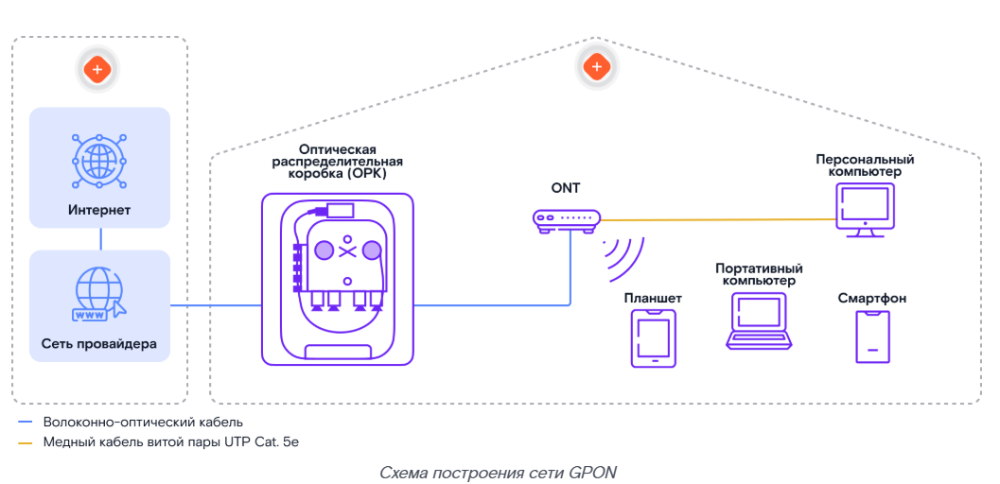
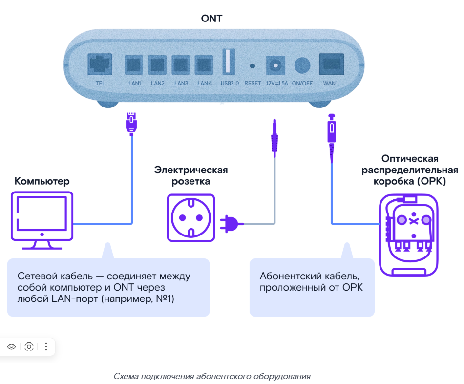

# Технология GPON: что это?

ПАО «Ростелеком» предоставляет высокоскоростной доступ к интернету по технологии **GPON** (Gigabit Passive Optical Network, в переводе с английского — «Гигабитные пассивные оптические сети»).

> **GPON (Gigabit Passive Optical Network)** — технология пассивных оптических сетей, позволяющая по единой оптической сети передавать трафик разных типов (интернет, IP-телефония, телевидение) на скорости до 1 Гбит/с.

## Суть технологии GPON

### Схема построения сети GPON

> **ОРК (оптический распределительный короб)** — пассивное оптическое устройство, размещаемое в подъезде МКД, предназначенное для распределения оптического сигнала между абонентами.

> **ONT (Optical Network Termination, «Оптический сетевой терминал»)** — сетевое устройство, которое принимает и передаёт данные. Находится в квартире Клиента и является шлюзом доступа для подключения к IP-телефонии, сети Интернет и телевидению.

ОРК располагаются на каждом этаже многоквартирного дома (МКД), через этаж или между этажами.

Для прокладки линии от ОРК к ONT в квартиру Клиента используется **оптический патч-корд**.

> **Оптический патч-корд** — отрезок оптического кабеля с коннекторами на обоих концах, предназначенный для подключения оптических устройств.

Работу с данным типом кабеля подробно рассмотрим на практической лабораторной работе.

Для подключения оборудования Клиента — например, ПК к ONT — используется медный кабель витой пары **UTP Cat. 5e**.

> **Запомни:** Схема подключения по технологии GPON включает в себя ОРК, от которой проложен оптический патч-корд до ONT в квартире Клиента.

Технология позволяет по единой сети передавать трафик разных типов: интернет, IP-телефонию, телевидение.

## Инсталляция услуги

### Общая схема инсталляции услуги

Инсталляция GPON требует строгого соблюдения алгоритма. Это гарантия того, что услуга будет работать без сбоев, а тебе не придётся переделывать работу.

Далее мы разберём каждый из шагов инсталляции отдельно.

### Этап 1. Подготовка к инсталляции и выезд

Подробный алгоритм смотри в курсе «Роль и стандарты работы. Выездной технический специалист ПАО Ростелеком».

Этап включает 4 основных шага.

**01. Получение наряда**
- Запусти приложение ЦМ/ММ и посмотри назначенные наряды на день. Рассчитай количество абонентского оборудования.
- Проверь комментарии к наряду.

**02. Сборы**
- Подготовь смартфон, инструменты, оборудование и SIM-карты для инсталляций.
- Получи ключи от телекоммуникационных шкафов.

**03. Дозвон**
- За 30–60 минут до визита созвонись с Клиентом в ЦМ/ММ: подтверди время визита и сверь адрес с нарядом.

**04. Выезд**
- Доберись до адреса не позже чем через 10 минут после начала интервала инсталляции.
- Получи доступ во все помещения и ко всему оборудованию, необходимому для проведения работ.

Алгоритм звонка Клиенту и порядок действий в нестандартных ситуациях (Клиент не успевает или не может присутствовать, ты опаздываешь, Клиента нет по адресу, нет доступа к оборудованию) рассматриваются в курсе «Роль и стандарты работы. Выездной технический специалист ПАО Ростелеком».

**Прежде чем отправляться на выезд, проверь наличие:**
- брендированной формы от ПАО «Ростелеком»;
- исправного инструмента;
- рекламной продукции;
- при необходимости — полного пакета документов.

**Далее не забудь:**
- позвонить через приложение ЦМ/ММ Клиенту за 30–60 минут до начала интервала инсталляции, подтвердить визит в назначенное время, сверить адрес выполнения работ;
- прибыть в согласованное с Клиентом время, в рамках интервала инсталляции.

### Этап 2. Встреча с Клиентом или его представителем

Подробный алгоритм смотри в курсе «Роль и стандарты работы. Выездной технический специалист ПАО Ростелеком».

**Приветствие и проверка документов**

01. Поздоровайся, представься, покажи удостоверение и объясни цель визита.
02. Спроси у Клиента, как к нему можно обращаться.
03. Спроси, куда можно повесить верхнюю одежду и где расположить инструменты.
04. Сверь данные Клиента с указанными в наряде.

> Что делать, если у Клиента или его представителя нет актуального паспорта или доверенности, смотри в курсе «Роль и стандарты работы. Выездной технический специалист ПАО Ростелеком».

05. Убедись, что квартира не используется в коммерческих целях.

**Согласование состава услуг**

01. Сверь с Клиентом:
- состав услуг;
- АО;
- размер абонентской платы.
02. Предложи дополнительные услуги/оборудование.
03. Ознакомь Клиента с документами для электронного документооборота.

**Согласование места расположения АО (ONT)**

01. Совместно с Клиентом выбери подходящее место для установки АО.

> Требования к установке АО смотри в курсе «Роль и стандарты работы. Выездной технический специалист ПАО Ростелеком».

02. Подключи АО к электросети в предполагаемом месте его установки.
03. Проведи необходимые замеры уровня сигнала Wi-Fi Клиента в ЦМ/ММ — «радиопланирование». Важно, чтобы сигнал был в пределах допустимой нормы.

Подробно тему радиопланирования рассмотрим на практической лабораторной работе.

**Значения соответствия силы сигнала Wi-Fi и его качества:**

| Качество сигнала | Значение |
|---|---|
| Отличные показатели | от -35 до -50 дБм |
| Хорошие показатели | от -50 до -65 дБм |
| Удовлетворительные показатели | от -65 до -75 дБм |
| Плохие показатели | от -75 до -85 дБм |
| Неприемлемые значения | от -85 до -100 дБм |

Если зоны покрытия Wi-Fi или скорости недостаточно для квартиры Клиента, предложи другое месторасположение или дополнительное оборудование. Если Клиент согласен, добавь оборудование в ЦМ/ММ самостоятельно. Если не получается — позвони в НПП (направление поддержки продаж): оператор изменит состав заказа.

Выбирая место для АО, сразу продумай трассу кабеля. Следи, чтобы кабель:
- был в недоступном для детей и животных месте;
- не защемлялся и не передавливался;
- не повреждался острыми предметами;
- не перегибался на углах.

**Согласование плана и времени работ**

01. Поясни Клиенту, какие работы нужны для подключения и сколько времени понадобится.
02. Согласуй с Клиентом трассу прокладки кабеля внутри квартиры и место технологического отверстия (при необходимости).

Если инсталляция производится в присутствии представителя, свяжись с Клиентом и согласуй монтажные работы по телефону.

**Этап завершён. При встрече с Клиентом не забудь:**
- представиться, показать служебное удостоверение;
- использовать бахилы во время выполнения работ;
- согласовать оптимальное место установки АО, трассу прокладки кабеля и технологическое отверстие (при необходимости).

### Этап 3. Монтажные работы

Проводя монтажные работы, соблюдай тишину: шумные работы проводи только в разрешённое по местным законам время.

Детали монтажных работ разберём на практической лабораторной работе.

**01. Поиск ОРК**

Посмотри линейные данные в ЦМ/ММ, найди ОРК.

**02. Замер уровня оптического сигнала на ОРК**

Замерь уровень оптического сигнала на ОРК тестером.

> **Норма уровня сигнала:** не ниже -25 дБм на длине волны 1490 нм.

> **Что происходит с сигналом и почему его важно замерять.** Оптический сигнал затухает при прохождении по волокну. Если уровень сигнала ниже нормы, услуга работать не будет.

**Показания на ОРК не укладываются в норму?**
- Работы не выполняются.
- Создай техническую заявку в ЛКЦ (линейно-кабельный цех) через ЦМ/ММ. В заявке укажи: результаты измерений, номер проблемной ОРК. Если возникнут сложности — сообщи о повреждении диспетчеру НТПВС (направление технической поддержки выездных специалистов).

**03. Прокладка оптического патч-корда от ОРК до квартиры Клиента**

Обычно мы работаем с готовым (заранее оконцованным) оптическим патч-кордом. Если необходимо срезать коннектор и оконцевать ВОК сваркой, это необходимо делать со стороны Клиента. В ОРК подключайся заводским коннектором.

Убедись, что нет препятствий для выполнения монтажа.

- **Препятствий нет** — составь визуальный план прокладки кабеля с использованием измерительной рулетки и анализатора скрытой электрической проводки.
- **Монтаж сложный, нужны дополнительные инструменты/материалы или подмога** — свяжись с оператором НПП для переноса времени визита, и можешь покидать место инсталляции.
- **Другая техническая проблема** — если с ресурсами оборудования доступа всё в порядке, но, например, в МКД забитый стояк, разбит ОРК или ВОК повреждён — установи признак NRFS* в ЦМ/ММ. Оператор НПП свяжется с Клиентом и сообщит о переносе визита.
- **Монтаж и/или ввод кабеля невозможен** — сообщи оператору НПП для отмены заказа, и можешь покидать адрес инсталляции.

> **NRFS (Not Ready For Sale)** — признак, который устанавливается в случае, когда невозможна инсталляция услуги по другим техническим причинам.

Подробнее с признаком NRFS можно ознакомиться в курсе «Работа с ограничением NRFS при инсталляциях».

**Основные правила прокладки кабеля**

Прокладывай оптический патч-корд закрытым способом в электротехнических коробках, плинтусах или каналах строительных конструкций. Используй лотки (коробы) закрытого типа.

> **Не используй общедомовой пожарный кабель-канал.**

**Шаг крепления и изгиб трассы**

Крепи оптический патч-корд каждые **250 мм**, ориентируясь на поверхность.

При изменении направления трассы фиксируй угол поворота креплениями на расстоянии **30 мм** от вершины угла. Соблюдай допустимый радиус изгиба.

> Рис. 1 — Крепление оптического патч-корда при изменении направления прокладки и прохождении внутреннего угла

> Рис. 2 — Крепление оптического патч-корда при прохождении внешнего угла

> **Не крепи оптический патч-корд в точке вершины угла.**

**04. Маркировка оптического патч-корда**

Промаркируй оптический патч-корд с указанием номера квартиры и номера порта.

**05. Технологическое отверстие**

Если нет технологического отверстия в квартире Клиента, сделай новое, предварительно проверив скрытую проводку.

Отверстие сверли изнутри квартиры (так как при сверлении с обратной стороны может отколоться значительный фрагмент отделки) в пределах периметра дверной коробки, отступив не больше **15 см**. Не сверли ближе **20 см** от пола и **30 см** от потолка.

> Рис. 3 — Зона, разрешённая для сверления технологического отверстия

> Рис. 4 — Пример выбивания куска бетона со штукатуркой с обратной стороны стены

После выполнения технологического отверстия зашпаклюй стену и восстанови её первоначальный вид.

**06. Прокладка линии по квартире Клиента до АО**

- Заведи оптический патч-корд в квартиру Клиента через новое или существующее технологическое отверстие.
- Прохождение сквозного отверстия фиксируй креплениями на расстоянии **50 мм** от отверстия.

> Рис. 5 — Крепление оптического патч-корда при прохождении сквозного отверстия через стену

- Проведи оптический патч-корд по квартире Клиента.

Проверяй целостность волокна с помощью визуального локатора повреждений (VFL). Дефекты на линии приводят к потере сигнала, поэтому важно вовремя их находить и устранять.

> **VFL (Visual Fault Locator, визуальный локатор повреждений)** — устройство для обнаружения повреждений оптического волокна путём подачи видимого лазерного излучения.

**Примеры запрещённых трасс:**
- под линолеумом;
- в дверных проёмах;
- поверх плинтусов вблизи пола, если трассу могут повредить дети или домашние животные;
- по участкам, где стоят стулья, шкафы и пр.

Правила прокладки оптического патч-корда в квартире такие же, как и при прокладке вне квартиры.

**07. Проверка проложенной линии тестером**

Проверь проложенную линию тестером. Измерь уровень оптического сигнала на коннекторе, подключаемом к ONT.

> **Разница уровней сигнала** на коннекторе у АО и на порту ОРК должна быть **не более 1 дБм**.

Далее тебе предстоит подключить и настроить АО. Перед переходом к следующему этапу важно:
- проложить абонентскую линию в подъезде с использованием кабель-каналов по вертикальным и горизонтальным линиям (за исключением прокладки в лестничном проёме параллельно лестничному маршу), с отсутствием видимых частей абонентской линии;
- проложить абонентскую линию в квартире.

### Этап 4. Подключение и настройка оборудования

01. В «рюкзаке монтажника» в ЦМ/ММ выбери и привяжи оборудование к наряду.
02. Закрепи ONT в вертикальном или горизонтальном положении.

> Если Клиент просит не крепить ONT стационарно (например, поставить на стол), сделай отметку об этом в акте выполненных работ.

> Если подключаешь услуги на оборудовании Клиента, предупреди его: качество может быть ниже обычного.

03. Подключи ONT к питанию.
04. Подключи ONT к абонентской линии.

> Рис. 6 — Схема подключения абонентского оборудования

05. Промаркируй кабель со стороны АО и само оборудование.

С помощью квадратных и прямоугольных наклеек маркируются порты на АО и соответствующие патч-корды:
- **синий цвет** — для портов LAN под Internet;
- **красный цвет** — для портов LAN под IP-TV;
- **жёлтый цвет** — для портов PON.

**Правила нанесения маркировки:**

Наноси маркировку аккуратно и ровно, только на кабель или оборудование компании.

**Места нанесения:**
- на заднюю панель ONT строго над необходимым портом, либо под портом, если маркировка над портом невозможна;
- на подключённый кабель — на расстоянии 50–100 мм от его конца.

> Рис. 7 — Пример промаркированного АО

- Квадрат клеится на заднюю часть ONT (над/под портом).
- Прямоугольник клеится на ВОК/медный кабель витой пары UTP Cat. 5e.

06. Активируй услуги в ЦМ/ММ.

> Если возникнут проблемы — свяжись с руководителем/куратором. Коллеги попробуют решить проблему и сообщат результат.
> Если проблема не решена — сообщи оператору НПП, и можешь покидать адрес. Обязательно переговори с Клиентом.

07. Настрой подключение к интернету на ONT (если необходимо).
08. Подключи дополнительное оборудование, если была допродажа.

Детали подключения и настройки оборудования разберём на практической лабораторной работе.

**После этого можно переходить к следующему этапу. Но сначала проверь, всё ли выполнено:**
- устройство подключено;
- выполнена активация услуг в информационной системе с помощью ЦМ/ММ;
- ONT настроен.

### Этап 5. Демонстрация работы услуги

01. Покажи Клиенту наклейку на устройстве с названием сети и паролем для Wi-Fi.

> При наличии дополнительной наклейки в комплекте предложи Клиенту разместить её на видном месте.

02. Подключи к Wi-Fi-сети беспроводное устройство Клиента.
03. Продемонстрируй скорость интернета по кабелю и Wi-Fi.

Протестируй скорость доступа в интернет на своём устройстве и на устройстве Клиента через сервис **epd.qms.ru**, чтобы узнать, насколько она соответствует тарифному плану.

> При использовании ММ проводи замер скорости доступа к сети Интернет по Wi-Fi на своём устройстве.

**Что делать, если фактическая скорость на устройстве Клиента при проводном подключении не соответствует заявленной в тарифном плане:**

> **Как проверить возможности сетевой карты.** Подключи маршрутизатор/роутер и посмотри, изменяется ли статус компьютера. Если линк отсутствует (нет моргания), скорее всего, проблема в патч-корде или сетевой карте. Возьми заведомо рабочий патч-корд и проверь снова. Если ничего не изменилось — причина в сетевой карте. Сетевая карта может выдавать «неопознанную сеть». Тогда потребуется прописать IP-адрес вручную. Если ничего не помогло — сетевая карта неисправна, её нужно заменить.

04. Продемонстрируй работу услуги.

> При выполнении дополнительных платных работ оформи акт с указанием стоимости и добавь работы в наряд через ЦМ/ММ. Если такой возможности нет — согласуй добавление с руководителем/куратором.

**Это предпоследний этап. Не забудь выполнить следующие действия:**
- измерить скорость передачи Wi-Fi через ЦМ/ММ;
- выполнить замер скорости на соответствие с тарифным планом с устройства Клиента на ресурсе **epd.qms.ru**;
- продемонстрировать работу услуги.

### Этап 6. Завершение работ

Подробный алгоритм смотри в курсе «Роль и стандарты работы. Выездной технический специалист ПАО Ростелеком».

01. Помоги Клиенту подписать договор и заполнить Клиентский пакет документов в электронном формате.
02. Расскажи Клиенту про возможности Единого Личного Кабинета (ЕЛК) и мобильного приложения Личный Кабинет (МЛК). Предложи зарегистрироваться или войти в ЕЛК/МЛК.

> С возможностями личного кабинета можно познакомиться в курсе «Мобильный/Личный кабинет».

03. Расскажи Клиенту о:
- программе «Бонус»;
- дополнительных услугах ПАО «Ростелеком» и предложи подходящие сервисы/услуги (сделай допродажу);
- способах устранения типовых неисправностей.
04. Сделай фотофиксацию результатов работ и прикрепи к наряду в ЦМ/ММ.
05. Если были дополнительные платные работы — заполни акт с указанием стоимости работ и материалов, подпиши у Клиента в ЦМ/ММ.
06. Закрой наряд в ЦМ/ММ.
07. Убери мусор и обрезки кабеля как в квартире, так и на лестничной клетке подъезда.
08. Перед уходом спроси Клиента, остались ли у него вопросы.
09. Сообщи Клиенту о завершении работ и оставь рекламные раздаточные материалы (при наличии), расскажи о новых Услугах ПАО «Ростелеком».
10. Расклей внутри подъезда на объектах ПАО «Ростелеком» актуальную брендовую наклейку.
11. Попроси Клиента оценить качество твоей работы.
12. Поблагодари Клиента за выбор ПАО «Ростелеком», пожелай приятного пользования, попрощайся.

**Отлично! Инсталляция завершена. Не забудь выполнить следующие действия:**
- убрать мусор в квартире, в подъезде, появившийся в ходе выполнения работ по подключению услуг;
- спросить у Клиента, не осталось ли вопросов по использованию услуги связи и оборудования, ответить при их наличии;
- сделать фотофиксацию результатов выполнения работ;
- прикрепить фото и скриншоты измерения к наряду в ЦМ/ММ согласно требованиям к фотоотчёту;
- при заключении договора проверить наличие в нём контактных данных Клиента (телефон, адрес электронной почты);
- закрыть наряд в ЦМ/ММ.

## Заключение

Курс пройден. Теперь ты знаешь все этапы подключения и готов к работе.

Для оперативного решения проблем используй **Единый номер поддержки инсталлятора**.

### Волга

**Контактный телефон:** 8 800 707 00 63

**Главный IVR (Первый уровень):**
- Кнопка 1 — меню ФЛ.
- Кнопка 2 — меню ЮЛ.

**Меню ФЛ (Второй уровень):**
- 1 — НТПВС (Инсталляции/3ЛТП). Для получения технической поддержки Инсталляции/3ЛТП.
- 2 — Ключ (Домофон). Для получения технической поддержки по вопросам услуг Ключ.
- 3 — НТПВС Заведение ПГП/ГП. По вопросам, связанным с кабельной и пассивной инфраструктурой.
- 5 — ЦПП/ГПП диспетчерская. Если Клиент отказывается от одной или нескольких услуг.
- 6 — ЦПП/ГПП бэк-офис. Для связи с группой отдела продаж.
- 9 — Технический учёт. Для соединения с сотрудником технического учёта.

---

## FAQ

**Что такое GPON?**
GPON (Gigabit Passive Optical Network) — технология пассивных оптических сетей, позволяющая по единой оптической сети передавать трафик разных типов (интернет, IP-телефония, телевидение) на скорости до 1 Гбит/с.

**Что такое ОРК?**
ОРК (оптический распределительный короб) — пассивное оптическое устройство, размещаемое в подъезде МКД, предназначенное для распределения оптического сигнала между абонентами.

**Что такое ONT?**
ONT (Optical Network Termination, «Оптический сетевой терминал») — сетевое устройство, которое принимает и передаёт данные. Находится в квартире Клиента и является шлюзом доступа для подключения к IP-телефонии, сети Интернет и телевидению.

**Где располагаются ОРК?**
ОРК располагаются на каждом этаже многоквартирного дома (МКД), через этаж или между этажами.

**Какой кабель используется для прокладки линии от ОРК к ONT?**
Оптический патч-корд.

**Какой кабель используется для подключения оборудования Клиента (например, ПК) к ONT?**
Медный кабель витой пары UTP Cat. 5e.

**Какие типы трафика можно передавать по единой сети GPON?**
Интернет, IP-телефонию, телевидение.

**Что включает в себя схема подключения по технологии GPON?**
ОРК, от которой проложен оптический патч-корд до ONT в квартире Клиента.

**За сколько минут до визита нужно позвонить Клиенту?**
За 30–60 минут до начала интервала инсталляции.

**Что делать, если порт на узле доступа занят или повреждён?**
Свяжись с сотрудником УПЛД. Если порт занят, он попробует забронировать другой. Если не получается — свяжись с оператором НПП для отложения визита.

**Что такое NRFS?**
NRFS (Not Ready For Sale) — признак, устанавливаемый в ЦМ/ММ, когда инсталляция услуги невозможна по техническим причинам.

**Какая норма уровня оптического сигнала на ОРК?**
Не ниже -25 дБм на длине волне 1490 нм.

**Что делать, если показания на ОРК не укладываются в норму?**
Работы не выполняются. Создай техническую заявку в ЛКЦ (линейно-кабельный цех) через ЦМ/ММ. В заявке укажи: результаты измерений, номер проблемной ОРК. Если возникнут сложности — сообщи о повреждении диспетчеру НТПВС.

**Можно ли срезать коннектор и оконцевать ВОК сваркой?**
Да, если необходимо. Это делается со стороны Клиента. В ОРК подключайся заводским коннектором.

**С каким шагом крепится оптический патч-корд?**
Каждые 250 мм.

**На каком расстоянии от вершины угла фиксируется поворот трассы?**
На расстоянии 30 мм от вершины угла.

**На каком расстоянии от отверстия фиксируется кабель при прохождении сквозного отверстия?**
На расстоянии 50 мм от отверстия.

**Где нужно сверлить новое технологическое отверстие, если его нет в квартире Клиента?**
Отверстие сверлится изнутри квартиры в пределах периметра дверной коробки, отступив не больше 15 см, не ближе 20 см от пола и 30 см от потолка. Перед сверлением обязательно проверь скрытую проводку. После выполнения отверстия зашпаклюй стену и восстанови её первоначальный вид.

**Чем проверяется целостность оптического волокна?**
Визуальным локатором повреждений (VFL).

**Какая разница уровней сигнала допустима на коннекторе у АО и на порту ОРК?**
Не более 1 дБм.

**Что нужно сделать после прокладки и оконечивания линии перед переходом к подключению и настройке оборудования?**
Проверить проложенную линию тестером, измерить уровень оптического сигнала на коннекторе, подключаемом к ONT, и убедиться, что абонентская линия проложена корректно: в подъезде — с использованием кабель-каналов по вертикальным и горизонтальным линиям (за исключением прокладки в лестничном проёме параллельно лестничному маршу), с отсутствием видимых частей абонентской линии; в квартире — проложена до АО.

**Что нужно сделать перед проверкой работоспособности узла доступа и порта абонента?**
Посмотреть линейные данные в ЦМ/ММ, найти ОРК и замерить уровень оптического сигнала на ОРК тестером.

**Какие цвета маркировки используются для портов?**
Синий — LAN под Internet, красный — LAN под IP-TV, жёлтый — PON.

**На каком расстоянии от конца кабеля наносится маркировка?**
На расстоянии 50–100 мм от конца кабеля.

**Какой сервис используется для замера скорости интернета?**
epd.qms.ru.

**Что делать, если скорость на устройстве Клиента не соответствует тарифу?**
Проверить сетевую карту: подключить маршрутизатор, проверить статус, заменить патч-корд, при необходимости прописать IP-адрес вручную или заменить сетевую карту.

**Что делать после завершения работ?**
Убрать мусор, сделать фотофиксацию, прикрепить фото к наряду, проверить контактные данные в договоре, закрыть наряд в ЦМ/ММ.

**Какой номер поддержки инсталлятора?**
8 800 707 00 63.