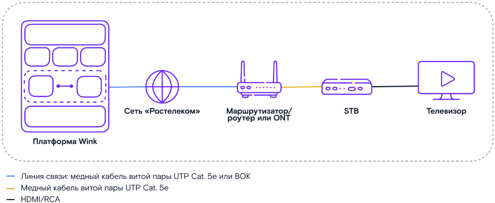
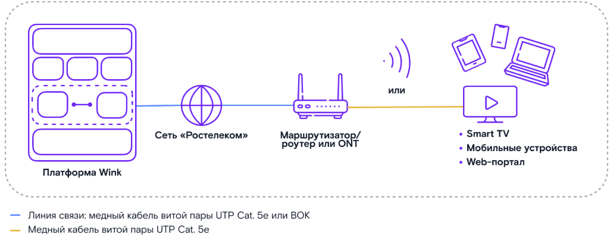
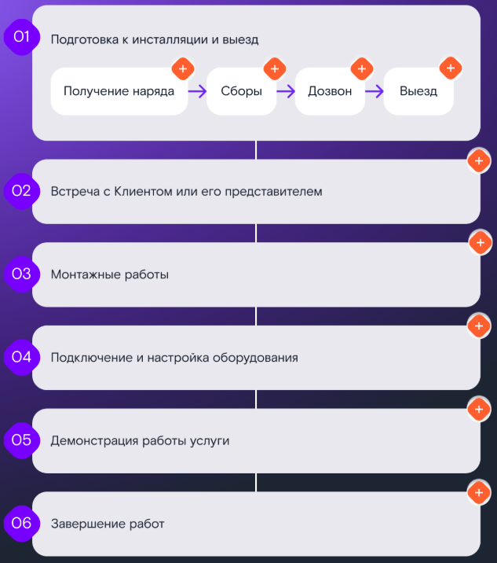
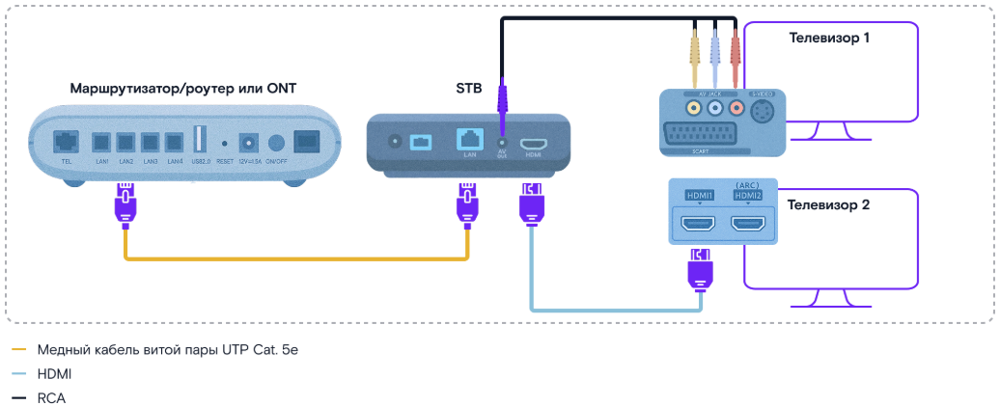
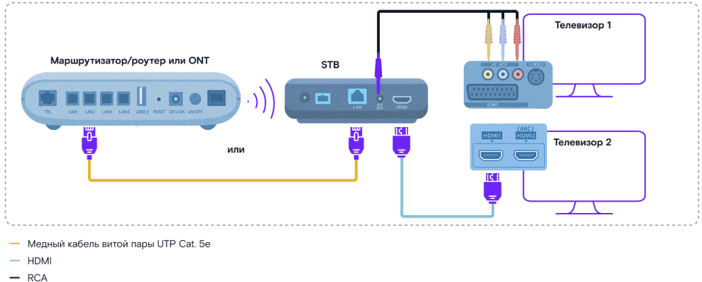
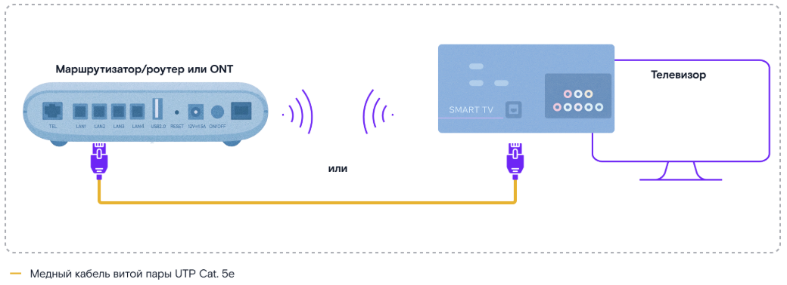

# Общее понятие услуги Wink

## Услуга Wink: что это?

> **Wink** — мультимедийная платформа ПАО «Ростелеком», предоставляющая клиенту доступ к большой и регулярно пополняемой коллекции фильмов и сериалов, а также к широкому выбору телеканалов.

> **STB (Set-Top Box)** — устройство, которое принимает цифровой телесигнал и преобразует его в формат, понятный телевизору.

> **OTT (Over-the-Top)** — услуга, которая может работать на сети любого провайдера.

Клиенту в любое время доступна большая и регулярно пополняемая коллекция фильмов и сериалов, а также широкий выбор телеканалов.

## Технологии подключения услуги

Есть две технологии подключения услуги:

1. **Услуга Wink ИТВ** — с установкой проводной ТВ-приставки STB (Set-Top Box).

2. **Услуга Wink ТВ-Онлайн** — с использованием мобильного приложения. Услугу можно подключить на любом устройстве, поддерживающем приложение Wink: Smart TV, STB (WinkBox, Apple TV, Android TV), смартфоны и планшеты. Устройство должно быть подключено к интернету по кабелю или Wi-Fi.

Так как услуга Wink ТВ-Онлайн является OTT-услугой (Over-the-Top — услуга может работать на сети любого провайдера), клиент может использовать собственное оборудование (маршрутизатор/роутер), но оно должно соответствовать следующим минимальным требованиям:

- гигабитные порты;
- поддержка работы Wi-Fi в двух диапазонах (2,4 и 5 ГГц).

## Запомни

> **Wink** — это мультимедийная платформа ПАО «Ростелеком». Видеосервис предоставляется клиенту двумя способами:
>
> - **Услуга Wink ИТВ.** STB подключается к маршрутизатору/роутеру или ONT, а затем к ТВ-приёмнику.
> - **Услуга Wink ТВ-Онлайн.** STB не требуется, если есть возможность использовать приложение на Smart TV. В этом случае к маршрутизатору/роутеру или ONT сразу подключается Smart TV — через кабель или по Wi-Fi.

Теперь рассмотрим алгоритм инсталляционных работ.

---

# Инсталляция услуги

## Общая схема инсталляции услуги

> **Инсталляция Wink** — это строгое соблюдение алгоритма, гарантирующего, что услуга будет работать без сбоев, а работу не придётся переделывать.

Нажми на «+», чтобы посмотреть подробнее.

Далее мы разберём каждый из шагов инсталляции отдельно.

---

## Этап 1. Подготовка к инсталляции и выезд

Подробный алгоритм смотри в курсе «Роль и стандарты работы. Выездной технический специалист ПАО Ростелеком».

**Перейти в курс**

Этап включает 4 основных шага.

### 01. Получение наряда

- Запусти приложение ЦМ/ММ и посмотри назначенные наряды на день. Рассчитай количество абонентского оборудования.
- Проверь комментарии к наряду.

### 02. Сборы

- Подготовь смартфон, инструменты, оборудование и SIM-карты для инсталляций.
- Получи ключи от телекоммуникационных шкафов.

### 03. Дозвон

- За 30–60 минут до визита созвонись с клиентом в ЦМ/ММ: подтверди время визита и сверь адрес с нарядом.

### 04. Выезд

- Доберись до адреса не позже чем через 10 минут после начала интервала инсталляции.
- Получи доступ во все помещения и ко всему оборудованию, необходимому для проведения работ.

Алгоритм звонка клиенту и порядок действий в нестандартных ситуациях (клиент не успевает или не может присутствовать, ты опаздываешь, клиента нет по адресу, нет доступа к оборудованию) рассматриваются в курсе «Роль и стандарты работы. Выездной технический специалист ПАО Ростелеком».

**Перейти в курс**

Отлично! Первый этап завершён.

Прежде чем отправляться на выезд, проверь наличие:

- брендированной формы от ПАО «Ростелеком»;
- исправного инструмента;
- рекламной продукции;
- при необходимости — полного пакета документов.

Далее не забудь:

- позвонить через приложение ЦМ/ММ клиенту за 30–60 минут до начала интервала инсталляции, подтвердить визит в назначенное время, сверить адрес выполнения работ;
- прибыть в согласованное с клиентом время, в рамках интервала инсталляции.

Когда все шаги выполнены — можешь переходить к следующему этапу.

---

## Этап 2. Встреча с клиентом или его представителем

Подробный алгоритм смотри в курсе «Роль и стандарты работы. Выездной технический специалист ПАО Ростелеком».

**Перейти в курс**

### Приветствие и проверка документов

1. Поздоровайся, представься, покажи удостоверение и объясни цель визита.
2. Спроси у клиента, как к нему можно обращаться.
3. Спроси, куда можно повесить верхнюю одежду и где расположить инструменты.
4. Сверь данные клиента с указанными в наряде.

Что делать, если у клиента или его представителя нет актуального паспорта или доверенности, смотри в курсе «Роль и стандарты работы. Выездной технический специалист ПАО Ростелеком».

**Перейти в курс**

5. Убедись, что квартира не используется в коммерческих целях.

### Согласование состава услуг

1. Сверь с клиентом:
    - состав услуг;
    - АО;
    - размер абонентской платы.
2. Предложи дополнительные услуги/оборудование.
3. Ознакомь клиента с документами для электронного документооборота.

### Согласование места расположения АО

1. Совместно с клиентом выбери подходящее место для установки АО.

Если выполняется подключение для нового клиента, интернет проводится по технологиям FTTB или GPON. Как выбрать место для установки оборудования в этих случаях, смотри в специализированных курсах.

- Курс «FTTB. Инсталляция услуги Интернет».
- Курс «GPON. Инсталляция услуги Интернет».

**Перейти в курс**

**Перейти в курс**

### Согласование плана и времени работ

1. Поясни клиенту, какие работы нужны для подключения и сколько времени понадобится.
2. Согласуй с клиентом трассу прокладки кабеля внутри квартиры и место технологического отверстия (при необходимости).

Если инсталляция производится в присутствии представителя, свяжись с клиентом и согласуй монтажные работы по телефону.

Этап завершён. При встрече с клиентом не забудь:

- представиться, показать служебное удостоверение;
- использовать бахилы во время выполнения работ;
- согласовать оптимальное место установки АО, трассу прокладки кабеля и технологическое отверстие (при необходимости).

Когда договорённости с клиентом о месте установки оборудования достигнуты — можно начинать монтаж.

---

## Этап 3. Монтажные работы

Существует 2 варианта подключения услуги:

### 01. Полное подключение для нового клиента

Инсталляция включает в себя монтажные работы по технологии FTTB или GPON, установку и настройку оборудования. Подробный порядок выполнения работ смотри в курсах:

- Курс «FTTB. Инсталляция услуги Интернет».
- Курс «GPON. Инсталляция услуги Интернет».

**Перейти в курс**

**Перейти в курс**

### 02. Подключение для действующего клиента

Монтажные работы не проводятся, так как АО (маршрутизатор/роутер или ONT) у клиента уже установлено.

Далее тебе предстоит подключить и настроить абонентское оборудование. Прежде чем перейти к следующему этапу, не забудь проверить, всё ли сделано:

- при необходимости — проложена абонентская линия в подъезде и в квартире.

---

## Этап 4. Подключение и настройка оборудования

Детали подключения и настройки оборудования разберём на практической лабораторной работе.

Подключение зависит от варианта предоставления услуги.

### Wink ИТВ. Проводной способ + STB «Ростелеком»

1. Проложи медный кабель витой пары UTP Cat. 5e от маршрутизатора/роутера до места установки.
2. Проведи оконцовку медного кабеля витой пары UTP Cat. 5e и проверь его LAN-тестером.
3. Подключи медный кабель витой пары UTP Cat. 5e со стороны маршрутизатора/роутера в предварительно настроенный на нём порт.
4. Подключи медный кабель витой пары UTP Cat. 5e к STB.
5. Подключи устройства к электрической сети.

На STB должен загореться индикатор питания, на ONT или маршрутизаторе/роутере — соответствующий индикатор LAN.

Если индикации нет — подключи тестовый STB. Если на тестовом STB индикация появится — значит, нужно заменить клиентский STB.

6. Подключи STB к ТВ-приёмнику клиента с помощью кабеля HDMI/RCA, который прилагается к STB.
7. Включи ТВ-приёмник и выбери режим источника сигнала: HDMI или AV.
8. Активируй услугу в ЦМ/ММ.
9. Введи на ТВ-приёмнике логин и пароль из наряда.
10. Выполни активацию профиля «Мультискрин» (привяжи номер мобильного телефона клиента).
11. Проверь, нужно ли обновить ПО.
12. Настрой ПДУ (пульт дистанционного управления) под ТВ-приёмник клиента.

### Wink ТВ-Онлайн + STB (WinkBox, Android TV, Apple TV)

1. Подключи STB к электрической сети.
2. Подключи STB к маршрутизатору/роутеру или ONT проводным или беспроводным способом.
3. Подключи STB к ТВ-приёмнику клиента с помощью кабеля HDMI/RCA, который прилагается к STB.
4. Включи ТВ-приёмник и выбери режим источника сигнала: HDMI или AV.
5. Активируй услугу в ЦМ/ММ.
6. Запусти приложение Wink (выполни предварительную установку приложения для Android TV, Apple TV).
7. Помоги клиенту зарегистрироваться и авторизоваться в Wink.
8. В меню Wink зайди в раздел «Моё» и выполни активацию Wink ТВ-Онлайн, введи код, который пришёл на телефон клиента до начала инсталляции.
9. Настрой ПДУ.

### Wink ТВ-Онлайн + Smart TV

1. Проверь, подключён ли ТВ-приёмник к сети Интернет. Если нет — выполни подключение проводным или беспроводным способом.
2. Запусти приложение Wink (выполни предварительную установку приложения из магазина приложений).
3. Активируй услугу в ЦМ/ММ.
4. Помоги клиенту зарегистрироваться и авторизоваться в Wink.
5. В меню Wink зайди в раздел «Моё» и выполни активацию Wink ТВ-Онлайн, введи код, который пришёл на телефон клиента до начала инсталляции.

После этого можно переходить к следующему этапу.

Но сначала проверь, всё ли выполнено:

- подключена ТВ-приставка STB (при необходимости);
- выполнена активация услуг в информационной системе с помощью ЦМ/ММ;
- клиент зарегистрирован/авторизован в Wink;
- выполнена активация услуг в разделе «Моё» (при подключении Wink ТВ-Онлайн).

---

## Этап 5. Демонстрация работы услуги

Детали демонстрации работы услуги разберём на практической лабораторной работе.

1. Если подключалась приставка STB, включи её, дождись полной загрузки и продемонстрируй сервис клиенту.
2. Познакомь клиента с интерфейсом услуги: покажи главный экран и расскажи про каждый раздел меню. Особое внимание удели разделам «ТВ-каналы», «Фильмы», «Моё».
3. Покажи клиенту:
    - как вызывать всплывающее меню в любом разделе интерфейса;
    - где посмотреть баланс и тарификацию услуг и как оплатить услуги картой;
    - как пользоваться функцией «Управление просмотром»: запись эфира, перемотка, просмотр записей;
    - как пользоваться видеоплеером VoD (Video on Demand, в переводе с английского — «видео по запросу»);
    - где найти раздел с частыми вопросами и ответами. Объясни, что там собраны подсказки по самым разным ситуациям — от настроек до оплаты.
4. Расскажи про родительский контроль и защиту от случайных покупок. При желании клиента настрой функции и передай ему записанный пин-код.
5. Объясни, как в разделе «Моё» настроить профиль, возрастные ограничения, интервал и длительность просмотра, а также доступ к ТВ-каналам.
6. Расскажи о возможностях услуги «Мультискрин», предложи установить приложение Wink на планшеты, смартфоны и Smart TV клиента (до 7 устройств).
7. Сообщи, есть ли по услуге промопериод и как он влияет на тарификацию.

При выполнении дополнительных платных работ оформи акт с указанием стоимости и добавь работы в наряд через ЦМ/ММ. Если такой возможности нет — согласуй добавление с руководителем/куратором.

Это предпоследний этап. Не забудь выполнить следующие действия:

- познакомить клиента с интерфейсом: показать главный экран и подробно рассказать про разделы «ТВ-каналы», «Фильмы» и «Моё»;
- показать, как пользоваться ПДУ;
- рассказать, где искать ответы на возникающие вопросы.

---

## Этап 6. Завершение работ

Подробный алгоритм смотри в курсе «Роль и стандарты работы. Выездной технический специалист ПАО Ростелеком».

**Перейти в курс**

1. Помоги клиенту подписать договор и заполнить клиентский пакет документов в электронном формате.
2. Расскажи клиенту про возможности Единого Личного Кабинета (ЕЛК) и мобильного приложения Личный Кабинет (МЛК). Предложи зарегистрироваться или войти в ЕЛК/МЛК.

С возможностями личного кабинета можно познакомиться в курсе «Мобильный/Личный кабинет».

**Перейти в курс**

3. Расскажи клиенту о:
    - программе «Бонус»;
    - дополнительных услугах ПАО «Ростелеком» и предложи подходящие сервисы/услуги (сделай допродажу);
    - способах устранения типовых неисправностей.
4. Сделай фотофиксацию результатов работ и прикрепи к наряду в ЦМ/ММ.
5. Если были дополнительные платные работы — заполни акт с указанием стоимости работ и материалов, подпиши у клиента в ЦМ/ММ.
6. Закрой наряд в ЦМ/ММ.
7. Убери мусор и обрезки кабеля как в квартире, так и на лестничной клетке подъезда.
8. Перед уходом спроси клиента, остались ли у него вопросы.
9. Сообщи клиенту о завершении работ и оставь рекламные раздаточные материалы (при наличии), расскажи о новых услугах ПАО «Ростелеком».
10. Расклей внутри подъезда на объектах ПАО «Ростелеком» актуальную брендовую наклейку.
11. Попроси клиента оценить качество твоей работы.
12. Поблагодари клиента за выбор ПАО «Ростелеком», пожелай приятного пользования, попрощайся.

Отлично! Инсталляция завершена. Не забудь выполнить следующие действия:

- убрать мусор в квартире, в подъезде, появившийся в ходе выполнения работ по подключению услуг;
- спросить у клиента, не осталось ли вопросов по использованию услуги связи и оборудования, ответить при их наличии;
- сделать фотофиксацию результатов выполнения работ;
- прикрепить фото и скриншоты измерения к наряду в ЦМ/ММ согласно требованиям к фотоотчёту;
- при заключении договора проверить наличие в нём контактных данных клиента (телефон, адрес электронной почты);
- закрыть наряд в ЦМ/ММ.

---

# Заключение

Курс пройден. Теперь ты знаешь все этапы подключения и готов к работе.

Для оперативного решения проблем используй Единый номер поддержки инсталлятора.

Нажми на блок, чтобы развернуть его и узнать больше.

## Волга

**Контактный телефон:** 88007070063

**Главный IVR (Первый уровень):**

- Кнопка 1 — меню ФЛ.
- Кнопка 2 — меню ЮЛ.

**Меню ФЛ (Второй уровень):**

1. НТПВС (Инсталляции/3ЛТП). Для получения технической поддержки Инсталляции/3ЛТП.
2. Ключ (Домофон). Для получения технической поддержки по вопросам услуг Ключ.
3. НТПВС Заведение ПГП/ГП. По вопросам, связанным с кабельной и пассивной инфраструктурой.
5. ЦПП/ГПП диспетчерская. Если клиент отказывается от одной или нескольких услуг.
6. ЦПП/ГПП бэк-офис. Для связи с группой отдела продаж.
9. Технический учёт. Для соединения с сотрудником технического учёта.

---

# FAQ

**Что такое Wink?**
Wink — это мультимедийная платформа ПАО «Ростелеком», предоставляющая доступ к коллекции фильмов, сериалов и телеканалов.

**Какие есть технологии подключения услуги Wink?**
Две: услуга Wink ИТВ (с проводной ТВ-приставкой STB) и услуга Wink ТВ-Онлайн (через мобильное приложение).

**Что такое STB?**
STB (Set-Top Box) — устройство, которое принимает цифровой телесигнал и преобразует его в понятный для телевизора формат.

**Что такое OTT?**
OTT (Over-the-Top) — услуга, которая может работать на сети любого провайдера.

**Какие требования предъявляются к собственному оборудованию клиента для Wink ТВ-Онлайн?**
Гигабитные порты и поддержка Wi-Fi в двух диапазонах (2,4 и 5 ГГц).

**Сколько этапов включает инсталляция услуги Wink?**
Шесть этапов: подготовка и выезд, встреча с клиентом, монтажные работы, подключение и настройка оборудования, демонстрация работы услуги, завершение работ.

**За сколько времени нужно позвонить клиенту перед визитом?**
За 30–60 минут до визита.

**Через сколько после начала интервала инсталляции нужно прибыть на адрес?**
Не позже чем через 10 минут после начала интервала.

**Какие устройства поддерживают Wink ТВ-Онлайн?**
Smart TV, STB (WinkBox, Apple TV, Android TV), смартфоны и планшеты.

**Нужна ли проводная ТВ-приставка для Wink ТВ-Онлайн?**
Нет, если есть возможность использовать приложение на Smart TV.

**Что делать, если на STB нет индикации?**
Подключить тестовый STB. Если на тестовом STB индикация появится — значит, нужно заменить клиентский STB.

**На сколько устройств можно установить приложение Wink по услуге «Мультискрин»?**
До 7 устройств.

**Что такое VoD?**
VoD (Video on Demand) — «видео по запросу», функция видеоплеера для просмотра контента по запросу.

**Какой номер Единой поддержки инсталлятора?**
88007070063.

**Какие кнопки доступны в меню ФЛ (Второй уровень) для региона Волга?**
1 — НТПВС (Инсталляции/3ЛТП), 2 — Ключ (Домофон), 3 — НТПВС Заведение ПГП/ГП, 5 — ЦПП/ГПП диспетчерская, 6 — ЦПП/ГПП бэк-офис, 9 — Технический учёт.