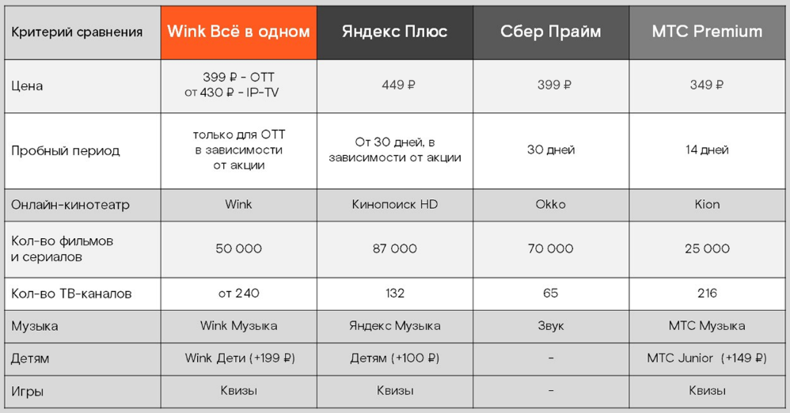
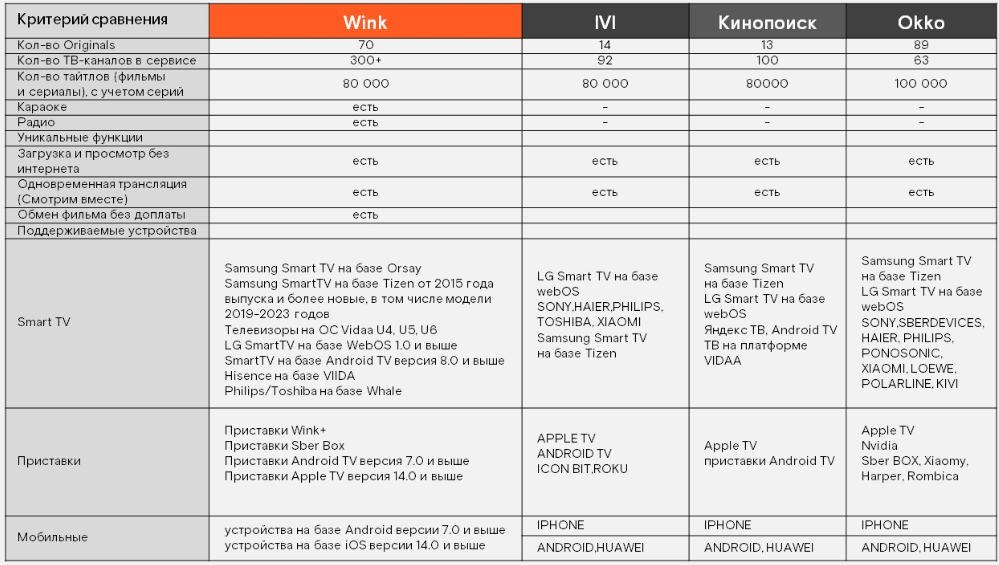
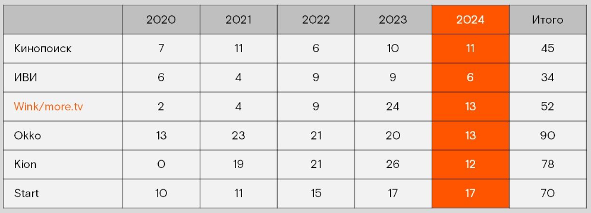
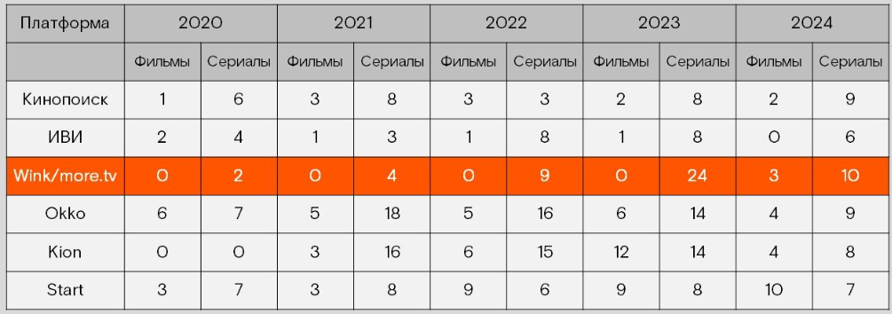

<strong>Кратко</strong>
<table><tr><td>

# Выжимка: Wink

**Wink** — платформа развлечений: ТВ, онлайн-кинотеатр, музыка, игры, караоке, блоги, детский контент. Собственные проекты — **Wink Originals**.

## Ключевые возможности
- Более 350 ТВ-каналов (FullHD/4K), свыше 80 000 фильмов и сериалов
- Один аккаунт — до 5 устройств
- Управление без пульта (умные колонки), архив на 72 часа, запись передач
- Скидка 25% на фильмы, сервис «Смотрим вместе» (до 4 приглашений)

## Способы подключения
1. **Интерактивное ТВ Wink** — приставка, только в сети Ростелекома, до 3 ТВ (Мультирум)
2. **Wink ТВ-онлайн** — через интернет Ростелекома от 50 Мбит/с
3. **Wink OTT** — любой оператор, любое устройство

## Подписки

**Основные:**
- **Стартовый** — 200+ каналов, 27 000 фильмов, 280 ₽/мес
- **Wink+more.tv** — 200+ каналов, 35 000 фильмов, караоке, радио, 350 ₽/мес
- **Премиум** — 300+ каналов, 80 000 фильмов, премиум-контент, Wink Музыка, от 1700 ₽/мес
- **Wink Всё в одном** — 240+ каналов, 50 000+ фильмов, Wink Видео + Музыка + Игры, 430 ₽/мес (399 ₽ для ОТТ)
- **Wink Всё в одном + START + AMEDIATEKA** — 779 ₽/мес

**Дополнительные** — тематические пакеты (кино, спорт, концерты).

## Новые сервисы
- **Wink Игры** — 100+ квизов на ТВ/ПК
- **Wink Дети** — безопасный контент 0+/6+/12+, 14 приложений, ограничение времени
- **Wink Музыка** — 50 млн треков, «Мой поток», Car Play, 169 ₽/мес

## Продажи по типам клиентов
- **Консерваторы** — удобство, безопасность, простой пульт, помощь мастера
- **Нейтральные** — цена/качество, семейность, детские ограничения, мобильность
- **Продвинутые** — эксклюзивы, без рекламы, объединение сервисов, выгода

**Схема отработки возражений:** выслушай → присоединись → уточни → аргументируй.

</td></tr></table>

# Что такое Wink

**Wink** — это территория развлечений, где всё, что нужно клиенту, собрано в одном месте: фильмы, сериалы, музыка, концерты, караоке, блоги и многое другое.

> **Wink** — это не просто обычное телевидение и онлайн-кинотеатр, а целая платформа для развлечений.

Далее рассмотрим, какие преимущества есть у Wink.

## Фишки Wink

### Wink Originals

**Wink Originals** — контент, снятый специально для Wink.

> **Wink Originals** — собственные оригинальные проекты платформы Wink: сериалы, художественные и документальные фильмы, созданные по заказу сервиса.

- **Сериалы:** от нашумевшего «Слово пацана. Кровь на асфальте» с Янковским и Буруновым до новейших «Чистых» и «Комбинации».
- **Художественные и документальные фильмы.**

Контент Wink Originals настолько крут, что уже имеет немало наград 🏆🏆🏆. Остановимся на самых громких проектах.

### Телевидение

- Более 350 ТВ-каналов.
- Каналы в FullHD и 4K.
- Подборки тематических каналов.
- Поддержка субтитров.
- Возможность записать ТВ-передачу.

### Фильмы и сериалы

Тысячи фильмов и сериалов на любой вкус: новинки проката кинотеатров и классические фильмы.

- Доступно более 80 000 единиц контента.
- Новинки проката в высоком качестве.
- Большое количество тематических подборок.
- Смотри так, как удобно тебе — покупай навсегда или в подписках.

### Дополнительные возможности

#### Удобное управление

Управлять Интерактивным ТВ и Wink можно даже без пульта — с помощью умных колонок.

#### Управление просмотром и архив

Можно поставить на паузу, перемотать и посмотреть программы за последние 72 часа, записать серию любимого сериала.

> **Создание каталога** — это место, где будут храниться ваши учебные проекты. Все проекты хранятся в папках внутри каталога, это уменьшает время на поиск нужного учебного проекта.

#### Скидка 25% на фильмы

Не все фильмы в Wink доступны бесплатно — редкие находки нужно покупать дополнительно. Эта услуга с ежемесячной абонентской платой позволяет покупать и арендовать фильмы с 25%-ной скидкой. Если твой клиент — фанат хорошего кино, ему понравится.

#### Смотрим вместе

С Wink клиент может пригласить друзей смотреть фильмы бесплатно.

> **Смотрим вместе** — сервис, позволяющий отправить до четырёх приглашений на купленный фильм или сериал из подписки. Ссылка действует 24 часа. Получателю нужно только перейти по ней и смотреть фильм бесплатно.

Улучшить условия работы: чем больше клиентов, тем больше возможностей у компании.

## Как подключить Wink

Есть несколько способов подключить Wink. Они отличаются возможностями и потребностями клиентов.

### 01. Интерактивное ТВ Wink

Это доступ к каналам и контенту Wink через проводную интерактивную приставку. Работает только в сети Ростелекома в пакете с Домашним интернетом и подходит тем, кто не против проводной приставки.

**Преимущества:**

- Подойдёт для любого телевизора.
- Можно подключить до трёх телевизоров в одной квартире, если есть дополнительные приставки. Эта услуга называется **Мультирум**. Стоимость зависит от региона. Узнай актуальную в СУЗ или у своего руководителя.
- Стабильность и высокое качество видео.

### 02. Wink ТВ–онлайн

Это способ подключения к видеосервису через интерактивную приставку, приложение Wink или сайт wink.ru. Работает через Интернет Ростелекома при скорости от 50 Мбит/с.

**Преимущества:**

- Легко подключается.
- Не обязательно дополнительное оборудование.

**ТВ–онлайн доступен на:**

- смартфонах и планшетах Android и iOS;
- компьютерах и ноутбуках через wink.ru;
- SmartTV;
- любых ТВ-приставках на базе tvOS и AndroidTV;
- телевизорах без SmartTV, с использованием интерактивных приставок.

### 03. Wink OTT

Доступ к видеосервису Wink через мобильное приложение Wink, Smart TV или через сайт wink.ru. Подходит тем, у кого не подключен Домашний интернет от Ростелекома.

**Преимущества:**

- Легко подключается.
- Не нужно дополнительное оборудование.
- Работает с интернетом любого оператора на любом устройстве и приставке, где можно установить приложение Wink.

**ТВ–онлайн доступен на:**

- смартфонах и планшетах Android и iOS;
- компьютерах и ноутбуках через wink.ru;
- SmartTV;
- любых ТВ-приставках на базе tvOS и AndroidTV;
- телевизорах без SmartTV, с использованием приставки WinkBox.

Подробнее обо всех приставках для подключения Wink ты узнаешь в специальном курсе «Оборудование Wink».

### Один аккаунт – 5 устройств

Пользоваться всеми возможностями Wink можно сразу на 5 устройствах: на телевизоре, SmartTV, компьютере, ноутбуке, планшете или смартфоне. Можно смотреть любимое кино где и когда угодно, онлайн или оффлайн с любых гаджетов.

Теперь давай проверим, как хорошо ты знаешь Wink и его возможности.

---

# Раздел 02. Подписки Wink

В этом разделе ты узнаешь, какие подписки доступны клиентам Wink. Каждая из них — это не просто набор контента, а удобный способ выбрать то, что идеально подходит каждому.

> **Подписка Wink** — это пакет доступа к контенту и сервисам платформы Wink, оформляемый клиентом на регулярной основе.

Подписки Wink делятся на основные и дополнительные:

- Основная подписка должна быть обязательно подключена у клиента.
- Дополнительные подписки клиенты могут выбирать плюсом к основной.

## Основные подписки Wink

### Стартовый

Твой клиент только начинает смотреть кино? Тогда этот пакет только для него!

- Более 200 ТВ-каналов.
- 27 000 фильмов и сериалов.
- 280 рублей в месяц.

### Wink+more.tv

Эта подписка — то, что нужно для любителей сериалов. Вот что в неё входит:

- Более 200 ТВ-каналов.
- 35 000 фильмов и сериалов.
- Караоке.
- Радио.
- 350 рублей в месяц.

### Премиум

Твой клиент хочет максимальный пакет каналов и фильмов, предпочитает премиум-контент? Тогда предлагай — «Премиум»!

- Более 300 ТВ-каналов.
- 80 000 фильмов и сериалов.
- Премиум-контент: AMEDIATEKA, viju, START, МАТЧ ПРЕМЬЕР, «Взрослый», more.tv и др.
- Wink Музыка.
- От 1700 рублей в месяц.

### Wink Всё в одном

Твой клиент хочет всё и сразу по разумной цене? Смело предлагай ему «Wink Всё в одном»!

- Более 240 ТВ-каналов.
- Более 50 000 фильмов и сериалов.
- Включает Wink Видео, Wink Музыка и Wink Игры.
- Подписки Премьеры, Хиты СТС, Сериалы more.tv, English Class, Коллекция «Караоке».
- Дополнительные пакеты каналов: Каналы в 4К, Спорт, Музыка, Наше кино, Мировое кино, Женская коллекция, Мужская коллекция, Для любознательных.
- Стоимость подключения — 430 рублей в месяц.

На этой мультиподписке мы более подробно остановимся в специальном разделе этого курса чуть позже.

### Wink Всё в одном + START + AMEDIATEKA

Твой клиент хочет ещё больше крутых фильмов и сериалов? «Wink Всё в одном + START + AMEDIATEKA» — то, что точно нужно ему предложить!

- Более 240 ТВ-каналов.
- Более 50 000 фильмов и сериалов.
- Включает Wink Видео, Wink Музыка и Wink Игры.
- Подписки AMEDIATEKA, START, Премьеры, Хиты СТС, Сериалы more.tv, English Class, Коллекция «Караоке».
- Дополнительные пакеты каналов: Каналы в 4К, Спорт, Музыка, Наше кино, Мировое кино, Женская коллекция, Мужская коллекция, Для любознательных.
- Стоимость подключения — 779 рублей в месяц.

## Дополнительные подписки Wink

Дополнительные подписки обычно тематические. Например, среди них есть подборки для любителей кино, футбола и концертов.

> **Дополнительная подписка Wink** — тематический пакет контента, который клиент может подключить сверх основной подписки.

Для клиентов ОТТ линейка и стоимость подписок может отличаться. Ознакомиться с предложением для них и полным списком всех подписок ты можешь в СУЗ или на сайте WINK.RU.

Как видишь, подписок у нас достаточно. Так что для каждого клиента точно найдётся та, что полностью удовлетворит его потребности в контенте.

Чтобы перейти к следующему разделу, закрепи знания подписок Wink.

---

# Раздел 03. Новые сервисы Wink

В этом разделе ты узнаешь о самых новых сервисах Wink, которые делают его настоящей платформой для развлечений.

## Wink Игры

> **Wink Игры** — это увлекательные квизы прямо на экране телевизора.

- Более 100 игр для большой компании.
- Огромная коллекция квизов.
- Можно играть на ТВ или ПК с близкими или одному.

Wink Игры помогут весело провести время с друзьями или скоротать вечер в одиночестве.

## Wink Дети

> **Wink Дети** — это детская развлекательная подписка с безопасными развлечениями для развития детей.

**Преимущества подписки:**

- Безопасный видео- и аудиоконтент c возрастными ограничениями 0+/6+/12+.
- 14 детских приложений для игр и развития логики и мышления детей от 0 до 12 лет.
- Возможность ограничения времени для просмотра видео.

**Видео для детей:**

- Более 20 детских каналов.
- 8 тысяч детских фильмов, сериалов и блогов.

**Приложения для развития:**

- **Кубокот** — более 2500 развивающих игр для детей от 3 до 6 лет. Программа основана на стандарте ФГОС. Кубокот готовит детей к школе, занятия включают математику, развитие речи, окружающий мир, развитие эмоций и бытовых навыков.
- **ЛогикЛайк** — более 4500 заданий на развитие логики, математики и внимания для детей 4–8 лет. Соответствует стандартам безопасности kidSAFE.

**Приложения для развлечений:**

Приключения, рисование, пение, готовка, путешествия в космос и изучение окружающей среды с любимыми героями в 12 игровых приложениях.

С сервисом Wink Дети ребёнку можно легко доверить гаджет и интернет. Весь контент подписки безопасен и полезен для малышей.

## Wink Музыка

> **Wink Музыка** — это новый музыкальный сервис, который даёт клиентам доступ к десяткам миллионов треков и персональному рекомендательному сервису «Мой поток».

**Как можно воспользоваться сервисом:**

- на мобильных устройствах iOS;
- на мобильных устройствах Android и Huawei;
- на телевизорах и приставках Android TV;
- в веб-браузерах;
- на приставках WinkBox.

**Преимущества подписки:**

**Музыка:**

- Топовый каталог: более 50 миллионов треков.
- Эксклюзивные релизы и плейлисты Wink Originals.
- Обновляемые плейлисты, учитывающие предпочтения пользователя.
- Можно перемешивать плейлист, добавлять в избранное, скачивать треки, альбомы или плейлисты для офлайн-прослушивания, отправлять воспроизведение на умные колонки или телевизоры.

**Функция «Поток»:**

Это бесконечный источник музыки для настроения, сгенерированный на основе истории прослушивания и предпочтений клиента. Можно настроить воспроизведение треков в Моем потоке по новизне, языку, настроению — бодрому, грустному и т.д.

**Поддержка функции Car Play:**

Можно слушать музыку с iPhone в автомобиле, не отвлекаясь от дороги.

**Простота подключения:**

Авторизация по номеру телефона.

**Треки из фильмов Wink Originals и музыкальные клипы на Wink:**

- Самый большой каталог музыкальных клипов на рынке — более 10 000.
- Музыкальные клипы на втором месте по смотрению после фильмов и сериалов.

**Стоимость подписки на Wink Музыка:**

- Ежемесячная подписка — 169 рублей в месяц.
- В составе мультиподписки «Wink Всё в одном»:
    - 430 рублей в месяц — для клиентов Интерактивного ТВ Wink и Wink ТВ-Онлайн;
    - 399 рублей в месяц — для клиентов ОТТ.

**В ближайшее время в Wink Музыке…**

- **Перенос медиатеки** — позволит перенести плейлисты и любимые треки пользователя из других музыкальных сервисов.
- **Подкасты** — тысячи популярных и любимых подкастов для любого пользователя.
- **Детям** — любимые детские песенки и сказки.

Wink Музыка — это бесконечный выбор контента и множество удобных функций для его прослушивания. Можно наслаждаться музыкой в любое время и в любом месте. А специальные функции и персонализированные плейлисты делают сервис ещё более удобным и приятным.

А теперь для перехода к следующему разделу ответь на три вопроса, чтобы проверить знания и закрепить материал.

---

# Раздел 04. Мультиподписка «Wink Всё в одном»

> **Мультиподписка «Wink Всё в одном»** — это подписка на несколько сервисов Wink сразу: Wink Видео, Wink Музыка и Wink Игры.

**Всё в одном:**

- Wink Видео
- Wink Музыка
- Wink Игры

**Преимущества мультиподписки:**

- Простой вход без специальных ID и паролей: достаточно только номера мобильного телефона.
- Более 240 ТВ-каналов в качестве Full HD и 4K.
- Игры и квизы для компаний на большом экране прямо в онлайн-кинотеатре.
- Доступ к Онлайн-кинотеатру, Музыке с 5 разных устройств.

**Стоимость подписки:**

- 430 рублей в месяц — для клиентов Интерактивного ТВ Wink и Wink ТВ-Онлайн.
- 399 рублей в месяц — для клиентов ОТТ.

**Сравнение мультиподписки с конкурентами:**

Мультиподписка «Wink Всё в одном» — это простота, доступность и максимум возможностей для каждого клиента. Она объединяет все популярные форматы развлечений, добавляет эксклюзивный контент и подходит для всей семьи. Благодаря простому подключению и поддержке на 5 устройствах, подписка легко становится неотъемлемой частью досуга.

А теперь проверь себя и закрепи знания, чтобы уверенно рассказывать клиентам о преимуществах мультиподписки!

---

# Раздел 05. Сравнение с конкурентами

Ты уже знаешь почти всё про платформу Wink и её сервисы. В этом разделе предлагаем сравнить одну из наших самых популярных подписок с возможностями других крупных онлайн-кинотеатров.

> **Платформа Wink** — безусловный лидер по количеству эксклюзивов, каналов и уникальных условий. Это значит, что Wink точно не заменить другими платформами, зато он может заменить несколько онлайн-кинотеатров и сервисов.

Более подробно сравнение с IVI, Кинопоиском HD и Okko ты можешь посмотреть в таблице ниже.

Теперь посмотри внимательно на сравнение количества оригинального контента Wink с ближайшим конкурентом — Кинопоиском.

**Количество оригинальных проектов стриминговых сервисов**

**Количество сериалов и фильмов, выпускаемых платформами по годам**

* Составлено Mediascope.ru по материалам сайта kinopoisk.ru, библиотек контента платформ ИВИ, Wink, Okko, Kion, Start, Premier.

**Топ 10 самых популярных оригинальных сериалов онлайн-платформ 2022–2023**

Теперь ты видишь, что количество и популярность оригинального контента Wink высоко ценится нашими клиентами.

Ну что, можно смело переходить к последнему разделу нашего курса, в нём тебе пригодится всё, что ты узнал сегодня.

---

# Раздел 06. Как продавать Wink

В этом разделе ты узнаешь, как продавать Wink самым разным клиентам.

Ты помнишь, что наши клиенты делятся на три группы по их отношению к технологиям: консерваторы, нейтральные и продвинутые.

- Для **консерваторов** самое главное — это удобство и безопасность.
- **Нейтральные** спокойно относятся к моде на устройства и выбирают по цене и качеству.
- А вот **продвинутые** точно следят за всеми новинками и тщательно выбирают, что купить.

При встрече с новым клиентом очень важно понять, кто перед тобой. Давай пройдёмся по всем этапам продаж и разберёмся, как правильно продавать Wink каждому типу клиентов.

## Игорь, продвинутый пользователь ТВ

**Сначала задай 2–3 вопроса, чтобы понять, что нужно клиенту.**

— Игорь, какими приложениями для развлечений вы обычно пользуетесь: видео, музыка, игры?..

— У меня подключены онлайн-кинотеатры Start, Okko и VK Музыка.

— Подскажите, почему отдали им предпочтение?

— Выходят интересные премьеры, нет рекламы и музыку можно использовать без интернета.

— Сколько платите в месяц за все сервисы в сумме?

— Около 800 рублей.

**Раскрой продукт со всех сторон и не забудь про выгоды.**

— Отлично, Игорь, в мультиподписке «Wink Всё в одном» мы собрали для вас всё самое интересное: эксклюзивные премьеры, более 240 ТВ-каналов и огромную коллекцию фильмов и сериалов — порядка 50 000. В подписку УЖЕ включены дополнительные сервисы Wink: музыка и игры. Всё это — с простым входом и без рекламы. Согласитесь, это очень удобно?

— Согласен, но у меня уже подключены Start, Okko и VK Музыка.

**Отработай сомнения клиента по привычной схеме: выслушай, присоединись, уточни, аргументируй.**

— Игорь, рад, что вы уже знакомы с подобными сервисами. Подключив подписку «Wink Всё в одном», вы сможете использовать все интересные для вас сервисы в одном месте без доплат, по цене одного билета в кино — 430 руб. Это гораздо выгоднее, чем вы платите сейчас. Предлагаю оценить все преимущества, уверен, вы останетесь довольны. Подключаем?

Игорь согласен! Wink покорил и его. Осталось завершить сделку.

## Светлана, нейтральный пользователь ТВ

**Первым делом выяви пожелания клиента, задав 2–3 вопроса.**

— Светлана, что любите смотреть по ТВ вы и ваши близкие?
— Сколько у вас телевизоров дома?
— Сколько из них Smart TV?

— У нас два Smart TV. В основном ТВ смотрят дети — мультфильмы, передачи. Я включаю фоном фильмы, музыку или что-то про кулинарию.

**Расскажи о продукте на языке выгод.**

— Светлана, более 200 каналов и 27 000 фильмов дадут возможность каждому члену семьи найти контент по вкусу. Также можно поставить ограничения от детей на часть каналов или сделать для ребёнка отдельный детский профиль.

— Хммм…

*Светлана задумалась и хочет возразить.*

**Отработай сомнения клиента по привычной схеме (выслушай, присоединись, уточни, аргументируй).**

— Я снимаю эту квартиру. Боюсь, владелец будет против.

— Светлана, понял(а) вас. Есть решение: мы можем провести подключение ТВ без проводов с дальнейшей возможностью переноса услуг на другой адрес, если соберётесь переезжать. Очень удобное и мобильное решение. Смотреть можно на любом устройстве где угодно и когда угодно. Что скажете, так удобнее? Подключаем?

Светлане такое решение очень нравится. Заверши сделку и положи в копилку дня ещё одну продажу.

## Ольга Петровна, консервативный клиент

**Узнай, что ей интересно, задав 2–3 вопроса.**

— Ольга Петровна, какое ТВ подключено? Сколько сейчас каналов?

— Точно не помню, сколько сейчас каналов, но вот качественных каналов с фильмами не хватает.

— Что вам в нём нравится и что хотели бы поменять?

— Муж любит детективы и спорт, я — советские фильмы, современные российские сериалы и новости.

**Построй рассказ о продукте на языке выгод.**

— Ольга Петровна, в Интерактивном ТВ Wink вы получите больше каналов по своим любимым тематикам. Любимые советские фильмы, современные детективы, информационные и спортивные каналы. Кстати, в меню всегда можно посмотреть программу передач, она там более актуальна, чем в газете, вышедшей на прошлой неделе.

— Боюсь, что не разберусь с вашей приставкой.

**Отработай сомнения по привычной схеме (выслушай, присоединись, уточни, аргументируй).**

— Ольга Петровна, понимаю вас. На самом деле всё проще, чем кажется. Во-первых, у вас будет один пульт. Не нужно будет отдельно включать телевизор и приставку. Во-вторых, мастер на месте всё настроит и покажет, а вы при нём сможете попробовать и задать вопросы. Подключаем?

Вот и Ольга Петровна очаровалась нашим Супер Wink’ом! Когда клиент согласился на подключение, всегда завершай диалог по правилам.

**Используй один из способов завершения сделки:**

- Подведи итоги разговора.
- Расскажи о размере стартового платежа и сроках оплаты услуг.

Наш курс подошёл к концу. Ты усвоил(а), как продавать Wink, знаешь всё о его преимуществах и можешь выгодно их подсветить при разговоре с клиентами. Осталось завершить все дела викториной — и ты можешь тренировать свои навыки в реальных сделках!

---

# FAQ

**Что такое Wink?**
Wink — это платформа развлечений, объединяющая телевидение, онлайн-кинотеатр, музыку, игры и другие сервисы в одном месте.

**Чем Wink отличается от обычного онлайн-кинотеатра?**
Wink включает не только фильмы и сериалы, но и ТВ-каналы, музыку, игры, караоке, детский контент и собственные оригинальные проекты Wink Originals.

**Что такое Wink Originals?**
Это контент, снятый специально для Wink: сериалы, художественные и документальные фильмы.

**Сколько устройств можно использовать на одном аккаунте Wink?**
До 5 устройств одновременно.

**Какие основные подписки есть у Wink?**
«Стартовый», «Wink+more.tv», «Премиум», «Wink Всё в одном», «Wink Всё в одном + START + AMEDIATEKA».

**Чем отличаются основные и дополнительные подписки?**
Основная подписка обязательна для клиента, дополнительные подключаются сверх неё и обычно являются тематическими.

**Что входит в мультиподписку «Wink Всё в одном»?**
Wink Видео, Wink Музыка и Wink Игры, а также более 240 ТВ-каналов и более 50 000 фильмов и сериалов.

**Сколько стоит мультиподписка «Wink Всё в одном»?**
430 рублей в месяц для клиентов Интерактивного ТВ Wink и Wink ТВ-Онлайн; 399 рублей в месяц для клиентов ОТТ.

**Какие новые сервисы есть у Wink?**
Wink Игры, Wink Дети и Wink Музыка.

**Что такое Wink Дети?**
Детская подписка с безопасным контентом, развивающими приложениями и ограничением времени просмотра.

**Что такое Wink Музыка?**
Музыкальный сервис с каталогом более 50 млн треков, персональными рекомендациями «Мой поток» и поддержкой Car Play.

**Сколько стоит Wink Музыка?**
169 рублей в месяц отдельно; в составе мультиподписки «Wink Всё в одном» — 430 рублей для Интерактивного ТВ и Wink ТВ-Онлайн, 399 рублей для ОТТ.

**Как подключить Wink?**
Тремя способами: Интерактивное ТВ Wink, Wink ТВ-онлайн, Wink OTT.

**Чем отличается Wink OTT от Wink ТВ-онлайн?**
Wink OTT работает с интернетом любого оператора, а Wink ТВ-онлайн — через Интернет Ростелекома при скорости от 50 Мбит/с.

**На какие типы клиентов делятся пользователи?**
На консерваторов, нейтральных и продвинутых.

**Как продавать Wink консервативному клиенту?**
Делать акцент на удобстве, безопасности, простоте управления и поддержке мастера при настройке.

**Как продавать Wink нейтральному клиенту?**
Опираться на соотношение цены и качества, семейность, возможность ограничений для детей и мобильность решения.

**Как продавать Wink продвинутому клиенту?**
Показывать эксклюзивный контент, отсутствие рекламы, объединение нескольких сервисов в одном и выгоду по цене.