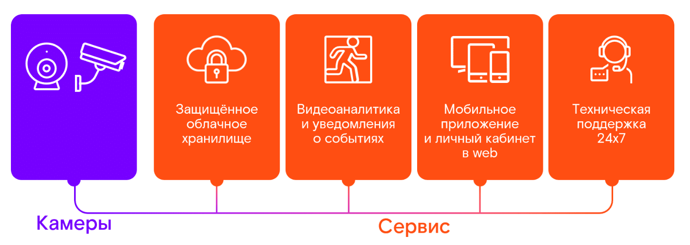
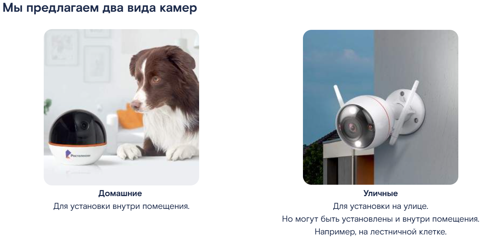
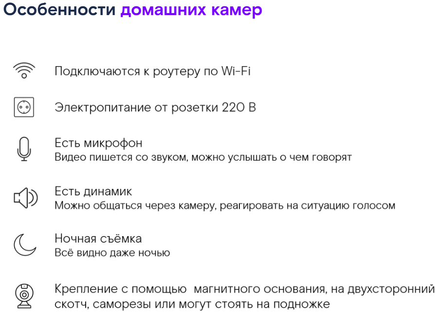
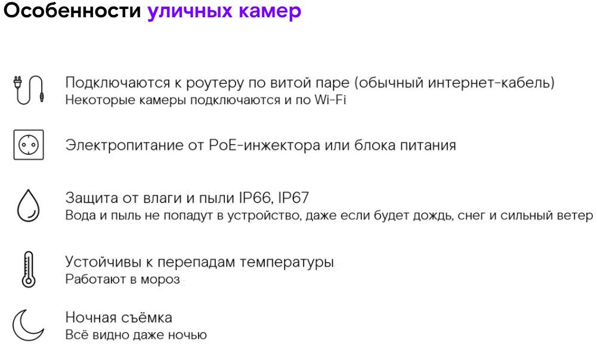
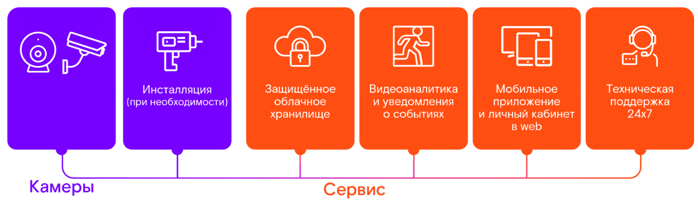
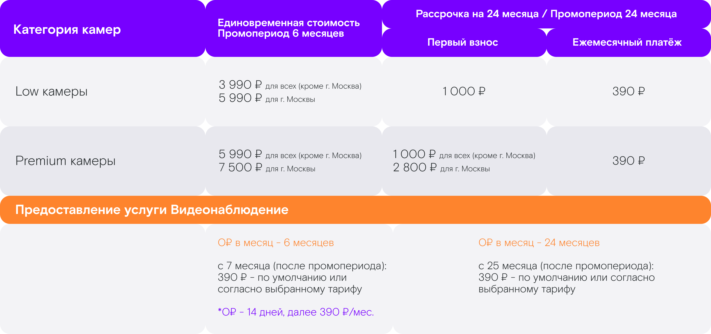
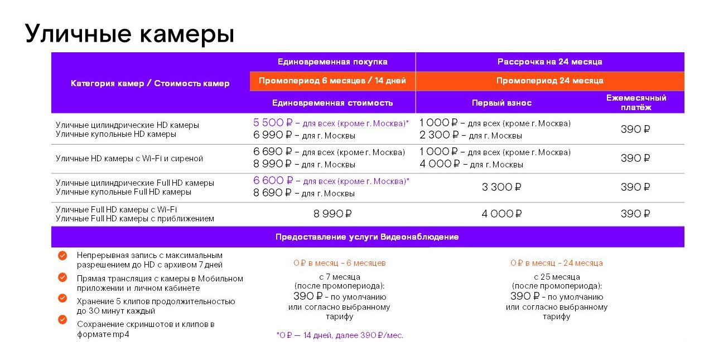
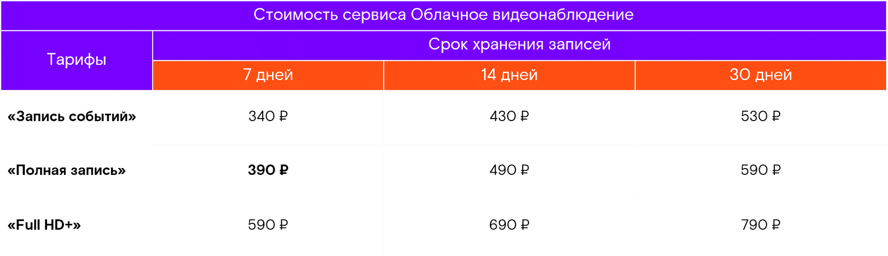

# Видеонаблюдение от Ростелекома: продукт, камеры, тарифы и продажи

## Введение

> Видеонаблюдение — <mark>комплексная услуга, включающая камеры, защищённое облачное хранилище, видеоаналитику, мобильное приложение, личный кабинет в web и техническую поддержку 24/7.</mark>

По данным поискового сервиса Яндекса, **более 1 миллиона россиян ежемесячно** ищут слово «видеонаблюдение». Это подтверждает высокий интерес к продукту: люди выбирают камеры не только для защиты от кражи, но и для комфорта и безопасности.

> Облачное видеонаблюдение — <mark>услуга, при которой видео с камер зашифровывается и хранится в защищённом облачном хранилище, доступ к которому есть только у клиента.</mark>

**Ростелеком — безусловный лидер рынка облачного видеонаблюдения России в сегменте B2C.** Продавать такую услугу проще, чем многие другие.

## Что включает услуга видеонаблюдения от Ростелекома

> Видеонаблюдение от Ростелекома — <mark>комплексная услуга, которая работает от интернета любого провайдера и помогает уследить за ребёнком, проконтролировать няню или ремонтную бригаду, убедиться, что в квартире или на даче нет непрошеных гостей.</mark>

Сервис включает <mark>четыре составляющие</mark>:

1. <mark>Защищённое облачное хранилище.</mark>
2. <mark>Видеоаналитика и уведомления о событиях.</mark>
3. <mark>Мобильное приложение и личный кабинет в web.</mark>
4. <mark>Техническая поддержка 24/7.</mark>

### Защищённое облачное хранилище

> Облачное хранилище — <mark>защищённое хранилище Ростелекома, в котором видео с камеры зашифровывается и хранится, а доступ к нему есть только у клиента.</mark>

Если камеру похитят, записи не потеряются и не попадут в руки злоумышленников. При прерывании подключения к интернету видео записывается на карту памяти (приобретается отдельно). Когда интернет снова подключается, видео транслируется в облако Ростелекома, и его легко посмотреть в архиве через приложение или личный кабинет.

### Видеоаналитика и уведомления о событиях

> Видеоаналитика — <mark>функция камеры, позволяющая фиксировать события и отправлять уведомления о них (push на смартфон, письмо на e-mail).</mark>

Клиенту не обязательно постоянно смотреть, что происходит. Камера может фиксировать события и отправлять уведомления.

**События с видеоаналитикой:**

> Движение — <mark>в кадре камеры зафиксировано движение.</mark>

> Движение в зонах — <mark>зафиксировано движение в одной из зон, заданных клиентом. Клиент может очертить до трёх зон в кадре, требующих усиленного внимания.</mark>

> Пересечение линии — <mark>в кадре зафиксировано пересечение линии. Клиент может задать направление движения в настройках.</mark>

**Другие события:**

> Обнаружение звука — <mark>камера зафиксировала звук</mark> (только для камер с микрофоном). Важный нюанс: звук фиксируется, но уведомления о звуке не присылаются. События с обнаружением звука видны под плеером камеры в мобильном приложении или сбоку от плеера в личном кабинете.

> Перекрытие обзора камеры — <mark>поле зрения камеры было перекрыто.</mark>

> Состояние камеры — <mark>подключение или отключение камеры.</mark>

### Мобильное приложение и личный кабинет в web

Клиенты могут пользоваться услугой в мобильном приложении или в личном кабинете на сайте. Возможности:

- <mark>смотреть видео онлайн и в записи из облака;</mark>
- <mark>выбирать зоны для наблюдения;</mark>
- <mark>настраивать датчики и уведомления;</mark>
- <mark>общаться через камеру;</mark>
- <mark>включать сирену</mark> (только на камерах с динамиком);
- создавать <mark>ссылки на трансляцию;</mark>
- сохранять <mark>скриншоты и клипы.</mark>

Приложение «Видеонаблюдение и Умный дом» доступно на Android и iOS. Для скачивания нужно навести камеру смартфона на QR-код или перейти по ссылке. В приложении есть демо-режим — можно познакомиться с возможностями без регистрации и смс.

### Техническая поддержка 24/7

> Техническая поддержка 24/7 — <mark>круглосуточная поддержка клиентов по телефону горячей линии, в чате мобильного приложения и личного кабинета.</mark>

Номер горячей линии: **8-800-1000-800**.

## Камеры

В 2022 году Ростелеком продал **170 000 камер** только физическим лицам — это почти 500 камер в день. Компания предлагает два вида камер:

> Домашние камеры — камеры для установки внутри помещения.

> Уличные камеры — камеры для установки на улице (могут быть установлены и внутри помещения, например на лестничной клетке).

### Домашние камеры

| Тип | Особенности |
|---|---|
| Low камеры | Базовое качество видео |
| Базовые камеры | — |
| Premium камеры | Разрешение Full HD, поворотный объектив, функция автослежения за движущимся объектом |

**Как подобрать домашнюю камеру:**

- нужно базовое качество видео — подойдут Low камеры HD;
- нужно высокое качество видео — подойдут Low камеры Full HD;
- требуется слежение за объектом (ребёнком, питомцем) — подойдут поворотные Premium камеры.

### Уличные камеры

| Тип | Подключение | Электропитание | Особенности |
|---|---|---|---|
| HD камеры цилиндрические и купольные | По витой паре | PoE-инжектор или блок питания (отдельно) | Самая низкая цена |
| HD камеры с Wi-Fi и сиреной | По Wi-Fi или витой паре | Блок питания (в комплекте) | Микрофон, динамик, стробоскоп |
| Full HD камеры цилиндрические | По витой паре | PoE-инжектор или блок питания (отдельно) | — |
| Full HD камеры купольные | По витой паре | PoE-инжектор или блок питания (отдельно) | — |
| Full HD камеры с Wi-Fi | По Wi-Fi или витой паре | Блок питания (в комплекте) | — |
| Full HD камеры с приближением | По витой паре | PoE-инжектор или блок питания (отдельно) | Приближение через приложение или ручное; самая высокая цена |

**Как подобрать уличную камеру:**

- нет повышенных требований к изображению — подойдут камеры HD;
- нужно более детальное изображение — подойдут камеры Full HD;
- объекты наблюдения расположены далеко — подойдут камеры с приближением;
- нужна функция общения через камеру — подойдёт HD камера с Wi-Fi и сиреной;
- нужна камера с сиреной — подойдёт HD камера с Wi-Fi и сиреной;
- нужна антивандальная камера — подойдут купольные камеры HD и Full HD;
- нужно беспроводное подключение к роутеру — подойдут камеры с Wi-Fi.

> PoE-инжектор — устройство, которое подключает камеру к электричеству и к роутеру одновременно. Вместо двух проводов к камере идёт всего один провод.

<mark>PoE-инжектор используется в основном для уличных камер без Wi-Fi. У таких камер обычно нет блока питания в комплекте, поэтому без PoE-инжектора чаще всего не обойтись.</mark> Его можно приобрести у Ростелекома.

### Интеграция с умными колонками

Если у клиента есть умная колонка от Яндекса, он <mark>может выводить видео с камер на телевизор с помощью голосового помощника Алисы.</mark> Для этого нужно добавить камеры Ростелекома в приложение Яндекса «Умный дом» — и включать видео голосом. Компания также ожидает интеграции камер с Марусей.

## Стоимость услуги

<mark>Стоимость складывается из трёх составляющих:</mark> камеры, инсталляция и сервис.

### Камеры

Приобрести <mark>камеру можно двумя способами:</mark>

- **Разовая оплата** — доступна всем клиентам.
- **Рассрочка на 24 месяца** — доступна только клиентам с подключёнными основными услугами Ростелекома (интернет, телевидение, домашний телефон). В рассрочку можно оформить не более 3 камер.

При покупке камеры предоставляется сервис в подарок (промо-период):

- при разовой оплате — сервис в подарок на 6 месяцев (или 14 дней на некоторые модели камер по сниженной цене);
- при рассрочке — сервис в подарок на 24 месяца (клиент оплачивает только рассрочку за камеру).

### Инсталляция (при необходимости)

> Инсталляция — <mark>услуга по установке и настройке камер, доступная действующим клиентам Ростелекома с основными услугами.</mark>

Домашние камеры клиент может установить и настроить самостоятельно: в коробке есть подробная инструкция, настройка занимает около 5 минут. Для уличных камер клиенты чаще пользуются услугами специалистов Ростелекома.

Стоимость установки и настройки зависит от вида камеры и региона:

- домашние камеры — от 650 рублей;
- уличные камеры — от 1650 рублей.

При установке уличных камер возможны дополнительные расходы: покупка PoE-инжектора, прокладка кабеля по фасаду здания. Актуальные цены на инсталляцию, дополнительное оборудование и услуги для своего региона можно узнать у супервайзера или руководителя.

### Сервис

> Сервис — <mark>ежемесячная оплата за защищённое облако, видеоаналитику и уведомления, мобильное приложение и личный кабинет, а также техническую поддержку 24/7.</mark>

Без оплаты сервиса клиент может только смотреть видео с камеры, остальные возможности недоступны.

**Тарифы на сервис:**

| Тариф | Описание |
|---|---|
| Запись событий | Запись только событий с разрешением HD |
| Полная запись | Непрерывная запись с разрешением HD |
| Full HD+ | Непрерывная запись с разрешением Full HD и выше |

На любом тарифе записи хранятся в облаке за последние несколько дней. Клиент может выбрать срок хранения: 7, 14 или 30 дней.

По умолчанию устанавливается тариф «Полная запись» на 7 дней стоимостью **390 руб./мес.** Клиент может поменять тариф в личном кабинете.

**Акция «Безопасный онлайн»** для новых клиентов: при подключении видеонаблюдения с домашним интернетом (в том числе в пакете с ТВ и в конвергенте) предоставляется скидка на камеру и сервис на 24 месяца. В акции участвуют все камеры. Записи хранятся в архиве 3 дня. С 25-го месяца — 250 ₽ по умолчанию или согласно выбранному тарифу.

## Как продавать видеонаблюдение

### Выявление потребностей

> Выявление потребностей — этап продажи, на котором продавец определяет, какие задачи клиента может решить продукт.

**Кто наши клиенты:**

1. **Те, кто заботится о близких:** о детях, о пожилых родственниках и близких с ограничениями, о домашних питомцах.
2. **Те, кто заботится о безопасности и сохранности имущества:** квартиры, загородного дома или дачи, автомобиля.
3. **Те, кому важно контролировать добросовестность персонала:** няни, репетитора, сиделки, домработницы, строителей.

### Презентация видеонаблюдения

> Презентация — этап продажи, на котором продавец показывает, как продукт закрывает конкретные потребности клиента.

**Присмотр за детьми, когда они остаются дома одни.** Вы всегда будете знать, когда ребёнок пришёл домой. Если камера обнаружит движение или звук — придёт уведомление на смартфон. Вы будете в курсе, чем занят ребёнок: учит уроки, играет или пригласил кого-то в гости.

**Присмотр за пожилыми родственниками и близкими с ограничениями.** Пожилые родственники часто не слышат телефон. Чтобы убедиться, что всё в порядке, можно открыть приложение и посмотреть прямую трансляцию или запись. Если близкий человек не отвечает на звонок, через динамик в камере можно напомнить выпить лекарства или попросить перезвонить.

**Присмотр за питомцами.** Камера уведомит, если питомец зайдёт на запретную территорию или будет вести себя слишком шумно. Через динамик можно отреагировать на ситуацию. Камера записывает постоянно и не упустит ни одного забавного момента — видео можно скачать из облака и сохранить на память.

**Присмотр за квартирой и домом.** Проверить, всё ли в порядке дома, можно удалённо с любого устройства. С помощью встроенной сирены или голосовой функции вы сможете отреагировать на ситуацию. Если камера зафиксирует движение или звук около двери — немедленно отправит уведомление на смартфон.

**Присмотр за сохранностью автомобиля.** Предотвращайте угон, порчу автомобиля и кражу запчастей. В мобильном приложении можно настроить камеру на определённые события, например уведомлять, когда какой-то объект оказался рядом с машиной.

**Контроль за действиями няни.** Вы можете контролировать действия няни и наблюдать, как развивается ваш ребёнок. Это поможет снизить тревожность, пока вас нет рядом.

**Контроль за ходом ремонта.** Видеонаблюдение помогает в любое время удалённо контролировать, как протекает ремонт в квартире или благоустройство придомовых территорий, а также следить за сохранностью стройматериалов.

### Отработка возражений

> Возражение — сомнение клиента, которое продавец отрабатывает с помощью преимуществ услуги.

При отработке возражения обязательно используйте преимущества услуги для аргументации. Подбирайте аргументы, которые бьют точно в цель.

### Завершение продажи

1. Резюмируйте договорённости.
2. Оформите заявку.
3. Оставьте контакты, попрощайтесь с клиентом и пожелайте приятного пользования.

## FAQ

**Что такое видеонаблюдение от Ростелекома?**
Это комплексная услуга: камеры, защищённое облачное хранилище, видеоаналитика, мобильное приложение, личный кабинет в web и поддержка 24/7.

**Работает ли услуга от интернета другого провайдера?**
Да, видеонаблюдение работает от интернета любого провайдера.

**Что произойдёт с записью, если интернет отключится?**
Видео записывается на карту памяти (приобретается отдельно). Когда интернет снова подключится, видео транслируется в облако Ростелекома.

**Приходят ли уведомления при обнаружении звука?**
Нет. Звук фиксируется, но уведомления о звуке не присылаются. События видны под плеером камеры в приложении или сбоку от плеера в личном кабинете.

**Можно ли установить камеру самостоятельно?**
Да, домашние камеры клиент может установить и настроить самостоятельно — в коробке есть подробная инструкция, настройка занимает около 5 минут.

**Сколько камер можно оформить в рассрочку?**
Не более 3 камер. Рассрочка доступна только клиентам с подключёнными основными услугами Ростелекома.

**Какой тариф устанавливается по умолчанию?**
«Полная запись» на 7 дней стоимостью 390 руб./мес. Тариф можно поменять в личном кабинете.

**Что такое PoE-инжектор?**
Устройство, которое подключает камеру к электричеству и к роутеру одновременно — вместо двух проводов к камере идёт один.

**Можно ли выводить видео с камер на телевизор?**
Да, если у клиента есть умная колонка от Яндекса. Нужно добавить камеры Ростелекома в приложение «Умный дом» и включать видео голосом через Алису.

**Сколько камер Ростелеком продал в 2022 году?**
170 000 камер только физическим лицам — почти 500 камер в день.

**Как связаться с технической поддержкой?**
По горячей линии 8-800-1000-800, а также в чате мобильного приложения и личного кабинета.