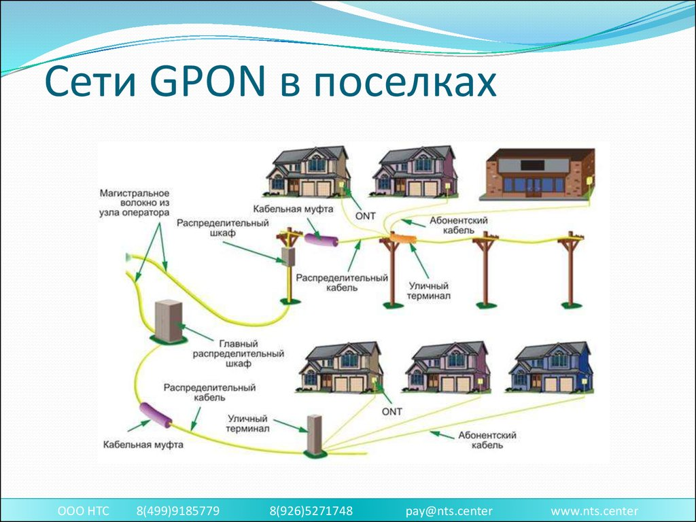
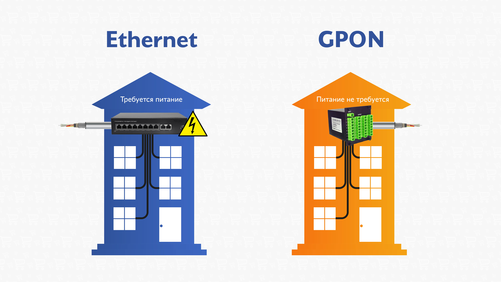
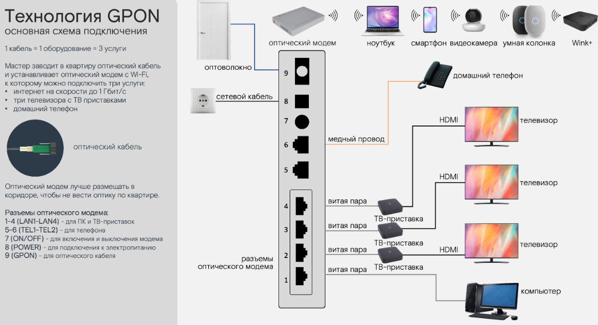
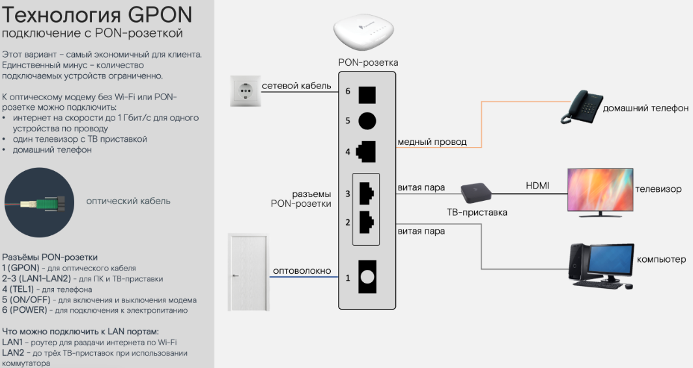
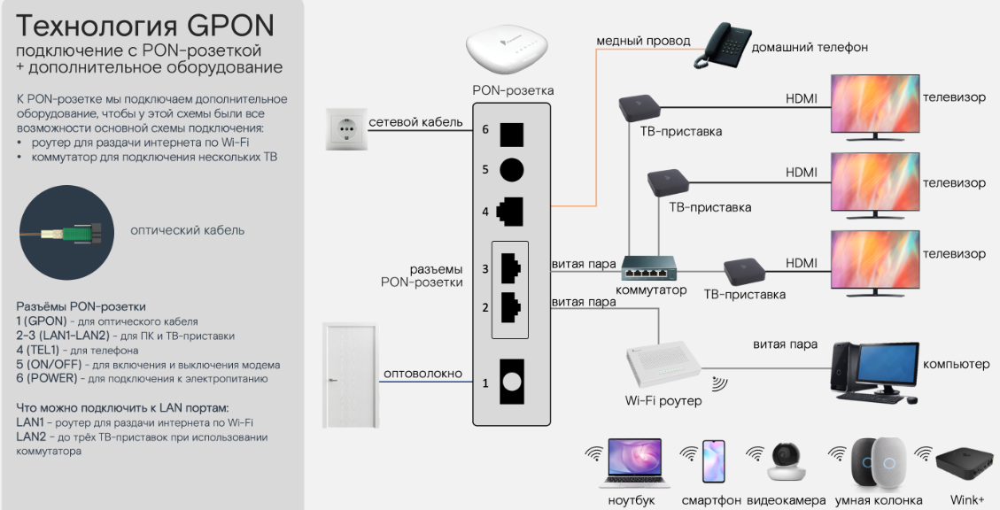
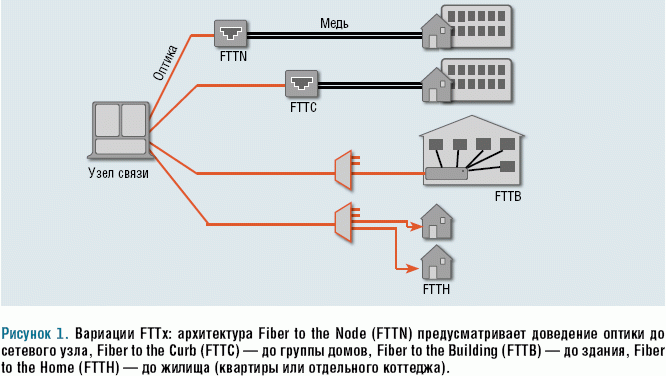
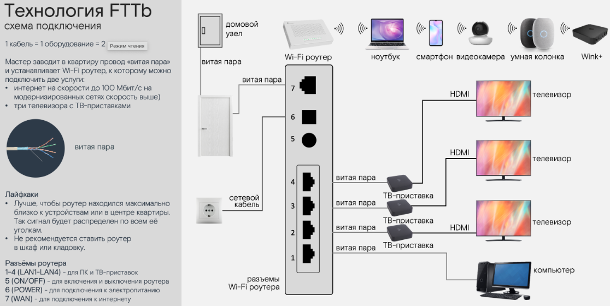
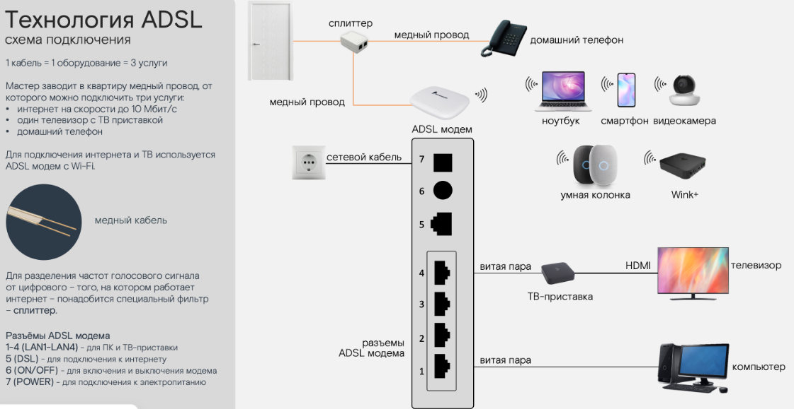

# Технологии подключения

Ты во втором разделе курса — и он самый технический 😊

Не переживай: сложных формул и инженерных деталей не будет. Разберём всё простым языком, чтобы ты понимал(а), как устроен Домашний интернет и мог(ла) отвечать на вопросы клиента.

## 1. Термины и определения

> **GPON (Gigabit Passive Optical Network)** — гигабитная пассивная оптическая сеть; технология, при которой оптика заводится прямо в квартиру.

> **FTTb (Fiber to the Building)** — технология, при которой оптика приходит в дом, а в квартиру заводится витая пара (обычный сетевой кабель).

> **ADSL** — технология подключения интернета по обычной телефонной линии; используется там, где нет оптики.

> **ONT (Optical Network Terminal)** — оптический модем, который преобразует оптический сигнал и раздаёт услуги.

> **PON-розетка** — вариант ONT без Wi-Fi с минимальным количеством портов для проводных подключений.

> **Витая пара (Ethernet-кабель)** — обычный сетевой кабель, который заводится в квартиру при подключении по технологии FTTb.

> **Сплиттер** — устройство, разделяющее сигнал, чтобы одновременно работали и телефон, и интернет (используется в ADSL).

## 2. Три основные технологии подключения

В Ростелекоме есть три основные технологии подключения:

- **GPON** — оптика заходит прямо в квартиру.
- **FTTb** — оптика доходит до дома, а в квартиру идёт витая пара.
- **ADSL** — интернет работает через телефонную линию.

Дальше разберём каждую технологию по одной понятной схеме: что это такое, как выглядит подключение дома и какие у технологии преимущества и особенности.

<strong>ТУТ ОШИБКА</strong>
<table><tr><td>

GPON — это один из способов реализовать FTTH. Но FTTH можно построить и на других технологиях

Да, вы абсолютно правы — в этом тексте есть **смешивание технологии и топологии (архитектуры)**. Разберём по пунктам.

## Где именно смешаны понятия

| В тексте | Что на самом деле | Проблема |
|----------|-------------------|----------|
| «GPON — оптика заходит прямо в квартиру» | GPON — это **технология передачи**. «Оптика в квартиру» — это **FTTH** (топология). | Технология названа вместо архитектуры. |
| «FTTb — оптика доходит до дома, а в квартиру идёт витая пара» | **FTTB** — это топология (Fiber To The Building). А «витая пара в квартиру» — это уже **технология доступа** (обычно Ethernet / VDSL). | Здесь топология названа, но как «технология подключения». |
| «ADSL — интернет через телефонную линию» | ADSL — это **технология передачи** по телефонной линии (медный кабель). Топология здесь — **FTTC/FTTN** или вообще чистая медь. | Технология названа, но без указания топологии. |

## Суть путаницы

Автор поставил в один ряд **три разнородные вещи**:

1. **GPON** — технология (стандарт PON)
2. **FTTB** — топология (где заканчивается оптика)
3. **ADSL** — технология (стандарт передачи по меди)

Это как сравнивать «дизель», «доставку до подъезда» и «бензин» — они из разных категорий.

## Как было бы корректно

Правильно разделять **два уровня**:

**1. Топология (куда доходит оптика):**
- **FTTH** — волокно до квартиры
- **FTTB** — волокно до здания, дальше медь/Ethernet
- **FTTC** — волокно до шкафа, дальше медь (ADSL/VDSL)

**2. Технология передачи (как гоняем данные):**
- **GPON / XGS-PON** — пассивные оптические сети
- **Active Ethernet** — активная оптика точка-точка
- **ADSL / VDSL** — по медной паре
- **Ethernet** — по витой паре

## Как выглядела бы корректная таблица Ростелекома

| Услуга | Топология | Технология |
|--------|-----------|------------|
| GPON | FTTH | GPON |
| FTTB | FTTB | Ethernet (или VDSL) |
| ADSL | FTTC / медь | ADSL |

**Вывод:** да, текст смешивает технологию и топологию. Формально он «не врёт» — GPON действительно часто идёт до квартиры, а FTTB действительно подразумевает витую пару. Но **логика классификации нарушена**: в одном списке стоят понятия из разных категорий, что создаёт путаницу.

</td></tr></table>

## 3. GPON — оптика в квартиру

**GPON (Gigabit Passive Optical Network)** — гигабитная пассивная оптическая сеть. Это технология, где оптику заводят прямо в квартиру.

Данные по оптоволокну передаются световым сигналом, поэтому интернет получается быстрым и стабильным. Плюс оптика не ржавеет и не окисляется, как медь, и нечувствительна к влаге, перепадам температур и электромагнитным помехам — связь остаётся стабильной надолго.

### Как выглядит подключение дома

В квартиру заводят оптический кабель и подключают его к оптическому модему (ONT).

Оптику лучше не тянуть далеко по квартире: кабель довольно хрупкий, поэтому ONT чаще ставят ближе к месту ввода — у входа, например в коридоре. И этот момент важно заранее проговорить с клиентом: есть ли рядом розетка для питания ONT или понадобится удлинитель.

В большинстве случаев мы ставим **ONT с Wi-Fi** — это основной вариант. Он преобразует оптический сигнал и дальше раздаёт услуги.

**По GPON можно подключить:**

- Домашний интернет
- Интерактивное ТВ — до трёх ТВ-приставок
- Домашний телефон

Иногда используют вариант **ONT без Wi-Fi** — у нас его называют **PON-розетка**. Это не розетка в стене, а такой же ONT, просто без Wi-Fi и с минимальным количеством портов для проводных подключений.

**В PON-розетке всегда есть:**

- Порт для интернета по кабелю — к нему можно подключить роутер для раздачи Wi-Fi.
- Порт для ТВ-приставки — если нужно подключить несколько ТВ-приставок, к порту подключают контроллер/разветвитель.
- Порт для домашнего телефона.

### Преимущества и особенности технологии

- Скорость может быть до 1 Гбит/с (зависит от тарифов, доступных в регионе и по адресу).
- Хорошо тянет нагрузку: много устройств, видео, игры, большие файлы.
- Оптика долговечная: не окисляется и не боится влаги, перепадов температур и электромагнитных помех.

## 4. FTTb — оптика до дома, в квартиру заходит витая пара

**FTTb (Fiber to the Building)** — технология, где оптика приходит в дом, а в квартиру заводится витая пара — обычный сетевой кабель. Это один из самых частых вариантов подключения, особенно в многоэтажках.

### Как выглядит подключение дома

В квартиру заводят витую пару (Ethernet-кабель). Так как оптика в квартиру не заходит, ONT здесь не нужен.

Обычно ставят роутер, чтобы интернет был на нескольких устройствах и работал Wi-Fi.

Чисто технически FTTb можно подключить и без роутера — кабелем напрямую в компьютер. Но тогда интернет будет только на одном устройстве, поэтому так делают редко.

**По FTTb можно подключить:**

- Домашний интернет
- Интерактивное ТВ — до трёх ТВ-приставок

> **Важно:** домашний телефон по FTTb не подключают — это одно из отличий от GPON.

### Преимущества и особенности технологии

- Хорошо подходит для повседневных задач: видео, учёба, созвоны, несколько устройств одновременно.
- Скорость обычно до 100 Мбит/с, на модернизированных сетях скорость может быть выше и доходить до 890 Мбит/с.
- Для подключения нескольких устройств и Wi-Fi используют роутер.

## 5. ADSL — интернет по телефонной линии

**ADSL** — технология подключения интернета по обычной телефонной линии. Сейчас её используют в тех случаях, когда по адресу нет оптики.

### Как выглядит подключение дома

В квартиру заводят телефонный провод. Если у клиента уже есть домашний телефон, провод может быть уже заведён.

Для подключения ставят ADSL-модем.

Если нужно, чтобы одновременно работали и телефон, и интернет, используют сплиттер — он разделяет сигнал.

**По ADSL можно подключить:**

- Домашний интернет
- Интерактивное ТВ — только одну ТВ-приставку, т. к. большей нагрузки такая технология обычно не тянет
- Домашний телефон

### Преимущества и особенности технологии

- ADSL выручает там, где нет других технических возможностей — например, если по адресу не доступны GPON или FTTb.
- ADSL — асимметричная технология: скорость к абоненту может быть до 10 Мбит/с, а от абонента — обычно до 1 Мбит/с. То есть скачать данные получится быстрее, чем отправить.
- Скорость по ADSL в целом значительно ниже, чем по оптике. Но в некоторых регионах встречаются разновидности DSL с более высокой скоростью, например XDSL до 100 Мбит/с.
- На скорость влияет удалённость от станции: чем дальше находится абонент, тем ниже может быть скорость.

## 6. Основные отличия технологий

- **GPON:** оптика в квартиру → ONT → интернет + интерактивное ТВ + домашний телефон.
- **FTTb:** витая пара в квартиру → роутер → интернет + интерактивное ТВ.
- **ADSL:** телефонная линия → DSL-модем → интернет + одна ТВ-приставка + домашний телефон.

Ну что, с технической частью разобрались — для старта этого точно достаточно 😊

Давай остановимся и закрепим главное. Ответь на несколько простых вопросов.

## FAQ

**Какие три основные технологии подключения есть в Ростелекоме?**
GPON, FTTb и ADSL.

**Что такое GPON?**
Это гигабитная пассивная оптическая сеть: оптика заводится прямо в квартиру. Данные передаются световым сигналом, поэтому интернет быстрый и стабильный.

**Что такое FTTb?**
Это технология, при которой оптика приходит в дом, а в квартиру заводится витая пара. ONT не нужен, обычно ставят роутер.

**Что такое ADSL?**
Это технология подключения интернета по обычной телефонной линии. Используется там, где нет оптики.

**Какие услуги можно подключить по GPON?**
Домашний интернет, Интерактивное ТВ (до трёх ТВ-приставок) и Домашний телефон.

**Какие услуги можно подключить по FTTb?**
Домашний интернет и Интерактивное ТВ (до трёх ТВ-приставок). Домашний телефон по FTTb не подключают.

**Какие услуги можно подключить по ADSL?**
Домашний интернет, Интерактивное ТВ (только одну ТВ-приставку) и Домашний телефон.

**Что такое ONT?**
Это оптический модем, который преобразует оптический сигнал и дальше раздаёт услуги. В большинстве случаев ставится ONT с Wi-Fi.

**Что такое PON-розетка?**
Это вариант ONT без Wi-Fi с минимальным количеством портов для проводных подключений. В ней есть порт для интернета по кабелю, порт для ТВ-приставки и порт для домашнего телефона.

**Какая скорость у GPON?**
До 1 Гбит/с — зависит от тарифов, доступных в регионе и по адресу.

**Какая скорость у FTTb?**
Обычно до 100 Мбит/с, на модернизированных сетях может доходить до 890 Мбит/с.

**Какая скорость у ADSL?**
Скорость к абоненту — до 10 Мбит/с, от абонента — обычно до 1 Мбит/с. В некоторых регионах встречаются разновидности DSL с более высокой скоростью, например XDSL до 100 Мбит/с. На скорость влияет удалённость от станции.

**Почему оптика долговечнее меди?**
Оптика не ржавеет и не окисляется, как медь, и нечувствительна к влаге, перепадам температур и электромагнитным помехам.

**Зачем нужен сплиттер при ADSL?**
Чтобы одновременно работали и телефон, и интернет — сплиттер разделяет сигнал.

**Можно ли по FTTb подключить интернет без роутера?**
Технически можно — кабелем напрямую в компьютер. Но тогда интернет будет только на одном устройстве, поэтому так делают редко.