# Волоконно-оптические линии связи: оборудование и основы монтажа

Волоконно-оптические линии связи (ВОЛС) — основа современных телекоммуникационных сетей. Высокая пропускная способность, устойчивость к электромагнитным помехам, минимальное затухание сигнала и длительный ресурс эксплуатации делают оптоволокно незаменимым при построении магистральных сетей, городских и корпоративных инфраструктур, а также сетей доступа FTTH.

> **ВОЛС** — волоконно-оптическая линия связи; совокупность оптических кабелей, пассивных и активных компонентов, обеспечивающая передачу информации посредством оптического излучения.

> **FTTH** (Fiber to the Home) — архитектура оптической сети доступа, при которой оптическое волокно доводится непосредственно до помещения абонента.

Переход от медной к волоконно-оптической технологии означает необходимость в новых инструментах и навыках. Помимо теоретических знаний, установщики должны улучшить навыки ручного труда: работа с оптоволокном требует более внимательного подхода.

Как и в случае с другими типами кабельных систем, процесс установки волоконно-оптической системы можно разделить на три основных этапа:

1. Прокладка кабелей.
2. Установка разъёмов и пассивных компонентов.
3. Установка и настройка активных устройств.

Способ прокладки кабелей важен для затухания передаваемых оптических сигналов. Каждый кабель содержит одно или несколько волокон.

> **Оптическое волокно** — тонкая нить из оптически прозрачного материала (стекла или пластика), предназначенная для направленной передачи оптического излучения.

> **Затухание** — уменьшение мощности оптического сигнала по мере его распространения по волокну, выражается в дБ.

Тип волокна определяет минимальный радиус изгиба, однако установщик не должен путать минимальный радиус изгиба отдельного волокна и самого кабеля. Минимальный радиус изгиба кабеля обычно равен 20× его диаметра. Минимальный радиус изгиба одиночного волокна зависит от его стандарта:

- 30 мм — для волокон G.652D;
- 10 мм — для волокон G.657A1;
- 7,5 мм — для волокон G.657A2.

В случае систем FTTH рекомендуемым стандартом является G.657A2 с наименьшим минимальным радиусом изгиба. Это значительно облегчает работу установщика и сводит к минимуму проблемы, связанные с увеличением затухания сигнала из-за резких изгибов (прямые углы и т. д.).

При прокладке кабелей не допускается превышение максимального тягового усилия. В отличие от коаксиальных кабелей или кабелей витой пары, локализовать неисправности в оптоволокне непросто, если у установщика нет дорогостоящего устройства — рефлектометра.

> **Рефлектометр (OTDR, Optical Time Domain Reflectometer)** — прибор для измерения параметров оптического тракта, позволяющий обнаруживать места повреждений, сварных соединений и изгибов по обратному рассеянию.


Подключение и настройка активных оптических устройств несложны, в целом процедуры аналогичны применяемым в сетях LAN на основе кабелей UTP. Однако установщик должен помнить о двух важных моментах:

- ИК-лазерный свет невидим для человеческого глаза, но может быть очень вредным — все подключения должны выполняться до включения каких-либо устройств.
- Оптические устройства и разъёмы требуют высоких стандартов чистоты — любая грязь увеличивает затухание в оптическом канале.

Большинство проблем, с которыми сталкиваются начинающие установщики, возникают при подключении оптоволокна. Ниже приведены практические советы, общие для всех техник сварки (сварка плавлением, механическая сварка, склеивание и полировка).

## Классификация оборудования для оптоволокна

Всё оборудование, используемое при строительстве и обслуживании ВОЛС, можно разделить на несколько крупных категорий.

### Пассивное оптическое оборудование

> **Пассивное оптическое оборудование** — <mark><strong>компоненты ВОЛС, которые не требуют электропитания и не преобразуют сигнал, а лишь направляют, распределяют или соединяют оптические волокна.</strong></mark>

Пассивные компоненты — основа любой волоконно-оптической сети.

#### Оптические кабели

> **Оптический кабель (кабель ВОЛС)** — ключевое звено ВОЛС; <mark><strong>содержит одно или несколько оптических волокон, заключённых в защитные оболочки.</strong></mark>

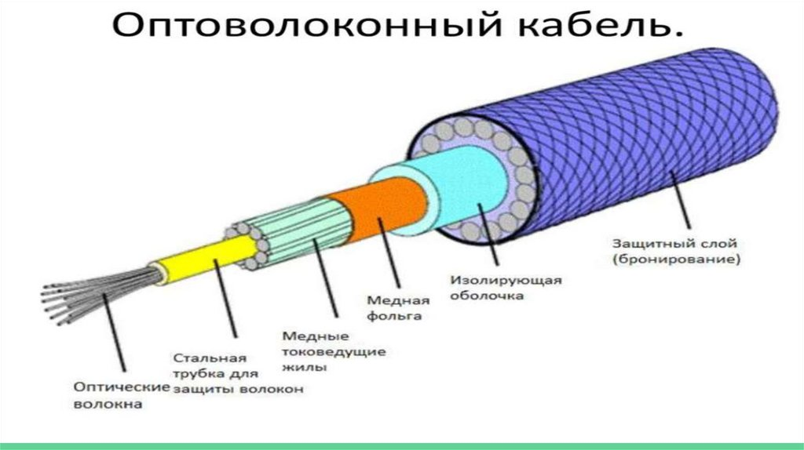

Различают одномодовые и многомодовые кабели.

> **Одномодовое волокно** — <mark><strong>волокно с малым диаметром сердцевины (обычно 9 мкм), по которому распространяется одна мода;</strong></mark> применяется для передачи сигналов на значительные расстояния (вплоть до сотен километров).

> **Многомодовое волокно** — <mark><strong>волокно с большим диаметром сердцевины (50 или 62,5 мкм), по которому распространяется несколько мод;</strong></mark> применяется главным образом для локальных сетей и непротяжённых магистралей.

В зависимости от количества волокон встречаются исполнения, например, оптический кабель 4 или оптический кабель 8. <mark><strong>Срок службы качественного оптоволоконного кабеля превышает 25 лет.</strong></mark>

#### Патч-корды и пигтейлы

> **Патч-корд** — коммутационный шнур с оптическими коннекторами на обоих концах.

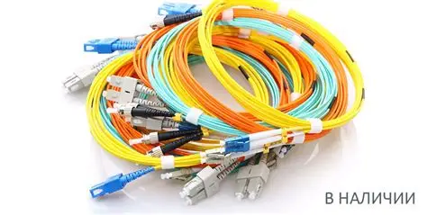

Патч-корды используются для соединения активного оборудования с оптическими кроссами, а также для коммутации портов внутри стоек и шкафов.

> **Пигтейл** — короткий отрезок оптического кабеля с коннектором только на одном конце.

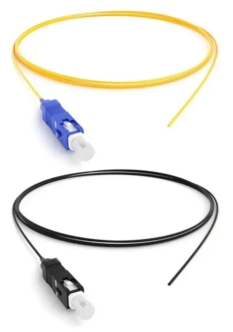

<mark><strong>Второй конец пигтейла предназначен для сварного соединения с волокнами основного кабеля.</strong></mark> Пигтейлы применяются для оконцовки оптического кабеля внутри кроссов и муфт.

#### Оптические муфты

> **Оптическая муфта** — <mark><strong>герметичный контейнер для защиты мест сварки оптических волокон</strong></mark> от внешних воздействий.

| 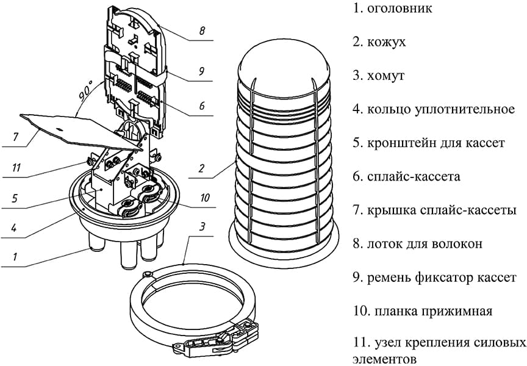 | 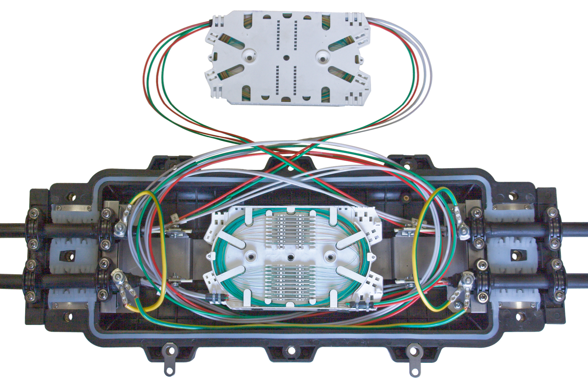 |   |
|-----------------------|------------------------|---|


Внутри муфты размещаются сплайс-пластины для фиксации сваренных волокон.

Муфты выпускаются в различных исполнениях: для подземной прокладки, для воздушных линий, для кабельной канализации. Также существуют кросс-муфты, совмещающие функции защиты сварных соединений и коммутации.

> **Сплайс-пластина** — элемент муфты или кросса, предназначенный для фиксации и защиты сварных соединений оптических волокон.

| 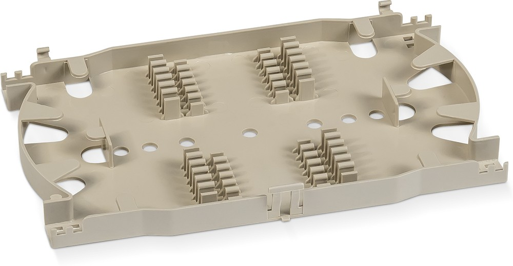  | 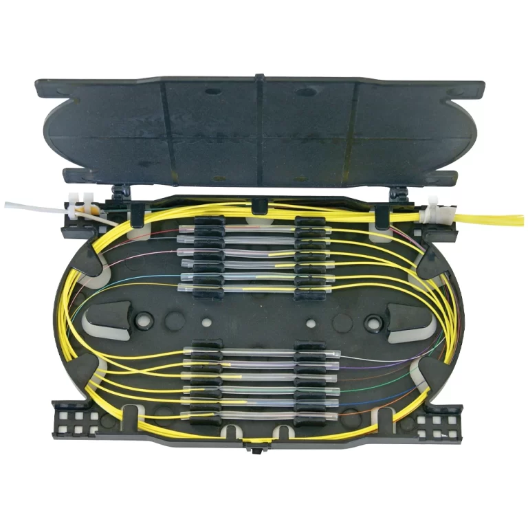  |
|---|---|

#### Оптические кроссы и распределительные шкафы

> **Оптический кросс** — <mark><strong>устройство для подключения оптических волокон к стандартным разъёмам и организации коммутации.</strong></mark>

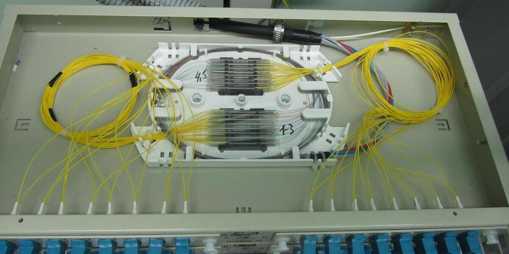

Кроссы могут быть настенными или стоечными (19-дюймовыми), оснащаться адаптерными панелями с разъёмами различных типов (SC, LC, FC, ST и др.). Для центров обработки данных (ЦОД) выпускаются решения с повышенной плотностью монтажа — до 144 волокон и более в 1U.

> **1U** (одна монтажная единица) — стандартная высота оборудования в стойке, равная 44,45 мм.

#### Распределительные боксы, розетки и патч-панели

Кабели и волокна имеют соответствующие минимальные радиусы изгиба. Самым простым и быстрым решением для защиты соединений и оконечных устройств кабеля/оптоволокна является использование подходящих распределительных боксов с кассетами для кабелей и волокон. Они обеспечивают правильное расположение кабелей и волокон и предотвращают случайное повреждение волокон в местах соединения и заделки.

> **Оптическая розетка** — небольшая пластиковая коробка, устанавливаемая в помещении абонента; <mark><strong>предназначена для ввода оптического волокна, хранения его запаса и вывода сигнала на оборудование клиента.</strong></mark>

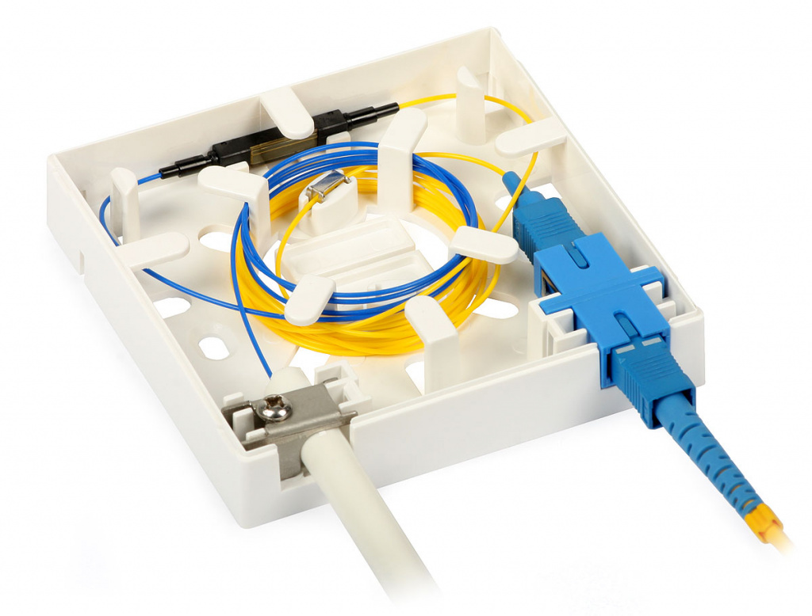

> **Оптическая патч-панель** — устройство, обычно используемое в 19-дюймовых стоечных системах для организации кроссового поля.

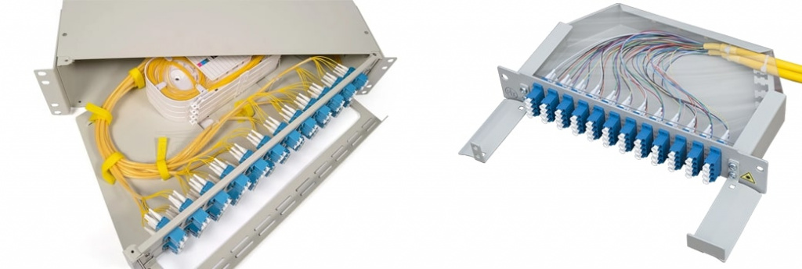

Внутри патч-панели есть сплайс-кассета для разводки и сохранения волокон. На лицевой панели есть в основном от 8 до 48 посадочных мест для адаптеров типа SC/LC.

<details><summary><strong>Зачем?</strong></summary><table><tr><td>

Проблема, которую она решает

Представьте: в здание заходит **магистральный кабель на 144 волокна**. Он приходит с улицы, в нём 144 тонкие стеклянные нити. Что с ними делать дальше?

- Их нельзя просто «раскидать» по зданию — они хрупкие.
- Нужно как-то подключить к оборудованию: коммутаторам, серверам, роутерам.
- Нужно, чтобы можно было **переключать** — сегодня это волокно идёт в одну комнату, завтра в другую.
- Нужно, чтобы было **понятно**, где какое волокно.

Вот для этого и нужна **патч-панель**.

Есть **два уровня** волокон:

**1. Магистральный кабель** (приходит снаружи) → его волокна **вводятся в патч-панель сзади**.

**2. Пигтейлы** (короткие отрезки волокна с разъёмом на конце) → их **приваривают** к волокнам магистрального кабеля внутри панели.

Схема:

```
Магистральный кабель
   │
   │ 144 волокна
   ▼
┌─────────────────────────┐
│  Патч-панель            │
│  ┌───────────────────┐  │
│  │ Сплайс-кассета    │  │
│  │  (сварка волокон) │  │
│  └───────────────────┘  │
│  ┌──┐┌──┐┌──┐┌──┐      │
│  │  ││  ││  ││  │ ...  │ ← порты (LC/SC)
│  └──┘└──┘└──┘└──┘      │
└─────────────────────────┘
   │
   │ Патч-корды
   ▼
Коммутаторы, серверы, роутеры
```

**Патч-корд** — это гибкий оптический кабель с разъёмами на обоих концах. Им соединяют порт патч-панели с портом оборудования.

## Зачем это нужно

**1. Удобство коммутации.** Вместо того чтобы каждый раз лезть в магистральный кабель и что-то переваривать, вы просто **переключаете патч-корд** с одного порта на другой. Это как переключить штекер в розетке.

**2. Защита волокон.** Магистральный кабель хрупкий, его нельзя часто трогать. Патч-панель «принимает удар» — все переключения происходят на патч-кордах, а магистраль остаётся нетронутой.

**3. Порядок.** 144 волокна без патч-панели — это клубок стеклянных нитей, в котором ничего не понятно. С патч-панелью каждое волокно имеет **свой порт с номером**.

**4. Маркировка.** Каждый порт подписан. Видно, куда идёт каждое волокно.

**5. Резервирование.** Свободные порты — это запас. Можно подключить новое оборудование, не трогая существующее.

**6. Разделение зон.** Одна патч-панель — для магистрали, другая — для оборудования. Между ними — патч-корды. Это называется **кроссовое поле** (cross-connect).

</td></tr></table></details>

> **Оптический бокс** — устройство, в отличие от патч-панелей предназначенное для наружной установки; защищает оптический кабель от климатических и механических воздействий и исполняет роль хранилища сварных соединений и определённого запаса волокон.

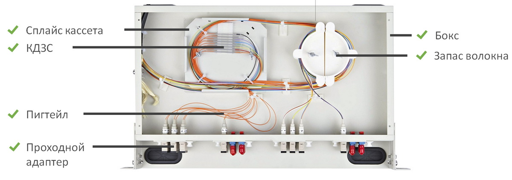

|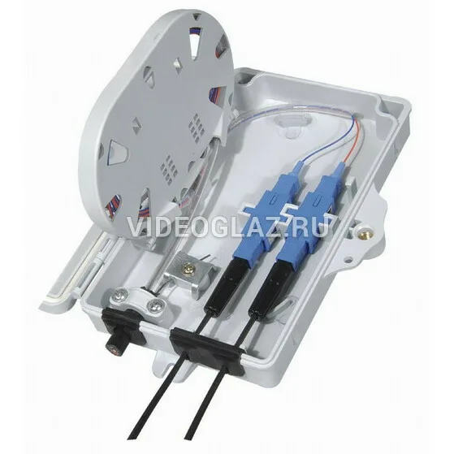   | 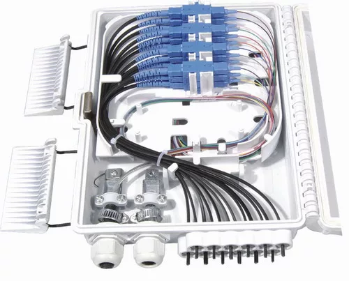  | 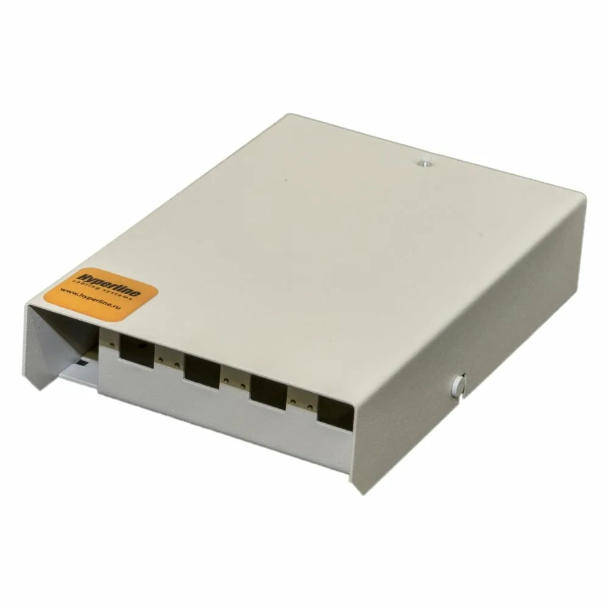  |
|---|---|---|


Для обеспечения последней функции оптические PON-боксы оснащаются сплайс-кассетами и кросс-адаптерами.

> **PON** (Passive Optical Network) — пассивная оптическая сеть; архитектура сети доступа, в которой между активным оборудованием оператора и абонентскими устройствами используются только пассивные оптические компоненты.

#### Адаптеры и соединители

> **Оптический адаптер** (соединительная розетка) — пассивный компонент для соединения двух коннекторов между собой.

> **Коннектор** — устройство для оконцевания оптического волокна, обеспечивающее механическое и оптическое соединение с другим коннектором или адаптером.

Коннекторы бывают различных типов: SC, LC, FC, ST, MPO/MTP — каждый имеет свои особенности и области применения.

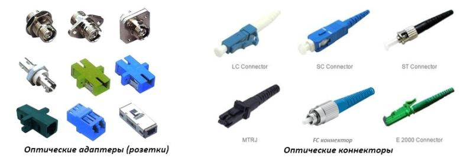

#### Сплиттеры (оптические разветвители)

> **Сплиттер** (оптический разветвитель) — пассивный компонент для разделения оптического сигнала на несколько выходов.

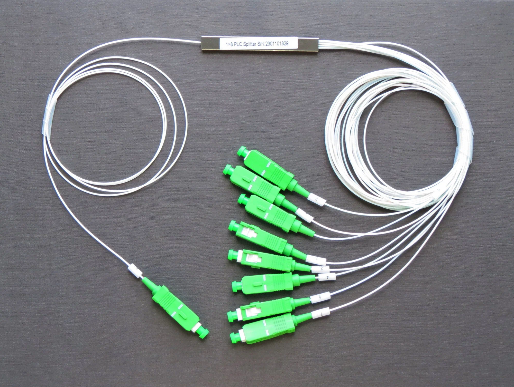

Сплиттеры широко применяются в сетях PON, в том числе по технологии GPON.

> **GPON** (Gigabit-capable Passive Optical Network) — стандарт пассивных оптических сетей, обеспечивающий скорость передачи до 2,5 Гбит/с в направлении к абоненту.

### Активное кроссовое оборудование

> **Активное оптическое оборудование** — <mark><strong>оборудование, требующее электропитания и выполняющее функции преобразования, усиления, коммутации и маршрутизации оптических сигналов.</strong></mark>

#### Оптические трансиверы (SFP-модули)

> **SFP-модуль** (Small Form-factor Pluggable) — <mark><strong>оптический приёмопередатчик, преобразующий электрический сигнал в оптический и обратно.</strong></mark>

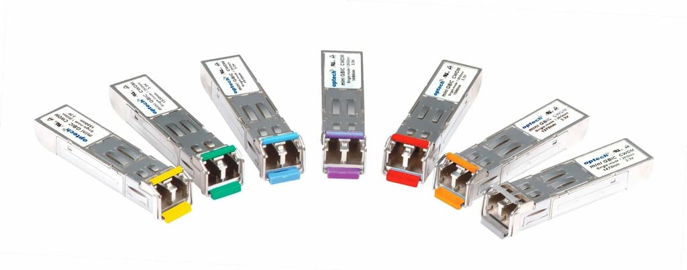

<mark><strong>SFP-модули устанавливаются в порты коммутаторов, маршрутизаторов и другого сетевого оборудования.</strong></mark> Стандартные SFP-модули обеспечивают скорость до 1,25 Гбит/с, а модули SFP+ — до 10 Гбит/с. При выборе трансивера важно учитывать длину волны, максимальную дальность передачи, тип разъёма, оптический бюджет и допустимые температурные условия эксплуатации.

> **Оптический бюджет** — разность между выходной мощностью передатчика и чувствительностью приёмника; определяет максимально допустимые потери в оптическом тракте.

#### Медиаконвертеры

> **Медиаконвертер** —<mark><strong> устройство, преобразующее сигнал из электрического (передаваемого по медной витой паре) в оптический и наоборот.</strong></mark>

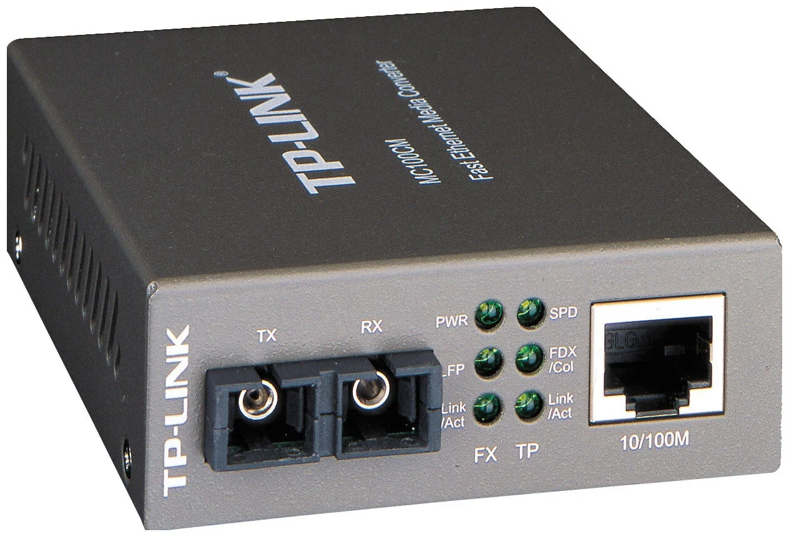

Медиаконвертеры <mark><strong>позволяют увеличить протяжённость сети за пределы ограничений, накладываемых медными кабелями, и эффективно интегрировать оптоволокно в существующие инфраструктуры на основе Ethernet.</strong></mark>

#### Оптические коммутаторы и маршрутизаторы

> **Оптический коммутатор** — устройство с оптическими портами, обеспечивающее коммутацию пакетов данных на высокой скорости.


Коммутаторы с оптическими портами являются основой активных сетевых узлов. В крупных сетях также применяются мультиплексоры для уплотнения нескольких оптических сигналов в одном волокне (технологии CWDM и DWDM).

> **CWDM** (Coarse Wavelength Division Multiplexing) — грубое волновое мультиплексирование; технология уплотнения до 18 каналов с шагом 20 нм.

> **DWDM** (Dense Wavelength Division Multiplexing) — плотное волновое мультиплексирование; технология уплотнения десятков и сотен каналов с малым шагом.

#### Оптические усилители и регенераторы

> **Оптический усилитель** — устройство, увеличивающее мощность оптического сигнала без преобразования его в электрическую форму.

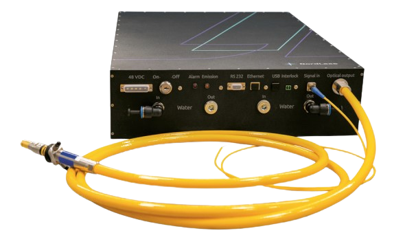

> **Регенератор** — устройство, восстанавливающее первоначальную форму импульсного сигнала, подвергшегося искажениям при передаче на большие расстояния.

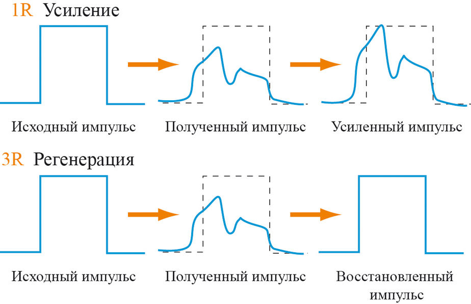

### Монтажное оборудование для оптоволокна

> **Монтажное оборудование** — <mark><strong>специализированный инструмент для прокладки, сращивания и оконцовки оптических кабелей.</strong></mark>

В том числе:

- Сварочные аппараты для оптоволокна.


- Скалыватели оптического волокна.

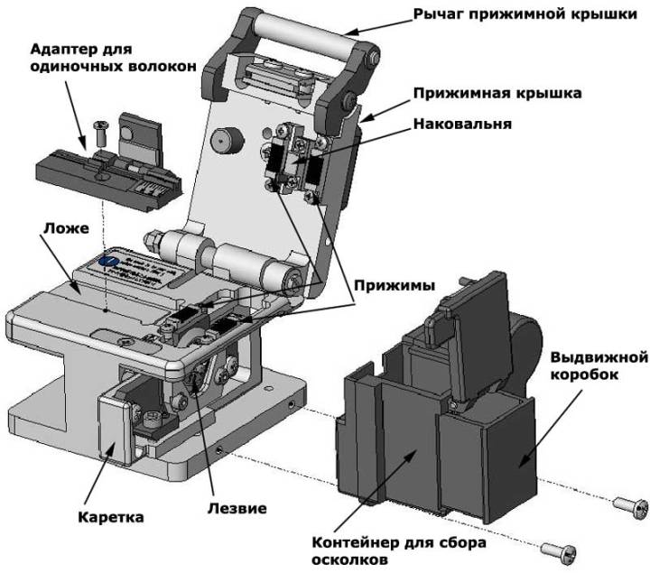

- Визуальные локаторы повреждений (VFL).

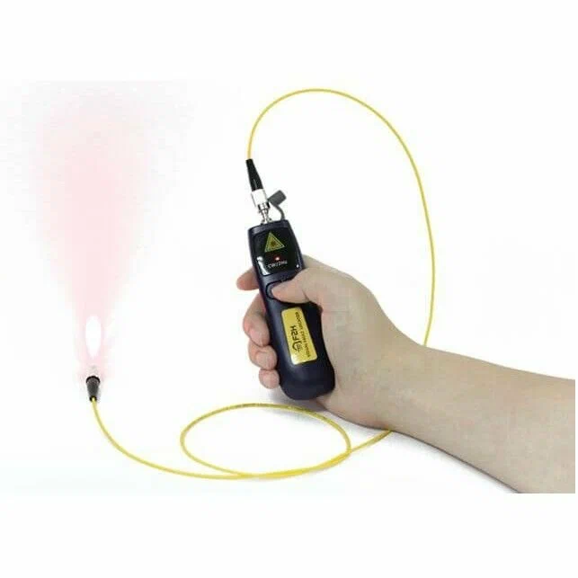

> **VFL** (Visual Fault Locator) — визуальный локатор повреждений; прибор, излучающий видимый свет (обычно 650 нм) для обнаружения дефектов и изгибов волокна.

- Инструменты для зачистки и обработки.


### Измерительное и диагностическое оборудование

Контроль качества — неотъемлемая часть строительства и эксплуатации ВОЛС. Для этого применяется целый ряд измерительных приборов:

- Оптические рефлектометры (OTDR).


- Измерители оптической мощности (OPM).

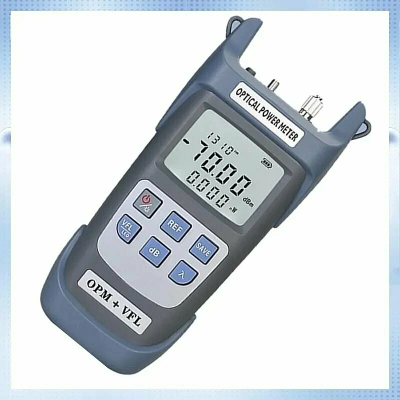

- Тестеры потерь и источники света.
- Микроскопы для коннекторов.

> **OPM** (Optical Power Meter) — измеритель оптической мощности; прибор для измерения уровня мощности оптического сигнала.

### Дополнительное оборудование и комплектующие

Помимо перечисленных категорий, при строительстве ВОЛС применяются: анкерные зажимы и крепёжные элементы, защитные гильзы (КДЗС), оптические аттенюаторы, органайзеры и системы управления кабелями.

> **КДЗС** — комплект деталей для защиты сварного соединения; термоусаживаемая гильза с силиконовой вставкой.

> **Оптический аттенюатор** — устройство, уменьшающее амплитуду или мощность сигнала без существенного искажения его формы.

## Резерв оптоволоконного кабеля и свободные волокна

Установщик может заранее проинформировать инвестора/заказчика о том, что некоторые <mark><strong>запасные отрезки кабеля и несколько дополнительных волокон в каждом кабеле могут решить многие проблемы в будущем.</strong></mark> <mark><strong>Для одного канала точка-точка требуется два волокна, а при использовании технологии WDM — одно волокно.</strong></mark>

> **WDM** (Wavelength Division Multiplexing) — волновое мультиплексирование; технология передачи нескольких сигналов по одному волокну на разных длинах волн.

<mark><strong>Когда, например, нужно четыре волокна, разумнее использовать 8-волоконный кабель</strong></mark>, чем «минимальный» четырёхволоконный (популярные оптические кабели обычно имеют 2, 4, 8, 16, 24 … волокна). Волоконно-оптические кабели дешевы, но стоимость повторной установки может быть высокой, и её следует избегать, поэтому гораздо лучше иметь запасные волокна для будущих нужд или просто в качестве резервного на случай выхода из строя одного волокна.

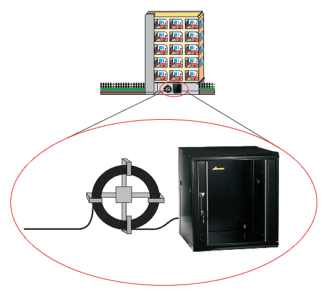

Рис. 1 — Оставленный запас кабеля. Дополнительная длина кабеля хранится в запасной стойке (или боксе) для хранения кабеля, закреплённой на стене.

<mark><strong>Настоятельно рекомендуется оставить дополнительную длину оптоволоконного кабеля на запасной стойке — обычно около 10 метров или около того. Дополнительное затухание незначительно по сравнению с затуханием, вызываемым сращиваниями и соединениями.</strong></mark> В будущем резерв кабеля может решить проблемы, вызванные неожиданными ситуациями (новое расположение сервера, необходимость изменить путь кабеля и т. д.). Имея запас кабеля, установщик может вносить изменения без дополнительных затрат, которые потребуются в случае прокладки нового кабеля.

## Зачистка волоконно-оптического кабеля

Защитные слои оптических кабелей могут быть сняты с помощью обычных инструментов, таких как ножи, кусачки, приспособления для снятия изоляции. Конечно, установщик должен внимательно следить за оголёнными волокнами. Весь кабель с оболочкой и защитными покрытиями необходимо вставить в патч-панель или бокс и прикрепить к ней — использовать для этого извлечённые волокна нельзя.

Типовые конструкции:

- Внутренний кабель — оболочка LSZH, волокна в буферах 0,9 мм.
- Универсальный кабель — гелевая центральная трубка, оболочка LSZH, волокна 0,25 мм.
- Внешний кабель — центральная труба, заполненная тугелем, оболочка из ЛПЭНП, волокна 0,25 мм.

> **LSZH** (Low Smoke Zero Halogen) — материал оболочки, не выделяющий галогенов и мало дыма при горении.

> **ЛПЭНП** — линейный полиэтилен низкой плотности; материал наружной оболочки кабеля.

> **Тугель** — гидрофобный гель, заполняющий центральную трубку кабеля для защиты от влаги.

Если это наружный кабель с гелем внутри, необходимо очистить волокна изопропиловым спиртом от защитного геля перед тем, как вставить конец кабеля в коробку. В случае кабелей, армированных арамидной нитью, её необходимо удалить. Для этой операции требуются специальные ножницы для резки кевлара. Эти специально сконструированные инструменты с лезвиями из закалённого материала обеспечивают хорошие результаты и долговечны. Использование обычных ножей или ножниц в большинстве случаев не даст желаемого эффекта и может быть опасным для оптических волокон (в основном из-за дополнительной силы, необходимой для отделения пряжи). Конструкция лезвий ножниц для кевлара — специальные зубчики позволяют разрезать твёрдые и прочные арамидные волокна.

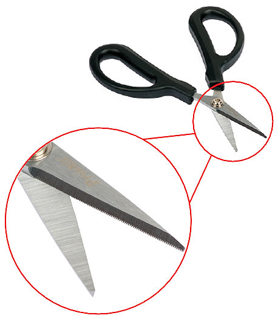

> **Арамидная нить** (кевлар) — высокопрочное синтетическое волокно, используемое для упрочнения оптического кабеля.

## Подготовка оптоволокна к сварке

Этот этап работы самый сложный. Рабочее место должно содержаться в чистоте, а установщик, оснащённый необходимыми инструментами, должен использовать их точно и эффективно.

### Первый шаг — подготовка конца волокна

Извлечённые волокна обычно имеют диаметр 0,9 мм (900 мкм) или 0,25 мм (250 мкм). Они состоят из нескольких слоёв (от центра): сердцевина, оболочка, буфер, защитное покрытие.

> **Сердцевина** — центральная часть волокна, по которой распространяется оптическое излучение.

> **Оболочка** — слой вокруг сердцевины с меньшим показателем преломления, обеспечивающий полное внутреннее отражение.

> **Буфер** — защитный слой вокруг оболочки, предохраняющий волокно от механических повреждений.

В зависимости от типа волокна диаметр сердцевины составляет 62,5/50 мкм (многомодовый) или 9 мкм (одномодовый). Оболочка имеет диаметр 125 мкм и буфер 250 мкм. Это новейшее покрытие для гелевых кабелей, окрашенное в соответствии со стандартом GB13993.3-2001. В случае других кабелей защитное покрытие обычно имеет толщину 0,9 мм и имеет соответствующий цвет. Волокна этого типа используются в распределительных кабелях.

Инструмент для снятия защитных слоёв называется стриппер.

> **Стриппер** — инструмент для снятия буферного и защитного слоёв оптического волокна.


Стриппер используется для снятия буферного и защитного слоёв перед скалыванием. Независимо от метода сварки/соединения конечная толщина волокна должна составлять 125 микрометров как в случае одномодовых, так и в случае многомодовых волокон. Итак, лучший выбор — универсальный инструмент, способный снимать лишние слои с волокон разного диаметра. Стриппер имеет три отверстия:

- Первое снимает буферное покрытие 250 мкм с оптического волокна 125 мкм.
- Второе отверстие снимает буферное покрытие толщиной 900 мкм до покрытия толщиной 250 мкм.
- Третье отверстие используется для снятия оболочки толщиной 2–3 мм до буферного покрытия 900 мкм.

Длину отрезанного 125 мкм волокна следует выбирать в зависимости от метода сварки и типа скалывателя.

### Второй этап — очистка волокна

После подготовки конца волокна необходимо очистить его от грязи и пыли, оставшихся после снятых покрытий. Для этого настоятельно рекомендуется использовать изопропиловый спирт (IPA). Этиловый спирт оставит отложения. То же касается и салфеток — они должны быть безворсовые. Очиститель на основе растворителя IPA и безворсовые салфетки также используются для очистки лицевой поверхности наконечника после полировки.

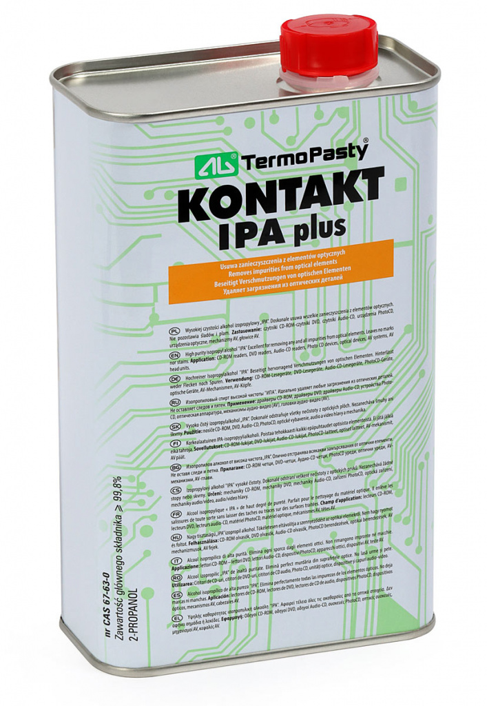

<mark><strong>Волокно следует очистить перед скалыванием</strong></mark>, ни в коем случае не в обратном порядке! Грязь со стороны волокна перемещается к его концу, поэтому сначала нужно очистить волокно, а затем разрезать его. Обратный порядок может привести к тому, что на конце волокна останется немного грязи и значительно ухудшатся параметры сварки.

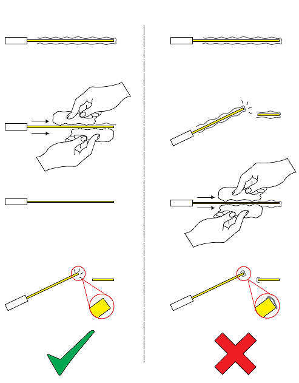

> **IPA** (изопропиловый спирт) — растворитель, используемый для очистки оптических волокон и коннекторов.

### Третий этап — скалывание волокон

Правильно подготовленное и очищенное волокно можно расколоть. Для этого были разработаны специальные точные скалыватели.

> **Скалыватель** — инструмент для получения ровного перпендикулярного скола оптического волокна.

Раскол — самый важный шаг для обеспечения качественной сварки и низкого затухания соединения. Есть огромное количество разных моделей, включая как обычные ручные скалыватели, так и высокоточные скалыватели волокон. Сейчас наиболее популярным является всё же второй вариант.

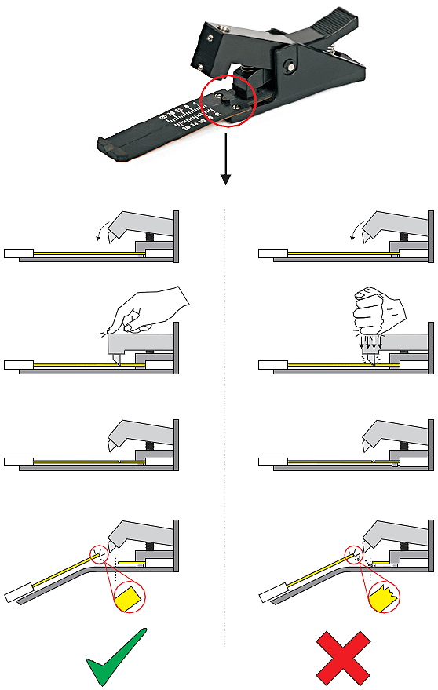

|   |   | 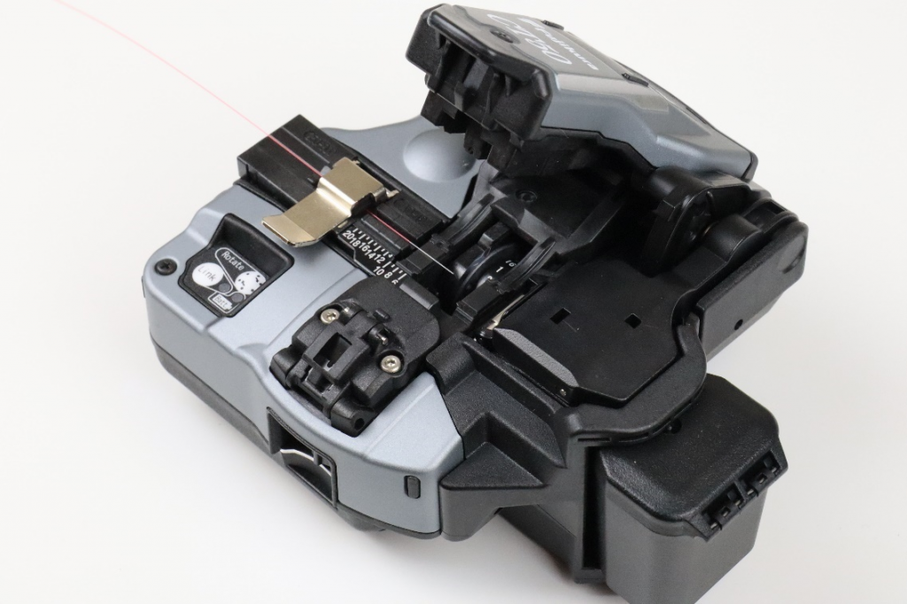  |
|---|---|---|


## Сварка волокон

Правильно подготовленные концы волокон можно сращивать различными способами: <mark><strong>сращивание оплавлением, механическое сращивание, склеивание и полировка.</strong></mark>

> **Сварка оплавлением** — метод соединения волокон, при котором концы сплавляются электрической дугой на специальном сварочном аппарате.

> **Механическая сварка** — метод соединения волокон с использованием специальных пластиковых футляров для позиционирования концов волокон.

<mark><strong>Сращивание дуговой сваркой</strong></mark> производится на специальных сварочных аппаратах, которые сплавляют концы волокон вместе с помощью электрической дуги. Этот метод обеспечивает наилучшие результаты, но оборудование может быть слишком дорогим для небольших монтажных компаний и индивидуальных установщиков. 

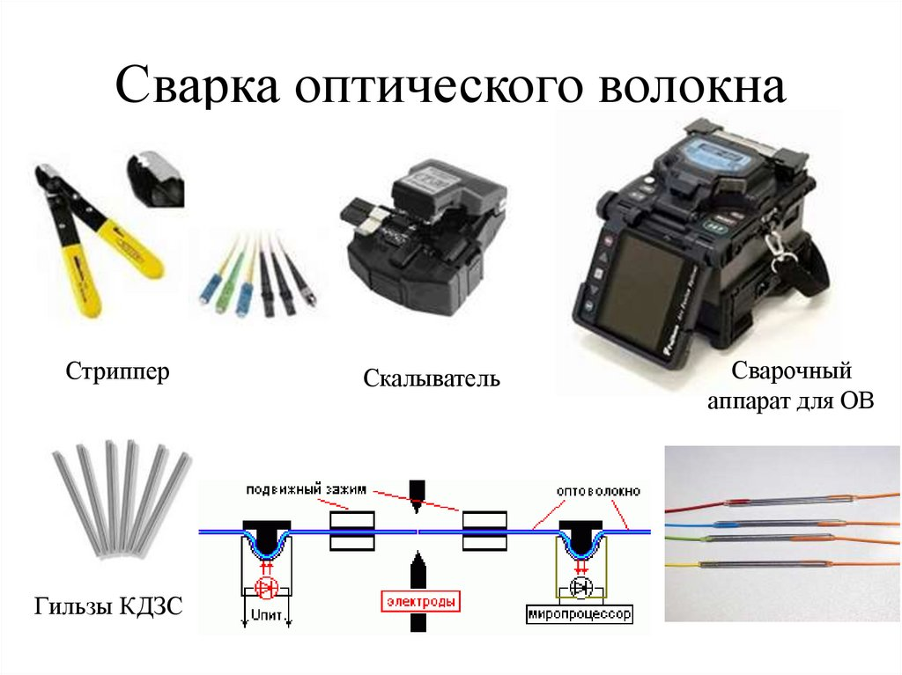

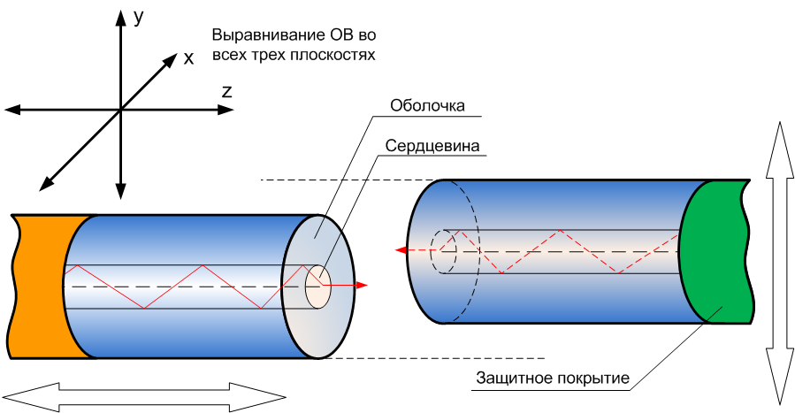

<mark><strong>Механическая сварка</strong></mark> выполняется с использованием специальных пластиковых футляров для позиционирования концов волокон. Оптический гель, который также используется в устройствах, снижает эффект неточных разрезов и возможный зазор между торцами волокон. Такой метод не может похвастаться такими же результатами, как оптоволоконный сварочный аппарат, и в наше время используется достаточно редко.

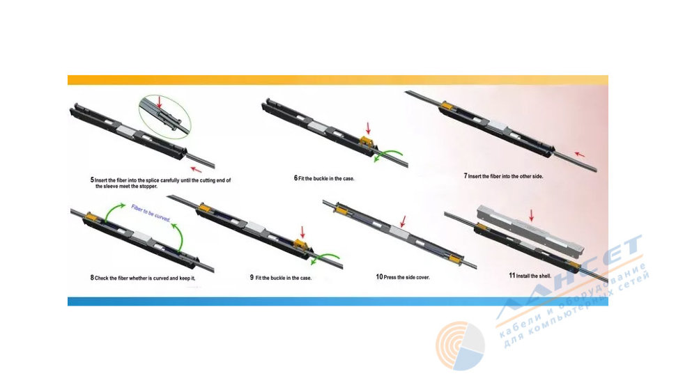

В каждом методе длина оголённого волокна должна соответствовать техническим характеристикам сварочного аппарата или механического сварочного аппарата. В противном случае соединение может вызвать значительное затухание, которое уменьшит дальность связи или даже сделает передачу данных невозможной.

Сращивания волокон являются хрупкими, поэтому их необходимо надлежащим образом защищать. <mark><strong>По окончании сварки место стыка следует защитить термоусаживающейся гильзой.</strong></mark> Лучше всего поместить волокна в специальные боксы. В большинстве распространённых монтажных боксов нет специальных отсеков для стыков, но внутри них легко установить дополнительные кассеты, предназначенные для этого.

<mark><strong>Используя механические соединения, установщик может проверить качество соединений на основании «утечек» света.</strong></mark> Например, источник излучения MT3111m предназначен для тестирования одномодовых и многомодовых оптоволоконных кабелей и соединений с наконечниками 2,5 мм. Он излучает видимый свет (650 нм), а его выходная мощность достаточна для проверки даже 5-километровых линий связи. Используя визуальный локатор неисправностей, установщик может обнаружить типичные проблемы, которые обычно не видны. Механические дефекты часто обнаруживаются на концах волокон и являются результатом неправильного обращения с кабелем во время установки.

Основные проблемы сварки:

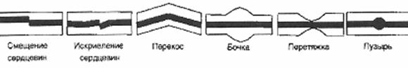

## Измерения затухания в оптоволокне

<mark><strong>По завершении оптической системы установщик должен измерить затухание в оптических соединениях.</strong></mark> Измерения потерь оптической мощности в оптоволоконных сетях, выполняемые с помощью измерителей оптической мощности, возможны только в том случае, если источник света откалиброван и стабилен.

<mark><strong>Недопустимо измерять затухание на оптическом пути с использованием активных устройств, таких как модули SFP, медиаконвертеры и т. д. Недостаточная точность и стабильность источников света, встроенных в эти устройства, не позволяет проводить надёжные измерения</strong></mark>, а погрешность может достигать 1 дБ или около того.

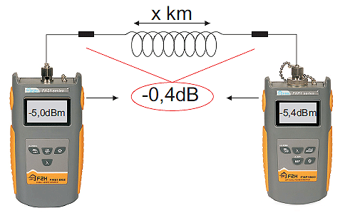

Пример расчёта: кабель длиной $x$ км, два сращивания и два пигтейла с разъёмами — общее затухание 0,4 дБ.

На приведённой выше диаграмме показана типовая конфигурация измерения с оптическим лазерным источником GRANDWAY и измерителем оптической мощности. Любые измерения следует проводить в том же окне передачи, которое будет использоваться в оптической системе.

Измерения затухания на оптических путях в первую очередь позволяют проверить качество монтажных работ. Но это не единственная причина для снятия мерок. С практической точки зрения знание затухания на оптических путях может быть необходимо для определения необходимости использования оптических аттенюаторов.

Активные волоконно-оптические устройства характеризуются двумя основными параметрами: выходной мощностью передатчика и чувствительностью приёмника (в случае приемопередатчиков WDM одно устройство одновременно является передатчиком и приёмником). В случае коротких линий связи (например, в зданиях) устройства с высокой выходной мощностью могут перегрузить или даже разрушить приёмное оборудование. Точное измерение затухания в оптическом тракте позволяет установщику предсказать, следует ли и какой тип аттенюатора использовать в данном случае.

Формула оптического бюджета:

$$
P_{\text{пр}} = P_{\text{пер}} - A_{\text{тракт}}
$$

где $P_{\text{пр}}$ — мощность на приёмнике, $P_{\text{пер}}$ — выходная мощность передатчика, $A_{\text{тракт}}$ — суммарные потери в тракте.

Условие нормальной работы:

$$
P_{\text{пр}} \geq S_{\text{пр}}
$$

где $S_{\text{пр}}$ — чувствительность приёмника.

## Как выбрать оборудование для оптоволокна?

При выборе оборудования для оптоволоконной сети рекомендуется учитывать несколько ключевых факторов:

- **Масштаб проекта** — для небольшого офиса потребуется минимальный набор, тогда как для магистральной линии или ЦОД — комплексные решения высокой плотности.
- **Тип сети** — одномодовое или многомодовое волокно определяет выбор кабелей, трансиверов и измерительного оборудования.
- **Условия эксплуатации** — для наружной прокладки необходимы муфты и кабели с соответствующей степенью защиты, устойчивые к перепадам температур и механическим нагрузкам.
- **Стандарты и совместимость** — оборудование должно соответствовать отраслевым стандартам (TIA-568, ISO/IEC 11801 и др.).
- **Надёжность производителя** — предпочтение стоит отдавать проверенным брендам с хорошей репутацией на рынке.

## В заключение

В этой статье описаны основы, которые должен знать каждый, кто собирается работать с оптоволокном, а также рассмотрено основное оборудование, которое может понадобиться. Оборудование для оптоволокна представляет собой обширную и взаимосвязанную систему компонентов — от пассивных соединительных элементов до сложных измерительных приборов и активного сетевого оборудования. Правильный подбор и качественный монтаж каждого элемента гарантируют надёжную и долговечную работу волоконно-оптической линии связи.

Сращивание оптоволокна — неизбежное занятие в любой оптоволоконной установке. Выбор правильного метода сварки не только сэкономит вам деньги, но и повысит эффективность вашего бизнеса. И не забудьте проверить волокно на затухание после завершения сварки. Волоконно-оптические кабели — дело хрупкое. Одно плохое сращивание — всё, что нужно, чтобы свести к минимуму производительность вашего оптоволоконного кабеля, поэтому будьте осторожны с этим процессом и придерживайтесь основных правил.

Помочь с выбором вам могут менеджеры компании «СТЭЛС». Приобрести оборудование можно как в оффлайн-магазине, так и онлайн на сайте stels.market.

Источник: https://lanmarket.ua/stats/rabota-s-opticheskimi-voloknami-vvedenie-dlya-nachinayushchikh/. Сайт lanmarket.ua

## FAQ

**Что такое ВОЛС?**
Волоконно-оптическая линия связи — совокупность оптических кабелей и компонентов для передачи информации посредством оптического излучения.

**Чем одномодовое волокно отличается от многомодового?**
Одномодовое имеет сердцевину 9 мкм и применяется на больших расстояниях; многомодовое — 50 или 62,5 мкм и используется в локальных сетях.

**Какое волокно выбрать для FTTH?**
Рекомендуется G.657A2 с минимальным радиусом изгиба 7,5 мм.

**Почему нельзя измерять затухание через SFP-модуль?**
Встроенные источники света SFP не обладают достаточной точностью и стабильностью; погрешность может достигать 1 дБ.

**Зачем нужен запас кабеля?**
Он позволяет вносить изменения в сеть без дополнительных затрат и служит резервом на случай выхода из строя волокна.

**Каким спиртом очищать волокно?**
Изопропиловым (IPA); этиловый спирт оставляет отложения.

**Что делать после сварки волокон?**
Защитить место стыка термоусаживаемой гильзой (КДЗС) и проверить затухание.