# Проектирование ВОЛС для видеонаблюдения

## Введение

> **ВОЛС (волоконно-оптическая линия связи)** —<mark><strong> линия передачи данных, в которой носителем сигнала является свет, распространяющийся по оптическому волокну.</strong></mark>

Тема проектирования ВОЛС затрагивалась в различных материалах и статьях, посвящённых проектированию ЛВС, СКС, периметральных систем видеонаблюдения и другому. Однако вопросов относительно проектирования ВОЛС для видеонаблюдения меньше не становится. Основной пул вопросов: как выбрать тип кабеля, что такое класс волокна, какие разъёмы использовать в уличном шкафу, что такое оптический кросс, оптический бюджет и т.д.

> **ЛВС (локальная вычислительная сеть)** — <mark><strong>сеть, объединяющая вычислительные устройства в пределах ограниченной территории.</strong></mark>

> **СКС (структурированная кабельная система)** — <mark><strong>универсальная кабельная система здания или комплекса зданий, предназначенная для передачи различных сигналов.</strong></mark>

В этом материале сделан упор на практику. Информации на тему построения ВОЛС в интернете большое количество, поэтому здесь мы не повторяем физические основы передачи данных по оптоволокну, а концентрируемся на методике проектирования — с чего начинать, что и в какой последовательности выбирать, какие расчёты необходимо выполнить. Попутно мы ответим на типовые вопросы.

**Обратить внимание.** Мы исходим из того, что читатель — специалист-проектировщик, который имеет общее представление о компонентах ВОЛС, знаком с профессиональной терминологией, общепринятыми сокращениями, разбирается в топологиях сетей (звезда, кольцо).

---

## 1. Место ВОЛС в проектах видеонаблюдения

Если вы читаете эту статью, то, скорее всего, необходимость применения волоконно-оптических линий связи у вас уже сформировалась. Однако не лишним будет проговорить основные задачи, которые решает применение ВОЛС в системах видеонаблюдения.

### 1.1. Расстояние между узлами превышает 100 м

<mark><strong>Если расстояние между сетевыми узлами превышает 100 м, это первое показание к использованию ВОЛС для соединения узлов.</strong></mark> Наиболее яркий тому пример — узлы для систем видеонаблюдения на периметре, где расстояния могут исчисляться километрами.

### 1.2. Гальваническая изоляция

> **Гальваническая изоляция** — <mark><strong>исключение электрического контакта между двумя цепями при сохранении передачи сигнала.</strong></mark>

Передача данных в ВОЛС осуществляется через стеклянное волокно, являющееся отличным изолятором. Если узлы расположены в разных зданиях, то использование оптики позволит избежать проблем с разностью потенциалов заземления. В дополнение к этому кабели ВОЛС могут быть полностью диэлектрическими, что позволяет избежать части проблем, связанных с атмосферным электричеством, которые могут быть на медных линиях.

### 1.3. Устойчивость к ЭМ излучению

> **ЭМ излучение (электромагнитное излучение)** — <mark><strong>распространяющееся в пространстве возмущение электромагнитного поля.</strong></mark>

<mark><strong>Оптика невосприимчива к электромагнитному излучению. Если на объекте есть какие-то энергетические или электропередающие мощные устройства, то оптика позволит снять угрозу помех и наводок.</strong></mark>

Существуют и другие способы решения части указанных выше задач, такие как использование специальных модемов для медных кабелей и использование радиоканала. Все эти способы больше подходят для особых ситуаций, когда кабельная инфраструктура уже имеется и прокладка новых линий может быть неоправданно дорогой либо когда проложить никакие кабельные линии невозможно — не позволяют особенности ландшафта либо иные причины. Если же ситуация стандартная, никаких особенностей нет, вы проектируете систему с нуля, то ВОЛС — наиболее разумный и надёжный способ соединения удалённых узлов локальной сети.

---

## 2. Алгоритм проектирования ВОЛС

В общем случае это чёткая и простая последовательность действий, когда мы идём от имеющихся у нас данных и на каждом шаге получаем новые сведения, двигаясь дальше.

Краткая последовательность действий: зная расстояние и скорость передачи данных, мы определяем стандарт (протокол связи), затем определяем тип и класс волокна согласно выбранному стандарту, далее составляем схему ВОЛС и выбираем компоненты согласно выбранному типу, классу волокна и условиям эксплуатации компонентов (улица, помещение и т.п.), далее рассчитываем затухания согласно требованиям стандартов и документации на компоненты и в финале документируем в проекте.

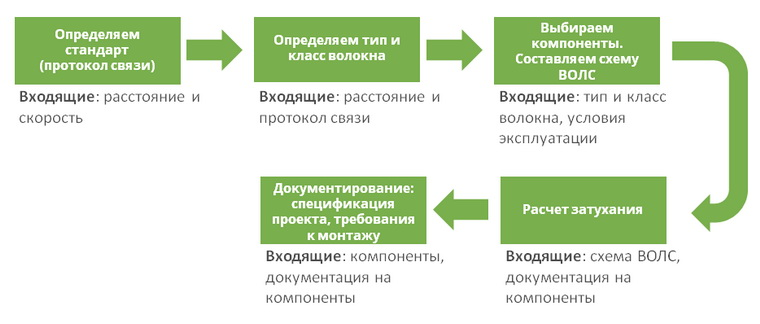

Рассмотрим все этапы подробно. И начнём с выбора стандарта (протокола связи).

---

## 3. Выбор стандарта ВОЛС (протокола связи)

<mark><strong>На момент выбора стандарта мы знаем длину линии и скорость передачи данных.</strong></mark>

> **Протокол связи** — набор правил и стандартов, определяющих формат и порядок передачи данных между устройствами.

Набор стандартов ВОЛС приведён и описан в международных стандартах. На текущий момент последняя версия стандарта — ISO/IEC 11801 2017. Это набор документов в части построения СКС для ЦОД, домашних сетей, индустриальных сетей, стандартов на тестирование.

> **ЦОД (центр обработки данных)** — специализированное здание или помещение для размещения серверного и сетевого оборудования.

Изучение стандартов — вещь увлекательная, но нас интересуют конкретные указания для выбора стандартов передачи в ВОЛС. Для этих целей в стандарте на СКС приведены таблицы.

**Выбор стандарта ВОЛС в зависимости от длины линии и скорости для многомодового оптоволокна**

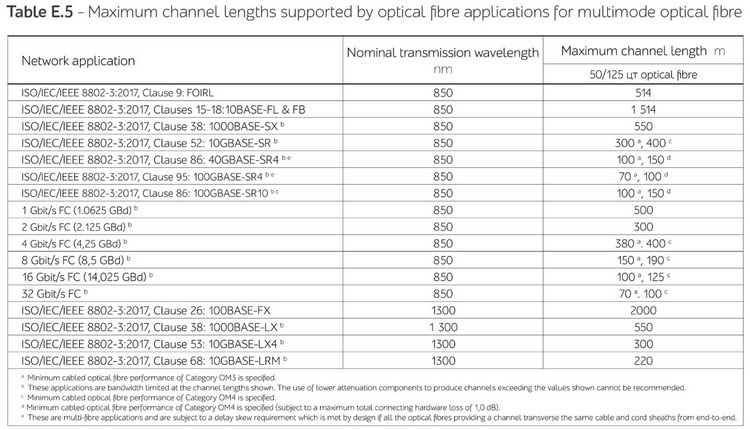

**Выбор стандарта ВОЛС в зависимости от длины линии и скорости для одномодового оптоволокна**

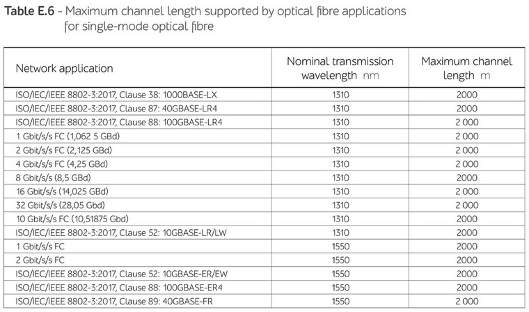

<mark><strong>В таблицах мы видим соответствие длины линии и скорости.</strong></mark> К примеру: 1000BASE-SX позволяет обеспечить передачу на скорости 1000 Мбит/с на расстоянии до 550 м.

**Внимание.** Группа документов по стандарту ISO/IEC 11801 2017 распространяется на платной основе. Компания Видеомакс не вправе распространять документы стандарта, в связи с этим в настоящей статье приведены только выдержки из стандарта ISO/IEC 11801 2017 в виде таблиц для практического применения.

### Типовые вопросы раздела

**Здесь столько одинаковых по скорости и расстоянию стандартов — какой мне выбрать?**

<mark><strong>Если смотреть напрямую на пару «Скорость — Расстояние», то можно найти схожие, однако они будут отличаться, к примеру, длиной волны</strong></mark> (1000BASE-SX — 850 нм, 1000BASE-LX — 1300 нм). Но <mark><strong>какой всё же выбрать? Здесь рекомендация простая: посмотрите, какие протоколы поддерживаются в выбранном активном оборудовании.</strong></mark> В большинстве случаев вам будет доступен ограниченный набор протоколов, реализованных в SFP-модулях выбранного вендора.

> **SFP-модуль (Small Form-factor Pluggable)** — компактный сменный приёмопередатчик, устанавливаемый в сетевое оборудование для подключения оптического или медного кабеля.

**В таблицах характеристик вендора — производителя SFP-модулей указаны иные значения длин. Чему верить — стандарту или вендору?**

Наше мнение, что правильно ориентироваться на данные стандартов. В этом случае на участке ВОЛС, спроектированном в соответствии со стандартом, будет гарантированно работать активное оборудование любого вендора, заявляющего соответствие стандарту.

**Что выбрать — многомодовое или одномодовое волокно?**

Именно в таком ключе вопрос ставить некорректно. <mark><strong>Если длина участка оптоволоконной линии укладывается в Multimode (MM), требуемая скорость передачи данных обеспечивается одним из стандартов MM, выбранный вендор имеет в перечне SFP с соответствующим протоколом MM, то применение Single-mode (SM) неоправданно ничем.</strong></mark> <mark><strong>Использование SM всегда дороже, чем MM.</strong></mark>

Выбрав стандарт, можно выбрать тип и класс волокна.

---

## 4. Выбор типа и класса волокна

Для начала устраним путаницу в терминологии, которую мы наблюдаем. А именно: тип и класс волокна.

> **Тип волокна** — <mark><strong>категория оптического волокна, определяемая количеством путей распространения света:</strong></mark> многомодовое (Multimode, MM) и одномодовое (Single-mode, SM).

> **Класс волокна** — <mark><strong>характеристика оптического волокна, определяющая его пропускную способность и максимальную дальность передачи:</strong></mark> OM1–OM5 для многомодового, OS1–OS2 для одномодового.

**Тип волокна.** Всего существует два типа волокна: многомодовое и одномодовое, или Multimode (MM) и Single-mode (SM).

Не вдаваясь в физику процессов, скажем просто: <mark><strong>многомодовое волокно и все компоненты значительно дешевле, и сварка менее требовательна к качеству. Однако расстояния передачи данных у многомодового волокна ограничены и не превышают 2000 м для 100 Мбит/с (100BASE-FX) и 550 м для 1000 Мбит/с (1000BASE-SX).</strong></mark> Одномодовое волокно позволяет обеспечить высокоскоростную передачу данных на расстояния до нескольких десятков километров без репитеров.

> **Репитер (повторитель)** — устройство, усиливающее и восстанавливающее сигнал для увеличения дальности передачи.

Конструктивно <mark><strong>многомодовое и одномодовое волокна отличаются диаметром сердцевины.</strong></mark>

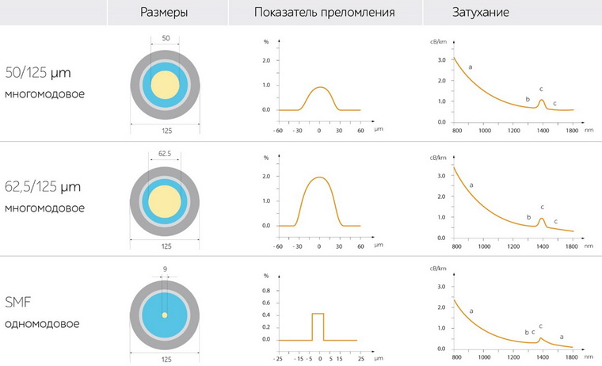

**Конструкция многомодового и одномодового волокна**

Этой информации вполне достаточно для задач проектирования ВОЛС: мы понимаем характеристики MM и SM относительно расстояния передачи данных и можем легко отличить их конструктивно: 50/125 мкм — многомодовое волокно, 9/125 мкм — одномодовое волокно. И не забываем, что для Multimode всё значительно дешевле.

**Класс волокна.** Снова не будем вдаваться в физику и скажем, что <mark><strong>чем выше класс волокна, тем выше допустимая скорость и расстояние, на которое можно передать данные.</strong></mark> Класс волокна обозначается как OM1–OM5 для многомодового волокна, и OS1, OS2 — для одномодового. Существуют и другие классы относительно стандартов TIA, но мы их рассматривать не будем ввиду их малой распространённости. Чем выше цифра, тем выше классом волокно: ОМ4 — волокно более высокого класса, чем ОМ3.

> **TIA (Telecommunications Industry Association)** — <mark><strong>ассоциация телекоммуникационной промышленности, разрабатывающая стандарты в области связи.</strong></mark>

<mark><strong>Выбор класса волокна в большинстве случаев определён стандартом, т.е. в рамках стандарта определено, на какое расстояние гарантируется передача данных при условии использования определённого класса волокна.</strong></mark>

Одно замечание относительно класса волокна: классы ОМ1 и ОМ2 не рекомендованы к использованию согласно указаниям ISO/IEC 11801 2017. Поэтому ориентируемся сразу на ОМ3 для многомодового волокна.

В итоге и тип, и класс волокна мы определяем исходя из выбранного стандарта (протокола связи). Наша задача упрощается до минимума — смотрим таблицы параметров стандартов и определяемся сразу со всеми необходимыми данными: максимальное расстояние передачи информации, скорость, тип волокна, класс волокна. Зная эти базовые параметры, переходим к проектированию линии связи.

---

## 5. Составляем схему ВОЛС. Выбираем компоненты

<mark><strong>В общем случае схема ВОЛС состоит из набора типовых компонентов; комбинируя и составляя их, решаются различные задачи.</strong></mark> Проще всего проиллюстрировать состав компонентов на типовой схеме соединения с уличным узлом.

**Типовая схема ВОЛС для подключения удалённого сетевого узла на улице**

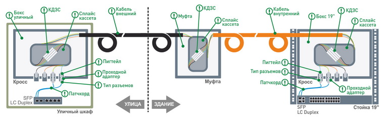

Пройдёмся по схеме: SFP-модуль, установленный в коммутаторе, соединяется патчкордом через проходной адаптер с пигтейлом. Волокно (хвостик) пигтейла сваривается с волокном в кабеле, и место сварки защищается КДЗС. Запасы волокна наматываются на сплайс-кассету. Сплайс-кассета, места сварки, пигтейлы, проходные адаптеры и ввод кабеля размещаются в боксе. Далее оптоволоконный кабель, проходя через границу «здание–улица», меняет свой тип согласно условиям эксплуатации через муфту. И далее в обратной последовательности кабель разделывается на кроссе, и волокна соединяются с другим активным оборудованием через SFP-модуль.

> **Патчкорд (коммутационный шнур)** — отрезок оптического кабеля с разъёмами на обоих концах для соединения активного оборудования с кроссом.

> **Пигтейл** — отрезок оптического волокна, разделанный с одной стороны на разъёме, а с другой — свободный конец для сварки с жилой кабеля.

> **Проходной адаптер** — устройство для соединения пигтейла с патчкордом, обеспечивающее физический контакт сердцевин волокон.

> **КДЗС (комплект деталей защиты сростка)** — набор из металлического стержня, клеевой трубки и термоусаживаемой трубки для защиты места сварки.

> **Сплайс-кассета** — элемент кросса для укладки и защиты сварных соединений оптических волокон.

> **Кросс** — место разделки и сварки жил оптического кабеля с волокнами от пигтейлов.

> **Муфта** — конструкция для сварки жил кабеля, смены типа кабеля, удлинения или ответвления.

**Все компоненты должны строго соответствовать выбранному типу и классу волокна.** Все компоненты в соединении двух активных устройств должны соответствовать определённому стандартом типу и классу. Считается, что если хоть один компонент в соединении используется классом ниже, то класс всей линии понижается до этого компонента. Скажем, если в многомодовой линии с классом ОМ4 применён патчкорд ОМ2, то класс всей линии принимается за ОМ2.

### 5.1. Кросс волоконно-оптической линии связи

Кросс ВОЛС, простым языком, это место разделки и сварки жил волоконно-оптического кабеля с волокнами от пигтейлов, установленных в проходные адаптеры.

**Состав оптического кросса**

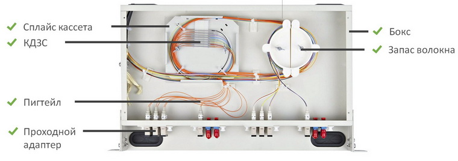

Бокс для кросса бывает настенный и для установки в 19-дюймовую стойку. Удобнее всего закладывать боксы со всем необходимым в комплекте: сплайс-кассетой, местом для размещения КДЗС, набором пластин под различные проходные адаптеры.

Проходные адаптеры предназначены для соединения пигтейла с патчкордом, где происходит физический контакт сердцевин волокон. Проходные адаптеры отличаются по типу разъёмов пигтейла и патчкорда, но чаще применяются проходные адаптеры, рассчитанные под одинаковый тип разъёма как пигтейла, так и патчкорда.

**Типы проходных адаптеров FC, SC и LC Duplex**

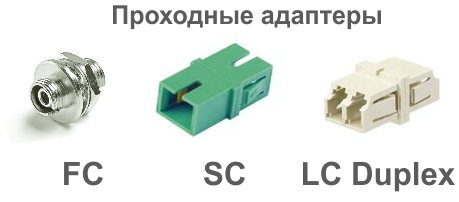

Проходной адаптер обеспечивает физический контакт сердцевин оптических волокон пигтейла и патчкорда.

Тип оптического разъёма выбирается исходя из указаний заказчика, предпочтений проектировщика и условий эксплуатации. Наибольшее распространение получили разъёмы FC, SC и LC.

**Типы оптических разъёмов FC, SC и LC**

Выбор типа оптического коннектора (разъёма) для оптического кросса не регламентируется и остаётся за заказчиком или проектировщиком.

- **Самое надёжное соединение — FC.** Это завинчивающееся соединение с уплотнительным резиновым кольцом. Его применяют при наличии вибраций, для герметизации места соединения при неблагоприятных внешних условиях, например в уличном кроссе.
- **Самое удобное соединение — SC.** Это крупный разъём, удобный для частых коммутаций.
- **Самое компактное соединение — LC.** Чаще всего это LC duplex — сдвоенный разъём LC. Именно такие разъёмы применяются в большинстве SFP-модулей. LC является де-факто стандартом для внутренних кроссов высокой плотности.

Тип полировки оптических коннекторов определяет способ физического контакта сердцевин волокон в соединении. Существует два основных типа полировки — плоский (на самом деле сферический) и под углом в 8–9 градусов. Плоский PC, SPC, UPC — самый простой и недорогой, обладает повышенными обратными отражениями. Разновидности полировки отличаются качеством и уровнем обратных отражений — минимальные отражения в UPC (-50 дБ), максимальные в PC (-30 дБ). Под углом APC — минимальные обратные отражения (-60 дБ), используется в одномодовых ВОЛС большой протяжённости.

**Виды полировок оптических коннекторов**

Всего существует два основных типа полировки — плоская (на самом деле сферическая) и под углом. Коннекторы с разными типами полировки не совместимы между собой!

Коннекторы с одним типом полировки, но разными по типам (PC, SPC, UPC) совместимы между собой и отличаются только качеством полировки.

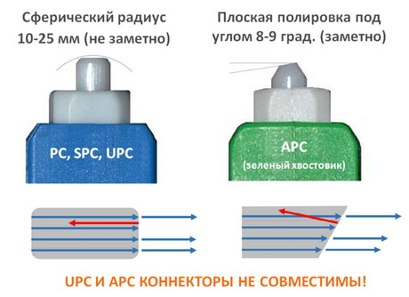

Для многомодового волокна определён один тип полировки — PC, т.к. волны (моды) распространяются в многомодовом волокне не по прямой, а путём многократных переотражений, и к месту соединения они могут подойти под разными углами, соответственно полировка под углом не приведёт к уменьшению обратного отражения. При проектировании одномодовых ВОЛС тип полировки существенен, т.к. распространение одной моды происходит строго по прямой вдоль волокна.

**Внимание.** Категорически запрещается использование разных типов полировок в одном соединении одномодового волокна — могут образовываться сколы волокна, а уровень потерь такого соединения может привести к полной неработоспособности соединения.

Пигтейл представляет собой метровый отрезок оптического волокна, разделанный с одной стороны на разъёме для установки в проходной адаптер, а с другой стороны — свободный конец, предназначенный для сварки с жилой волоконно-оптического кабеля.

**Пигтейл SC**

Пигтейл — это разъём с метровым «хвостом» оптического волокна для сварки с жилой волоконно-оптического кабеля.

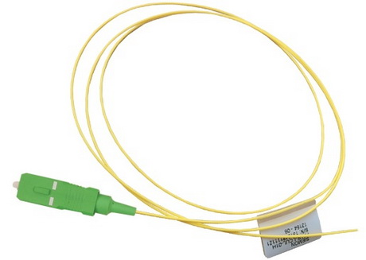

КДЗС — комплект деталей защиты сростка. Представляет собой комплект из трёх деталей: металлического стержня, клеевой трубки и термоусаживаемой трубки. При нагревании клеевая трубка полностью расплавляется, надёжно фиксируя место сварки. Стержень придаёт прочность всей конструкции, а термоусаживаемая трубка выдавливает воздух и превращает соединение в монолит.

Скорее всего, КДЗС у сварщиков имеются в достаточном количестве, но для порядка не лишним будет добавить эти материалы в спецификацию проекта. Комплекты бывают двух видов — длиной 40 и 60 мм. Наиболее распространены КДЗС 60 мм.

Патчкорд соединяет разъёмы активного оборудования (чаще всего SFP-модули) с разъёмами в кроссе. Существует огромное разнообразие патчкордов, отличающихся типом и классом кабеля, длиной, типами разъёмов с одной и с другой стороны. Вы наверняка сможете выбрать тот патчкорд, который обеспечит соединение вашего активного оборудования с выбранными вами разъёмами в кроссе. Рекомендуется выбирать патчкорд в самом конце, когда уже определены все компоненты кросса, места размещения кросса и активного сетевого оборудования.

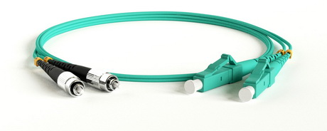

**Оптический патчкорд**

Оптический патчкорд рекомендуется выбирать в самом конце — когда скомпонован кросс и определены места установки кросса и активного оборудования ЛВС.

Компоновка сетевого узла ВОЛС на этом заканчивается. Выбор конкретных компонентов — рутинный процесс поиска нужной позиции в каталогах выбранного вендора — производителя СКС. Нередко мы встречаемся с тем, что специалисты, переходя в каталог компонентов и видя там тысячи разных позиций, испытывают сложности с выбором и даже некий страх выбора чего-то неправильного и неподходящего. Чаще всего проблемы с выбором возникают тогда, когда с одним из параметров специалист не определился. Например: мы знаем тип и класс волокна, начинаем выбирать пигтейл, и поиск по каталогу выдаёт с десяток разных пигтейлов, отличающихся разъёмами. Всё верно — нужно было заранее определиться с типом разъёма! И так далее.

**Позиций в каталоге тысячи, а я один :(**
Позиций в каталогах вендоров СКС огромное количество, но это не значит, что производитель над вами издевается и заставляет делать мучительный выбор. Нет! Зная конкретные параметры, вы просто выбираете то, что нужно вам, и это будет ОДНА позиция.

В качестве иллюстрации алгоритма проектирования ВОЛС для видеонаблюдения специалистами компании Видеомакс подготовлено справочное пособие, где приведён пример выбора компонентов и проведены расчёты на реальной задаче. Ознакомиться со справочным пособием можно здесь >>>.

### 5.2. Оставляйте запас волокон

Кабель на 4 или 8 волокон стоит практически одинаково, а вот если понадобится расширить систему, если обнаружится брак или разрушение волокна в процессе эксплуатации, проложить дополнительный кабель может быть дорого или даже невозможно. Запас можно оставлять в виде неразделанных жил. Однако при аварии необходимо будет осуществить сварку жил, что потребует и времени, и ресурсов. Если оставлять запас в виде «тёмных волокон» (ещё называемых «холодным» резервом), уже разделанных в кроссе на пигтейлы, то в случае аварии можно легко переключиться на проверенные и исправные линии и обеспечить возврат системы в рабочее состояние в считанные минуты.

### 5.3. Муфта волоконно-оптической линии связи

Муфта в ВОЛС используется для нескольких целей:

- **смена типа кабеля** — например, с уличного на внутренний, с кабеля в грунте на воздушную ЛС и т.п.;
- **удлинение** — когда заводской кабель имеет длину отрезка менее чем протяжённость линии;
- **ответвление** — когда необходимо часть жил направить в другую сторону.

**Различное назначение муфт в волоконно-оптической линии связи**

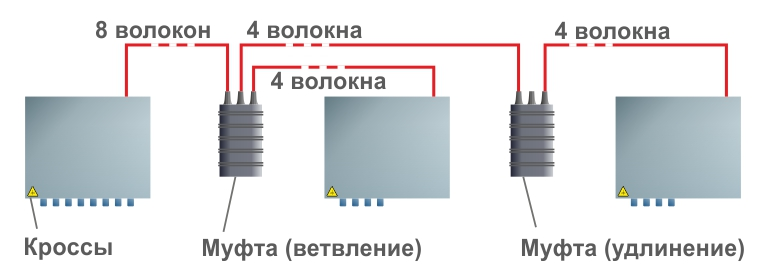

<mark><strong>Муфта представляет собой конструкцию для сварки жил.</strong></mark> Муфту выбирают исходя из внешних воздействующих факторов места размещения. <mark><strong>Если муфта размещается внутри здания, то в качестве муфты может служить бокс для оптического кросса.</strong></mark> Важно при этом учесть возможность крепления того количества кабелей, которое планируется соединить, и размещения КДЗС всех сварок. При этом даже если производится ответвление, то стандартно все волокна свариваются заново — как входящего кабеля, так и всех выходящих. Однако существуют муфты, в которых осуществляется только лишь ответвление части жил, а часть проходит напрямую, но в этом случае магистральный кабель должен быть многомодульным, т.к. разделка должна осуществляться для всех волокон из одной модульной трубки (см. далее конструкции волоконно-оптических кабелей).

**Муфта для ВОЛС**

При выборе муфт рекомендуется предпочтение отдавать моделям, имеющим в комплекте всё необходимое: корпус, механизмы крепления кабелей, сплайс-кассету, места размещения КДЗС.

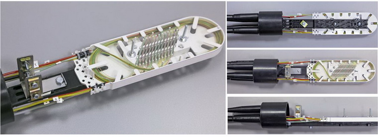

**Оставляйте запас кабеля перед кроссом и муфтами.** Требование стандартов — оставлять запас перед кроссом не менее 3-х метров. Об этом должны знать монтажники, однако будет не лишним указать на обеспечение запасов непосредственно в проекте. К тому же расчёт затухания нужно вести с учётом всех запасов, включая запас на сплайс-кассете.

### 5.4. Волоконно-оптический кабель

Основная стоимость волоконно-оптического кабеля — это его конструкция. Само по себе волокно — это обычное кварцевое стекло (диоксид кремния) — достаточно хрупкий материал, который нужно защищать от внешних физических воздействий. Именно по защите от внешних воздействий, а соответственно и условиям эксплуатации, и принято разделять кабели:

- для прокладки внутри зданий;
- для кабельной канализации небронированный;
- для кабельной канализации бронированный;
- для укладки в грунт;
- подвесной самонесущий;
- подвесной с тросом.

Выбор кабеля достаточно очевиден, и в каталогах можно увидеть назначение кабеля. Вам остаётся только выбрать нужный кабель исходя из количества жил (напоминаем про запас), типа волокна (одномод или многомод) и класса волокна (OS1, OS2 или OM3–OM5).

**Внимание.** При вводе уличного кабеля в здание в обязательном порядке необходимо перейти на внутренний тип кабеля. Это требования нормативных документов в области противопожарной защиты. Переход с одного типа кабеля на другой осуществляется с использованием муфты. Внутренний кабель чаще всего помечается аббревиатурой LSZH, но имейте в виду, что гарантию на возможность применения кабеля внутри помещений обеспечит только специальный сертификат соответствия требованиям технического регламента о пожарной безопасности, который должен быть у производителя.

> **LSZH (Low Smoke Zero Halogen)** — материал оболочки кабеля, не выделяющий дыма и галогенов при горении.

**Пример одномодульного (одна модульная трубка) волоконно-оптического кабеля.** Самая простая конструкция, обеспечивающая достаточную защиту при укладке на лотки в помещениях.

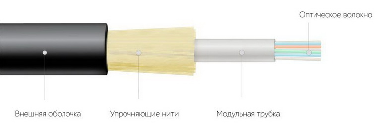

**Пример многомодульного волоконно-оптического кабеля с силовым элементом.** Центральный силовой элемент используется в многомодульных кабелях для придания дополнительной прочности на изгиб. Если кабель заявлен как самонесущий для воздушной прокладки, силовой элемент должен быть выполнен из диэлектрика: стеклопластик или арамидные нити. Для прокладки в канализации кабель должен дополнительно оснащаться гидрофобным наполнителем для защиты от влаги.

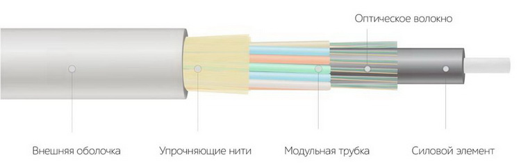

**Пример бронированного многомодульного волоконно-оптического кабеля с силовым элементом.** В качестве брони могут использоваться бронированная лента либо проволока. Считается, что лента — достаточная защита, например, от грызунов. Проволочная броня используется при значительных механических воздействиях при укладке и эксплуатации, например, в подвижных грунтах, в мокрых грунтах и т.п.

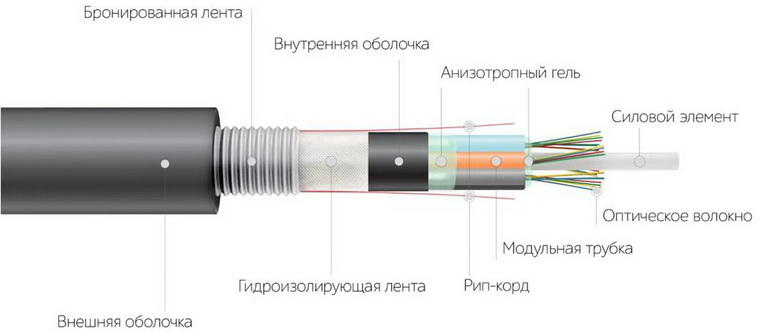

**Пример самонесущего многомодульного волоконно-оптического кабеля с силовым элементом и металлическим тросом для подвеса.** Обычно применяется, когда пролёты между опорами не превышают 50–70 метров.

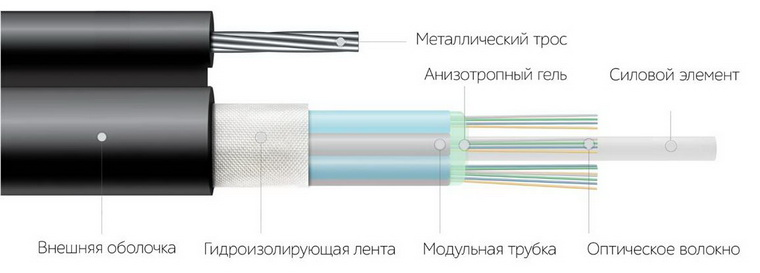

### Типовые вопросы раздела

**Есть SFP с подключением одного волокна. Чем они хуже или лучше?**

Это SFP-модули, способные в одном волокне работать на разных длинах волн для приёма и передачи. Они дороже обычных дуплексных модулей, работающих на приём и передачу по отдельным волокнам. К тому же такие комплекты разделяются на т.н. Master и Slave. Если мы проектируем систему с нуля, гораздо проще и дешевле обеспечить ВОЛС достаточным количеством линий для полноценного дуплексного соединения по двум волокнам.

**Зачем нужен кросс? Нельзя ли сразу воткнуть волокно в SFP-модуль?**

Существуют технологии полевой заделки, когда волокно скалывается и помещается непосредственно в специальный разъём, наполненный гелем. Нет ни сварки, ни склейки. Однако такие разъёмы дорогие (стоимость нескольких разъёмов сопоставима со стоимостью кросса), обладают большими потерями (отсутствует гарантированное соединение в виде сварки), оптоволоконная жила остаётся не защищённой от механических воздействий и может треснуть. Такую технологию используют тогда, когда нужно быстро обеспечить соединение буквально в поле. Если система монтируется по проекту и с нуля, то разумнее закладывать надёжные решения согласно стандартам СКС.

**У меня топология звезда. Как лучше — тянуть многожильный магистральный кабель и ответвлять с использованием муфт либо к каждому узлу тянуть отдельный кабель?**

Лучше и надёжнее протянуть отдельный кабель от каждого узла. Особенно в системах, где количество узлов невелико и расстояния ограничены единицами километров. По стоимости это может быть дороже, однако по пути следования жил будут отсутствовать места сварки и лишние потери в муфтах. Если же расстояния между узлами очень большие, то использование промежуточных муфт для ответвления может быть дешевле. Предлагаем в каждом конкретном случае производить экономический расчёт, включая стоимость прокладки отдельных кабелей, стоимость разделки кабеля и сварки муфт.

**Есть кабель универсальный — уличный и внутренний. Нужна ли в этом случае муфта на входе в здание?**

В этом случае муфта не нужна. Однако у большинства вендоров выбор конструкций универсальных кабелей ограничен.

Схема ВОЛС определена, все компоненты выбраны. Далее согласно алгоритму проектирования ВОЛС необходимо произвести расчёт затуханий.

---

## 6. Расчёт затуханий (вносимых потерь) в ВОЛС

Строго говоря, расчёт затуханий можно выполнять сразу после формирования структурной схемы ВОЛС, когда нам уже известны и длина сегментов, и количество муфт, и количество коннекторов.

> **Затухание (вносимые потери)** — уменьшение мощности оптического сигнала при прохождении через компоненты линии связи, измеряется в децибелах (дБ).

Расчёт затуханий проводится по формуле:

$$IL_л = IL_к + IL_{кн} + IL_м$$

где:

**$IL_к$ — потери в кабеле:**

$$IL_к = ILC_к \cdot L_к$$

где:

- $L_к$ — длина кабеля, км. При расчёте длины линии следует учитывать запасы перед кроссами — 3 м, до и после муфт — по 3 м, на сплайс-кассетах — по 1 м;
- $ILC_к$ — коэффициент вносимых потерь кабеля, дБ/км. Данные берутся из характеристик кабеля по спецификациям производителя.

**$IL_{кн}$ — потери в коннекторах:**

$$IL_{кн} = N_п \cdot ILC_{кн}$$

где:

- $N_п$ — число пар коннекторов в линии. Фактически — число соединений патчкордов с пигтейлами. В типовой линии таких соединений всего два — на кроссах в одном и другом узлах;
- $ILC_{кн}$ — коэффициент вносимых потерь коннекторов, регламентируемый стандартом. Определяется по соответствующим таблицам из стандартов.

**Потери в оптических соединителях.** Максимальные потери в оптических соединителях согласно стандарту. Не зависят от типа волокна.

**$IL_м$ — потери в муфтах:**

$$IL_м = N_м \cdot ILC_м$$

где:

- $N_м$ — число муфт в линии. Фактически — количество сварок в линии. Соответственно, в расчёт берутся не только сварки в муфтах, но и сварки в кроссах. Об этом часто забывают;
- $ILC_м$ — коэффициент вносимых потерь муфты, регламентируемый стандартом. Определяется по соответствующим таблицам из стандартов.

**Потери в муфтах (сварках).** Максимальные потери в муфтах (сварках) согласно стандарту. Не зависят от типа волокна.

После расчётов полученные значения сравниваются со значениями максимальных потерь, регламентируемых стандартом.

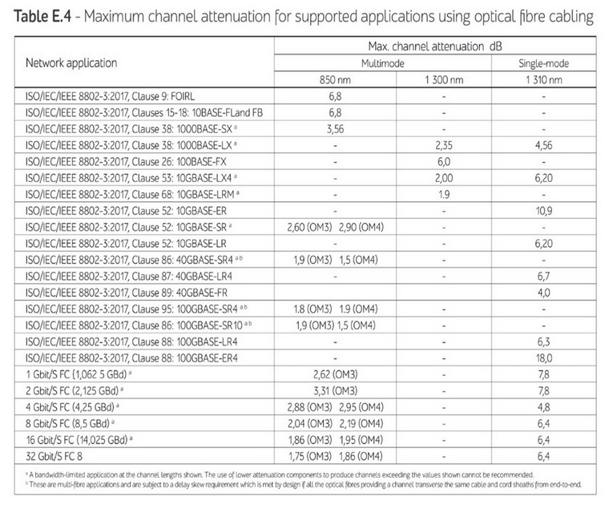

**Максимальное затухание ВОЛС, регламентированное стандартом**

Полученные значения должны быть меньше. Если расчётные значения превысили требования стандартов, можно перейти на волокно выше классом, например с ОМ3 на ОМ4, перейти с многомода на одномод, выбрав другой протокол.

### Типовые вопросы раздела

**В стандарте приведены значения затуханий сильно больше, чем в реальности. Можно ли производить расчёт по реальным данным измерений?**

И у вас, как у проектировщика, и у монтажника есть один ориентир — стандарт. И вы, и он защищены требованиями стандартов, что создаёт гарантию выполнения задачи. Расчёт по стандарту гарантирует, что в самом наихудшем случае соединение продолжит функционировать без ухудшения параметров скорости и стабильности.

**Расчёт показывает, что я могу удлинить линию на многомодовом кабеле более 550 м, предусмотренных протоколом. Так будет работать?**

Скорее всего, работать не будет. Ограничение максимального расстояния обусловлено не столько параметрами затухания и мощностью передатчиков, а межмодовой дисперсией, которая на расстояниях более 550 м достигает критических значений.

> **Межмодовая дисперсия** — искажение сигнала в многомодовом волокне из-за разного времени распространения различных мод.

**Почему в расчёте не учитывается бюджет мощности SFP-модуля?**

Методика рассчитана на обеспечение требований стандартов. Это означает, что любое оборудование, для которого заявлено соответствие протоколу согласно стандарту, будет функционировать на спроектированной ВОЛС. Если вы проводите расчёт под конкретного производителя, то в качестве значения максимального затухания можно использовать бюджет мощности SFP-модуля. Но в этом случае линия будет гарантированно работать только с выбранным SFP-модулем, и в случае замены модуля на другой необходимо будет подбирать модуль с аналогичным бюджетом мощности.

> **Бюджет мощности SFP-модуля** — разность между мощностью передатчика и чувствительностью приёмника, определяющая допустимые потери в линии.

В таблице пример бюджета мощности для SFP-модулей Allied Telesis.

**Бюджет мощности SFP-модуля**

Когда все материалы выбраны и расчёт затухания показал, что мы в рамках стандартов, можно переходить к документированию.

---

## 7. Документирование в проекте

В комплект проектной документации в обязательном порядке должны входить:

- схема ВОЛС;
- спецификация материалов;
- указания к монтажу кабеля: минимальные радиусы изгиба, допустимое растяжение кабеля при укладке и минимальная температура воздуха при укладке. Информацию можно взять из спецификации кабеля;
- указания на формирование запасов кабеля перед кроссом и на сплайс-кассете.

Если проектируется воздушная линия связи, то в обязательном порядке необходимо выполнить расчёт максимального растяжения кабеля между опорами. Расчёт довольно сложный, и рекомендуется его осуществлять в специальных программных комплексах, которые учитывают, в том числе, географический регион и время монтажа для учёта температурных растяжений кабеля.

---

## 8. Заключение

В статье рассмотрены основные моменты проектирования ВОЛС. Не рассмотрены такие моменты, как тип буферного покрытия волокна, учёт обратных отражений, особенности выбора SFP-модулей. Однако в большинстве случаев это вам не понадобится, и стандартный выбор из предлагаемых вендорами вариантов вам подойдёт.

В дополнение существует большое количество решений и технологий от производителей СКС, которые могут в той или иной ситуации быть удобнее, дешевле, проще. Для локальных сетей внутри здания удобны претерминированные решения. При строительстве сетей в зданиях с дальнейшим расширением существует возможность применения полых трубок с целью прокладки в них волокон впоследствии (т.н. «задувка» волокон). Чтобы быть в курсе всего спектра решений различных вендоров и применять наиболее подходящие решения для вашего проекта, необходимо быть в постоянном контакте с производителем, регулярно посещать выставки, конференции, вебинары, получать дайджесты, следить за обновлением информации и, конечно же, периодически проходить обучение.

Постоянное развитие и пополнение себя новыми знаниями — гарантия успеха в любом деле, не говоря уже о деле проектирования сложных и высокотехнологичных инженерных систем, коими, безусловно, являются системы видеонаблюдения.

**Обратить внимание.** Специалисты компании Видеомакс готовы помочь и определиться с основными проектными решениями, оптимальной схемой СКС, проверить выбор оборудования и компонентов на совместимость. Нам важно, чтобы проекты с применением VIDEOMAX были самыми современными, а системы видеонаблюдения функционировали долгое время без сбоев.

Если у вас остались вопросы и требуется помощь в проектировании систем видеонаблюдения, вы можете обратиться за консультацией в отдел поддержки проектировщиков компании Видеомакс по телефону 8 800 302-55-46 либо отправить письмо на email: info@videomax.ru. Все консультации бесплатны!

Если проект уже готов, вы можете прислать его на аудит, заполнив специальную форму в личном кабинете. Требуется авторизация.

В качестве иллюстрации алгоритма проектирования ВОЛС для видеонаблюдения специалистами компании Видеомакс подготовлено справочное пособие, где приведён пример выбора компонентов и проведения расчётов на реальной задаче. Ознакомиться со справочным пособием можно здесь >>>.

Подробно тему проектирования ВОЛС для систем видеонаблюдения мы рассмотрели в нашем вебинаре. Для практиков будет полезна вторая часть вебинара, целиком посвящённая расчёту ВОЛС и выбору компонентов на реальном примере.

---

## FAQ

**Что такое ВОЛС?**

ВОЛС (волоконно-оптическая линия связи) — линия передачи данных, в которой носителем сигнала является свет, распространяющийся по оптическому волокну.

**Когда нужно применять ВОЛС в видеонаблюдении?**

Основные показания: расстояние между узлами превышает 100 м; необходима гальваническая изоляция между узлами в разных зданиях; требуется устойчивость к электромагнитным помехам.

**С чего начинается проектирование ВОЛС?**

С определения стандарта (протокола связи) на основе известных длины линии и скорости передачи данных. Затем определяются тип и класс волокна, составляется схема, выбираются компоненты, рассчитываются затухания и документируется проект.

**Что такое тип и класс волокна?**

Тип волокна — многомодовое (MM) или одномодовое (SM). Класс волокна — OM1–OM5 для многомодового, OS1–OS2 для одномодового. Чем выше класс, тем выше допустимая скорость и расстояние.

**Какое волокно выбрать — многомодовое или одномодовое?**

Если длина участка укладывается в Multimode, требуемая скорость обеспечивается стандартом MM, а вендор имеет соответствующий SFP — применение Single-mode неоправданно, так как SM всегда дороже.

**Какие классы волокна рекомендованы?**

Классы OM1 и OM2 не рекомендованы к использованию согласно ISO/IEC 11801 2017. Ориентируйтесь на OM3 для многомодового волокна.

**Какие типы разъёмов используются в кроссе?**

Наибольшее распространение получили FC (самый надёжный), SC (самый удобный), LC (самый компактный, де-факто стандарт для внутренних кроссов высокой плотности).

**Чем отличаются типы полировки коннекторов?**

Плоская (PC, SPC, UPC) — простой и недорогой вариант с повышенными обратными отражениями. Под углом (APC) — минимальные обратные отражения, используется в одномодовых ВОЛС большой протяжённости. Коннекторы с разными типами полировки не совместимы.

**Зачем нужен запас волокон?**

Кабель на 4 или 8 волокон стоит практически одинаково. Запас в виде «тёмных волокон», уже разделанных в кроссе, позволяет при аварии быстро переключиться на исправные линии.

**Как рассчитываются затухания в ВОЛС?**

По формуле $IL_л = IL_к + IL_{кн} + IL_м$, где $IL_к$ — потери в кабеле, $IL_{кн}$ — потери в коннекторах, $IL_м$ — потери в муфтах. Полученные значения сравниваются с максимальными потерями, регламентированными стандартом.

**Что входит в комплект проектной документации?**

Схема ВОЛС, спецификация материалов, указания к монтажу кабеля (радиусы изгиба, растяжение, температура), указания на формирование запасов кабеля.

**Нужна ли муфта при вводе уличного кабеля в здание?**

Да, при вводе уличного кабеля в здание в обязательном порядке необходимо перейти на внутренний тип кабеля (требование противопожарных норм). Переход осуществляется через муфту. Если кабель универсальный, муфта не нужна, но выбор таких кабелей у большинства вендоров ограничен.