# Сварка оптических волокон: технологии, оборудование и практика

## Введение

Сварка оптических волокон (ОВ) — это передовая <mark>технология неразъёмного соединения волокон в процессе строительства волоконно-оптических линий связи (ВОЛС)</mark> и оптоволоконных сетей передачи данных. 

> **ВОЛС** — волоконно-оптическая линия связи; совокупность оптических кабелей, муфт, кроссов и оконечного оборудования, обеспечивающая передачу данных по оптическому волокну.

> **Оптическое волокно (ОВ)** — тонкая стеклянная или пластиковая нить, способная передавать световые сигналы на большие расстояния без значительных потерь.

Соединить два отрезка волокна можно несколькими способами:

- сварка/сплавление оптических волокон;
- неразъёмное механическое соединение;
- разъёмное механическое соединение при помощи «быстрых коннекторов».

Каждый метод хорош в своей области, но именно сварка является наиболее универсальным и качественным решением. Современные сварочные аппараты обеспечивают минимальные потери на сварных стыках в пределах $0{,}01$–$0{,}02$ дБ. Совокупное небольшое затухание на соединениях ОВ позволяет передавать высокоскоростной трафик на большие расстояния по ВОЛС, состоящей из множества кабельных отрезков.

> **Затухание (вносимые потери)** — уменьшение мощности оптического сигнала при прохождении через соединение, измеряется в децибелах (дБ).

Выполнение качественной сварки ОВ возможно только при правильной процедуре подготовки волокон и использовании высокотехнологичного оборудования от проверенных производителей.

---

## 1. Термины и определения

> **Стриппер** — инструмент для снятия защитного лакового покрытия с оптического волокна.

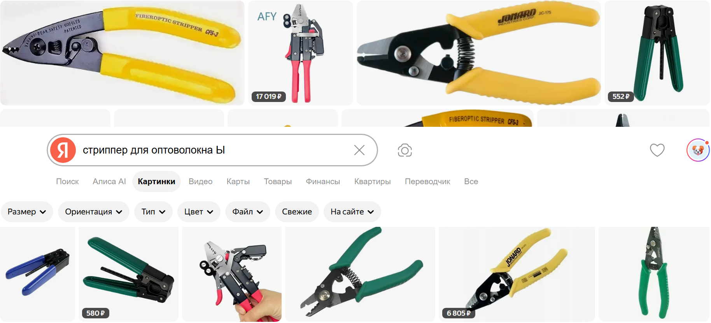

> **Термостриппер** — инструмент, удаляющий лак за счёт термического нагрева волокна.

> **Скалыватель** — инструмент для получения ровного перпендикулярного торца волокна путём нанесения засечки алмазным резцом и последующего скалывания.

> **КДЗС** — комплект деталей для защиты сварного соединения оптоволокна; термоусаживающаяся гильза с трубкой из сополимерного клея и железной направляющей.

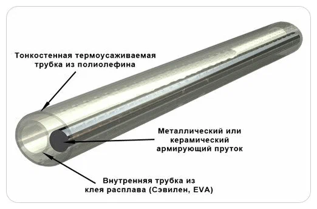

> **Юстировка** — центрирование и позиционирование волокон друг относительно друга внутри сварочного аппарата.

> **Оптическая муфта** — пластиковый контейнер, в который заводятся кабели и где соединяются оптические волокна.

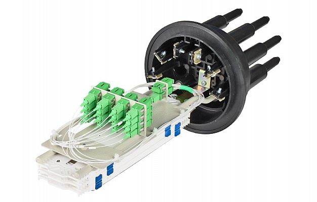

> **Оптический кросс** — металлический ящик типоразмера 19″ для крепления в стандартной стойке, предназначенный для оконечивания кабеля.

> **Пиг-тейл** — отрезок оптического волокна с коннектором на одном конце, предназначенный для оконечивания кабеля в кроссе.

> **Патч-корд** — оптический шнур с коннекторами с обеих сторон для коммутации.

> **Адаптер (оптическая розетка)** — устройство для соединения двух коннекторов.

---

## 2. Основы оптического волокна

<mark>Оптические волокна — это тонкие стеклянные или пластиковые нити, способные передавать световые сигналы на большие расстояния без значительных потерь.</mark> Они широко используются в современных технологиях связи и телекоммуникаций, а также в медицинских и научных приборах.

Существует <mark>несколько типов оптических волокон, различающихся по размеру, материалу и характеристикам:</mark>

- **Одномодовые волокна (SMF, SM)** — используются для передачи сигналов на большие расстояния.
- **Многомодовые волокна** — обычно используются для передачи сигналов на короткие расстояния.
- **Волокна со смещённой дисперсией (DSF, DS)** — позволяют передавать сигнал без искажений дальше, чем по простым волокнам.
- **Волокна с ненулевой смещённой дисперсией (NZDSF, NZDS, NZ)** — разновидность волокон со смещённой дисперсией.

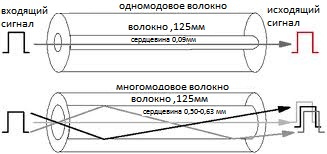

> **Дисперсия** — искажение оптического сигнала при распространении по волокну, связанное с зависимостью скорости распространения от длины волны.

Внешне различить типы волокон нельзя: разница — в химическом/кристаллическом составе, геометрии центрального сердечника и плавности границы между ним и оболочкой.

### 2.1. Конструкция волокна

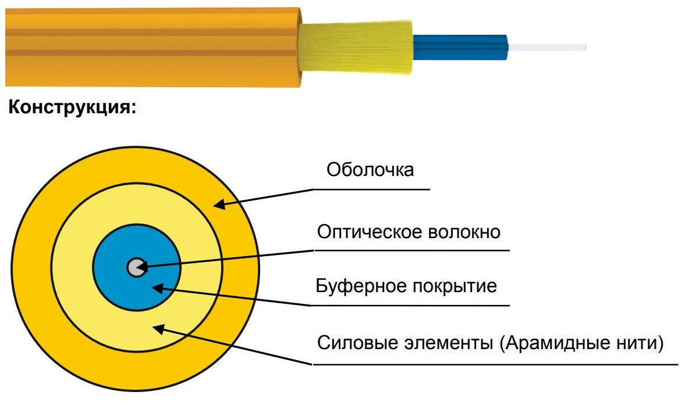

Волокно состоит из стеклянной оболочки из стекла с определёнными примесями. Без лака волокно имеет толщину 125 мкм (чуть толще волоса), а в центре идёт сердечник диаметром 9 мкм из сверхчистого стекла с другим составом и немного отличным от оболочки показателем преломления. Именно в сердечнике распространяется излучение за счёт эффекта полного отражения на границе «сердечник — оболочка».

Сверху 125-микрометровый цилиндр оболочки покрыт другой оболочкой — из особого лака (прозрачного или цветного — для цветовой маркировки волокон), который предохраняет волокно от умеренных повреждений. Без лака волокно хоть и гнётся, но плохо и легко ломается; в лаке его можно смело обмотать вокруг карандаша и довольно сильно дёрнуть — оно выдержит.

Тем не менее даже в лаке волокна можно легко повредить, поэтому в работе спайщика самое главное — дотошность и аккуратность. Одним неловким движением можно испортить результаты целого дня работы или надолго уронить магистральную связь.

### 2.2. Преимущества и недостатки оптических волокон

**Преимущества:**

- высокая скорость передачи данных;
- низкое энергопотребление;
- малый размер и вес;
- защита от электромагнитных помех.

**Недостатки:**

- более высокая стоимость;
- сложность установки и обслуживания по сравнению с другими видами сетевых кабелей.

---

## 3. Устройство оптического кабеля

Оптический кабель (ВОК) представляет собой сложную конструкцию, состоящую из нескольких слоёв и элементов. Кабели бывают разные:

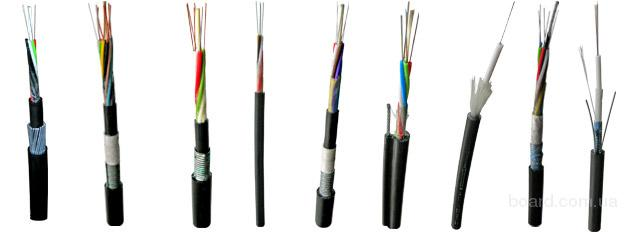

- по конструкции — от самых простых (оболочка, под ней пластиковые трубочки-модули, в них сами волокна) до супернавороченных (множество слоёв, двухуровневая броня — например, у подводных трансокеанских кабелей);
- по месту использования — для наружной и внутренней прокладки;
- по условиям прокладки — для подвеса (с кевларом или тросиком), для грунта (с бронёй из железных проволочек), для прокладки в кабельной канализации (с бронёй из гофрированного металла), подводные, для подвеса на опорах ЛЭП.

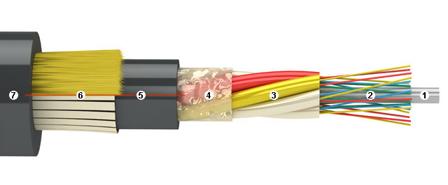

Типичная конструкция оптического кабеля включает следующие элементы:

1. **Центральный силовой элемент** — пруток из стеклопластика (может быть тросик в полиэтиленовой оболочке). Служит для центрирования трубок-модулей, придания жёсткости всему кабелю. За него часто закрепляют кабель в муфте/кроссе, зажимая под винт.
2. **Оптические волокна** — тончайшие нити-световоды в лаковой изоляции.
3. **Пластиковые трубочки-модули**, в которых плавают в гидрофобе волокна. Легко ломаются при изгибе. Обычно делают несколько модулей, в каждом из которых от 4 до 12 волокон. Единого стандарта на расцветку и количество модулей/волокон нет.
4. **Плёнка**, оплетающая модули. Играет демпфирующую роль, снижает трение внутри кабеля, защищает от влаги, удерживает гидрофоб.
5. **Тонкая внутренняя оболочка из полиэтилена** — дополнительная защита от влаги, защитная прослойка между кевларом/бронёй и модулями. Может отсутствовать.
6. **Кевларовые нити или броня**. Кевлар нужен, чтобы кабель выдерживал большое усилие на разрыв и при этом не был тяжёлым. Типичные значения допустимого растягивающего усилия для кабеля с кевларом — $6$–$9$ кН.
7. **Внешняя толстая оболочка из полиэтилена**. Принимает на себя первой все тяготы при прокладке и эксплуатации кабеля.

Минимальная ёмкость «взрослого» кабеля — 8 волокон, максимальная — 96. Обычно 32, 48, 64.

В России оптические волокна уже не производят. Их покупают у таких фирм, как Corning, OFS, Sumitomo, Fujikura и др. Но кабели в России и Белоруссии делают: Белтелекабель, МосКабель Фуджикура (МКФ), Еврокабель, Трансвок, Интегра-кабель, ОФС Связьстрой-1, Саранск-кабель, Инкаб.

---

## 4. Технологии сварки оптических волокон

Технология сварки оптических волокон является важной составляющей монтажа и обслуживания современных коммуникационных сетей. Эта технология используется для соединения отдельных волокон, при соединении волокон в муфте или для оконцовки оптического кабеля пиг-тейлами при монтаже в оптические кроссы.

Одним из ключевых элементов технологии сварки оптоволокна является специальное оборудование — оптический сварочный аппарат. Он осуществляет процесс соединения волокон путём нагрева концов волокон и последующего их сращивания. Современные сварочные аппараты обеспечивают высокую точность и скорость работы.

Существует <mark>несколько методов сварки</mark> оптических волокон:

- **Метод дуговой сварки** — наиболее распространённый. Сварочный аппарат создаёт дугу, нагревая концы волокон до температуры плавления, после чего они сращиваются под контролем микроскопа.
- **Метод с применением лазера** — обеспечивает более точное и быстрое соединение волокон, что особенно важно для коммуникационных сетей высокой производительности.
- **Использование газового пламени** — менее распространённый метод.
- **Метод на основе оптических клеев** — применяется в специальных случаях.

Каждый из этих методов имеет свои преимущества и недостатки и используется в зависимости от требований к качеству соединения.

---

## 5. Процесс сварки оптического волокна

Процесс сварки оптического волокна состоит из шести основных операций:

1. <mark>Очистка волокна от защитного покрытия.</mark>
2. <mark>Отчистка от лака и пыли</mark> (изо.спирт + безворсовые салфетки)
3. <mark>Скалывание торца</mark> волокна.
3. <mark>Помещение подготовленных волокон в аппарат для сварки.</mark>
4. <mark>Юстировка и сварка</mark> оптических волокон.
5. <mark>Анализ качества</mark> полученного сварного соединения.
6. <mark>Защита места сварного соединения.</mark>

В реальности 6 и 5 меняют местами

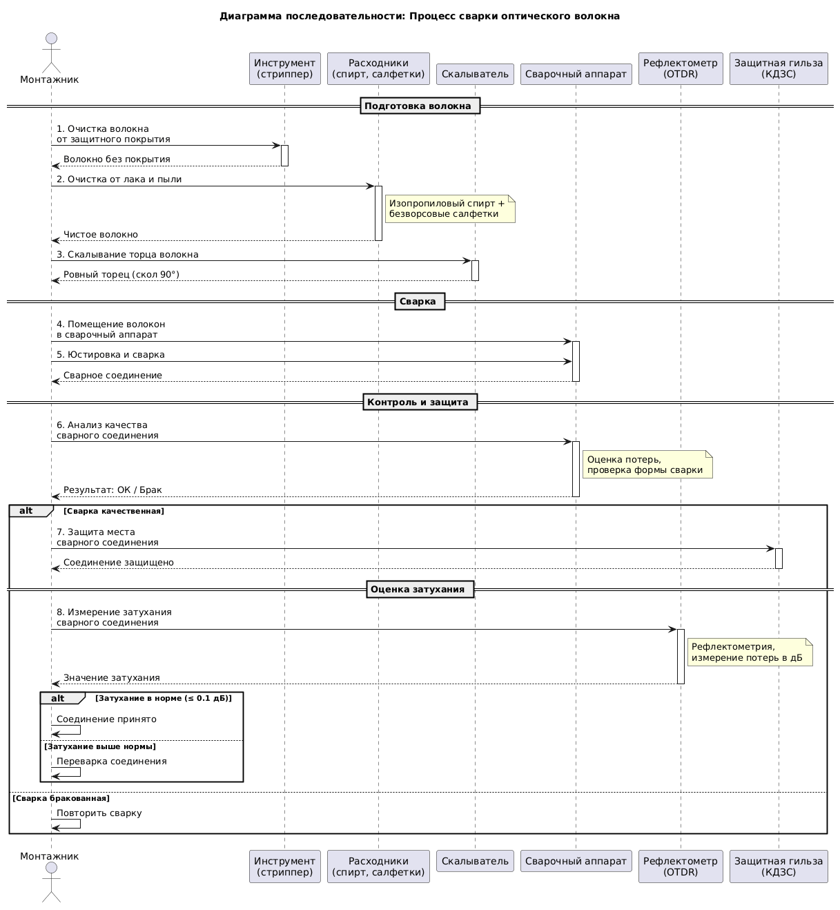

### 5.1. Очистка волокна от защитного покрытия

Каждый тип кабеля имеет различные защитные оболочки, но волокна, использующиеся в этих кабелях, обладают защитным покрытием из эпоксиакрилатного лака диаметром $250$ мкм.

<mark> Для снятия защитного лака с волокна используется специальный инструмент — стриппер. Зачастую стрипперы удаляют защитную оболочку волокна механическим методом, но встречаются и термострипперы, которые удаляют лак за счёт термического нагрева волокна.</mark>

<mark> Также существуют методы удаления защитного лака при помощи растворителя:</mark> в ёмкость с растворителем опускают конец волокна, растворитель разогревают до температуры $+50$ °С и через 1 минуту снимают лак при помощи безворсовой салфетки. Есть и способ механического удаления защитной оболочки при помощи лезвия толщиной не более $0{,}3$ мм. Оба этих метода на данный момент не применяются в связи со своей устарелостью, неудобством и опасностью воспроизведения.

### 5.2. Скол торца оптического волокна

<mark>Скалывание торца</mark> волокна перед процессом сварки — обязательная процедура, <mark>необходимая для получения ровных торцов.</mark> Для качественного сварного соединения <mark>поверхность скола должна быть перпендикулярна оси волокна с погрешностью менее $1°$.</mark>

Процесс скалывания достаточно прост: волокно укладывают и фиксируют в скалывателе, в нём волокно немного растягивается и изгибается, затем встроенным алмазным резцом наносится засечка на поверхности волокна, и при помощи бойка скалывателя волокно скалывается в этом месте.

Для произведения скола в современном скалывателе необходимо зачистить волокно на $>16$ мм от края. Современные модели скалывателей позволяют добиться прецизионного скола с отклонением от перпендикуляра не более $0{,}5°$ как для одномодовых, так и для многомодовых волокон.

### 5.3. Подготовка к сварке

<mark>После зачистки и скалывания на одно из волокон надевается гильза КДЗС, затем оба волокна закладываются в специальные ложементы внутри сварочного аппарата.</mark> Концы волокон фиксируются в V-образных блоках (V-groove) друг напротив друга.

В современных сварочных аппаратах весь процесс сварки производится автоматически по заранее выбранной программе. После закладывания волокон в V-образные канавки сварочный аппарат даёт небольшой электрический разряд для дополнительной очистки торцов. Если скол одного из торцов не удовлетворяет требованиям выбранной программы, аппарат укажет на проблему и не будет производить сплавление волокон до того, как скол не будет исправлен.

### 5.4. Юстировка и сварка волокон

<mark>Процесс юстировки — это центрирование и позиционирование волокон друг относительно друга внутри сварочного аппарата. Автоматическая юстировка в зависимости от метода делится на два основных типа:</mark>

- автоматическая юстировка по оболочке волокна;
- автоматическая юстировка по сердцевине волокна.

#### Юстировка по оболочке волокна

При данном методе юстировка и сведение волокон производится по внешней оболочке волокон при помощи движения V-образных канавок. Данный способ является самым простым, и при условии хороших геометрических параметров оптических волокон он может обеспечить вносимые потери на соединении на уровне $0{,}03$–$0{,}05$ дБ. Недостаточную точность такого вида юстировки сварочные аппараты компенсируют выравниванием оптического волокна в процессе сварки за счёт поверхностного натяжения.

Сварочные аппараты с юстировкой по оболочке используются при монтаже городских сетей или при аварийно-восстановительных работах, так как широко распространены и доступны.

#### Юстировка по сердцевине волокна

Автоматическая юстировка по сердцевине волокна подразумевает, что юстировка и сведение волокон производится сварочным аппаратом на основе данных о сердцевинах волокон. Такой метод позволяет производить точную юстировку и сведение даже при плохих геометрических параметрах волокна.

В зависимости от модели сварочные аппараты с юстировкой по сердцевине могут быть оборудованы одной из трёх систем управления:

- **PAS (Profile Alignment System)** — система юстировки по профилю волокна;
- **LID (Local light Injection and Detection)** — система с локальным вводом света и его обнаружением;
- **CDS (Core Detection System)** — система детектирования сердцевины.

#### Сварка отъюстированных волокон

<mark>Сварка отъюстированных и сведённых волокон происходит за счёт резкого нагревания волокон до температуры $\approx 2000$ °С.</mark> Это происходит под действием электрического разряда, подаваемого между двумя электродами, между которыми находятся волокна.

### 5.5. Анализ качества сварного соединения

<mark>Оценка качества сварного соединения сварочным аппаратом производится автоматически после каждого процесса сплавления по встроенному алгоритму,</mark> который учитывает:

- предварительные данные о качестве сколов;
- данные во время сварки (параметры внешней среды и значение поданного разряда);
- «визуальную» оценку получившегося соединения.

Данные о качестве соединения, полученные в ходе встроенного алгоритма оценки, далеки от точных, но могут быть использованы как качественная оценка.

### 5.6. Защита сварного соединения

<mark>Сварные соединения оптических волокон защищают от внешних воздействий при помощи термоусаживающихся гильз или КДЗС.</mark> КДЗС представляет собой термоусаживающуюся трубку, внутри которой размещены трубка из сополимерного клея и железная направляющая.

<mark>Перед процессом сварки гильзу надевают на одно из свариваемых волокон, а после сварки надвигают на место стыка и «запекают» в специальном отсеке сварочного аппарата,</mark> называемом «печкой». В процессе нагрева клеевая трубка расплавляется, а за счёт усадки термоусаживающей гильзы происходит уплотнение клея вокруг волокна. Железный стержень, заложенный в гильзу, придаёт получаемой конструкции жёсткость.

В зависимости от задач КДЗС могут быть следующих модификаций:

- КДЗС 80 мм с армирующим профилем;
- КДЗС 60 мм с армирующим профилем;
- КДЗС 40 мм с армирующим профилем;
- КДЗС 20 мм без армирующего профиля.

---

## 6. Разделка оптического кабеля

Для разделки кабеля, как и для сварки, требуется ряд специфических инструментов. <mark>Типичный набор монтажника-спайщика — чемодан с инструментами «НИМ-25», в нём содержатся все нужные стрипперы, тросокусы, отвёртки, бокорезы, плоскогубцы, макетный нож и прочий инструмент, а также помпа или пузырёк для спирта, запас растворителя гидрофоба «D-Gel», нетканые безворсовые салфетки, изолента, самоклеящиеся цифры-маркеры для кабелей и модулей и прочие расходные материалы.</mark>

<mark> При разделке кабелей важно выдержать длины элементов кабеля в соответствии с требованием инструкции к муфте: </mark> в одном случае может понадобиться оставить длинный силовой элемент, чтобы закрепить его в муфте/кроссе, в другом случае он не требуется; в одном случае из кевлара кабеля плетётся косичка и зажимается под винт, в другом случае кевлар отрезается. Всё зависит от конкретной муфты и конкретного кабеля.

### 6.1. Порядок разделки кабеля

а) Перед разделкой кабеля, долго находившегося в сырости или без гидроизолированного торца, следует отрезать ножовкой примерно метр кабеля (если позволяет запас), так как длительное воздействие влаги негативно влияет на оптическое волокно (может помутнеть) и на прочие элементы кабеля. Кевларовые нити — отличный капилляр, который может «насосать» в себя воду на десятки метров.

б) При наличии в конструкции кабеля отдельного троса для подвески (когда кабель в поперечном сечении имеет форму цифры «8») он выкусывается тросокусами и срезается ножом. При срезании троса важно не повредить кабель.

в) Для снятия внешней оболочки кабеля используется соответствующий нож-стриппер. НИМ-25 обычно комплектуется ножом «Kabifix», однако можно использовать и нож-стриппер для электрических кабелей с длинной ручкой.

Такой нож-стриппер имеет вращающееся во все стороны лезвие, которое можно отрегулировать по длине в соответствии с толщиной внешней оболочки кабеля, и прижимной элемент для удержания на кабеле. Важно: если приходится разделывать кабели разных марок, то перед разделкой нового кабеля нужно попробовать нож на кончике и, если прорезало слишком глубоко и повредило модули, лезвие надо подкрутить покороче.

Ножом-стриппером для снятия внешней оболочки делается круговой разрез на кабеле, а затем от него — два параллельных разреза с противоположных сторон кабеля в сторону конца кабеля, чтобы внешняя оболочка распалась на две половинки.

г) Если кабель самонесущий с кевларом, то кевлар срезается тросокусами либо ножницами со специальными керамическими лезвиями. Кевлар не следует срезать ножом или простыми ножницами без керамических накладок, так как он быстро тупит металлический режущий инструмент.

Если кабель предназначен для прокладки в телефонной канализации и из брони содержит лишь металлическую гофру, её можно разрезать продольно специальным инструментом (усиленным плужковым ножом). Либо осторожно сделать маленьким труборезом или даже обычным ножом на гофре круговую риску и, пошатывая, добиться роста усталости металла в месте риски и появления трещины, после чего можно снять часть гофры, надкусить модули и стянуть гофру.

Если кабель бронирован круглыми проволоками, их следует откусить тросокусами небольшими партиями, по 2–4 проволоки.

д) Для внутренней, более тонкой оболочки, присутствующей в некоторых кабелях, следует использовать отдельный, заранее настроенный нож-стриппер, чтобы не сбивать настройки длины ножа каждый раз при разделке кабеля.

е) С модулей при помощи салфеток и D-Gel/бензина удаляются нитки, пластиковая плёнка и прочие вспомогательные элементы. Работать следует в одноразовых перчатках, так как гидрофоб — очень неприятная субстанция, тяжело отмывается.

ё) На необходимой длине каждый модуль (кроме модулей-пустышек) надкусывается стриппером для модулей, после чего модуль можно без особых усилий стянуть с волокон. Надкусывание стриппером модулей — очень ответственный момент. Нужно выбрать выемку точного диаметра: если выемка будет больше, чем нужно, модуль не надкусится достаточно, чтоб легко сняться; если меньше — есть риск перекусить волокна в модуле.

ж) Волокна следует хорошо протереть безворсовыми салфетками со спиртом, чтобы полностью удалить гидрофобный заполнитель. Сначала волокна протираются сухой салфеткой, затем — салфетками, смоченными в изопропиловом либо этиловом спирте.

з) На разделанные кабели одеваются специальные клеевые термоусадки, которые часто входят в комплект муфты. Весьма распространённая и весьма неприятная ошибка новичка — забыть одеть термоусадку! Перед усадкой патрубок муфты и сам кабель нужно зашкурить грубой наждачкой для лучшей адгезии клея.

и) Разделанные кабели вводятся в муфту или кросс, фиксируются, а сама муфта или кросс фиксируется на рабочем столе.

---

## 7. Оборудование и инструменты

### 7.1. Сварочные аппараты

Сварочные аппараты выполняют сварку и термоусадку оптоволокна за минимальное время. Работа с прибором отличается удобством за счёт автоматической ветрозащитной крышки и автоматизации термоусадочной печки. Малый вес в сочетании с большой ёмкостью встроенной батареи обеспечивают мобильность и возможность применения в любой точке кабельной трассы. Отличная защищённость от воздействий внешней среды позволяет производить сварку в сложных погодных условиях.

### 7.2. Скалыватели

Современные модели скалывателей позволяют добиться прецизионного скола с отклонением от перпендикуляра не более $0{,}5°$ как для одномодовых, так и для многомодовых волокон.

### 7.3. Стрипперы

Зачастую стрипперы удаляют защитную оболочку волокна механическим методом, но встречаются и термострипперы, которые удаляют лак за счёт термического нагрева волокна.

### 7.4. Аксессуары

Дополнительное оборудование, применяемое для сварки оптических волокон: компактные скалыватели и аксессуары — стрипперы, электроды, лезвия скалывателя, держатели.

---

## 8. Контроль качества сварки

После завершения сварки оптического волокна необходимо проверить её качество, чтобы убедиться, что она была выполнена корректно. Существует несколько методов контроля качества:

- **Визуальный контроль** — сваренное соединение визуально оценивается на наличие трещин, воздушных пузырьков, перекосов или других дефектов. Самый простой и быстрый метод, но не всегда может обнаружить скрытые дефекты.
- **Метод оптической микроскопии** — использует оптический микроскоп для оценки качества сваренного соединения. Позволяет увидеть микроструктуру сваренного соединения, что помогает обнаружить скрытые дефекты.
- **Метод OTDR (Optical Time Domain Reflectometry)** — позволяет оценить качество сварного соединения путём измерения затухания сигнала на определённом расстоянии от места сварки. Обеспечивает наиболее точный анализ качества сварки, но требует использования специального оборудования.

---

## 9. Типичные ошибки при сварке оптического волокна

| Ошибка | Причина | Последствия |
|--------|---------|-------------|
| Загрязнение волокна | Плохая очистка | Высокие потери, слабое соединение |
| Неправильный скол | Неравномерное давление или тупой скалыватель | Несовпадение торцов |
| Слабое совмещение | Смещение по осям X/Y | Потери сигнала |
| Неправильная термоусадка | Недостаточный прогрев | Повреждение соединения |

### Практические рекомендации

- Перед началом работы нужно проверить, насколько чисты и обезжирены концы волокон.
- При выравнивании волокон нужно убедиться, что они расположены ровно и на нужном расстоянии друг от друга.
- Перед сваркой нужно убедиться, что сварочный аппарат настроен правильно и не имеет каких-либо технических проблем.
- После сварки нужно тщательно защитить сваренное волокно от внешних воздействий, чтобы оно не повредилось.

---

## 10. Проблемы, которые могут возникнуть при сварке

Несмотря на все преимущества сварки оптического волокна, существуют некоторые проблемы:

- Высокая чувствительность оптических волокон к механическим напряжениям может привести к их повреждению во время сварки.
- Некачественное оборудование для сварки может привести к недостаточному нагреву волокон, что приведёт к несовершенным сварочным соединениям.
- Некачественный материал для сварки может привести к нестабильности соединения, что может привести к прерыванию связи.

---

## 11. Оптические муфты и кроссы

### 11.1. Оптические муфты

Оптическая муфта — это пластиковый контейнер, в который заводятся кабели и там соединяются. Конструкций муфт много. Наиболее массовая конструкция — как у серии связьстройдеталевских муфт «МТОК». Имеется оголовье, из которого снаружи торчат патрубки для ввода кабеля. Изнутри оголовья прикреплена металлическая рамка, к которой крепятся оптические кассеты. Сверху одевается колпак, герметизируемый резинкой. Колпак фиксируется разъёмным пластиковым хомутом: муфту всегда можно открыть и закрыть, не тратя ремкомплект из термоусадок.

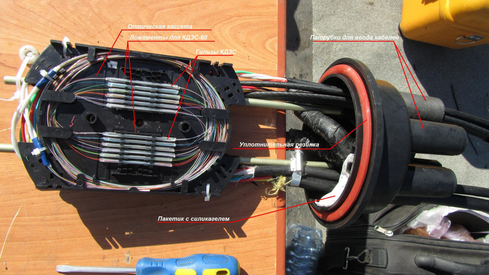

В оптическую муфту обычно заводится не менее двух кабелей. Если вводится 4–5 кабелей, да ещё все кабели разные с разной расцветкой и разным количеством волокон в модулях, то муфта получается сложная для монтажа и последующего разбора. Лучше проектировать сеть так, чтобы в муфту не входило более 3 кабелей.

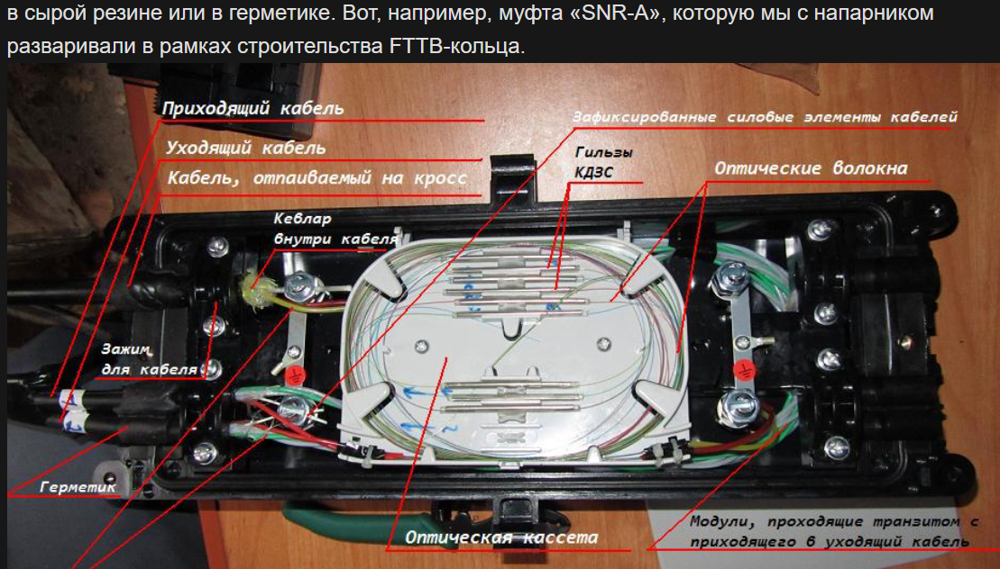

### 11.2. Оптические кроссы

Оптический кросс предназначен для оконечивания кабеля в месте, куда его подвели: на базовой станции, в ИВЦ, в дата-центре, в серверной. Типичный кросс представляет собой металлический ящик типоразмера 19″ для крепления в стандартной стойке, сзади в него вводится оконечиваемый кабель, спереди расположены планки с портами.

Вводящийся в кросс кабель сваривается с так называемыми пиг-тейлами. Каждое волокно — к своему пиг-тейлу. Другая сторона пиг-тейла содержит оптический коннектор-«вилку», которая вставляется в оптический адаптер-«розетку» изнутри кросса. Снаружи кросса коммутация выполняется оптическими патч-кордами.

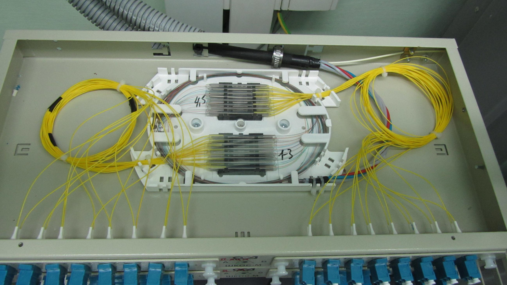

### 11.3. Адаптеры и коннекторы

Оптические кроссы характеризуются используемыми в них адаптерами (оптическими розетками). Стандартом является комплекс из адаптера (розетки) и коннектора (вилки).

На практике чаще всего используются такие стандарты, как FC, SC, LC. Пореже встречаются FC/APC, SC/APC, ST. LC бывает как дуплексный, так и одиночный.

**FC:**

- Плюсы — отличное качество соединения, подходит для ответственных магистралей; старый проверенный стандарт; металл (трудно сломать).
- Минусы — долго откручивать/закручивать при переключениях; бывает неудобно подлезть в тесноте.

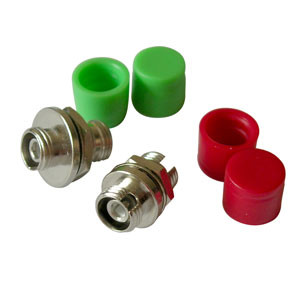

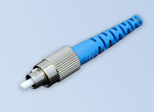

**SC:**

- Плюсы — дешевле FC, удобнее и быстрее переключать.
- Минусы — пластик легче сломать, меньше ресурс подключений-отключений.

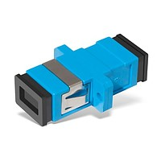

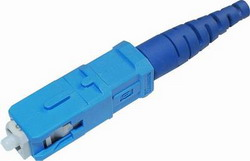

**LC и LC Duplex:**

- Похожи свойствами на SC, но имеют намного меньшие габариты: двухюнитовый кросс на LC вмещает 64 порта, а на SC — только 32.

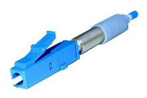

**FC/APC, SC/APC, LC/APC:**

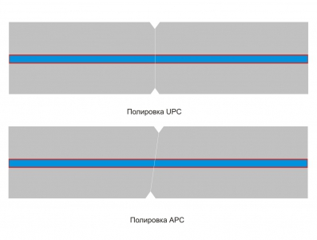

- То же самое, что FC, SC и LC, но с косой (A — angle, угол) полировкой наконечника. Такие адаптеры и коннекторы делаются зелёного цвета. Это нужно, чтобы уменьшить обратное отражение на стыке двух коннекторов.

Торец наконечника не плоский, а чуть-чуть выпуклый, чтобы два волокна из двух наконечников по разные стороны розетки гарантированно совместились без воздуха и пыли между ними. Розетка содержит в себе полый тонкостенный цилиндрик из керамики, имеющий продольный разрез. Когда в розетку вставляют вилку, разрез раздаётся на какие-то микроны, подпружинивая и центрируя вилку. Таким образом достигается прецизионная юстировка двух коннекторов в розетке.

---

## 12. Перспективы развития

Одной из перспективных областей развития технологий сварки ОВ является разработка более быстрых, точных и компактных сварочных устройств. Будущее принадлежит сварочным устройствам, которые сделают процесс сварки оптического волокна наиболее простым, надёжным и дешёвым.

Важность сварки ОВ для современных технологий и коммуникаций не может быть переоценена. Она позволяет создавать более быстрые и надёжные оптические сети, обеспечивая передачу данных на большие расстояния. Это особенно важно для различных отраслей, включая телекоммуникации, медицину, науку и промышленность.

---

## FAQ

**Вопрос:** Какие способы соединения оптических волокон существуют?

**Ответ:** Сварка/сплавление, неразъёмное механическое соединение и разъёмное механическое соединение при помощи «быстрых коннекторов». Сварка является наиболее универсальным и качественным решением.

**Вопрос:** Какие потери обеспечивают современные сварочные аппараты?

**Ответ:** Современные сварочные аппараты обеспечивают минимальные потери на сварных стыках в пределах $0{,}01$–$0{,}02$ дБ. Аппараты с юстировкой по оболочке — $0{,}03$–$0{,}05$ дБ, с юстировкой по сердцевине — $0{,}01$ дБ.

**Вопрос:** Из каких этапов состоит процесс сварки оптического волокна?

**Ответ:** Из шести основных операций: очистка волокна от защитного покрытия, скалывание торца, помещение волокон в сварочный аппарат, юстировка и сварка, анализ качества, защита места соединения.

**Вопрос:** Какая погрешность скола допустима для качественного соединения?

**Ответ:** Поверхность скола должна быть перпендикулярна оси волокна с погрешностью менее $1°$. Современные скалыватели обеспечивают отклонение не более $0{,}5°$.

**Вопрос:** Чем отличается юстировка по оболочке от юстировки по сердцевине?

**Ответ:** Юстировка по оболочке производится по внешней оболочке волокон и обеспечивает потери $0{,}03$–$0{,}05$ дБ. Юстировка по сердцевине производится на основе данных о сердцевинах волокон и обеспечивает потери $0{,}01$ дБ, позволяя работать даже при плохих геометрических параметрах волокна.

**Вопрос:** Какие системы управления используются в сварочных аппаратах с юстировкой по сердцевине?

**Ответ:** PAS (Profile Alignment System), LID (Local light Injection and Detection), CDS (Core Detection System).

**Вопрос:** При какой температуре происходит сварка волокон?

**Ответ:** Сварка происходит за счёт резкого нагревания волокон до температуры $\approx 2000$ °С под действием электрического разряда между двумя электродами.

**Вопрос:** Какие методы контроля качества сварки существуют?

**Ответ:** Визуальный контроль, метод оптической микроскопии и метод OTDR (Optical Time Domain Reflectometry).

**Вопрос:** Какие типичные ошибки возникают при сварке?

**Ответ:** Загрязнение волокна (высокие потери), неправильный скол (несовпадение торцов), слабое совмещение (потери сигнала), неправильная термоусадка (повреждение соединения).

**Вопрос:** Какие модификации КДЗС существуют?

**Ответ:** КДЗС 80 мм, 60 мм, 40 мм с армирующим профилем и КДЗС 20 мм без армирующего профиля.

**Вопрос:** Какие стандарты коннекторов наиболее распространены?

**Ответ:** FC, SC, LC. Пореже встречаются FC/APC, SC/APC, ST.

**Вопрос:** В чём разница между UPC и APC полировкой?

**Ответ:** APC (Angled Physical Contact) — косая полировка наконечника, применяется для уменьшения обратного отражения на стыке двух коннекторов. Такие адаптеры и коннекторы делаются зелёного цвета.

**Вопрос:** Что делать, если забыли надеть термоусадку перед сваркой?

**Ответ:** Поможет термоусаживаемая манжета с замком (известная как XAGA). Колхозить герметизацию изолентой нельзя!

**Вопрос:** Какие производители оптических кабелей существуют в России и Белоруссии?

**Ответ:** Белтелекабель, МосКабель Фуджикура (МКФ), Еврокабель, Трансвок, Интегра-кабель, ОФС Связьстрой-1, Саранск-кабель, Инкаб.

**Вопрос:** Где купить оборудование для сварки оптического волокна?

**Ответ:** Компания «АнЛан» занимает лидирующие позиции на рынке РФ с 2007 года. АО «Компонент» предлагает высокотехнологичные сварочные аппараты для оптики. Выбирайте надёжного поставщика.