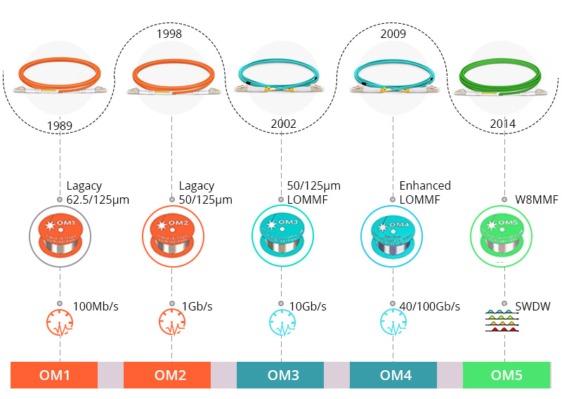
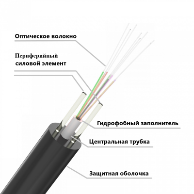
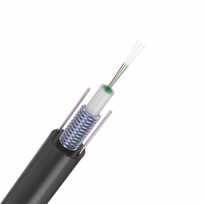
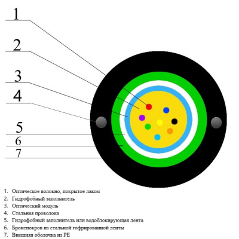
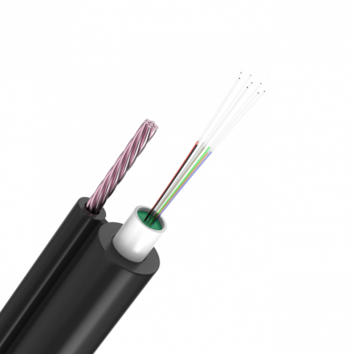
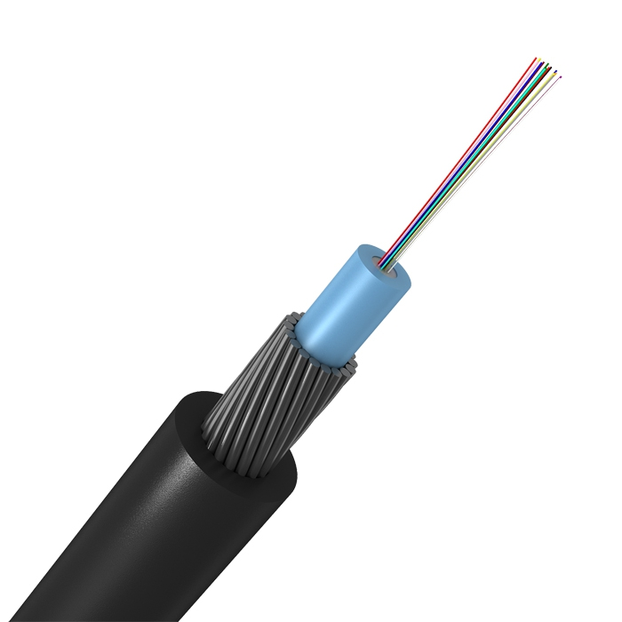
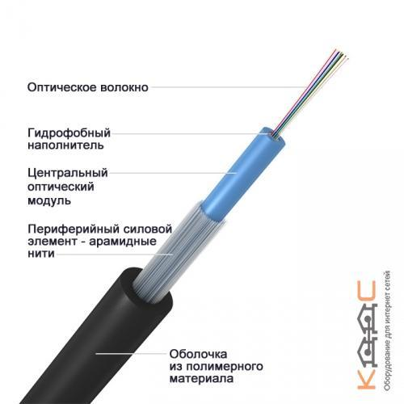
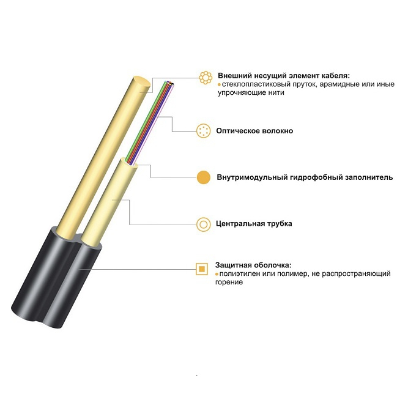
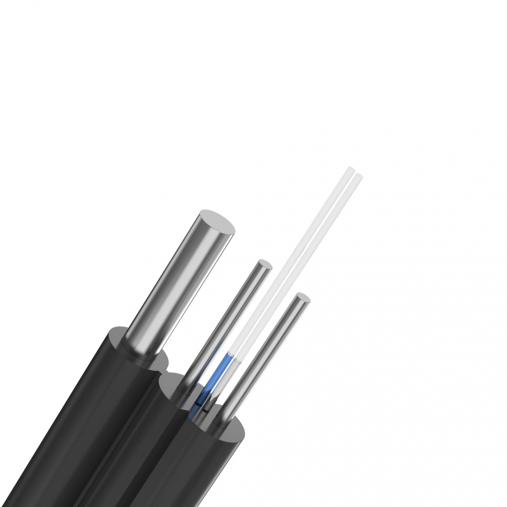

# Оптоволокно: принцип работы, устройство, типы и характеристики

## Введение

**Оптоволокно** — <mark><strong>это технология передачи данных, в которой носителем сигнала выступает свет, а не электрический ток.</strong></mark> В отличие от медных или алюминиевых кабелей, где сигнал передаётся электронами, в оптоволокне движутся фотоны, что <mark><strong>обеспечивает минимальные потери и высокую помехозащищённость.</strong></mark>

> **Оптоволокно** — это инновационная технология передачи данных, использующая световые сигналы, распространяющиеся по прозрачному волоконному световоду с минимальными потерями.

> **Оптоволоконный кабель** — это кабель, в котором в качестве среды для передачи сигнала используется прозрачный волоконный световод (стеклянный или пластиковый), а сигнал передаётся с помощью света.

**Важно сразу разграничить три понятия, которые часто путают:**

| Термин | Что это |
|---|---|
| **Волокно** | Одна стеклянная или пластиковая «нить» — <mark><strong>один физический канал передачи</strong></mark> |
| **Мода** | **Способ** распространения света **внутри одного волокна** |
| **Кабель** | **Оболочка**, внутри которой может быть **много волокон** |

Один кабель = много волокон. Одно волокно = один или много мод (в зависимости от типа). Это независимые характеристики.

---

## 1. Принцип работы оптоволокна

### 1.1. Основные компоненты оптоволоконного кабеля

Оптоволоконный кабель состоит из нескольких ключевых слоёв:

> **Ядро (Core)** — <mark><strong>центральная часть оптоволокна, через которую проходит свет. Изготовлено из высококачественного стекла или пластика с высоким коэффициентом преломления.</strong></mark> Диаметр ядра обычно составляет от 8 до 62,5 микрон в зависимости от типа волокна.

> **Оболочка (Cladding)** — <mark><strong>слой, окружающий ядро, с меньшим коэффициентом преломления. Обеспечивает полное внутреннее отражение светового сигнала</strong></mark>, удерживая его внутри ядра. Диаметр оболочки обычно составляет 125 микрон.

> **Буферное покрытие (Buffer Coating)** — <mark><strong>защитный слой, окружающий оболочку, предназначенный для защиты оптоволокна от влаги, механических повреждений и других внешних воздействий.</strong></mark> Может быть выполнен из пластика или другого защитного материала.

> **Внешняя оболочка (Jacket)** — <mark><strong>внешний слой кабеля, обеспечивающий дополнительную защиту и устойчивость. Может быть изготовлена из полиэтилена, полиуретана или ПВХ</strong></mark> в зависимости от условий эксплуатации.

В центре кабеля расположен световод из стекловолокна (диаметр не превышает 10 мкм), облачённый в защитную пластиковую или стеклянную оболочку, обеспечивающую полное внутреннее отражение света за счёт разности коэффициентов преломления на границе двух сред.

**От одного волокна к кабелю.** Всё описанное выше — это строение **одного** волокна. Но в реальном кабеле таких волокон почти всегда **несколько**. Они укладываются в общую оболочку, часто в пластиковые трубки (модули), заполненные гидрофобным гелем. Именно поэтому говорят о **волоконности кабеля** — сколько отдельных волокон внутри.

> **Волоконность (ёмкость кабеля)** — количество отдельных оптических волокон в одном кабеле. Варьируется от **1 до 6912 и более**.

Типичные значения:

| Волокон | Где применяется |
|---|---|
| 1–4 | Абонентские линии (FTTH), патч-корды, внутри помещений |
| 8–24 | Внутриобъектовые магистрали, небольшие узлы связи |
| 32–144 | Городские сети (MAN), распределительные линии |
| 288–864 | Магистральные линии между городами и крупными узлами |
| 1728–6912+ | Трансконтинентальные и подводные магистрали |

<strong>правильно ли я понял, что это 6912 физических каналов, которые могут использоваться для отдельных устройств</strong>
<table><tr><td>

Да, вы поняли правильно — **но с важной оговоркой**.

## Короткий ответ

**6912 волокон = 6912 физически независимых оптических путей.** Каждое волокно — это отдельная стеклянная нить, по которой можно независимо передавать сигнал. Теоретически каждое из них может обслуживать **отдельную пару устройств** (передатчик ↔ приёмник).

Но на практике **не всё так просто**, и вот почему.

## 1. Одно волокно ≠ одно устройство

По одному волокну можно передавать:
- **один сигнал** — тогда это действительно один канал «точка-точка» между двумя устройствами,
- **много сигналов одновременно** — с помощью **WDM** (спектральное уплотнение). Тогда одно волокно обслуживает десятки каналов, которые могут идти к разным устройствам (через разветвители, мультиплексоры, коммутаторы).

То есть **волокно — это физическая среда**, а сколько логических каналов по нему пустят — зависит от оборудования на концах.

## 2. Волокна не обязаны идти «до конечного устройства»

В магистральном кабеле на 6912 волокон они почти никогда не тянутся напрямую к 6912 устройствам. Обычно:
- кабель идёт между двумя **узлами связи** (например, двумя городами),
- на узлах волокна **распределяются** по другим кабелям, коммутаторам, мультиплексорам,
- часть волокон — **резервные**, они не используются постоянно,
- часть — **арендованные** другим операторам,
- часть — **тёмные волокна** (dark fiber), сданные в аренду «как есть», без оборудования.

Так что 6912 волокон — это **потенциал**, а не 6912 одновременно работающих устройств «в лоб».

## 3. Реальный пример

Представьте магистраль Москва — Санкт-Петербург. В кабеле 288 волокон (не 6912, но для примера). Что с ними происходит:
- 40 волокон — основной трафик между городами (с WDM — терабиты),
- 40 волокон — резерв,
- 60 волокон — сданы в аренду операторам,
- 60 волокон — запас на будущее,
- 88 волокон — распределяются по пути в промежуточных городах.

Итого: 288 физических волокон, но **устройств на концах** может быть в разы меньше или больше — в зависимости от того, как их коммутируют.

## 4. Аналогия

Представьте **многожильный телефонный кабель** в подъезде на 100 пар. Это 100 физических медных пар. Но:
- не все пары подключены к абонентам,
- часть — резерв,
- часть — занята под служебные линии,
- по одной паре при желании можно пустить несколько логических каналов (ADSL + телефон).

С оптоволокном то же самое, только масштаб больше и вместо меди — стекло.

## Итог

| Утверждение | Верно? |
|---|---|
| 6912 волокон = 6912 физических путей | ✅ Да |
| Каждое волокно может обслуживать отдельную пару устройств | ✅ Да, теоретически |
| 6912 волокон = 6912 одновременно работающих устройств | ❌ Не обязательно |
| По одному волокну можно передавать много каналов (WDM) | ✅ Да |
| Часть волокон всегда в резерве / аренде / запасе | ✅ Да |

Так что **6912 — это верхняя граница физической ёмкости кабеля**, а сколько из них реально используется и как — решает проектировщик сети.

Хотите, разберу, как на практике **считают нужное число волокон** при проектировании магистрали?

</td></tr></table>

### 1.2. Физические принципы передачи данных

Передача данных в оптоволокне основывается на явлении **полного внутреннего отражения**.

> **Полное внутреннее отражение** — физическое явление, при котором световой сигнал, поступающий в ядро под определённым углом, многократно отражается от границы ядра и оболочки, что позволяет ему проходить через кабель на большие расстояния без значительных потерь.

Этот процесс можно разделить на следующие этапы:

1. **Ввод света.** Световой сигнал, генерируемый передатчиком, вводится в ядро оптоволокна под определённым углом.
2. **Полное внутреннее отражение.** Из-за разницы в коэффициентах преломления между ядром и оболочкой свет отражается обратно в ядро.
3. **Многократное отражение.** Световой сигнал многократно отражается внутри ядра, проходя через оптоволокно без значительных потерь.

Свет, на всём своём пути от передатчика к приёмнику, не может выйти из центральной жилы. К тому же <mark><strong>свету не страшны электромагнитные помехи, поэтому такой кабель не нуждается в электромагнитном экранировании, а нуждается лишь в упрочнении.</strong></mark>

### 1.3. Что такое мода и почему их бывает много

Прежде чем говорить о типах волокон, нужно понять, что такое **мода**.

> **Мода** — <mark><strong>это вариант (способ) распространения световой волны внутри одного волокна. Свет может бежать строго по центру ядра — это одна мода. Может идти под небольшим углом, отражаясь от границы ядра и оболочки — это другая мода.</strong></mark> Под чуть другим углом — третья. Все эти «лучи» распространяются **внутри одного и того же волокна одновременно**.

Моды — это **не отдельные провода и не изолированные каналы**. Это разные траектории одной и той же световой волны внутри одного световода.

**Почему в одном волокне может быть много мод?**
Потому что всё определяется **диаметром ядра**:
- **Толстое ядро** (50–62,5 мкм) — свет может войти под разными углами, и все эти углы «разрешаются» физикой. Каждый угол = своя мода. Это **многомодовое** волокно.
- **Тонкое ядро** (8–10 мкм) — свет физически может идти только одним способом. Остальные моды «не помещаются». Это **одномодовое** волокно.

**Чем плохо много мод?** Разные моды бегут разными путями и приходят к концу в разное время. Импульс света «размазывается» — это называется **модовой дисперсией**. Из-за неё сигнал искажается, а дальность ограничивается сотнями метров или единицами километров. В одномодовом волокне этого нет — импульс чёткий, поэтому можно передавать данные на десятки километров.

**Ключевой вывод:** «много мод» — это не много независимых каналов. Это один канал, по которому свет бежит несколькими путями сразу. А «много волокон» — это уже реально много независимых линий в одном кабеле.

### 1.4. Процесс генерации и приёма оптических сигналов

Передача данных по оптоволокну включает три основных этапа: генерация сигнала, его передача и приём.

1. **Генерация.** На одном конце оптоволоконной линии установлен передатчик, который преобразует электрические сигналы в световые. В качестве источника света обычно используются светодиоды (LED) или лазеры. Светодиоды подходят для многомодовых волокон, лазеры — для одномодовых, так как генерируют более узкий и мощный световой луч.
2. **Передача.** Сгенерированный световой сигнал вводится в ядро оптоволокна и распространяется вдоль кабеля за счёт многократного полного внутреннего отражения. Оптоволокно способно передавать световые сигналы на большие расстояния с минимальными потерями.
3. **Приём.** На другом конце кабеля установлен приёмник, который преобразует световой сигнал обратно в электрический. Приёмник оснащён фотодетектором, чаще всего фотодиодом, который улавливает свет и преобразует его в электрические импульсы. Эти импульсы затем обрабатываются для восстановления передаваемой информации.

Эти три этапа обеспечивают высокоскоростную и надёжную передачу данных, делая оптоволокно идеальным решением для современных коммуникационных систем.

**Один канал — два устройства.** Обычно **одно волокно** соединяет **два устройства**: передатчик на одном конце и приёмник на другом. Но при необходимости по одному волокну можно пустить **много сигналов одновременно** — на разных длинах волн. Это называется **WDM** (Wavelength Division Multiplexing, спектральное уплотнение). Тогда одно волокно обслуживает сразу десятки каналов, но физически это всё равно одно волокно.

---

## 2. Типы оптоволоконных кабелей

<mark><strong>Оптоволоконные кабели классифицируются по</strong></mark> нескольким критериям, основными из которых являются:
1. тип оптического волокна (одномодовое или многомодовое) и
2. конструкция кабеля.
3. Материалу волокна

Важно понимать: **тип волокна (SM/MM) и количество волокон в кабеле — независимые параметры.** В одном кабеле могут быть, например, 24 волокна, и все они могут быть одномодовыми, или все многомодовыми, или (редко, в гибридных кабелях) вперемешку.

> **Одномодовое волокно (Single-Mode, SM)** — тип оптического волокна, <mark><strong>предназначенный для передачи световых сигналов по одному пути, что обеспечивает высокую пропускную способность и минимальные потери сигнала</strong></mark> на больших расстояниях.

> **Многомодовое волокно (Multi-Mode, MM)** — тип оптического волокна <mark><strong>с более широким ядром, позволяющим передавать световые сигналы по нескольким путям одновременно, что приводит к увеличению дисперсии сигнала.</strong></mark>

Также различают кабели по материалу волокна:

> **GOF-кабели (Glass Optic Fiber Cable)** — кабели <mark><strong>со стеклянным волокном.</strong></mark>

> **POF-кабели (Plastic Optic Fiber Cable)** — кабели <mark><strong>с прозрачным пластиковым волокном.</strong></mark>

### 2.1. Одномодовые оптоволоконные кабели

<mark><strong>Одномодовые кабели обеспечивают лучам, проходящим по световоду, практически один и тот же путь без существенных взаимных отклонений, в итоге на приёмник все лучи приходят одновременно и без искажений формы сигнала.</strong></mark>

**Основные характеристики:**

- **Диаметр ядра:** около 8–10 микрон (диаметр световода составляет около 1,3 мкм, и свет именно с такой длиной волны следует по нему передавать).
- **Источники света:** лазеры, генерирующие узкий и мощный световой луч (монохроматический свет строго требуемой длины волны).
- **Применение:** телекоммуникационные сети, магистральные линии связи, передача данных на большие расстояния (до 100 км и более) без необходимости в усилителях сигнала.

**Преимущества:** высокая скорость передачи данных и низкие потери сигнала, что делает их <mark><strong>идеальными для магистральных и корпоративных сетей.</strong></mark>

<mark><strong>Одномодовые кабели рассматриваются сегодня как наиболее перспективные для коммуникаций на значительные расстояния в будущем, но пока они дороги и недолговечны.</strong></mark>

### 2.2. Многомодовые оптоволоконные кабели

<mark><strong>Многомодовые кабели имеют более широкое ядро, позволяющее передавать световые сигналы по нескольким путям одновременно. </strong></mark>Это приводит к большему количеству отражений внутри волокна и, следовательно, к увеличению дисперсии сигнала.<mark><strong> Многомодовый кабель менее «точен», чем одномодовый: лучи от передатчика идут в нём с разбросом, и на стороне приёмника имеется некоторое искажение формы передаваемого сигнала.</strong></mark>

**Основные характеристики:**

- **Диаметр ядра:** обычно около 50–62,5 микрон (диаметр световодного волокна 62,5 мкм, диаметр внешней оболочки 125 мкм).
- **Источники света:** светодиоды (LED), генерирующие широкий световой пучок (длина волны 0,85 мкм).
- **Применение:** локальные сети (LAN), внутри зданий и на небольших расстояниях (до 2 км; кабели данного типа не превышают по длине 5 км).
- **Типовое время задержки сигнала:** порядка 5 нс/м.

**Преимущества:** простота установки и меньшая стоимость оборудования по сравнению с одномодовыми кабелями, что делает их идеальными для локальных сетей и систем видеонаблюдения. <mark><strong>Оборудование получается не таким дорогим, как с лазерным источником света, а срок службы нынешних многомодовых кабелей дольше.</strong></mark>

**Классификация многомодовых волокон:**

| Тип     | Диаметр сердцевины | Макс. скорость | Тип лазера      | Полоса пропускания | Применение                                  |
|---------|--------------------|----------------|-----------------|--------------------|---------------------------------------------|
| **OM1** | 62,5 мкм           | 1 Гбит/с       | Светодиод (LED) | 2000 МГц·км        | Старые сети, бюджетные решения              |
| **OM2** | 50 мкм             | 1 Гбит/с       | Светодиод (LED) | 500 МГц·км         | Небольшие корпоративные сети                |
| **OM3** | 50 мкм             | 10 Гбит/с      | VCSEL           | 2000 МГц·км        | Центры обработки данных, корпоративные сети |
| **OM4** | 50 мкм             | 10–40 Гбит/с   | VCSEL           | 4700 МГц·км        | Высокоскоростные центры обработки данных    |

> **OM1** — первый стандарт многомодового оптоволокна, разработанный в 1980-х годах. Имеет диаметр сердцевины 62,5 мкм и использует светодиоды для передачи данных. Подходит для небольших локальных сетей, но ограниченные характеристики делают его менее подходящим для современных высокоскоростных приложений.

> **OM2** — разработан для улучшения характеристик OM1, имеет меньший диаметр сердцевины (50 мкм), что позволяет передавать данные на большие расстояния и с более высокой скоростью. Как и OM1, уже устарел для большинства современных приложений.

> **OM3** — значительный шаг вперёд в технологии многомодового оптоволокна. Имеет сердцевину диаметром 50 мкм, но использует VCSEL для повышения скорости передачи и расстояния. Поддерживает передачу данных на скорости до 10 Гбит/с на расстоянии до 300 метров.

> **VCSEL (Vertical-Cavity Surface-Emitting Laser)** — лазер с вертикальным эмиттером, обеспечивающий более высокую скорость передачи и дальность по сравнению со светодиодами.

> **OM4** — более продвинутая версия многомодового оптоволокна, обеспечивающая ещё большую полосу пропускания и дальность передачи. Имеет сердцевину диаметром 50 мкм и поддерживает скорости передачи до 40 Гбит/с на расстоянии до 400 метров.

### 2.3. Конструкция оптоволоконных кабелей

Оптоволоконные кабели также различаются по конструкции, что определяет их применение и устойчивость к внешним воздействиям.

> **Кабели с плотной буферизацией (Tight Buffered Cables)** — каждый оптический волокно покрыто плотным буферным слоем, обеспечивающим дополнительную защиту и гибкость. Используются в локальных сетях и внутри зданий.

> **Кабели с свободной буферизацией (Loose Tube Cables)** — оптические волокна помещены в свободные трубки, заполненные гелем или другим материалом для защиты от влаги. Используются в наружных сетях и магистральных линиях связи.

> **Армированные кабели (Armored Cables)** — оснащены дополнительным слоем брони из металла или других материалов для защиты от механических повреждений. Применяются в условиях высоких нагрузок или риска физического повреждения.

> **Розеточные кабели (Breakout Cables)** — содержат несколько оптических волокон, каждое из которых имеет собственное буферное покрытие и может быть разделено на отдельные волокна. Удобны для мест, где требуется частая перенастройка или подключение новых устройств.

Для придания оптоволоконному кабелю механической прочности применяют особые меры — делают кабель бронированным, особенно когда речь идёт о многожильных оптических кабелях, несущих сразу несколько отдельных световодов. Кабели для подвесного монтажа требуют особого упрочнения металлом и кевларом.

Самая простая конструкция оптоволоконного кабеля — стеклянное волокно в пластиковой оболочке. Более сложная конструкция — многослойный кабель с упрочняющими элементами, например для прокладки под водой, под землёй или для подвесного монтажа.

В многослойном броневом кабеле несущий упрочняющий трос изготовлен из заключённого в полиэтиленовую оболочку металла. Вокруг него располагаются светонесущие пластиковые или стеклянные волокна. Каждое отдельное волокно покрыто слоем цветного лака в качестве цветовой маркировки и для защиты от механических повреждений. Пучки волокон облачены в пластиковые трубки, заполненные гидрофобным гелем. В одной пластиковой трубке может находиться от 4 до 12 таких волокон, в то время как общее количество волокон в одном таком кабеле может доходить до 288 штук. Трубки оплетены нитью, стягивающей плёнку, смоченную гидрофобным гелем — для большего демпфирования механических воздействий. Трубки и центральный кабель заключены в полиэтилен. Далее идут кевларовые нити, практически и обеспечивающие многожильному кабелю броню. Потом снова полиэтилен для защиты от влаги, и наконец внешняя оболочка.

#### Классификация с другого сайта

1. Оптический кабель для подвеса, самонесущий

2. Оптический кабель для прокладки в канализацию в стальной гофрированной ленте

|  |  |
|-------------------------------|-------------------------------------|

3. Оптический кабель подвесной с вынесенным силовым элементом

|  |  |
|-----------------------------|---------------------------------------|

4. Оптический кабель для прокладки в грунт

5. Оптический кабель для прокладки в пластмассовых трубопроводах

6. Оптический кабель для прокладки внутри помещений

7. Оптический кабель с диэлектрическим силовым элементом

8. Оптический кабель FTTx

### 2.4. Зачем в одном кабеле так много волокон

Возникает естественный вопрос: если по одному волокну можно передавать терабиты с помощью WDM, зачем класть в кабель 288 волокон? Причин несколько.

**1. Экономия на прокладке.** Самое дорогое в оптике — не сам кабель, а **работа по его прокладке**: земляные работы, траншеи, канализация, подвес на опоры, ввод в здания. Проложить одну трубу с кабелем на 288 волокон стоит почти столько же, сколько с кабелем на 12 волокон. А ёмкость — в 24 раза больше.

**2. Запас на будущее.** Сегодня нужно 8 волокон, а через 5 лет — 48. Если кабель уже проложен с запасом, достаточно подключить свободные волокна. Иначе придётся снова копать траншею. Поэтому магистрали часто кладут «с запасом на десятилетия».

**3. Резервирование.** Если одно волокно повредят (обрыв, перегиб), трафик можно перебросить на другое. В магистралях обычно держат резервные волокна — это стандарт надёжности.

**4. Разделение задач.** По разным волокнам одного кабеля можно пустить: интернет, телефонию, телевидение, служебную связь, аренду для других операторов. Всё это — независимые каналы, и они не мешают друг другу.

**5. Разные направления.** Один кабель между двумя узлами может «разветвляться»: часть волокон идёт в один район, часть — в другой. Это удобнее, чем тянуть отдельные кабели.

**6. Ремонтопригодность.** При аварии сваривают только повреждённые волокна, остальные продолжают работать. Если бы кабель был один, любая авария рушила бы всю связь.

**Почему не сделать одно волокно «бесконечно ёмким»?**
- **WDM-оборудование дорогое.** Проще поставить дешёвые трансиверы на отдельные волокна, чем сложную систему уплотнения.
- **Физический предел.** Даже WDM имеет ограниченное число каналов (обычно 40–96 длин волн).
- **Надёжность.** Одно волокно = единая точка отказа. Много волокон = распределённая система.
- **Простота эксплуатации.** Разные волокна можно сдавать в аренду разным компаниям, не деля между ними длины волн.

**Аналогия.** Представьте многожильный электрический кабель в доме. Можно было бы протянуть один толстый провод и «уплотнить» по нему всё — но проще и безопаснее вести отдельные жилы на свет, розетки, плиту. С оптикой то же самое, только вместо меди — стекло, а вместо тока — свет.

**Итог.** Много волокон в одном кабеле — это способ сэкономить на прокладке, заложить запас, обеспечить резерв и разделить потоки. Само волокно дешёвое, дорогая — инфраструктура вокруг него.

---

## 3. Преимущества и недостатки оптоволоконных кабелей

### 3.1. Преимущества

> **Высокая скорость передачи данных.** Оптоволокно обеспечивает значительно более высокие скорости передачи данных по сравнению с медными кабелями. Полоса пропускания теоретически составляет $10^{12}$ Гц. Можно легко передавать информацию со скоростью до 10 Гбит/с на километры.

> **Большие расстояния передачи.** Оптоволоконные кабели могут передавать данные на гораздо большие расстояния без значительных потерь сигнала. Практически возможно довести расстояние передачи до 800 км. Затухание светового сигнала при прохождении через оптоволоконный кабель локальной сети не превышает 5 дБ на 1 километр. При этом чем выше частота — тем выраженнее преимущество оптической среды: затухание растёт незначительно. На частотах выше 0,2 ГГц оптоволоконный кабель однозначно оказывается вне конкуренции.

> **Устойчивость к электромагнитным помехам.** Поскольку оптоволокно использует свет для передачи данных, оно не подвержено электромагнитным помехам, которые могут возникать при использовании медных кабелей. Электромагнитная помеха, направленная на оптоволоконный кабель, не способна исказить световой поток, да и сами фотоны не порождают внешнего электромагнитного излучения.

> **Меньший размер и вес.** Оптоволоконные кабели обычно легче и тоньше, чем медные, что облегчает их установку и транспортировку. Это также позволяет прокладывать большее количество кабелей в ограниченном пространстве.

> **Безопасность данных.** Передача данных через оптоволокно труднее перехватить по сравнению с медными кабелями. Без нарушения целостности кабеля невозможно перехватить передаваемую по нему информацию. Это обеспечивает более высокий уровень безопасности информации.

> **Идеальная гальваническая развязка.** Оптоволоконные кабели применимы в сетях с топологиями «кольцо» или «звезда», при этом полностью отсутствуют проблемы заземления и согласования с нагрузкой, вечно актуальные для электрических кабелей.

> **Низкая стоимость кабеля.** Сам по себе оптоволоконный кабель стоит недорого, почти так же, как тонкий коаксиальный кабель. Основная доля удорожания готовой сети приходится на передающее и приёмное оборудование.

Аналитики прогнозируют, что в сетевых коммуникациях оптоволоконные кабели вскоре полностью вытеснят электрические, тем более с учётом растущего дефицита меди на планете.

### 3.2. Недостатки

> **Высокая стоимость.** Одним из основных недостатков оптоволокна является его высокая стоимость по сравнению с медными кабелями. Это включает не только стоимость самих кабелей, но и оборудования для их установки и обслуживания.

> **Сложность установки и ремонта.** Установка оптоволоконных кабелей требует специальных навыков и оборудования, что может увеличить затраты на монтаж и обслуживание. Микронное отклонение при монтаже разъёма способно привести к увеличению затухания в нём. Здесь необходима высокоточная сварка или специальный клеевой гель, коэффициент преломления света в котором аналогичен таковому в самом монтируемом стекловолокне. Квалификация персонала не допускает снисхождения, необходимы специальные инструменты и высокое мастерство владения ими. Чаще всего прибегают к использованию готовых кусков кабеля, на концах которых уже установлены готовые разъёмы требуемого типа. Для разветвления сигнала от оптоволокна применяют специализированные разветвители на несколько каналов (от 2 до 8), но при разветвлении неизбежно происходит ослабление света.

> **Хрупкость.** Оптоволоконные кабели более хрупкие, чем медные, и могут легко повредиться при неправильной установке или обращении. Оптоволокно является менее прочным и менее гибким материалом, нежели медь, и изгибать оптоволокно на радиус менее чем 10 см небезопасно для его сохранности. Резкий перепад температуры может привести к образованию трещины в световоде. Оптоволокно уязвимо к механическим воздействиям, к ударам, к ультразвуку; для защиты от этих факторов применяются специальные мягкие звукопоглощающие материалы оболочек кабелей.

> **Ограниченная доступность оборудования.** Оборудование для работы с оптоволокном (передатчики, приёмники, усилители) может быть дороже и менее доступно по сравнению с аналогичным оборудованием для медных кабелей.

> **Влияние ионизирующих излучений.** Ионизирующие излучения снижают прозрачность оптоволокна, усиливают затухание передаваемого светового сигнала. Оптоволоконные кабели, стойкие к радиации, стоят дороже обычных.

### 3.3. Сравнение с медными кабелями

Для иллюстрации основных отличий и преимуществ оптоволоконных кабелей можно сравнить их с традиционными медными кабелями, такими как витая пара. Витая пара широко используется для передачи данных в локальных сетях, однако она имеет ограниченные возможности по сравнению с оптоволокном, особенно на больших расстояниях и при высоких скоростях передачи данных.

| Характеристика | Оптоволокно | Медный кабель (витая пара) |
|----------------|-------------|----------------------------|
| Носитель сигнала | Свет (фотоны) | Электрический ток (электроны) |
| Помехозащищённость | Полная | Требуется экранирование |
| Полоса пропускания | До $10^{12}$ Гц | Ограничена |
| Затухание | 5 дБ/км | Выше, растёт с частотой |
| Дальность передачи | До 800 км | Ограничена (сотни метров) |
| Безопасность | Высокая | Ниже |
| Стоимость кабеля | Низкая | Низкая |
| Стоимость оборудования | Высокая | Ниже |
| Сложность монтажа | Высокая | Ниже |

---

## 4. Применение оптоволоконных кабелей

Оптоволоконные кабели находят применение в различных областях благодаря своим уникальным свойствам:

> **Телекоммуникации.** Использование оптоволокна позволяет обеспечить высокоскоростную передачу данных на большие расстояния, что является ключевым фактором для современного интернета и мобильной связи.

> **Корпоративные сети.** В крупных корпоративных сетях оптоволокно обеспечивает стабильную и быструю передачу данных между различными офисами и филиалами.

> **Центры обработки данных.** Высокоскоростные центры обработки данных используют OM3 и OM4 для обеспечения максимальной пропускной способности.

> **Промышленность и медицина.** В этих сферах важны высокая надёжность и устойчивость к электромагнитным помехам, что делает оптоволокно предпочтительным выбором.

> **Военные и правительственные учреждения.** Оптоволокно обеспечивает высокую безопасность данных, что особенно важно для передачи конфиденциальной информации.

> **Локальные сети (LAN).** Многомодовые кабели (OM1–OM4) идеальны для использования в локальных сетях и системах видеонаблюдения.

**Как выбирают волоконность под задачу.** При проектировании сети количество волокон в кабеле подбирают, исходя из:
- текущего числа абонентов и узлов,
- прогноза роста трафика на 10–20 лет,
- необходимости резерва (обычно 20–50% волокон оставляют свободными),
- возможности сдачи волокон в аренду другим операторам,
- топологии сети (кольцо, звезда, дерево).

Именно поэтому магистральный кабель между двумя крупными городами почти всегда имеет сотни волокон, а кабель до отдельного коттеджа — одно или два.

---

## 5. Заключение

Оптоволоконные кабели представляют собой передовую технологию передачи данных, обладающую множеством преимуществ: высокая скорость, надёжность, помехозащищённость, безопасность и большие расстояния передачи. Несмотря на некоторые недостатки — высокую стоимость оборудования, сложность установки и ремонта, хрупкость — оптоволокно становится всё более популярным благодаря своим уникальным характеристикам.

Выбор правильного типа оптоволоконного кабеля зависит от конкретных потребностей сети. OM1 и OM2 могут быть подходящими для устаревших или небольших сетей, но для современных приложений рекомендуется использовать OM3 или OM4. Эти кабели обеспечивают высокую скорость передачи данных и большие расстояния, что делает их идеальными для центров обработки данных и корпоративных сетей.

При проектировании сети важно учитывать не только текущие потребности, но и будущие требования к пропускной способности и скорости передачи данных, чтобы избежать необходимости в значительных обновлениях оборудования в будущем. Для обеспечения качественной и надёжной связи важно использовать оборудование от проверенных поставщиков, таких как https://deps.ua/. Правильное использование оптоволоконных кабелей может значительно улучшить качество связи и передачи данных, что делает их незаменимым компонентом современной инфраструктуры.

**Главное, что стоит запомнить:**
- **Волокно** — одна нить, **кабель** — пучок волокон, **мода** — способ распространения света внутри одного волокна.
- Много волокон в кабеле нужно для экономии на прокладке, резерва, разделения задач и запаса на будущее.
- Много мод в одном волокне — это не много каналов, а одна линия с искажениями; поэтому многомодовое волокно годится только на короткие дистанции.
- Одно волокно обычно соединяет два устройства, но с помощью WDM по нему можно передавать десятки каналов одновременно.

---

## FAQ

**Что такое оптоволокно?**
Оптоволокно — это технология передачи данных, использующая световые сигналы, которые распространяются по прозрачному волоконному световоду (стеклянному или пластиковому) с минимальными потерями.

**Чем оптоволокно отличается от медного кабеля?**
В оптоволокне сигнал передаётся светом (фотонами), а в медном кабеле — электрическим током (электронами). Оптоволокно обеспечивает более высокую скорость, дальность и помехозащищённость, но требует более сложного и дорогого оборудования.

**Какие бывают типы оптоволоконных кабелей?**
По типу волокна: одномодовые (SM) и многомодовые (MM). По материалу: GOF (стеклянные) и POF (пластиковые). По конструкции: с плотной буферизацией, с свободной буферизацией, армированные, розеточные. По волоконности: от 1 до 6912 и более волокон в одном кабеле.

**В чём разница между одномодовым и многомодовым волокном?**
Одномодовое волокно имеет тонкое ядро (8–10 мкм) и передаёт свет по одному пути, что обеспечивает высокую скорость и дальность (до 100 км и более). Многомодовое волокно имеет широкое ядро (50–62,5 мкм) и передаёт свет по нескольким путям, что приводит к дисперсии сигнала и ограничивает дальность (до 2–5 км).

**Что такое мода и почему их бывает много?**
Мода — это вариант распространения световой волны внутри одного волокна. В толстом ядре (многомодовое волокно) свет может идти под разными углами — каждый угол даёт свою моду. В тонком ядре (одномодовое волокно) помещается только одна мода. Много мод — это не много каналов, а одна линия, в которой сигнал «размазывается» из-за разного времени прихода мод.

**Чем отличается волокно от кабеля?**
Волокно — это одна стеклянная или пластиковая нить, один физический канал. Кабель — это оболочка, внутри которой может быть много волокон. Волоконность кабеля может достигать 6912 и более.

**Зачем в одном кабеле много волокон?**
Чтобы сэкономить на прокладке (дорогая не нить, а траншея), заложить запас на будущее, обеспечить резервирование, разделить задачи (интернет, телефония, ТВ, аренда) и упростить ремонт.

**Один кабель — это два устройства?**
Обычно одно волокно соединяет два устройства (передатчик и приёмник). Но в кабеле много волокон, поэтому один кабель может соединять много пар устройств. А с помощью WDM по одному волокну можно передавать десятки каналов одновременно.

**Что такое OM1, OM2, OM3, OM4?**
Это стандарты многомодового оптоволокна. OM1 и OM2 — устаревшие стандарты для небольших сетей. OM3 и OM4 — современные стандарты для высокоскоростных центров обработки данных, поддерживающие скорости 10–40 Гбит/с.

**Почему оптоволокно устойчиво к помехам?**
Потому что сигнал передаётся светом, а не электрическим током. Электромагнитные помехи не могут исказить световой поток, и сами фотоны не порождают внешнего электромагнитного излучения.

**Какие недостатки у оптоволокна?**
Высокая стоимость оборудования, сложность установки и ремонта, хрупкость, ограниченная доступность оборудования, чувствительность к ионизирующим излучениям и резким перепадам температуры.

**На какие расстояния можно передавать данные по оптоволокну?**
Одномодовые кабели — до 100 км и более без усилителей, практически до 800 км. Многомодовые — до 2–5 км.

**Что такое полное внутреннее отражение?**
Это физическое явление, при котором световой сигнал, поступающий в ядро под определённым углом, многократно отражается от границы ядра и оболочки, что позволяет ему проходить через кабель без значительных потерь.

**Какое оборудование используется для передачи данных по оптоволокну?**
Передатчики (светодиоды LED или лазеры, включая VCSEL), приёмники (фотодетекторы, чаще всего фотодиоды), усилители, разъёмы и разветвители.

**Можно ли перехватить данные, передаваемые по оптоволокну?**
Перехватить данные труднее, чем в медных кабелях, но без нарушения целостности кабеля это невозможно. Это обеспечивает высокий уровень безопасности информации.

**Что такое VCSEL?**
VCSEL (Vertical-Cavity Surface-Emitting Laser) — лазер с вертикальным эмиттером, используемый в многомодовых волокнах OM3 и OM4 для повышения скорости передачи и дальности.

**Что такое WDM?**
WDM (Wavelength Division Multiplexing) — спектральное уплотнение, способ передачи нескольких сигналов по одному волокну на разных длинах волн. Позволяет одному волокну обслуживать десятки каналов одновременно.

**Можно ли соединять одномодовое и многомодовое волокно напрямую?**
Нет. У них разный диаметр сердцевины, свет просто не пройдёт нормально. Нужны либо одинаковые типы на обоих концах, либо специальные конвертеры/медиаконвертеры.