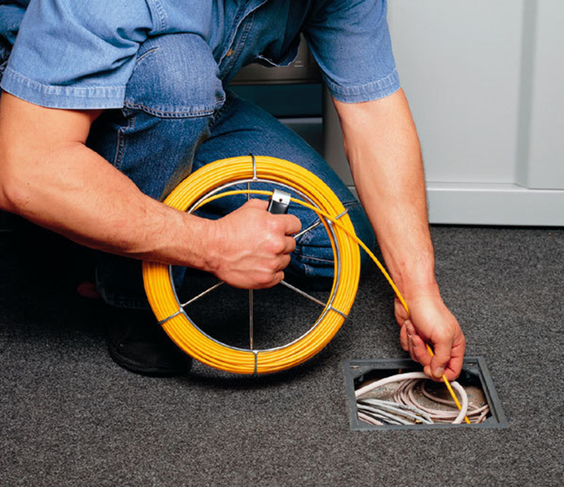
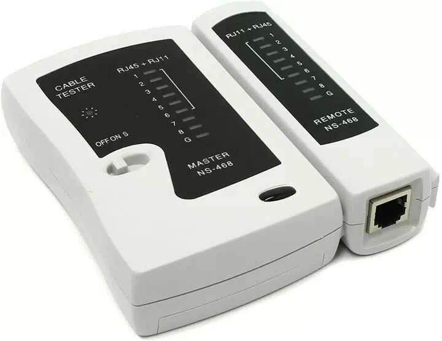

# Общая схема инсталляции услуги

## Перед выездами

### Начало рабочего дня

Подготовься к работе:

- пройди ежедневный инструктаж;
- надень чистую спецодежду с логотипом ПАО «Ростелеком».

Перед началом работы проверь, выполнены ли подготовительные действия:

- пройден инструктаж;
- надета чистая спецодежда;
- взяты СИЗ, удостоверение, бахилы и салфетки.

### Инструменты для выполнения работ

#### Общие

- Стриппер

- Тестовая телефонная трубка.
- Бокорезы.

- Молоток.
- Нож монтажный или кабельный.

- Отвёртка индикаторная.
- Перфоратор.
- Устройство закладки кабеля.

- Фонарь налобный.
- Сумка или рюкзак для инструментов.
- Инструменты и материалы для уборки мусора после проведения инсталляции.
- Инструменты и материалы для мелкого ремонта повреждений, возникших во время инсталляции.

- Индикатор определения скрытой электропроводки.
- Пассатижи.
- Рулетка.
- Удлинитель электрический.
- Шуруповерт аккумуляторный.

- Лестница универсальная.

#### Для витой пары

- Инструмент обжимной

- Кабельный тестер LAN.

#### Для оптоволокна

- Измеритель мощности оптического сигнала.

- Аппарат для сварки оптических волокон.

- Стриппер для снятия изоляции оптического кабеля.

- Безворсовые салфетки.
- Изопропиловый спирт.
- Визуальный локатор повреждений на оптическом кабеле (VFL).

## Работа

Алгоритм выполнения работы

## Подготовка к выполнению работ у Клиента

Подготовка включает в себя 4 основных шага. Разберём их подробнее.

### 01. Получение наряда

- Запусти приложение ЦМ / ММ и предоставь ему доступ к геолокации. Не отключай геолокацию во время рабочего дня.
- Посмотри в ЦМ / ММ назначенные наряды на день и рассчитай, сколько АО потребуется.

**Для нарядов по инсталляции**

- Проверь, готов ли Клиент заключить электронный договор (есть ли соответствующий комментарий в наряде). Если комментария нет — распечатай Клиентский пакет документов в двух экземплярах. Шаблоны ты можешь запросить у своего руководителя.

**Клиентский пакет документов**

- Договор об оказании Услуг связи с физическим лицом.
- Условия оказания услуг.
- Акт выполненных работ и приёма-передачи оборудования.
- Пустографки:*
    - Акт выполненных дополнительных работ.
    - Акт приёма-передачи оборудования (возврат/демонтаж).
    - Акт замены оборудования.
    - Договор об оказании услуг подвижной связи.
    - Договор гарантийного обслуживания по услуге «Гарантия плюс».

*Пустографки применяются при переоформлении договора и при исправлении ошибок.

### 02. Сборы

- Подготовь набор инструментов, материалов, оборудования и SIM-карт под запланированные на день инсталляции. Сверь его с оборудованием в ЦМ / ММ в разделе «Рюкзак монтажника». Всегда имей при себе запас каждого типа АО.
- Проверь заряд смартфона и не забудь зарядку.
- Получи ключи от телекоммуникационных шкафов (при наличии на площадке) по адресам.

### 03. Дозвон

- Созвонись с Клиентом в ЦМ / ММ за 30–60 минут до времени визита:
    - подтверди визит в назначенное время;
    - сверь адрес выполнения работ с указанным в наряде.
- Клиент не успевает или не может присутствовать лично?
    - Спроси, сможет ли вместо него присутствовать совершеннолетний с паспортом и разрешено ли проводить работы в его присутствии.
    - Не заходи в квартиру, если там нет лиц старше 18 лет.

**Алгоритм звонка Клиенту**

> **Недозвон** — ситуация, когда Клиент не отвечает на звонок. Недозвон не расценивается как отказ Клиента от инсталляции или исправления неисправностей и не отменяет выезд к Клиенту в назначенное время.

### 04. Выезд

- Доберись до адреса не позже чем через 10 минут после начала интервала инсталляции.

**Что делать, если опаздываешь?**

За 15 минут до назначенного времени позвони Клиенту, предупреди и скажи, когда примерно будешь.

**Клиента не оказалось на адресе, и он не берёт трубку?**

- Жди не меньше 30 минут. Прозванивай Клиента каждые 10 минут.
- Если за это время Клиент не появился и не ответил по телефону — свяжись с оператором НПП / НТПВС, сообщи об отсутствии Клиента и согласуй дальнейшие действия. Оператор НПП / НТПВС связывается с Клиентом и сообщает тебе решение.
- Покидай адрес Клиента только после согласования с оператором НПП / НТПВС.

- Получи доступ во все помещения и ко всему оборудованию, необходимому для проведения работ.

**Не удалось получить доступ к оборудованию?**

Если доступ к оборудованию ПАО «Ростелеком» на объекте ограничивает:

- **УК (управляющая компания), ТСЖ (товарищество собственников жилья).** Свяжись с руководителем/куратором и ГРТ (группа по работе с территориями). Их задача — постараться организовать доступ и сообщить тебе результат.
- **Соседи.** Совместно с Клиентом обсуди варианты решения вопроса. Попроси Клиента договориться с соседями о предоставлении доступа к оборудованию компании.
- Если проблема с доступом не решена — сообщи оператору НПП / НТПВС, что покидаешь адрес, чтобы он мог отложить визит.

**Что сказать Клиенту**

- Принеси извинения от лица Компании.
- Кратко объясни, почему не получилось провести инсталляцию.
- Сообщи о дополнительном звонке оператора НПП / НТПВС для назначения нового времени визита.
- Назови предположительный срок решения проблемы Клиента, если известны сроки и Клиент задаёт такой вопрос.

Прежде чем отправляться на выезд, проверь наличие:

- брендированной формы от ПАО «Ростелеком»;
- исправного инструмента;
- рекламной продукции;
- при необходимости — полного пакета документов.

Далее не забудь:

- позвонить через приложение ЦМ / ММ Клиенту за 30–60 минут до начала интервала инсталляции, подтвердить визит в назначенное время, сверить адрес выполнения работ;
- прибыть в согласованное с Клиентом время, в рамках интервала инсталляции.

Теперь переходим к встрече с Клиентом.

## Выполнение работ у Клиента

Выполнение работ у Клиента — основной этап твоей деятельности. Твоя задача — спланировать и согласовать с Клиентом предстоящие работы, выполнить все действия, указанные в наряде, взаимодействовать с Клиентом во время работы и продемонстрировать ему предоставляемую услугу.

Состав работ может отличаться в зависимости от наряда или заявки, но начало процесса всегда одинаковое.

### Приветствие и проверка документов

Перед входом в квартиру надевай бахилы и снимай при выходе. Делай так всегда, даже если Клиент говорит, что можно без бахил. Так ты защитишь пол от грязи, а свою обувь — от любопытных животных.

1. Поздоровайся, представься, покажи удостоверение и объясни цель визита.
2. Спроси у Клиента, как к нему можно обращаться.
3. Спроси, куда можно повесить верхнюю одежду и где расположить инструменты.
4. Сверь данные Клиента с указанными в наряде.

**Наряд на инсталляцию**

- Попроси Клиента показать документ, удостоверяющий личность, и убедись, что это человек, указанный в наряде.
- Работы можно проводить без Клиента, в присутствии его представителя. В этом случае у представителя должна быть официальная доверенность и паспорт.
- Если у Клиента нет актуального паспорта или у представителя нет доверенности, звони в НПП. Оператор НПП свяжется с Клиентом и предложит оформить договор на того, кто присутствует на месте. Оператор сообщит тебе о результатах:
    - Клиент согласен — приступай к инсталляции.
    - Клиент не согласен — покидай адрес.

5. Убедись, что квартира не используется в коммерческих целях. Если что-то не так — звони в НПП. Оператор НПП свяжется с Клиентом и предложит заключить договор на условиях для бизнеса.

### Согласование состава услуг

1. Сверь с Клиентом:
    - состав услуг;
    - АО;
    - размер абонентской платы.
2. Предложи дополнительные услуги/оборудование. Если Клиент согласится или изменит первоначальный заказ, скорректируй его самостоятельно: добавь услуги или оборудование через ЦМ / ММ. Если возникнут сложности — позвони в НПП. Оператор поменяет заказ и обновит состав работ в наряде.

Затрудняешься с ответом Клиенту по продуктам? Звони в НПП.

3. Ознакомь Клиента с документами для электронного документооборота.
    - Попроси Клиента открыть страницу https://ed.rt.ru/ по ссылке из СМС, направленной ему ранее, или ввести адрес вручную.
    - Помоги Клиенту:
        - пройти идентификацию по номеру телефона;
        - ознакомиться с публичной офертой;
        - согласиться на обработку персональных данных и подписание пакета документов в электронном виде.

### Согласование места расположения АО

1. Совместно с Клиентом выбери подходящее место для установки АО:
    - маршрутизатора/роутера, при подключении по технологии FTTB;
    - ONT (Optical Network Terminal, в переводе с английского — «Оптический сетевой терминал»), при подключении по технологии GPON.

**Требования к установке АО**

- АО нельзя ставить внутри шкафов, в ванной комнате, туалете и на кухне.
- Размещай АО максимально близко к основным потребителям по центру нужной зоны покрытия и максимально далеко от потенциальных источников помех.
- На пути распространения сигнала должно быть минимальное количество препятствий.
- Не ставь АО рядом с металлом, зеркалами или бетоном — это создаёт риски переотражения сигнала.
- Для подключения АО не используй розетку между ванной комнатой и туалетом.

Подключи АО к электросети в предполагаемом месте его установки.

Проведи необходимые замеры уровня сигнала Wi-Fi Клиента в ЦМ/ММ — «радиопланирование». Важно, чтобы сигнал был в пределах допустимой нормы.

Если зоны покрытия Wi-Fi или скорости недостаточно для квартиры Клиента, предложи другое месторасположение или дополнительное оборудование. Если Клиент согласен, добавь оборудование в ЦМ/ММ самостоятельно. Если не получается — позвони в НПП (направление поддержки продаж): оператор изменит состав заказа.

Выбирая место для АО, сразу продумай трассу кабеля. Следи, чтобы кабель:
- был в недоступном для детей и животных месте;
- не защемлялся и не передавливался;
- не повреждался острыми предметами;
- не перегибался на углах.

### Согласование плана и времени работ

1. Поясни Клиенту, какие работы нужны для подключения и сколько времени понадобится.
2. Согласуй с Клиентом трассу прокладки кабеля внутри квартиры и место технологического отверстия (при необходимости).

Если инсталляция производится в присутствии представителя, свяжись с Клиентом и согласуй монтажные работы по телефону.

**Что делать, если Клиент не согласовал состав услуг или отменил заказ?**

Если Клиент решает отменить заказ или часть услуг — звони оператору НПП. Оператор сообщит, что делать дальше.

После согласования всех деталей установки оборудования выполни его монтаж, подключение и настройку, а затем продемонстрируй работу услуги. Далее переходи к завершению работ.

### Наряд на устранение неисправностей

Бывают ситуации, когда у ранее подключённого Клиента возникают проблемы с работоспособностью услуги: например, появляются ошибки при подключении к сети или отсутствует интернет-соединение. В таких случаях потребуется твоя помощь — выезд для устранения неисправности.

Перед началом работ важно пообщаться с Клиентом:

- Попроси Клиента подробно описать проблему, чтобы понять суть неисправности.
- Сравни описание Клиента с информацией в наряде или заявке. Если обнаружишь расхождения, устрани все обнаруженные проблемы.
- Визуально оцени состояние АО и линий связи, чтобы определить точный объём работ и возможные риски.
- Объясни Клиенту, как будет происходить устранение неисправности и какие этапы работы будут выполнены.
- Уточни, остались ли у Клиента вопросы или дополнительные пожелания, чтобы избежать повторных выездов.

Выяснив все детали заранее, ты сможешь избежать типичных жалоб Клиентов на торопливость, невнимательность, грубость сотрудника, повреждение имущества или проблемы с качеством услуги.

Выполняя работы у Клиента, не забудь:

- представиться, показать служебное удостоверение;
- использовать бахилы;
- выяснить у Клиента суть проблемы и согласовать порядок работ.

Теперь перейдём к этапу завершения работ.

## Завершение работ у Клиента

На этом этапе важно предотвратить возможные замечания Клиентов. Новые Клиенты могут не знать, чего ожидать при эксплуатации услуги, поэтому заранее объясни им ключевые моменты и покажи, на что обратить внимание. Это поможет снизить количество обращений в службу технической поддержки и улучшить твои КПЭ.

1. Помоги Клиенту подписать договор и заполнить Клиентский пакет документов в электронном формате. Если Клиент отказывается или нет технической возможности — оформи всё на бумаге.

Если документы подписывали на бумаге — сдай их руководителю сервисного центра или куратору инсталляций в течение 24 часов после инсталляции.

**Договор оформляется на лицо, присутствующее на адресе**

В этом случае при электронном подписании внеси новые данные через систему «Электронный договор», а при бумажном — используй чистые бланки. Не допускай помарки и исправления.

2. Расскажи Клиенту про возможности Единого Личного Кабинета (ЕЛК) и мобильного приложения Личный Кабинет (МЛК).

С возможностями личного кабинета можно познакомиться в курсе «Мобильный/Личный кабинет».

> Перейти в курс

Адрес доступа ЕЛК: start.rt.ru.

3. Уточни у Клиента, пользовался ли он ранее личным кабинетом. Предложи установить или покажи, как открыть браузерную версию.

4. Помоги войти в личный кабинет и покажи, как посмотреть: баланс лицевого счёта, подключённые услуги и тарифные планы, оплату услуг. Предложи подключить автоплатёж.

Если в пакете есть конвергент — объясни Клиенту, что платить за него нужно через пополнение счёта мобильного телефона, на который подключена услуга.

5. Расскажи Клиенту о:
    - программе лояльности «Бонус» и, при согласии Клиента, помоги зарегистрироваться в программе;
    - возможностях ПАО «Ростелеком», дополнительных услугах и сервисах и предложи Клиенту подходящие решения (сделай допродажу);
    - способах устранения типовых неисправностей.

6. Сделай фотофиксацию результатов работ и прикрепи к наряду в ЦМ / ММ.

Если Клиент отказывается подписывать акт или фиксировать результат работ — обязательно укажи это в акте выполненных работ.

7. Если были дополнительные платные работы — заполни акт с указанием стоимости работ и материалов, подпиши у Клиента в ЦМ / ММ.*
8. Закрой Наряд в ЦМ / ММ.*

*Если технической возможности нет — сообщи руководителю/куратору.

9. Убери мусор и обрезки кабеля как в квартире, так и на лестничной клетке подъезда.
10. Перед уходом спроси Клиента, остались ли у него вопросы.
11. Сообщи Клиенту о завершении работ.
12. Оставь рекламные раздаточные материалы (при наличии), расскажи о новых Услугах ПАО «Ростелеком».
13. Расклей внутри подъезда на объектах «Ростелеком» актуальную брендовую наклейку — одну наклейку на место.
14. Попроси Клиента оценить качество твоей работы. Электронный опрос придёт на следующий день на номер мобильного телефона Клиента.
15. Поблагодари Клиента за выбор ПАО «Ростелеком», пожелай приятного пользования, попрощайся.

**Что сказать Клиенту**

Примерная речь: «[Имя Клиента], по окончании моего визита Вам поступит СМС с приглашением к оценке качества проведённых мной работ. Я прошу Вас принять участие и ответить на вопросы. Спасибо за выбор "Ростелеком", желаю приятного пользования, всего доброго, до свидания».

Не забудь выполнить следующие действия:

- убрать мусор в квартире, в подъезде, появившийся в ходе выполнения работ по подключению услуг;
- спросить у Клиента, не осталось ли вопросов по использованию услуги связи и оборудования, ответить при их наличии;
- сделать фотофиксацию результатов выполнения работ;
- прикрепить фото и скриншоты измерения к наряду в ЦМ / ММ согласно требованиям к фотоотчёту;
- при заключении договора проверить наличие в нём контактных данных Клиента (телефон, адрес электронной почты);
- закрыть наряд в ЦМ / ММ.

## Заключение

Курс завершён. Теперь ты знаешь, как работать по стандарту обслуживания: готовиться к выезду, взаимодействовать с Клиентом, выполнять и завершать работы. Следуя стандарту, ты повышаешь удовлетворённость Клиентов, сокращаешь количество ошибок и жалоб и можешь увеличить размер своей премии.

Для оперативного решения проблем используй Единый номер поддержки инсталлятора.

