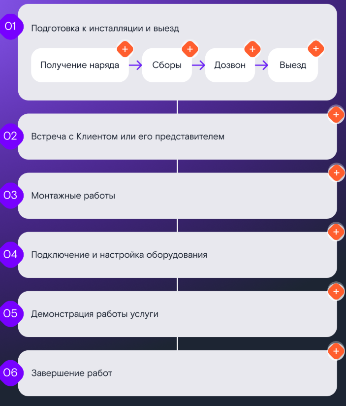
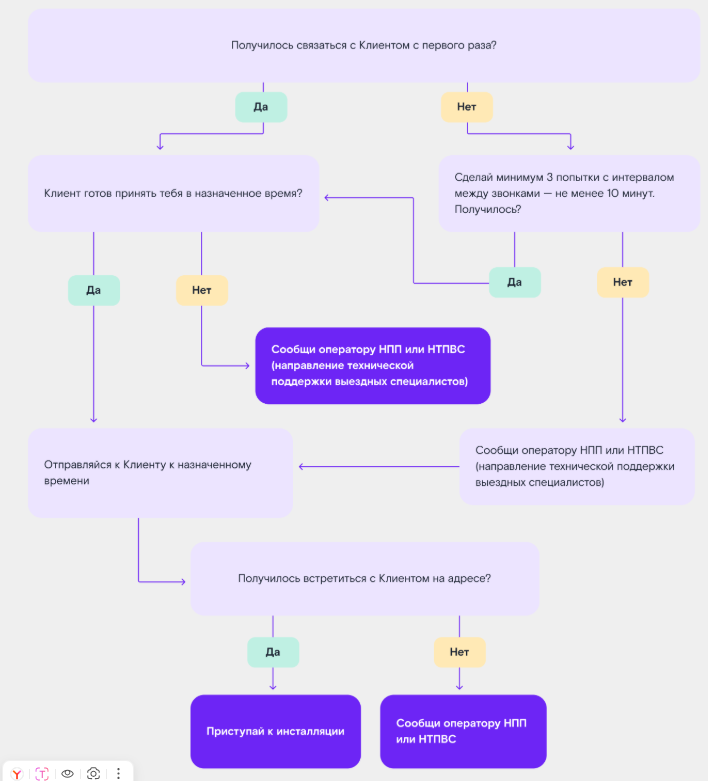
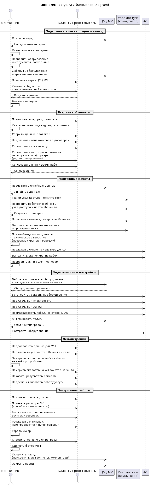
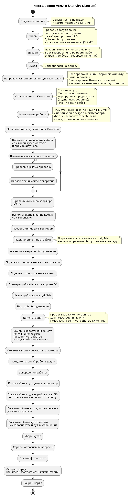

## Этап 1. Подготовка к инсталляции и выезд

### 1.1. Получение наряда
- Монтажник открывает приложение **ЦМ (цифровой монтажник) / ММ (мобильный монтажник)**.
- Ознакамливается с назначенным нарядом и комментариями к нему.
- Уточняет:
    - тип наряда (инсталляция, устранение неисправности, замена оборудования);
    - состав услуг и оборудования;
    - особые условия (электронный договор, присутствие представителя, доступ к оборудованию).
- При необходимости запрашивает у руководителя шаблоны клиентского пакета документов.

### 1.2. Сборы
- Проверяет наличие и исправность:
    - инструментов (общих, для витой пары, для оптоволокна);
    - расходных материалов;
    - СИЗ, удостоверения, бахил, салфеток.
- Проверяет запас **АО** (абонентского оборудования) по каждому типу.
- Добавляет необходимое оборудование в раздел **«Рюкзак монтажника»** в ЦМ / ММ.
- Проверяет заряд смартфона и наличие зарядного устройства.
- Получает ключи от телекоммуникационных шкафов (при наличии).

### 1.3. Дозвон
- Совершает звонок Клиенту **через ЦМ / ММ** за 30–60 минут до визита.
- Подтверждает:
    - время визита;
    - адрес выполнения работ.
- Уточняет, что во время работ в квартире будет находиться **совершеннолетний** (Клиент или представитель с паспортом/доверенностью).
- Если Клиент не отвечает — фиксирует **недозвон** (не отменяет выезд).

### 1.4. Выезд
- Отправляется на адрес Клиента.
- При опоздании — предупреждает Клиента за 15 минут до назначенного времени.
- Прибывает не позже чем через 10 минут после начала интервала инсталляции.

---

## Этап 2. Встреча с клиентом или представителем

- При входе в квартиру:
    - здоровается;
    - представляетcя, показывает удостоверение;
    - снимает верхнюю одежду;
    - надевает бахилы.
- Сверяет данные Клиента с заявкой (паспорт, доверенность при необходимости).
- Предлагает ознакомиться с договором.
- Согласует с Клиентом:
    - состав услуг;
    - место расположения маршрутизатора/роутера (выполняет **радиопланирование**);
    - план и время работ.

---

## Этап 3. Монтажные работы

- Смотрит **линейные данные** в ЦМ / ММ.
- Находит узел доступа (коммутатор).
- Убеждается в работоспособности:
    - узла доступа (коммутатора);
    - порта абонента.
- Прокладывает линию до квартиры Клиента.
- Выполняет оконечивание кабеля со стороны узла доступа (коммутатора) и **маркирует** его.
- При необходимости делает техническое отверстие, предварительно проверив скрытую проводку.
- Прокладывает линию по квартире Клиента до **АО**.
- Выполняет оконечивание кабеля со стороны АО.
- Проверяет проложенную линию **LAN-тестером**.

---

## Этап 4. Подключение и настройка

- В **«рюкзаке монтажника»** в ЦМ / ММ выбирает и привязывает оборудование к наряду.
- Устанавливает/закрепляет оборудование.
- Подключает оборудование:
    - к электросети;
    - к линии.
- Маркирует кабель со стороны АО.
- Активирует услуги в ЦМ / ММ.
- Настраивает оборудование.

---

## Этап 5. Демонстрация

- Предоставляет Клиенту данные для подключения к **Wi-Fi**.
- Подключает к сети устройство Клиента.
- Замеряет скорость интернета:
    - по Wi-Fi и по кабелю;
    - на своём устройстве и на устройстве Клиента.
- Показывает Клиенту результаты замеров.
- Демонстрирует работу услуги.

---

## Этап 6. Завершение работы

- Помогает Клиенту подписать договор.
- Показывает, как работать в **ЛК (личном кабинете)**:
    - способы и суммы оплаты по тарифу.
- Рассказывает о дополнительных услугах и сервисах.
- Рассказывает о типовых неисправностях и путях их решения.
- Убирает мусор.
- Спрашивает, остались ли вопросы.
- Делает **фотоотчёт**.
- Оформляет наряд:
    - прикрепляет фотоотчёты;
    - добавляет комментарий.
- Закрывает наряд.

