> **Узел доступа (коммутатор)** — сетевое устройство, размещаемое в телекоммуникационном шкафу, обеспечивающее подключение абонентов к сети провайдера через LAN-порты.

Over-the-Top — услуга может работать на сети любого провайдера), Клиент может использовать собственное оборудование (маршрутизатор/роутер).

## Че вообще буду делать

### > **FTTB (Fiber To The Building)** — технология подключения к интернету, при которой оптический кабель прокладывается до здания (узла доступа), а внутри здания до абонента используется медный кабель витой пары.

FTTb: до 100 мб (в некоторых сетях до 890 мб). Домашний интернет, интерактивное ТВ (до трех), (без телефона!!!)

1. Волоконно-оптический кабель прокладывается до телекоммуникационного шкафа, расположенного в многоквартирном доме.
2. От узла доступа (домового коммутатора доступа) до абонентского оборудования Клиента проводится медный кабель витой пары UTP Cat. 5e.

Схемы:

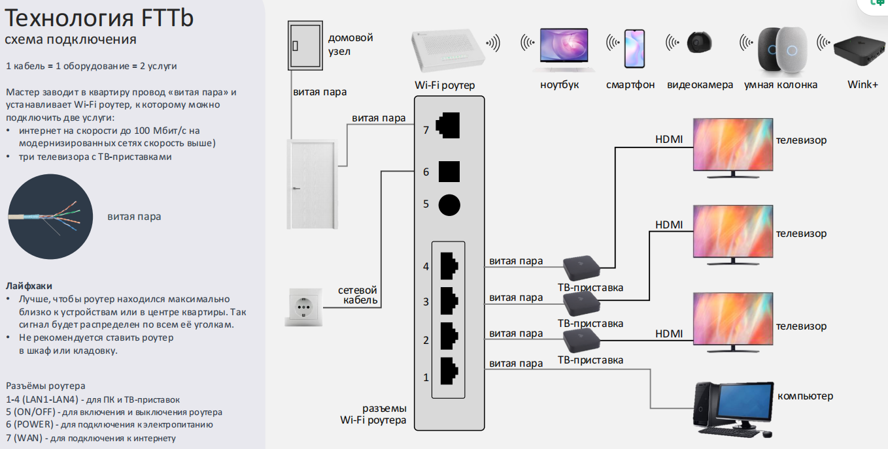

Узел доступа (коммутатор) размещают в антивандальных телекоммуникационных шкафах настенного или напольного типа. Шкаф устанавливают в подъездах домов, других технических и нежилых помещениях.

На узле доступа (коммутаторе) есть от **4 до 48 LAN-портов** для подключения абонентов. У каждого LAN-порта есть два светодиода, по которым можно определить его состояние: наличие подключения и активность передачи данных.

**01. Поиск узла доступа и определение порта абонента**

Посмотри линейные данные в ЦМ/ММ, найди узел доступа (коммутатор) и определи порт абонента.

**02. Проверка работоспособности узла доступа и порта абонента**

Подключи рабочий ноутбук через короткий патч-корд к абонентскому порту на узле доступа (коммутаторе) или используй цифровой LAN-тестер.

На порту узла доступа (коммутатора) должна появиться индикация.

### GPON (Gigabit Passive Optical Network) — технология пассивных оптических сетей, позволяющая по единой оптической сети передавать трафик разных типов (интернет, IP-телефония, телевидение) на скорости до 1 Гбит/с.

1. Волоконно-оптический кабель прокладывается до телекоммуникационного шкафа, расположенного в многоквартирном доме.
2. От узла доступа (домового коммутатора доступа) до абонентского оборудования Клиента проводится медный кабель витой пары UTP Cat. 5e.

Gpon: до гигабита. Интернет, ТВ (до трех), телефон.
Как: в дом оптоволокно -> ont (с WiFi)/ pon -> телефон/ 3 тв приставки/ интернет.

Плюсы : оптика и высокая скорость

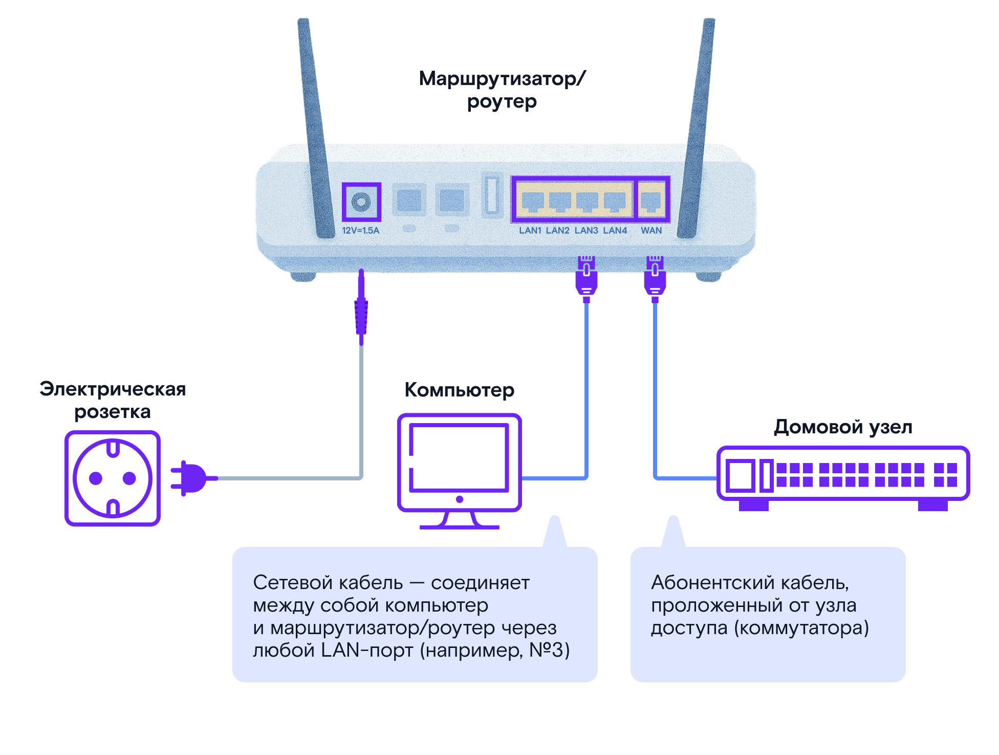

Схемы подключения:

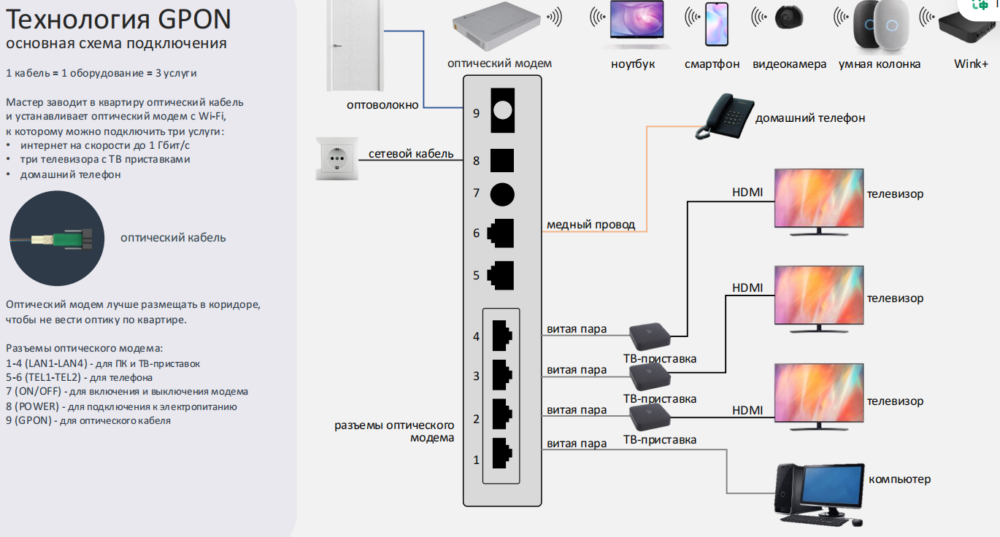

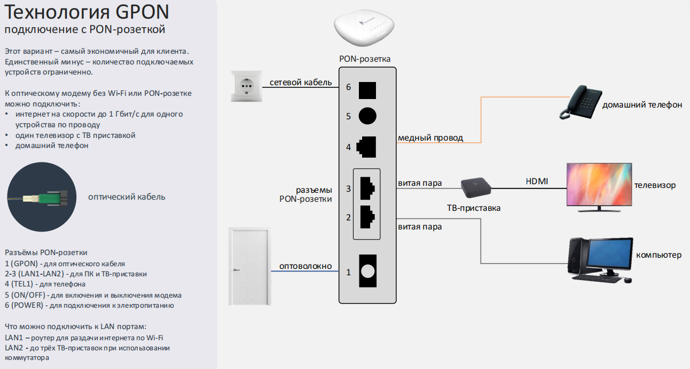

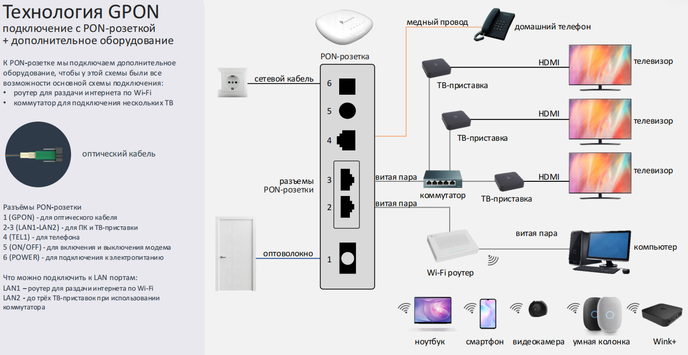

### ADSL

(ассиметрична)скачивание до 10мбит с, загрузка до 1 мбит с; в некоторых сетях XDSL до 100мбс. Интернет, Интерактивное Тв (ДО 1 приставки), домашний телефон.

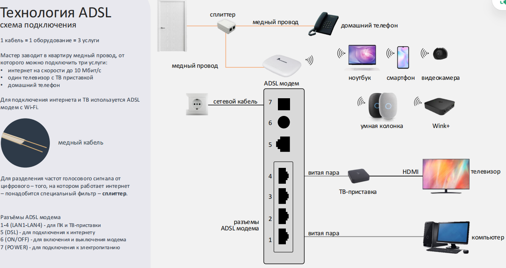

### БШПД

Беспроводной широкополосный доступ по радиоканалу

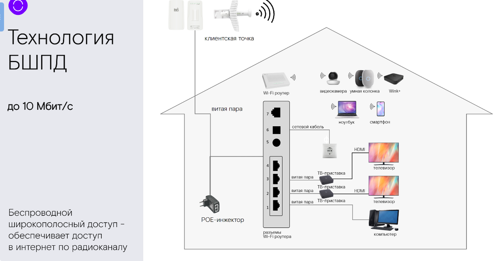

### DOCSIS

Телевизионный коаксиальный кабель

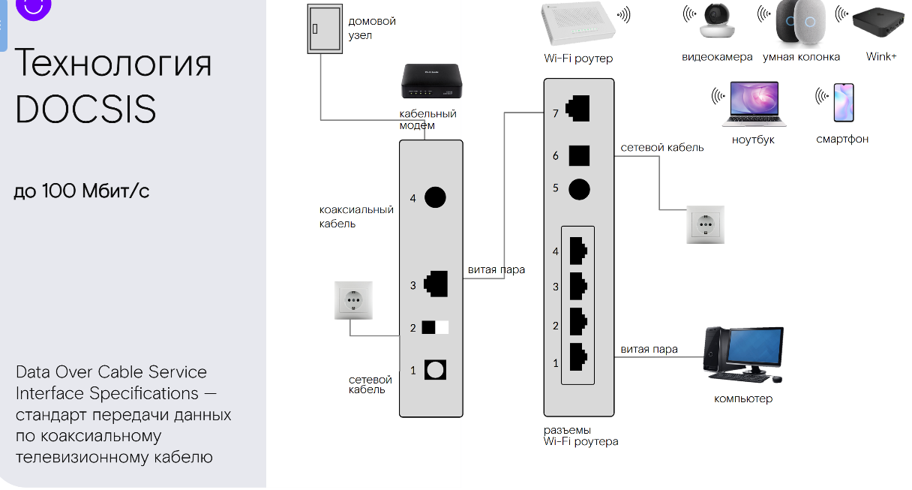

### Wink

Тут либо с подключением интернета/только подключение тв

2 Вида:

#### 1.Проводной способ + STB «Ростелеком»

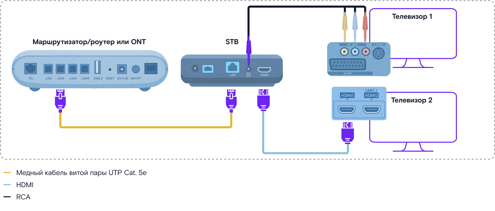

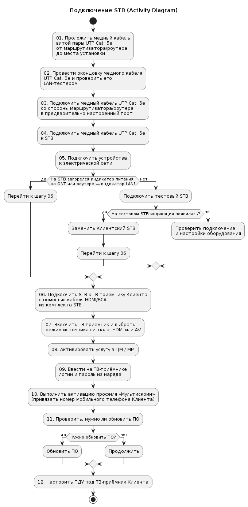

#### 2. Wink TB-Онлайн + STB (WinkBox, Android TV, Apple TV)

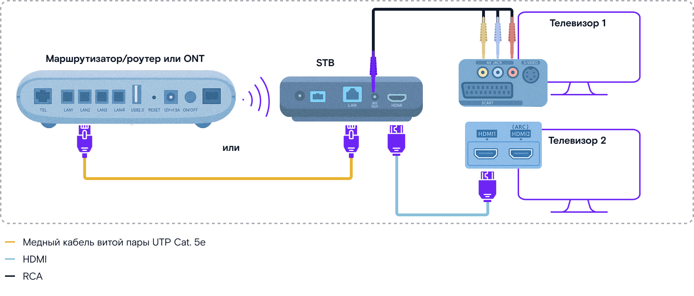

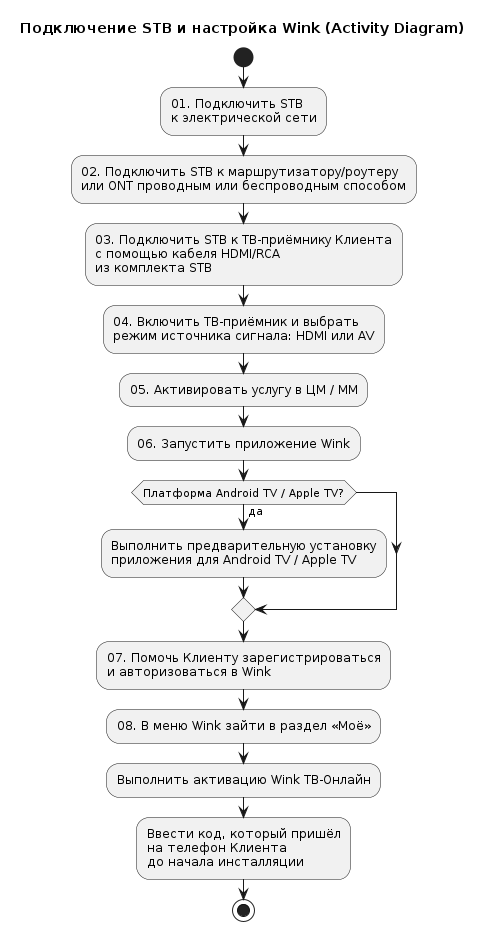

#### 3. Wink TB-Онлайн + Smart TV

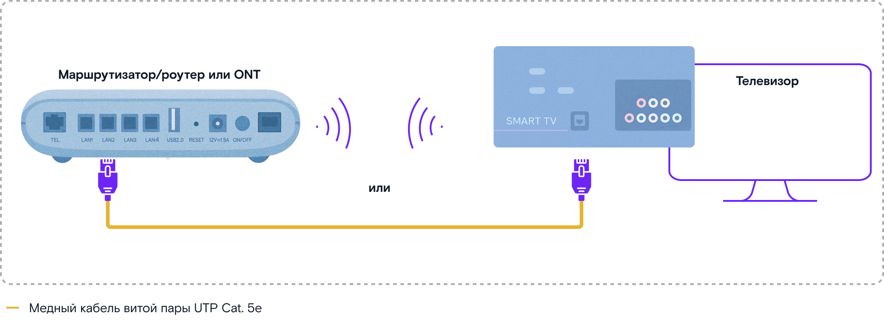

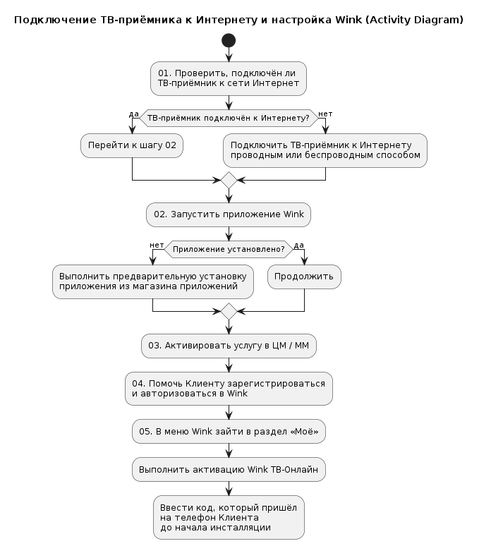

Для всех Винков

проверь, всё ли выполнено:

- подключена ТВ-приставка STB (при необходимости);
- выполнена активация услуг в информационной системе с помощью ЦМ/ММ;
- Клиент зарегистрирован/авторизован в Wink;
- выполнена активация услуг в разделе «Моё» (при подключении Wink TB-Онлайн).

После 

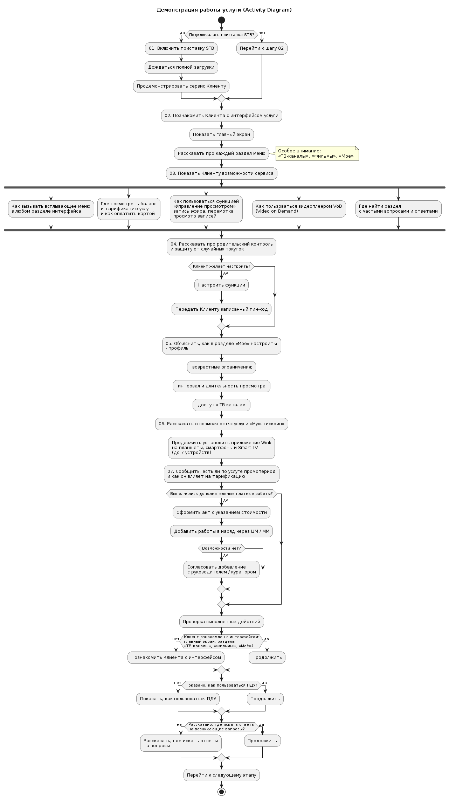

Пакеты, которые нужно впарить:

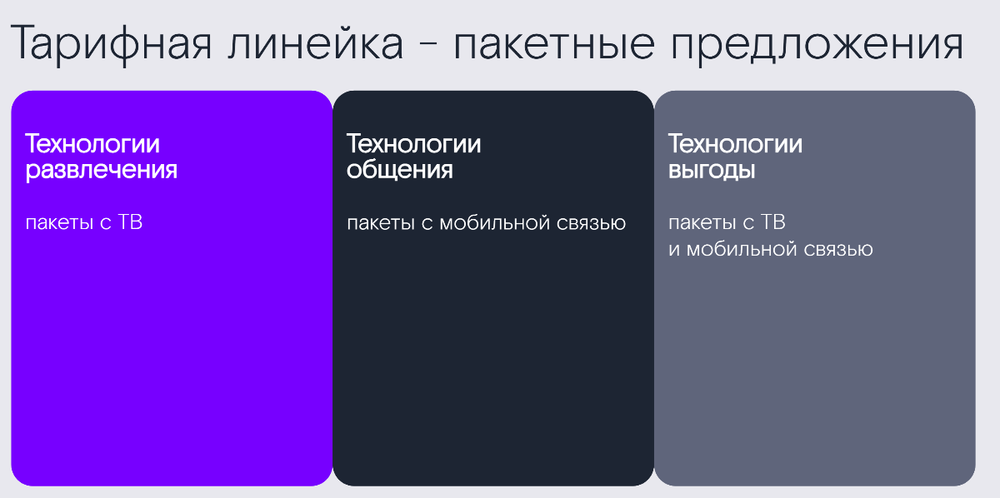

### Видеонаблюдение

2 Варианта:

1. Внутренняя (домашняя) камера для видеонаблюдения внутри квартиры.

Камера подключается к маршрутизатору/роутеру или ONT по Wi-Fi. Некоторые модели камер могут подключаться через медный кабель витой пары UTP Cat. 5e. Камеры питаются от сети 220В через адаптер. 

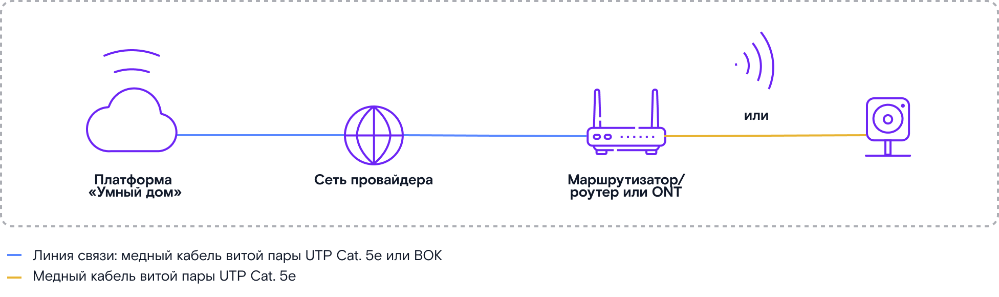

2. Внешняя (уличная) камера для наружного наблюдения.

Камера подключается к маршрутизатору/роутеру или ONT через медный кабель витой пары UTP Cat. 5e. Камера может питаться как через PoE-инжектор, так и напрямую от сети 220В через адаптер.
РоE-инжектор — устройство, которое передаёт данные и подаёт электропитание на сетевые устройства через медный кабель витой пары UTP Cat. 5e.

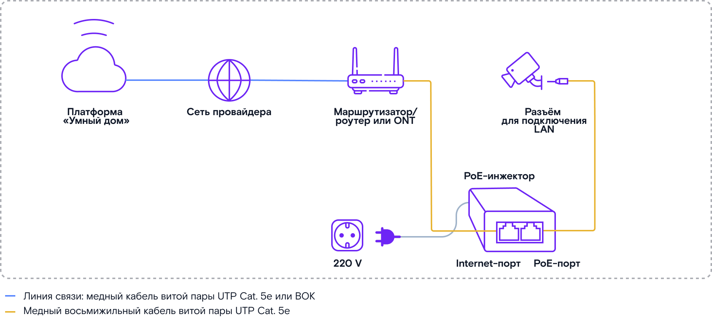

Poe инжектор:

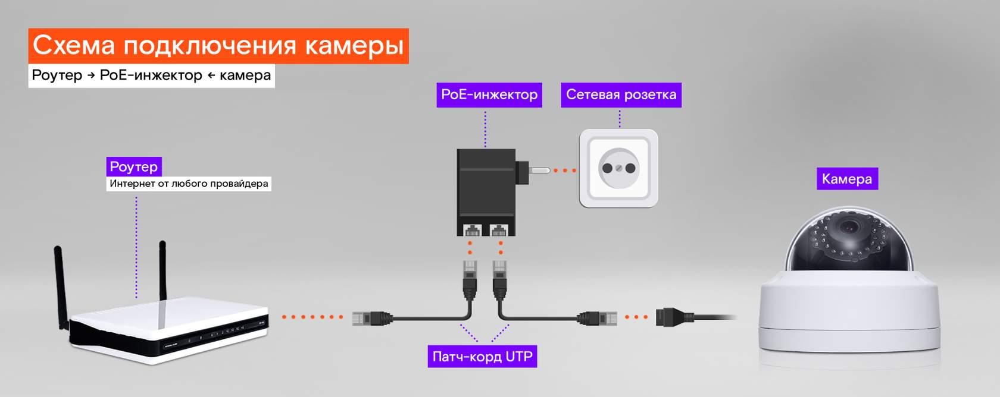

Для камер:

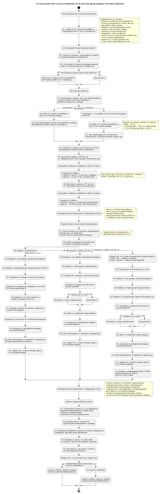