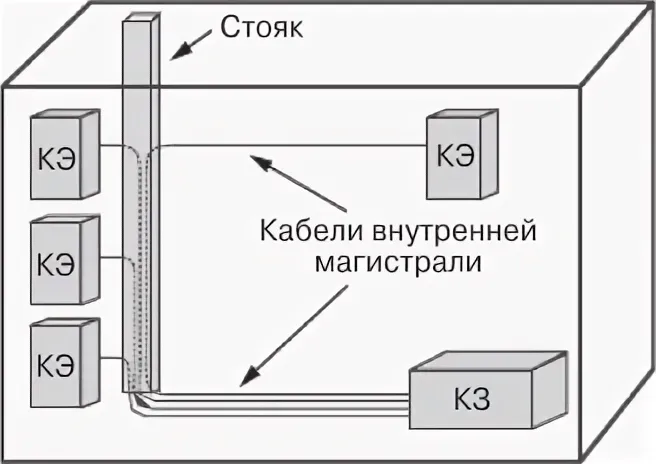
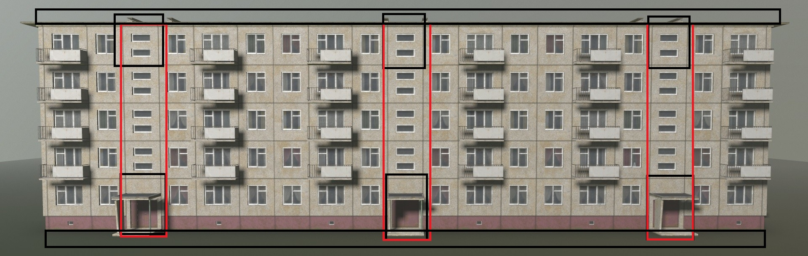
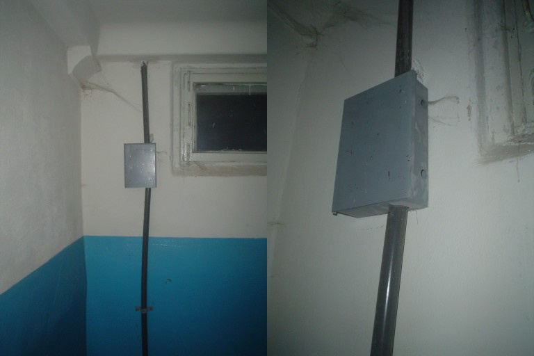
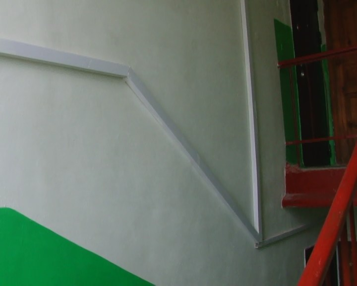
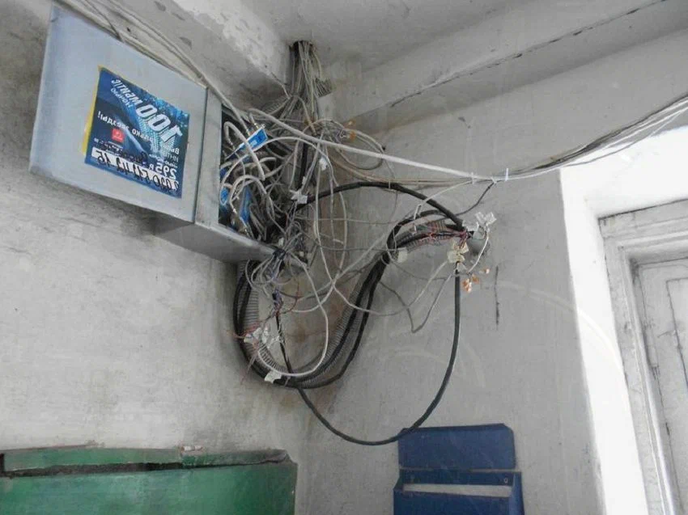
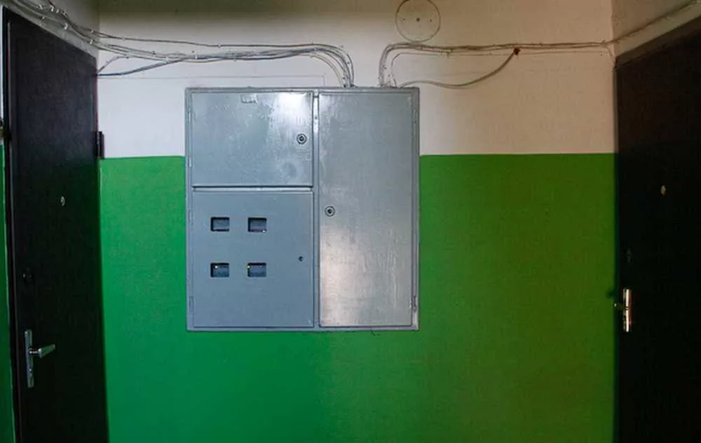
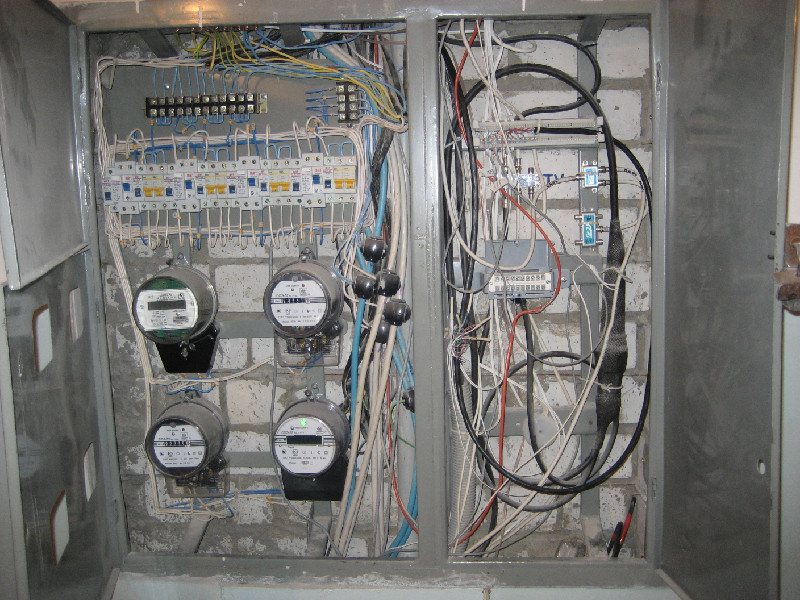

## Структура

# Систематизация: где в здании располагаются слаботочные системы

Ты уже неплохо всё разложил. Ниже — структурированная версия твоих наблюдений с уточнениями и расширениями, чтобы получилась рабочая карта для монтажника.

---

## 1. Иерархия СКС здания (упрощённо)

```
[Внешний провайдер]
        │
   ┌────▼─────┐
   │  Кроссовая│  ← ввод, активное оборудование, магистраль
   │  (КВМ)    │
   └────┬─────┘
        │ вертикальная магистраль
   ┌────▼─────┐
   │   КЭ      │  ← этажный кросс
   └────┬─────┘
        │ горизонтальная часть
   ┌────▼─────┐
   │  Розетка  │  ← рабочее место
   └──────────┘
```

**Аббревиатуры:**
- **КВМ** — кроссовая внутренней магистрали (главный узел)
- **КЭ** — кросс этажный (или «кросс этажа»)
- **СКС** — структурированная кабельная система



---

Возможные зоны размещения оборудования:



1. Красным - КЭ
2. Черным - КЗ

## 2. Кроссовая внутренней магистрали (КВМ)

**Где размещается:**
- Одна на несколько подъездов (часто — на весь дом или на группу).
- Этаж:
    - **Верхний** — если магистраль идёт «воздушкой» (по чердаку/техэтажу).
    - **Первый** — если используется подземная канализация (ввод снизу).
    - **Средний** — реже, но бывает при звёздообразной топологии.
- Помещение: техпомещение, электрощитовая, подвал, чердак, тамбур.

**Что внутри:**
- Активное оборудование: коммутаторы, медиаконвертеры, маршрутизаторы.
- Патч-панели (вертикальная/статическая часть СКС).
- Оптический кросс (если магистраль на оптике).
- Часто — шкаф (настенный или напольный).

**Особенность:** бывает **двойная кроссировка** — когда кабель от провайдера приходит на одну панель, а от неё патч-кордом идёт на другую панель/оборудование.

---

## 3. Кросс этажный (КЭ)

**Где размещается:**
- Небольшой шкафчик/бокс на этаже.
- Обычно на **средних этажах** (чтобы минимизировать длину горизонтальных линий), но фактически — где есть место и доступ.
- Часто — в **этажном щитке**: справа слаботочка, слева силовая часть (счётчики).

**Что внутри:**
- Патч-панель или плинт (для телефонных линий).
- Иногда — коммутатор (если есть активка на этаже).
- Может быть верхней частью вертикальной системы здания.

**Важно:** в щитке слаботочная часть **должна быть физически отделена** от силовой (разные отсеки, разные кабельные вводы).

---

## 4. Внутренняя магистраль (вертикальная часть)

**Старые дома:**
- Кабель-канал в виде трубы через перекрытия этажей.



- Пластиковый короб вдоль стен подъезда.



- Открытая прокладка по стене.



**Более новые дома:**
- В щитках: слева — силовая часть, справа — слаботочка.

|   |   |
|---|---|


- Специализированные стояки/шахты.
- Гофра/труба в стене.

---

## 5. Горизонтальная часть (от КЭ до розетки)

**Старые дома:**
- Открыто по стене на хомутах.
- В плинтусах (реже).
- Вдоль дверных проёмов.

**Новые дома:**
- Фальшпотолки.
- Кабель-каналы.
- Штробы в стенах.
- Гофра под стяжкой.

---

## 6. Практические заметки для монтажника

1. **Всегда уточняй топологию** до начала работ: где КВМ, где КЭ, как идёт магистраль.
2. **Слаботочка и силовая — раздельно.** Пересечения — под 90°, расстояние — минимум 50 мм (в идеале).
3. **Маркируй кабели** с двух сторон — сэкономишь себе и коллегам часы.
4. **Проверяй наличие места** в щитке: часто «слаботочный» отсек занят чем-то другим.
5. **Уточняй у провайдера**, где точка ввода — она может не совпадать с КВМ.
6. **Фотографируй** до/после — пригодится при сдаче и для себя.

---

## 7. Что можно добавить в твою схему

- **Типы кабелей:** UTP cat5e/6, оптика, телефонный.
- **Типы кроссов:** оптический, медный, комбинированный.
- **Активное оборудование:** коммутатор, медиаконвертер, ONT.
- **Заземление:** слаботочные шкафы часто требуют заземления.
- **Маркировка:** номера портов, этажей, подъездов.

---

Если хочешь, могу помочь оформить это в виде чек-листа для выезда на объект или схемы-памятки.


## Алгоритм

# Полный алгоритм работы монтажника слаботочных систем

Ниже — сводный алгоритм от получения заявки до сдачи объекта. Оформлен по этапам, с чек-листами и ветвлениями.

---

## ЭТАП 0. Получение заявки

**0.1. Изучить заявку:**
- Адрес, подъезд, этаж, квартира.
- ФИО и телефон абонента.
- Тип услуги (интернет / телефон / ТВ / комбо).
- Тариф (влияет на тип оборудования).
- Особые отметки (жалобы, повторный выезд, VIP).

**0.2. Проверить в приложении монтажника:**
- Где **КВМ** (кроссовая внутренней магистрали).
- Где **КЭ** (кросс этажный).
- Где **КЗ** (кросс здания / точка коммутации).
- Свободные порты в КВМ и КЭ.
- Тип линии (медь / оптика).
- История по адресу (были ли выезды, что делали).

**0.3. Уточнить у абонента (звонок за день):**
- Удобное время.
- Будет ли дома взрослый.
- Есть ли домофон / консьерж / закрытый подъезд.
- Есть ли домашние животные (аллергия, агрессия).
- Есть ли натяжные потолки / плитка / сложные стены.
- Куда хочет вывести розетку.

**0.4. Согласовать с диспетчером:**
- Время выезда.
- Кто встречает.
- Доступ в техпомещения.

---

## ЭТАП 1. Подготовка до выезда

**1.1. Оборудование (с запасом ×2–3):**
- [ ] Кабель (бухта, если тянуть).
- [ ] Коннекторы RJ-45.
- [ ] Патч-корды (2–3 шт., разные длины).
- [ ] Розетки / накладки.
- [ ] Гофра / кабель-канал.
- [ ] Стяжки, хомуты, дюбели, саморезы.
- [ ] Изолента, бирки, маркер.

**1.2. Инструмент:**
- [ ] Обжимка RJ-45.
- [ ] Стриппер / нож.
- [ ] Лан-тестер + обратка.
- [ ] Пробник для плинта (если телефон).
- [ ] Прозвонка (если нет тестера).
- [ ] Перфоратор / шуруповёрт.
- [ ] Бур по бетону, сверло по дереву.
- [ ] Фонарик.
- [ ] Рулетка.
- [ ] Отвёртки (крест, шлиц, мелкие).
- [ ] Пассатижи, бокорезы.
- [ ] **Средство для снятия изоляции с оптики** (если оптика).
- [ ] **Сварочник / скалыватель** (если оптика).

**1.3. Документы и доступы:**
- [ ] Ключи от всех помещений (мастер-шкаф).
- [ ] Ключ от подвала / чердака / техэтажа.
- [ ] Ключ от электрощитовой.
- [ ] Ключ от домофона / калитки.
- [ ] Пропуск (если режимный объект).
- [ ] Заявка / наряд.
- [ ] Телефон заряжен.

**1.4. Проверка:**
- [ ] Тестер работает, батарейки заряжены.
- [ ] Инструмент исправен.
- [ ] Кабель не повреждён.
- [ ] Оборудование соответствует тарифу.

---

## ЭТАП 2. Прибытие на объект

**2.1. Осмотр подъезда:**
- [ ] Найти КЭ (этажный щиток).
- [ ] Найти КВМ (техпомещение).
- [ ] Оценить состояние кабель-каналов.
- [ ] Оценить доступ к стоякам.

**2.2. Встреча с абонентом:**
- [ ] Представиться, показать удостоверение.
- [ ] Уточнить, куда хочет розетку.
- [ ] Осмотреть квартиру.
- [ ] Согласовать трассу ввода.
- [ ] Предупредить о возможных неудобствах (шум, пыль).

**2.3. Осмотр у абонента:**
- [ ] Есть ли уже розетка / кабель?
- [ ] Есть ли линия от нашего оператора?
- [ ] Есть ли линия другого оператора?
- [ ] Есть ли свободные места в щитке?
- [ ] Оценить сложность прокладки.

---

## ЭТАП 3. Ветвление: есть линия или нет

### 3.1. Линия есть

**3.1.1. Линия нашего оператора:**
- [ ] Проверить тестером от розетки абонента до КЭ.
- [ ] Убедиться, что линия не занята.
- [ ] Сфотографировать до работ.
- [ ] Перейти к этапу 4.

**3.1.2. Линия другого оператора:**
- [ ] Проверить, не занята ли (прозвонка).
- [ ] Если свободна — согласовать с абонентом использование.
- [ ] Если в том же кабель-канале — найти её (прозвонка, визуально).
- [ ] Если не найти — обрезать у двери абонента **только с согласия**.
- [ ] Поставить розетку.
- [ ] Перейти к этапу 4.

**3.1.3. Линия непонятная:**
- [ ] Не трогать без уверенности.
- [ ] Проложить новую.
- [ ] Перейти к этапу 3.2.

### 3.2. Линии нет

**3.2.1. Согласование:**
- [ ] Согласовать место ввода с абонентом.
- [ ] Согласовать трассу.
- [ ] Проверить техническую возможность.

**3.2.2. Прокладка:**
- [ ] Сделать техническое отверстие.
- [ ] Завести кабель в квартиру.
- [ ] Проложить трассу (гофра, кабель-канал, штроба).
- [ ] Закрепить кабель.
- [ ] Установить розетку.
- [ ] Обжать коннекторы.
- [ ] Проверить тестером от розетки до конца кабеля.

**3.2.3. Перейти к этапу 4.**

---

## ЭТАП 4. Тестирование существующей линии

**4.1. Обратка у абонента:**
- [ ] Вставить обратку в розетку абонента.
- [ ] Или обжать коннектор и вставить в тестер.
- [ ] Проверить все 8 жил.

**4.2. Тест на КЭ:**
- [ ] Дойти до КЭ.
- [ ] Найти пару абонента.
- [ ] Подключить тестер.
- [ ] Убедиться, что линия звонится.
- [ ] Если нет — искать обрыв / плохой контакт.

**4.3. Тест на КВМ:**
- [ ] Дойти до КВМ.
- [ ] Найти порт на патч-панели.
- [ ] Подключить тестер.
- [ ] Убедиться, что линия звонится.
- [ ] Если нет — искать обрыв на магистрали.

**4.4. Промежуточные точки:**
- [ ] Если есть розетки на линии — проверить каждую.
- [ ] Убедиться в надёжности контактов.

---

## ЭТАП 5. Кроссировка на КЭ

**5.1. Подготовка:**
- [ ] Найти свободную пару на плинте / патч-панели.
- [ ] Проверить, что пара не занята.
- [ ] Подготовить инструмент.

**5.2. Кроссировка:**
- [ ] Закрепить кабель абонента на плинте.
- [ ] Или подключить патч-корд к патч-панели.
- [ ] Промаркировать порт.
- [ ] Проверить тестером после кроссировки.

**5.3. Если плинт:**
- [ ] Использовать специальный пробник.
- [ ] Или прозвонку.
- [ ] Убедиться в надёжности контакта.

---

## ЭТАП 6. Коммутация в КВМ

**6.1. Подготовка:**
- [ ] Найти патч-панель.
- [ ] Найти коммутатор.
- [ ] Проверить свободные порты.
- [ ] Проверить исправность порта (тестером или визуально).

**6.2. Коммутация:**
- [ ] Подключить патч-корд от патч-панели к коммутатору.
- [ ] Промаркировать порт.
- [ ] Проверить индикацию на коммутаторе.

**6.3. Тест:**
- [ ] Проверить линию от абонента до КВМ.
- [ ] Убедиться, что сигнал есть.
- [ ] Проверить скорость / пинг (если возможно).

---

## ЭТАП 7. Финальная проверка

**7.1. У абонента:**
- [ ] Подключить оборудование абонента.
- [ ] Проверить интернет / телефон / ТВ.
- [ ] Проверить скорость (speedtest).
- [ ] Проверить стабильность (ping).

**7.2. Фотофиксация:**
- [ ] Фото розетки до/после.
- [ ] Фото трассы.
- [ ] Фото КЭ.
- [ ] Фото КВМ.
- [ ] Фото коммутатора.

**7.3. Сдача:**
- [ ] Показать абоненту результат.
- [ ] Объяснить, как пользоваться.
- [ ] Дать контакты поддержки.
- [ ] Подписать акт (если требуется).
- [ ] Отметить в приложении.

---

## ЭТАП 8. Завершение

**8.1. Уборка:**
- [ ] Убрать мусор.
- [ ] Убрать инструмент.
- [ ] Вернуть ключи.

**8.2. Отчётность:**
- [ ] Закрыть заявку в приложении.
- [ ] Приложить фото.
- [ ] Указать использованные материалы.
- [ ] Указать время.

**8.3. Если что-то не получилось:**
- [ ] Зафиксировать причину.
- [ ] Согласовать повторный выезд.
- [ ] Предупредить абонента.

---

## ПРИЛОЖЕНИЕ А. Чек-лист на выезд (краткий)

```
[ ] Заявка изучена
[ ] КВМ/КЭ/КЗ известны
[ ] Абонент предупреждён
[ ] Оборудование собрано
[ ] Инструмент собран
[ ] Ключи взяты
[ ] Тестер проверен
[ ] Телефон заряжен
```

---

## ПРИЛОЖЕНИЕ Б. Чек-лист на объекте (краткий)

```
[ ] Осмотр подъезда
[ ] Встреча с абонентом
[ ] Осмотр квартиры
[ ] Согласование трассы
[ ] Проверка линии
[ ] Прокладка (если нужно)
[ ] Обжим / розетка
[ ] Обратка
[ ] Тест на КЭ
[ ] Кроссировка на КЭ
[ ] Тест в КВМ
[ ] Коммутация в КВМ
[ ] Финальный тест
[ ] Фото
[ ] Сдача
[ ] Уборка
[ ] Отчёт
```

---

## ПРИЛОЖЕНИЕ В. Типовые ошибки

1. Не проверить порт коммутатора.
2. Не маркировать кабели.
3. Обрезать чужие линии.
4. Не тестировать после кроссировки.
5. Бегать туда-сюда между КЭ и КВМ.
6. Не фотографировать.
7. Не согласовывать трассу.
8. Не проверять все 8 жил.
9. Не проверять промежуточные розетки.
10. Не отмечать в приложении.

---

## ПРИЛОЖЕНИЕ Г. Оптимизация маршрута

**Если КЭ и КВМ рядом:**
1. Прокладка.
2. Тест.
3. Кроссировка.
4. Коммутация.
5. Финальный тест.

**Если КВМ далеко:**
1. Прокладка.
2. Тест от абонента до КЭ.
3. Кроссировка на КЭ.
4. Идти в КВМ.
5. Тест от КВМ до КЭ.
6. Коммутация.
7. Финальный тест.
8. Вернуться к абоненту.

**Если есть коллега:**
- Один у абонента, второй в КВМ.
- Связь по телефону.
- Синхронное тестирование.

---

## ПРИЛОЖЕНИЕ Д. Что делать в нестандартных ситуациях

**Нет доступа в техпомещение:**
- Связаться с диспетчером.
- Найти ответственного.
- Перенести выезд.

**Нет свободных портов:**
- Связаться с диспетчером.
- Уточнить, можно ли отключить неактивного абонента.
- Перенести выезд.

**Линия повреждена:**
- Найти место повреждения.
- Заменить участок.
- Если невозможно — проложить новую.

**Абонент недоволен:**
- Выслушать.
- Объяснить.
- Предложить решение.
- Если не решается — вызвать старшего.

**Сложная стена:**
- Использовать перфоратор.
- Согласовать с абонентом.
- Предложить альтернативу.

---

Если хочешь, могу:
- Сделать **печатную версию** на 1–2 страницы.
- Сделать **схему-памятку** для телефона.
- Добавить **разделы по оптике** отдельно.
- Сделать **форму отчёта** для заполнения.