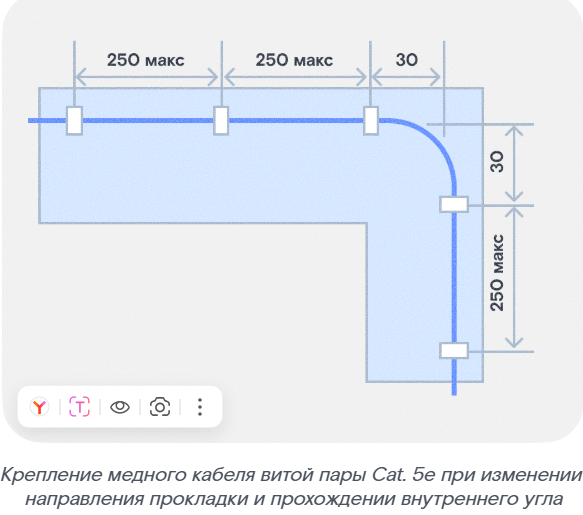
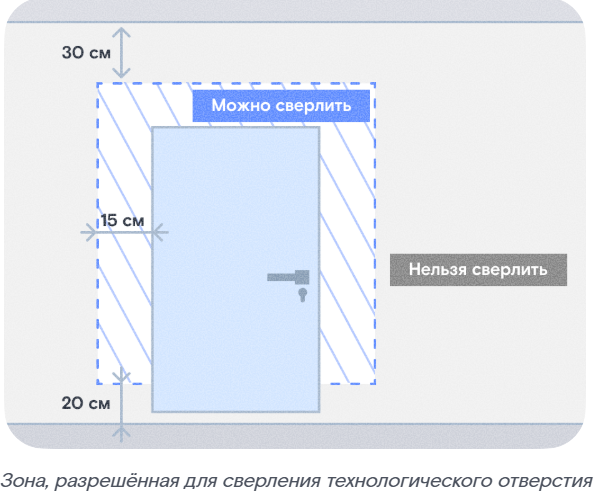
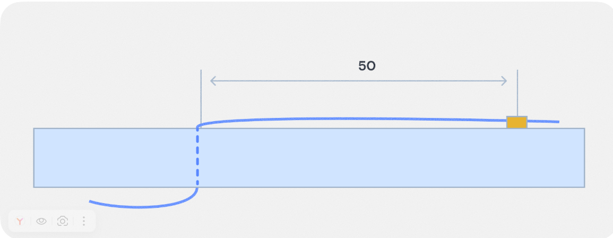
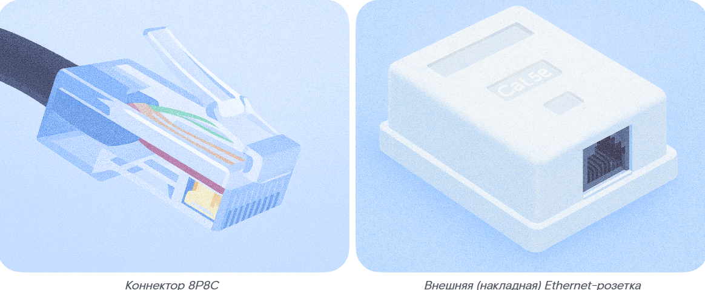
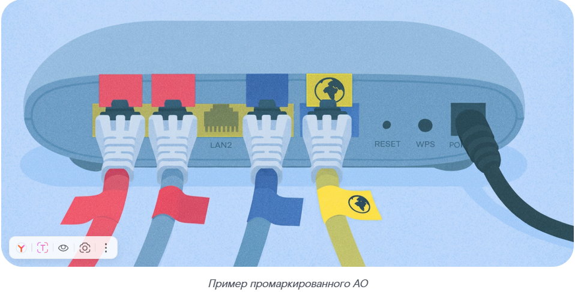

Проводя монтажные работы, соблюдай тишину: шумные работы проводи только в разрешённое по местным законам время.

**Основные правила прокладки кабеля**

Прокладывай кабель закрытым способом в электротехнических коробках, плинтусах или каналах строительных конструкций. Используй лотки (коробы) закрытого типа.

> **Не используй общедомовой пожарный кабель-канал.**

Если кабель приходится прокладывать параллельно другим коммуникациям, соблюдай минимальные расстояния:
- до слаботочных сетей — не менее 10 см;
- до электропроводки — не менее 25 см;
- до труб водоснабжения, отопления и сантехники — не менее 1 м.

**Запрещается:**
- перекручивать и завязывать кабель, оставлять излишки;
- использовать кабель, составленный из нескольких частей с помощью переходников или розеток;
- допускать сильные изгибы и заломы кабеля, продольное и поперечное петлевание и прямые углы;
- прокладывать кабель-канал по потолку (если только не надо обойти препятствия — трубы, ливневые стоки).

Старайся избегать пересечения с другими кабелями.

Если внешняя оболочка повредилась при выполнении монтажных работ, проверь, целы ли внутренние элементы кабеля. Если они повреждены — полностью замени кабель.

Крепления должны быть подходящего размера, чтобы кабель не проскальзывал. Кабель не должен провисать в пролётах между точками крепления.

> **Несоблюдение правил прокладки кабеля может привести к некачественной работе услуги и повторному выезду.**

**Шаг крепления и изгиб трассы**

Крепи кабель каждые **250 мм**, ориентируясь на поверхность.

При изменении направления трассы фиксируй угол поворота креплениями на расстоянии **30 мм** от вершины угла. Соблюдай допустимый радиус изгиба.

> Рис. 1 — Крепление медного кабеля витой пары Cat. 5e при изменении направления прокладки и прохождении внутреннего угла

> Рис. 2 — Крепление медного кабеля витой пары UTP Cat. 5e при прохождении внешнего угла

> **Не крепи кабель в точке вершины угла.**

**04. Оконечивание абонентского кабеля со стороны узла доступа и маркировка**

Проведи оконечивание абонентского кабеля со стороны узла доступа (коммутатора) и промаркируй кабель с указанием номера квартиры и номера порта.

**05. Технологическое отверстие**

Если нет технологического отверстия в квартире Клиента, сделай новое, предварительно проверив скрытую проводку.

Отверстие сверли изнутри квартиры (так как при сверлении с обратной стороны может отколоться значительный фрагмент отделки) в пределах периметра дверной коробки, отступив не больше **15 см**. Не сверли ближе **20 см** от пола и **30 см** от потолка.

> Рис. 3 — Зона, разрешённая для сверления технологического отверстия

> Рис. 4 — Пример выбивания куска бетона со штукатуркой с обратной стороны стены

После выполнения технологического отверстия зашпаклюй стену и восстанови её первоначальный вид.

**06. Прокладка линии по квартире Клиента до АО**

- Заведи кабель в квартиру Клиента через новое или существующее технологическое отверстие.
- Прохождение сквозного отверстия фиксируй креплениями на расстоянии **50 мм** от отверстия.

> Рис. 5 — Крепление медного кабеля витой пары UTP Cat. 5e при прохождении сквозного отверстия через стену

- Проведи медный кабель витой пары UTP Cat. 5e по квартире Клиента.

**Примеры запрещённых трасс:**
- под линолеумом;
- в дверных проёмах;
- поверх плинтусов вблизи пола, если трассу могут повредить дети или домашние животные;
- по участкам, где стоят стулья, шкафы и пр.

Правила прокладки кабеля в квартире такие же, как и при прокладке вне квартиры.

**07. Оконечивание кабеля со стороны АО**

Абонентский кабель можно оконечить коннектором **8P8C** или установить у Клиента розетку.

Детали работы с кабелем разберём на практической лабораторной работе.

**08. Проверка проложенной линии LAN-тестером**

Далее тебе предстоит подключить и настроить АО. Перед переходом к следующему этапу важно:
- проложить абонентскую линию в подъезде с использованием кабель-каналов по вертикальным и горизонтальным линиям (за исключением прокладки в лестничном проёме параллельно лестничному маршу), с отсутствием видимых частей абонентской линии;
- проложить абонентскую линию в квартире.

### Этап 4. Подключение и настройка оборудования

01. В «рюкзаке монтажника» в ЦМ/ММ выбери и привяжи оборудование к наряду.
02. Закрепи маршрутизатор/роутер в вертикальном или горизонтальном положении.

> Если Клиент просит не крепить маршрутизатор/роутер стационарно (например, поставить на стол), сделай отметку об этом в акте выполненных работ.

> Если подключаешь услуги на оборудовании Клиента, предупреди его: качество может быть ниже обычного.

03. Подключи маршрутизатор/роутер к питанию.
04. Подключи маршрутизатор/роутер к абонентской линии.

> Рис. 8 — Схема подключения абонентского оборудования

05. Промаркируй кабель со стороны АО и само оборудование.

С помощью квадратных и прямоугольных наклеек маркируются порты на АО и соответствующие патч-корды:
- **синий цвет** — для портов LAN под Internet;
- **красный цвет** — для портов LAN под IP-TV;
- **жёлтый цвет** — для портов WAN.

**Правила нанесения маркировки:**

Наноси маркировку аккуратно и ровно, только на кабель или оборудование компании.

**Места нанесения:**
- на заднюю панель маршрутизатора/роутера строго над необходимым портом, либо под портом, если маркировка над портом невозможна;
- на подключённый кабель — на расстоянии 50–100 мм от его конца.

> Рис. 9 — Пример промаркированного АО

- Квадрат клеится на заднюю часть маршрутизатора/роутера (над/под портом).
- Прямоугольник клеится на медный кабель витой пары UTP Cat. 5e.

06. Активируй услуги в ЦМ/ММ.

> Если возникнут проблемы — свяжись с руководителем/куратором. Коллеги попробуют решить проблему и сообщат результат.
> Если проблема не решена — сообщи оператору НПП, и можешь покидать адрес. Обязательно переговори с Клиентом.

07. Настрой подключение к интернету на маршрутизаторе/роутере.
08. Подключи дополнительное оборудование, если была допродажа.

Детали подключения и настройки оборудования разберём на практической лабораторной работе.

**После этого можно переходить к следующему этапу. Но сначала проверь, всё ли выполнено:**
- устройство подключено;
- выполнена активация услуг в информационной системе с помощью ЦМ/ММ;
- маршрутизатор/роутер настроен.