Какие вообще есть документы:

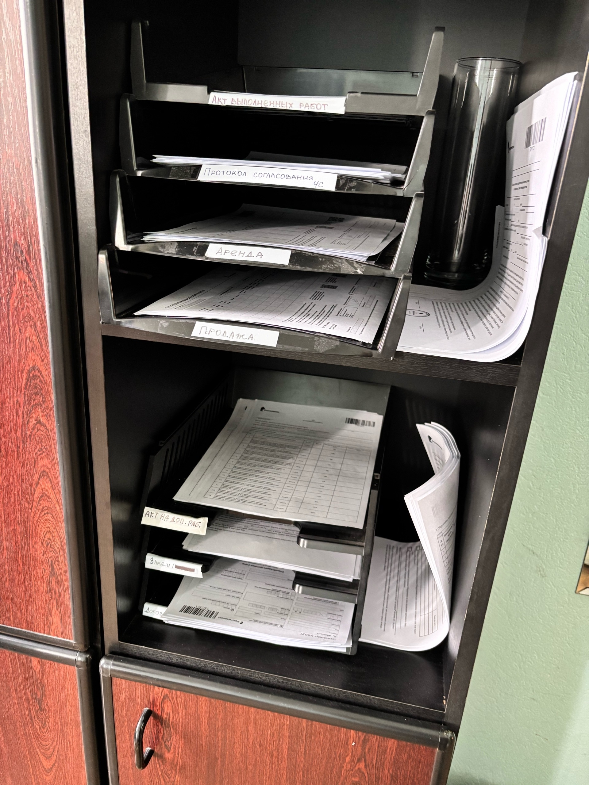

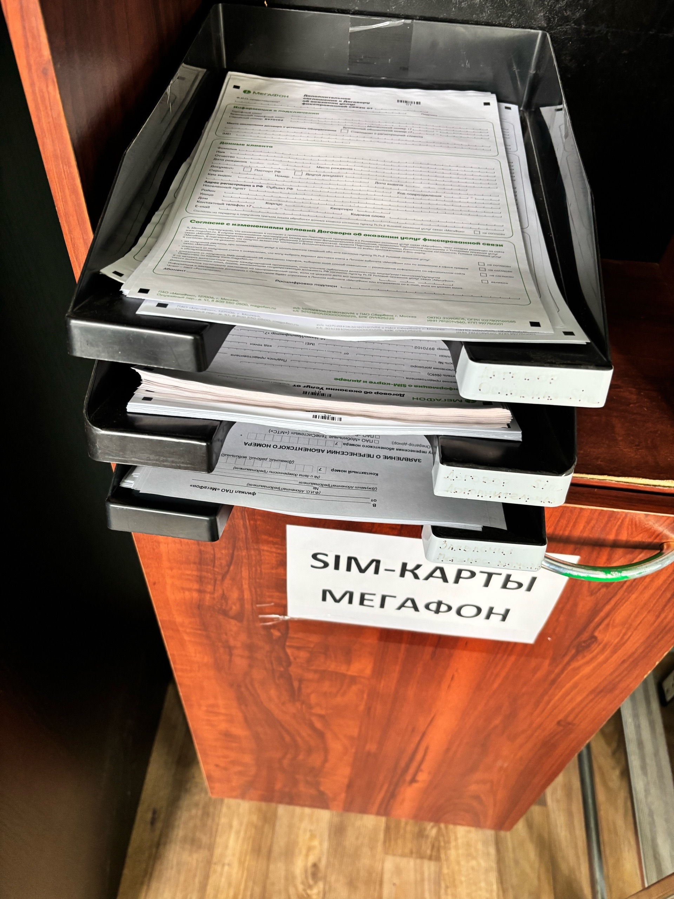

Ростелеком:

1. Протокол согласования ЧС?
2. Аренда? 
3. Продажа?
4. Акт на доп. работы
5. Замена
6. Акт выполненных работ
7. Договор

Мегафон:

...

## Договор

Бумажный договор заключается в следующих случаях:

1. Нет возможности заключить электронный
2. Несовершеннолетний 
3. Другой оператор (у них свои договора?)

| 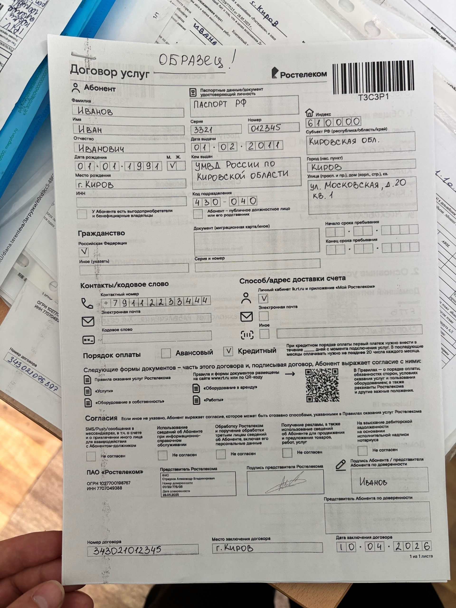            | 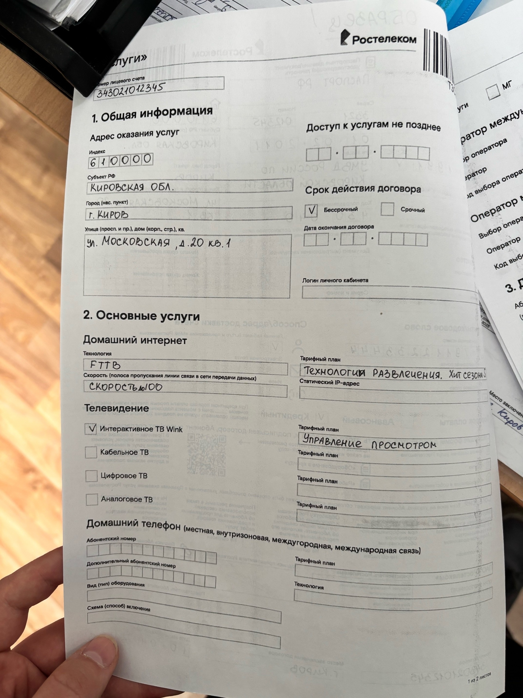 |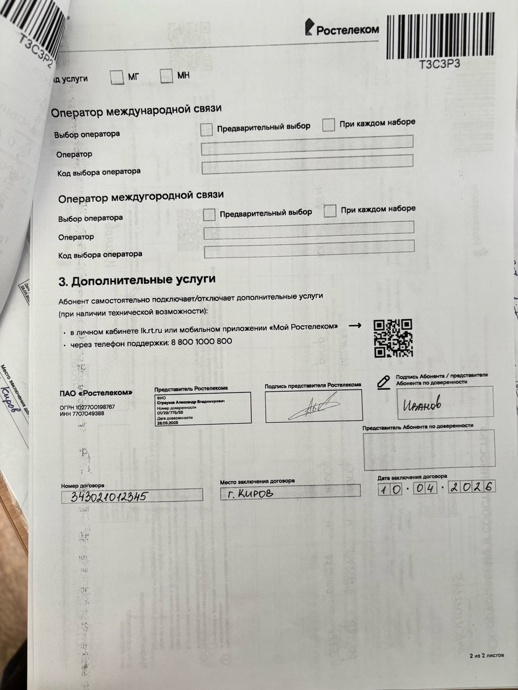   |
|-------------------------------------|-------------------------|---|
| Мржно без индекса и порядка опалаты | вроде можно без индекса |   |

|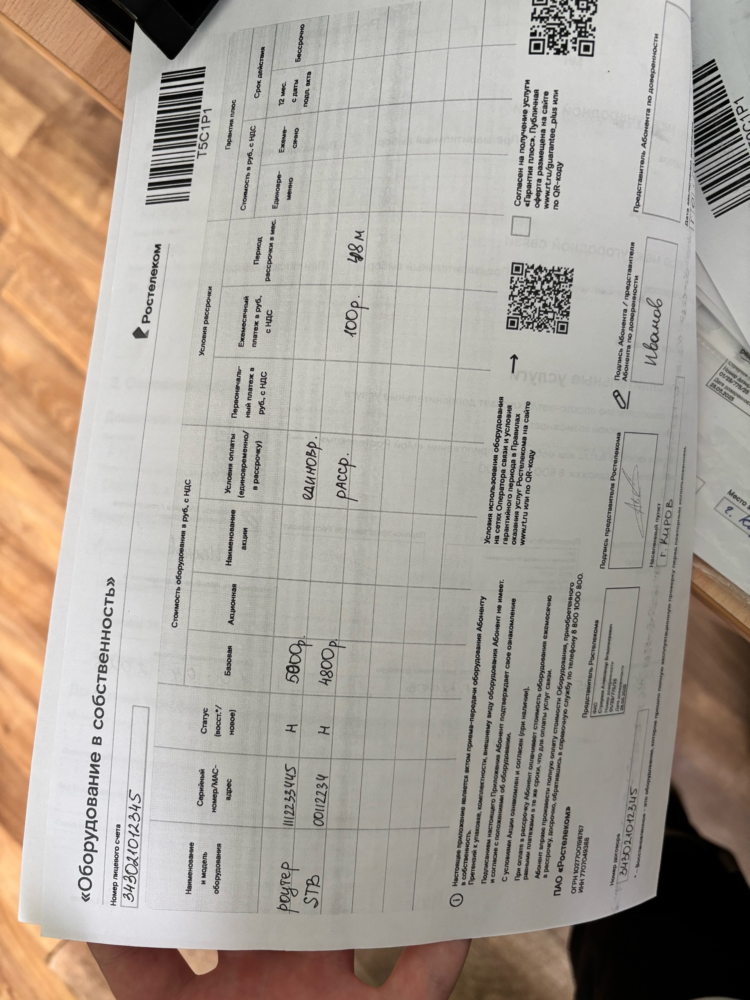   |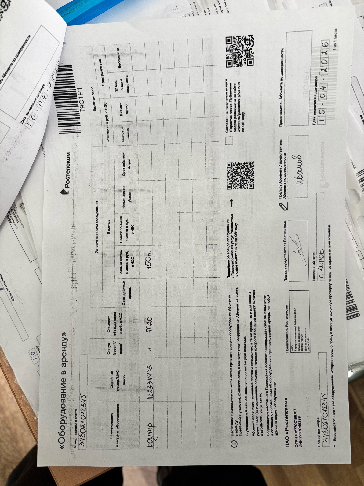   |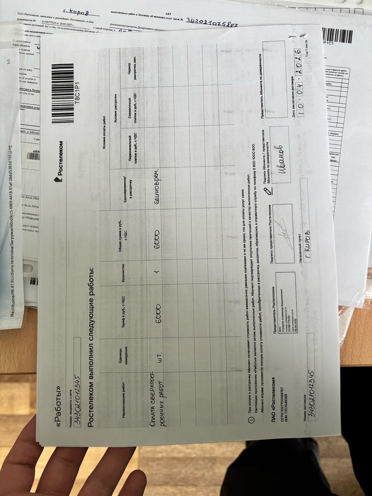   |
|---|---|---|
|   |   |   |

## Акт выполненных работ

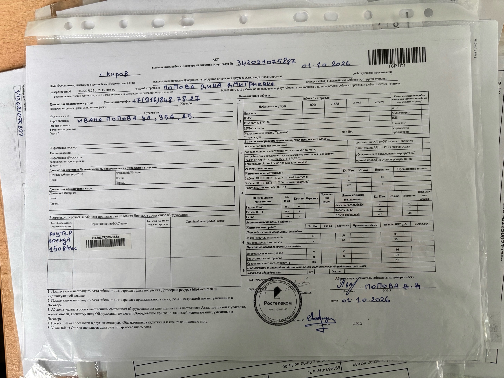

## Мегафон договор

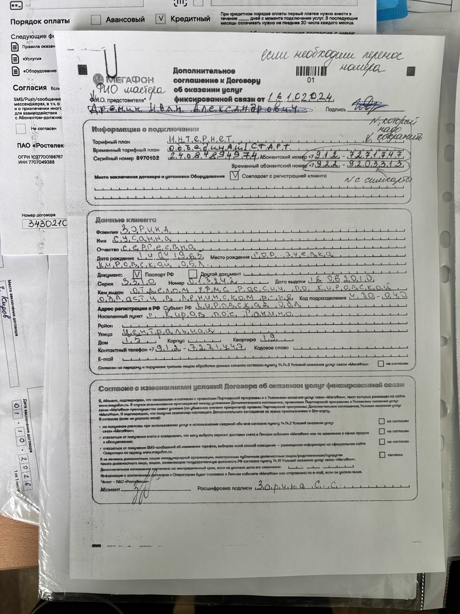

Если нужен перенос номера:

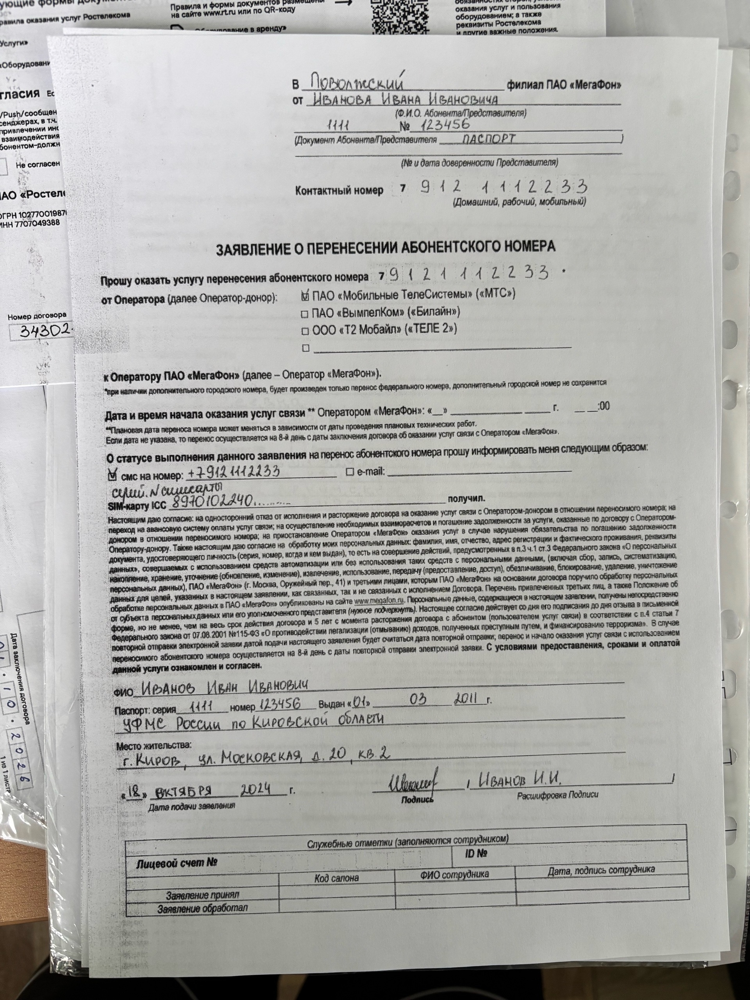

## Вопросы

1. Договр заключается в следующих случаях:
- Нет возможности заключить эл
- Несовершеннолетний 
- Другие операторы

2. Акт выполененных работ заполеняется в след случаях:
- Есть оборудование в аренду или продажу
- Подключение мегафон/теле2

3. Если в договоре прописка и фактический адрес не совпадают, то...

4. К чему привязан лицевой счет? 
- К абоненту
- К адресу
- К абоненту по адресу

5. Может ли у абонента быть несколько л.с.?

6. Если оформляем переезд, то л.с. меняется?