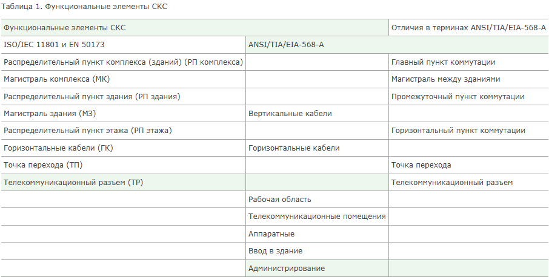
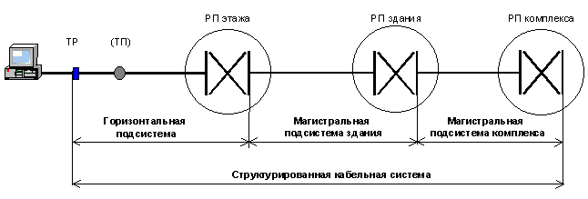
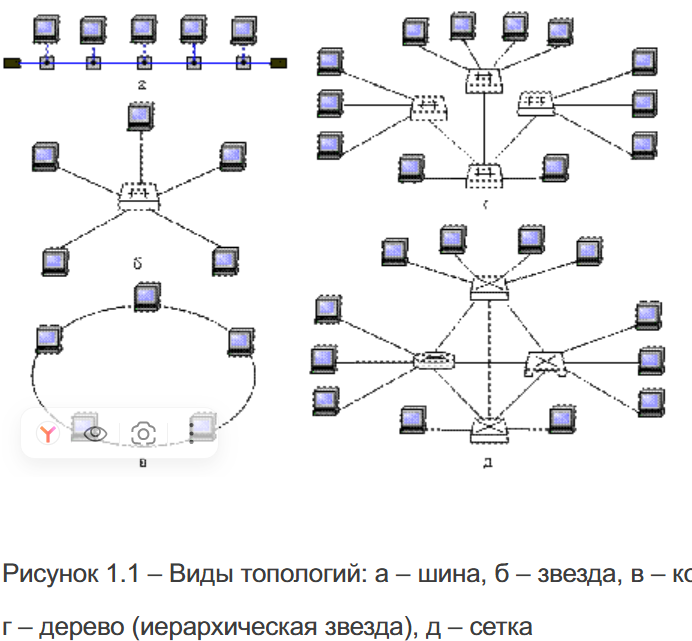
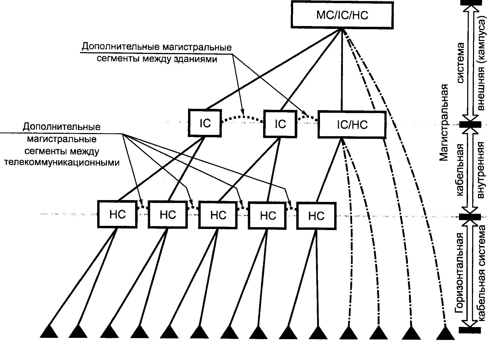
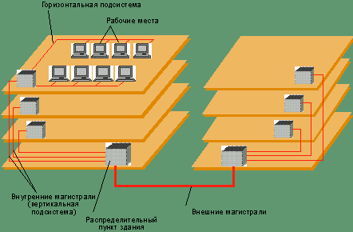
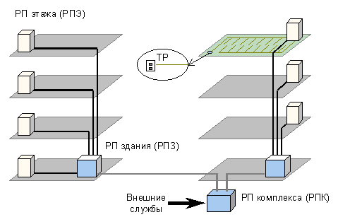
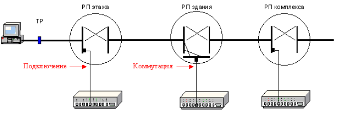

## 5. Структура СКС

<mark><strong>Под структурой СКС понимают модель построения системы из функциональных элементов и подсистем.</strong></mark> Данный раздел определяет также интерфейсы точки для подключения терминального оборудования к структурированной системе и самой СКС — к сети общего пользования. <mark><strong>Группы функциональных элементов образуют подсистемы СКС.</strong></mark> Отличия терминов американских стандартов выделены красным цветом.

### 5.1. Функциональные элементы СКС

<mark><strong>Структурированная кабельная система — среда передачи электромагнитных сигналов — состоит из элементов</strong></mark> — кабелей и разъёмов. Кабели, оснащённые разъёмами и проложенные по определённым правилам, образуют линии и магистрали. Линии, магистрали, точки подключения и коммутации составляют функциональные элементы СКС.

> **Функциональный элемент (functional element)** — <mark><strong>составная часть универсальной кабельной системы, выполняющая определённую функцию</strong></mark> (розетка, консолидационная точка, кабель подсистемы, дистрибьютор и т.д.).

В американском стандарте к функциональным элементам относят два типа кабелей, три типа помещений, элемент конструкции здания и документацию телекоммуникационной инфраструктуры. Кроме того, в данных группах стандартов используется разная терминология. Отличия показаны в таблице 1.

**Таблица 1. Функциональные элементы СКС**

| Функциональные элементы СКС                               | ISO/IEC 11801 и EN 50173 | ANSI/TIA/EIA-568-A              | Отличия в терминах ANSI/TIA/EIA-568-A |
|-----------------------------------------------------------|--------------------------|---------------------------------|---------------------------------------|
| Распределительный пункт комплекса (зданий) (РП комплекса) | —                        | Главный пункт коммутации        |                                       |
| Магистраль комплекса (МК)                                 | —                        | Магистраль между зданиями       |                                       |
| Распределительный пункт здания (РП здания)                | —                        | —                               |                                       |
| Магистраль здания (МЗ)                                    | —                        | Вертикальные кабели             |                                       |
| Распределительный пункт этажа (РП этажа)                  | —                        | Промежуточный пункт коммутации  |                                       |
| Горизонтальные кабели (ГК)                                | —                        | Горизонтальный пункт коммутации |                                       |
| Точка перехода (ТП)                                       | —                        | Горизонтальные кабели           |                                       |
| Телекоммуникационный разъём (ТР)                          | —                        | Точка перехода                  |                                       |
| —                                                         | —                        | Телекоммуникационный разъём     |                                       |
| —                                                         | —                        | Рабочая область                 |                                       |
| —                                                         | —                        | Телекоммуникационные помещения  |                                       |
| —                                                         | —                        | Аппаратные                      |                                       |
| —                                                         | —                        | Ввод в здание                   |                                       |
| —                                                         | —                        | Администрирование               |                                       |

Международные / европейские стандарты подразделяют СКС на восемь функциональных элементов, американский — на семь. Только два из них совпадают. В первом случае функциональные элементы составляют среду передачи, то есть собственно структурированную кабельную систему. Это позволяет выделить подсистемы и провести точные границы между ними.

Во втором в состав функциональных элементов не вошла магистраль комплекса и все интерфейсы СКС и добавлены помещения, элементы зданий и система документирования. Это приводит к путанице и смешиванию понятий в технической литературе, проспектах производителей и документации, создаваемых по американской модели — А.В.

### 5.2. Подсистемы СКС

Международные / европейские стандарты подразделяют <mark><strong>СКС на три подсистемы:</strong></mark> 
1. <mark><strong>магистральная подсистема комплекса</strong></mark>, 
2. <mark><strong>магистральная подсистема здания</strong></mark>, 
3. <mark><strong>горизонтальная подсистема.</strong></mark>

**Рис. 1. Подсистемы СКС**

Распределительные пункты обеспечивают возможность создания топологии каналов типа «шина», «звезда» или «кольцо».

**5.2.1. Магистральная подсистема комплекса** включает <mark><strong>магистральные кабели комплекса</strong></mark>, <mark><strong>механическое окончание кабелей (разъёмы)</strong></mark> в РП комплекса и РП здания и коммутационные соединения в РП комплекса. Магистральные кабели комплекса также могут соединять между собой распределительные пункты зданий.

**5.2.2. Магистральная подсистема здания** включает магистральные кабели здания, механическое окончание кабелей (разъёмы) в РП здания и РП этажа, а также коммутационные соединения в РП здания. Магистральные кабели здания не должны иметь точек перехода, электропроводные кабели не следует соединять сплайсами.

**5.2.3. Горизонтальная подсистема** включает горизонтальные кабели, механическое окончание кабелей (разъёмы) в РП этажа, коммутационные соединения в РП этажа и телекоммуникационные разъёмы. В горизонтальных кабелях не допускается разрывов. При необходимости допускается одна точка перехода. Все пары и волокна телекоммуникационного разъёма должны быть подключены. Телекоммуникационные разъёмы не являются точками администрирования. Не допускается включения активных элементов и адаптеров в состав СКС.

Я так понимаю, что жирная красная линия на диаграмме - дополнительный магистральный сегмент межжду зданиями, а магистральной подсистемы кампуса здесь нет

<mark><strong>Абонентские кабели для подключения терминального оборудования не являются стационарными и находятся за рамками СКС. Однако стандарты определяют параметры канала, в состав которого входят абонентские и сетевые кабели.</strong></mark>

### 5.3. Топология СКС

<mark><strong>Топология СКС — «иерархическая звезда», допускающая дополнительные соединения распределительных пунктов одного уровня.</strong></mark> Однако такие соединения не должны заменять магистрали основной топологии. Число и тип подсистем зависит от размеров комплекса или здания и стратегии использования системы. Например, в СКС одного здания достаточно одного РП здания и двух подсистем — горизонтальной и магистральной. С другой стороны, большое здание можно рассматривать как комплекс, включающий все три подсистемы, и в том числе несколько РП здания.

**Рис. 2. Топология СКС**

### 5.4. Размещение распределительных пунктов

Распределительные пункты размещаются в телекоммуникационных помещениях и аппаратных. Телекоммуникационные помещения предназначены для установки панелей и шкафов, сетевого и серверного оборудования, обслуживающих весь или часть этажа. Аппаратные выделяют для телекоммуникационного оборудования, обслуживающего пользователей всего здания (например, УАТС, мультиплексоры, серверы) и размещения РП здания / комплекса. Панели / шкафы и оборудование РП этажа, совмещённые с РП здания / комплекса, также могут находиться в помещении аппаратной.

### 5.5. Интерфейсы СКС

<mark><strong>Интерфейсы СКС — это окончания подсистем, обеспечивающие подключение оборудования и кабелей внешних служб методом подключения или коммутации.</strong></mark> На рисунке 3 показаны интерфейсы в виде линий в пределах распределительных пунктов, схематически обозначающих блоки гнёзд на панелях.

**Рис. 3. Интерфейсы СКС**

Для подключения к СКС достаточно одного сетевого кабеля. <mark><strong>В варианте коммутации используют сетевой и коммутационный кабель и дополнительную панель.</strong></mark>

<mark><strong>Подключение к сети общего пользования осуществляется с помощью интерфейса сети общего пользования.</strong></mark> Местоположение интерфейса сети общего пользования определяется национальными, региональными и местными правилами. Если интерфейсы сети общего пользования и СКС не соединены коммутационным кабелем или с помощью оборудования, необходимо учитывать параметры промежуточного кабеля.

### 5.6. Конфигурация

**Распределительный пункт этажа**

<mark><strong>Как минимум один РП этажа рекомендуется на каждые 1000 квадратных метров офисной площади.</strong></mark> 

<mark><strong>На каждом этаже должен быть, по крайней мере, один РП этажа. Если число рабочих мест на этаже невелико, его можно обслуживать с помощью распределительного пункта на смежном этаже.</strong></mark>

**Рекомендованные типы кабелей**

<mark><strong>В таблице 2 даны рекомендации применения различных типов среды передачи в каждой из подсистем.</strong></mark>

**Таблица 2. Рекомендованная среда передачи подсистем СКС**

| Подсистема | Тип среды передачи | Приложения |
|---|---|---|
| Горизонтальная подсистема | Симметричные кабели | Речевые и информационные |
| | Оптоволоконные кабели | Информационные |
| Магистральная подсистема здания | Симметричные кабели | Речевые и информационные классов А и В |
| | Оптоволоконные кабели | Информационные классов В и выше |
| Магистральная подсистема комплекса | Оптоволоконные кабели | Для всех приложений |
| | Симметричные кабели | Для приложений класса А (например, линии УАТС) |

Данные рекомендации устарели — информационные приложения классов А (до 0,1 МГц) и В (до 1,0 МГц) в локальных сетях практически не применяются. Выбор среды передачи для магистрали здания зависит также от длины каналов. Если длина магистральной линии не превышает 90 метров, симметричные кабели соответствующей категории призваны обеспечить работу всех действующих приложений — А.В.

С другой стороны, большинство многомодовых кабелей непригодны для работы Gigabit Ethernet при длине линии более 220 метров (в соответствии со стандартами максимальная длина ОВ ММ магистрали — 2000 метров) — А.В.

**Телекоммуникационные разъёмы (ТР)**

> **Телекоммуникационный разъём (ТР)** — <mark><strong>фиксированное соединительное устройство, обеспечивающее интерфейс к терминальному оборудованию.</strong></mark>

Телекоммуникационные разъёмы располагают на стене, полу или в другой точке рабочей области. При проектировании СКС следует обеспечить удобство доступа ко всем разъёмам. Высокая плотность разъёмов повышает гибкость системы и облегчает изменения телекоммуникационных ресурсов рабочих мест. Во многих странах на 10 м² используемой площади должны устанавливаться два телекоммуникационных разъёма. Допускается установка разъёмов одиночно или группами, однако <mark><strong>каждое рабочее место должно иметь не менее двух разъёмов.</strong></mark>

<mark><strong>На каждом рабочем месте должен быть предусмотрен, по крайней мере, один разъём, установленный на симметричном кабеле 100 Ом или 120 Ом</strong></mark> (предпочтение отдаётся кабелям 100 Ом). <mark><strong>Другие ТР требуется устанавливать либо на симметричном, либо на оптоволоконном кабеле.</strong></mark>

Симметричный кабель должен иметь две или четыре пары; все пары должны быть смонтированы на разъём. Если предусмотрено менее четырёх пар, это требуется отразить в маркировке. Приложения сбалансированной передачи могут иметь ограничения по задержке распространения сигналов по каждой из пар. Особенности спецификации ТР, соответствующие перечисленным выше типам кабелей, даны в разделе «Требования к разъёмам».

Разъёмы должны быть обозначены постоянной маркировкой, видной пользователю. Следует обращать внимание на то, чтобы регистрировалось первоначальное назначение пар, а также все последующие изменения. Волновые и другие адаптеры, используемые для согласования различных передающих сред, должны находиться с внешней стороны разъёма. Разрешается менять назначение пар с помощью адаптеров.

В русскоязычной литературе понятие «телекоммуникационный разъём» повсеместно подменяют термином «телекоммуникационная розетка». Разъём или окончание кабеля является частью розетки, то есть сборки разъёмов, установочной и фиксирующей арматуры. Розетка может объединять от одного до двенадцати разъёмов — А.В.

**Телекоммуникационные помещения и аппаратные**

<mark><strong>Телекоммуникационное помещение призвано обеспечивать наличие всех средств (пространство, электропитание, обогрев, вентиляция) для расположенных внутри него пассивных элементов, активных устройств, а также интерфейсов сети общего пользования.</strong></mark> Для каждого телекоммуникационного помещения следует предусмотреть прямой доступ к магистрали здания.

<mark><strong>Аппаратная — пространство в пределах здания, где размещается телекоммуникационное оборудование и могут находиться или отсутствовать распределительные пункты. К аппаратным предъявляют иные требования, чем к телекоммуникационным помещениям, поскольку оборудование, устанавливаемое в них, является более сложным</strong></mark> (например, УАТС или серверы). <mark><strong>В аппаратной может находиться более одного распределительного пункта.</strong></mark> Если телекоммуникационное помещение служит для размещения двух и более распределительных пунктов, его следует считать аппаратной.

<strong>Разнмца по мнению ИИ</strong>
<table><tr><td>

Коротко: в чём разница

| | Телекоммуникационное помещение | Аппаратная |
|---|---|---|
| **Что это** | Комната, где стоит кроссовое оборудование этажа | Комната, где стоит **всё главное** оборудование здания |
| **Уровень** | Этажный (обслуживает один этаж) | Общезданий (обслуживает всё здание) |
| **Что внутри** | Кроссовые панели, коммутаторы этажа | Серверы, маршрутизаторы, АТС, главный кросс |
| **Размер** | Маленькая (шкаф или небольшая комната) | Большая (отдельное помещение) |
| **Кто туда ходит** | Техник этажа | Системный администратор, инженер |
| **Стандарт** | TIA/EIA-569 | TIA/EIA-569 |

</td></tr></table>

Термин «телекоммуникационное помещение» часто переводят как «телекоммуникационный шкаф». Эти понятия не совпадают. Если используется несколько шкафов / стоек, неправильный перевод приводит к недоразумениям. Особенно серьёзные ошибки возникают при проектировании системы заземления и толковании стандартов, также использующих данный термин — А.В.

**Пункт ввода в здание**

П<mark><strong>ункты ввода в здание оборудуются в случае, когда внешние кабели магистрали комплекса, частных сетей и сети общего пользования (включая антенну) вводят в здание и осуществляют переход на внутренние кабели.</strong></mark> Местные правила могут требовать специального коммутационного оборудования для оснащения внешних кабелей разъёмами. Это оборудование позволяет перейти от внешних к внутренним кабелям.

**Электромагнитная совместимость**

Международные стандарты электромагнитных излучений и устойчивости (например, CISPR 22) и местные правила должны быть приняты во внимание. Кабельная система считается пассивной и не может быть протестирована на соответствие требованиям ЕМС индивидуально. Активное оборудование должно отвечать требованиям соответствующих стандартов ЕМС с учётом используемой среды передачи.

**Заземление**

<mark><strong>Элементы системы заземления должны отвечать требованиям соответствующих норм и правил.</strong></mark> Инструкции и требования производителей оборудования следует выполнять, если они совместимы с электрическими нормативами.

Важно отметить, что ответственность за соответствие СКС требованиям электромагнитной совместимости делегирована производителям активного оборудования. Такой подход не решает проблемы. Подробнее об этом в статье «Европейская директива электромагнитной совместимости». Строго говоря, пункты 5.7 «Электромагнитная совместимость» и 5.8 «Заземление» не относятся к конфигурации СКС и освещаются в разделе 10, специально посвящённом данным проблемам. Кроме того, они не содержат норм и правил, а только ссылки на другие стандарты — А.В.

**Примечания:**
1. Когда желательна большая гибкость системы, следует использовать четырёхпарные кабели.
2. Установка двухпарных кабелей ограничивает работу приложений класса D.

## FAQ

**Что такое СКС?**
Структурированная кабельная система — универсальная телекоммуникационная инфраструктура здания или комплекса зданий, предназначенная для передачи сигналов всех типов, включая речевые, информационные и видео.

**Какие стандарты определяют структуру и параметры СКС?**
ISO/IEC 11801, EN 50173 и ANSI/TIA/EIA-568-A.

**Какие два уровня требований определяют стандарты США?**
Обязательный (выражается словом «должен») и рекомендуемый (выражается словами «следует», «может», «желательно»).

**Для каких зданий оптимизированы системы СКС?**
Для зданий с офисной площадью до 1 000 000 м², числом пользователей 50–50 000 человек и расстояниями между зданиями до 3 км.

**На какие подсистемы подразделяют СКС международные / европейские стандарты?**
На три подсистемы: магистральная подсистема комплекса, магистральная подсистема здания, горизонтальная подсистема.

**Какая топология используется в СКС?**
Топология «иерархическая звезда», допускающая дополнительные соединения распределительных пунктов одного уровня.

**Сколько функциональных элементов выделяют международные / европейские стандарты?**
Восемь функциональных элементов.

**Сколько функциональных элементов выделяет американский стандарт?**
Семь функциональных элементов.

**Что такое телекоммуникационный разъём?**
Фиксированное соединительное устройство, обеспечивающее интерфейс к терминальному оборудованию.

**Сколько телекоммуникационных разъёмов должно быть на каждом рабочем месте?**
Не менее двух разъёмов.

**Какой кабель должен быть использован хотя бы для одного разъёма на рабочем месте?**
Симметричный кабель 100 Ом или 120 Ом (предпочтение отдаётся кабелям 100 Ом).

**Что такое аппаратная?**
Пространство в пределах здания, где размещается телекоммуникационное оборудование и могут находиться или отсутствовать распределительные пункты.

**Что такое пункт ввода в здание?**
Пункт, который оборудуется в случае, когда внешние кабели магистрали комплекса, частных сетей и сети общего пользования вводят в здание и осуществляют переход на внутренние кабели.

**Какие требования предъявляются к системе заземления?**
Элементы системы заземления должны отвечать требованиям соответствующих норм и правил. Инструкции и требования производителей оборудования следует выполнять, если они совместимы с электрическими нормативами.

**Кто несёт ответственность за соответствие СКС требованиям электромагнитной совместимости?**
Ответственность делегирована производителям активного оборудования.

**Когда рекомендованы измерения параметров передачи линий?**
Когда длина линий превышает ограничения раздела 6; когда для монтажа линии использованы элементы, не определённые в разделах 8 и 9; при оценке кабельной системы на соответствие требованиям приложений; при желании проверить параметры системы, установленной в соответствии с положениями разделов 6, 8 и 9.

**Что означают параметры, отмеченные «д.д.и.»?**
«Для дальнейшего изучения» — они являются предварительными и не требуют соответствия стандарту.

**Почему рекомендации по применению классов А и В устарели?**
Информационные приложения классов А (до 0,1 МГц) и В (до 1,0 МГц) в локальных сетях практически не применяются.

**Почему большинство многомодовых кабелей непригодны для Gigabit Ethernet при длине линии более 220 метров?**
В соответствии со стандартами максимальная длина ОВ ММ магистрали — 2000 метров, но для Gigabit Ethernet она ограничена 220 метрами.