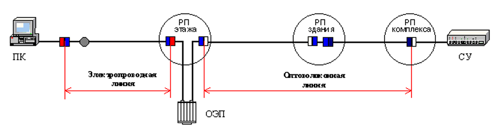

<strong>Кратко</strong>
<table><tr><td>

Простыми словами: это раздел о том, **каким требованиям должна соответствовать готовая линия СКС**, чтобы по ней работали приложения.

## Главное

**Линия** — это пассивный путь сигнала между двумя интерфейсами. В неё входят только кабели, разъёмы и коммутационные шнуры. Активное оборудование и абонентские/сетевые кабели — **за рамками** линии.

**Зачем нужна спецификация линий:**
- Проверять соответствие стандарту.
- Оценивать существующие системы.
- Находить проблемы.
- Выбирать приложения.

**Важно:** спецификация линий допускает работу на расстояниях **больше**, чем в разделе 6, если параметры линии лучше стандартных.

## Классы приложений

| Класс | Частота | Что поддерживает |
|---|---|---|
| **A** | до 100 кГц | Речь, низкочастотные приложения |
| **B** | до 1 МГц | Среднескоростная передача данных |
| **C** | до 16 МГц | Высокоскоростная передача |
| **D** | до 100 МГц | Очень высокая скорость |
| **Оптика** | 10 МГц и выше | Высокая и очень высокая скорость |

**Правило:** линия более высокого класса поддерживает все приложения более низкого класса.

## Связь классов и категорий кабелей

| Класс | Категория 3 | Категория 4 | Категория 5 | 150 Ом |
|---|---|---|---|---|
| A | 2000 м | 3000 м | 3000 м | 3000 м |
| B | 200 м | 260 м | 260 м | 400 м |
| C | 100 м | 150 м | 160 м | 250 м |
| D | — | — | 100 м | 150 м |

**Оптика:** многомодовое — 2000 м, одномодовое — 3000 м.

## Параметры симметричных линий

1. **Волновое сопротивление** — 100, 120 или 150 Ом. Допуск ±15%.
2. **Возвратные потери** — чем выше, тем лучше. Для класса D на 100 МГц — минимум 10 дБ.
3. **Затухание** — чем ниже, тем лучше. Для класса D на 100 МГц — максимум 23,2 дБ.
4. **Перекрестные наводки (NEXT)** — чем выше, тем лучше. Для класса D на 100 МГц — минимум 24 дБ.
5. **ACR (затухание/наводки)** — разница между NEXT и затуханием. Для класса D на 100 МГц — минимум 4 дБ.
6. **Сопротивление постоянному току** — для класса D максимум 40 Ом.
7. **Задержка распространения** — для класса D максимум 1 мкс.
8. **Баланс** — для класса D на 100 МГц — минимум 30 дБ.
9. **Переходное сопротивление экрана** — только для экранированных кабелей.

**Проблема класса D:** стандарт требует ACR на 4 дБ лучше, чем дают таблицы затухания и наводок. Это значит, что линия из стандартных компонентов может не пройти тест. Нужен резерв параметров или уменьшение длины.

## Параметры оптоволоконных линий

1. **Затухание:**
    - Горизонтальная — 100 м: многомодовое 2,2 дБ, одномодовое 2,2–2,7 дБ.
    - Магистраль здания — 500 м: многомодовое 2,7 дБ, одномодовое 2,2–3,6 дБ.
    - Магистраль комплекса — 1500 м: многомодовое 3,9–7,4 дБ, одномодовое 2,2–3,6 дБ.
    - Суммарно для объединённых подсистем — не более 11 дБ (многомодовое) и 8 дБ (одномодовое).

2. **Полоса пропускания многомодового волокна:**
    - 850 нм — минимум 100 МГц (200 МГц×км).
    - 1300 нм — минимум 250 МГц (500 МГц×км).

3. **Возвратные потери:**
    - Многомодовое — 20 дБ.
    - Одномодовое — 26 дБ.

4. **Задержка распространения** — некоторые приложения ограничивают.

## Отличия от ANSI/TIA/EIA-568-A

- Нет категорий линий и интерфейсов.
- Нет классификации приложений.
- Нет спецификации симметричных и оптоволоконных линий.
- Длина магистрали для данных — 90 м, для речи — 800 м.

## Аналогия

Представь водопровод:
- **Класс линии** — это диаметр трубы. Чем выше класс, тем больше воды (данных) пройдёт.
- **Затухание** — потери напора. Чем длиннее труба, тем слабее струя.
- **Наводки** — утечки между соседними трубами.
- **ACR** — насколько струя сильнее утечек. Если утечки почти как струя — вода дойдёт грязной.
- **Категория кабеля** — качество самой трубы. Если смешать хорошую и плохую — всё будет по худшей.

</td></tr></table>

# 7. Спецификация линий

Данный раздел определяет требования к функциональным характеристикам структурированной кабельной системы. Параметры заданы для линий двух типов среды передачи (симметричные кабели и оптические волокна). Пояснения приведены в Приложении F.

> **Линия (link)** — путь передачи между двумя интерфейсами кабельной системы, включая соединения на каждом конце.

Правила проектирования раздела 6 «Подсистемы СКС» используются для создания линий из элементов, определённых в разделах 8 «Требования к кабелям» и 9 «Требования к разъёмам». Спецификация линий допускает работу приложений определённых классов на расстояниях, превышающих пределы, определённые разделом 6, и / или в случае использования среды передачи и элементов с лучшими параметрами, чем предусмотрено в разделах 8 и 9.

Параметры данного раздела могут быть использованы для тестирования на соответствие стандарту. Кроме того, они позволяют оценить существующие кабельные системы, находить источники проблем на уровне линий и служат основой выбора используемых приложений. Результаты любых альтернативных измерений следует оценивать с учётом поправок.

Параметры линий определяются между интерфейсами. Линия включает только пассивные кабели, разъёмы и коммутационные кабели. Активные элементы и частные решения находятся за рамками данного стандарта. На рисунке 9 приведён пример подключения терминального оборудования в рабочей области к коммутатору в РП комплекса с помощью двух линий: симметричной электропроводной и оптоволоконной. Линии соединены с помощью оптоэлектронного преобразователя. При этом образуется четыре интерфейса — по два на каждом конце оптической и электропроводной линий.

**Рисунок 9. Пример линий и интерфейсов СКС**

Интерфейсом является телекоммуникационный разъём и любой разъём, к которому подключают оборудование. Абонентские и сетевые кабели не входят в состав линии. Параметры линии должны соответствовать для каждого интерфейса и любой среды. Не требуется измерений каждого параметра, определённого в данном разделе, поскольку соответствие им обеспечивается грамотным проектированием и монтажом.

Параметры линий должны быть не хуже заданных в диапазоне рабочих температур. Измерения могут проводиться при других температурах, но при этом требуется достаточный резерв параметров для учёта поправок, рассчитываемых по спецификациям производителей кабелей. Расчёт проводится для самых неблагоприятных условий. Следует также учитывать эффект старения.

Следует обратить внимание на следующее положение: «спецификация линий допускает работу приложений определённых классов на расстояниях, превышающих пределы, определённые разделом 6, и / или в случае использования среды передачи и элементов с лучшими параметрами, чем предусмотрено в разделах 8 и 9». Раздел 4 также допускает увеличение длины линии, если её параметры соответствуют требованиям стандартов. При этом рекомендуется инструментальное измерение, не обязательное при соблюдении стандартных требований.

Пример реализации таких возможностей даёт компания ITT NS&S, Великобритания. Для системы ISCS Gigapath гарантируется работа протоколов Fast Ethernet по каналу длиной до 140 метров и ATM 155 — до 145 метров. Это обеспечено за счёт разъёмов, имеющих лучшие параметры, чем предусмотрено стандартами — А.В.

**Отличия ANSI/TIA/EIA-568-A**

В стандарте ANSI/TIA/EIA-568-A нет категорий линии и интерфейсы СКС. Вместо этого в стандарте используются понятия горизонтальные кабели и магистральные кабели.

## 7.1. Классификация приложений и линий

### 7.1.1. Классификация приложений

Стандарт определяет пять классов приложений. Этим гарантируется гибкость в выборе различных систем передачи информации.

> **Класс приложения (application class)** — классификационная характеристика приложений, определяющая максимальную частоту сигнала и соответствующие требования к линии связи.

**Классы приложений:**

- **Класс A** — речевые и низкочастотные приложения. Рабочие характеристики кабельных линий, поддерживающих приложения Класса A, определены до 100 кГц.
- **Класс B** — приложения цифровой передачи данных со средней скоростью. Рабочие характеристики кабельных линий, поддерживающих приложения Класса B, определены до 1 МГц.
- **Класс C** — приложения высокоскоростной цифровой передачи данных. Рабочие характеристики кабельных линий, поддерживающих приложения Класса C, определены до 16 МГц.
- **Класс D** — приложения очень высокой скорости передачи данных. Рабочие характеристики кабельных линий, поддерживающих приложения Класса D, определены до 100 МГц.
- **Класс оптики** — приложения с высокой и очень высокой скоростью цифровой передачи. Рабочие характеристики волоконно-оптических кабельных линий определены для частот 10 МГц и выше. Ширина полосы обычно не является ограничивающим фактором в системах на территории конечных пользователей.

**Отличия ANSI/TIA/EIA-568-A**

Классификация приложений отсутствует. Различают две группы приложений: речевые (телефония) и информационные (передача данных).

### 7.1.2. Классификация линий

Универсальная кабельная система, смонтированная для поддержки конкретных приложений, содержит одну или более линий. Линия класса A имеет самый узкий диапазон частот. Её параметры определены таким образом, чтобы соответствовать минимальным требованиям приложений класса А. Аналогично линии классов B, C и D обеспечивают работу приложений классов B, C и D. Линии определённого класса поддерживают все приложения более низкого класса.

Оптические параметры задаются для одномодовых и многомодовых оптоволоконных линий. Оптическая линия призвана обеспечить минимальные параметры передачи для приложений, работающих на частоте 10 МГц и выше.

Линии классов C и D соответствуют полной реализации горизонтальных кабельных подсистем категорий 3 и 5 соответственно.

Связь между классами линий и категорией кабелей, определённых в разделе 8, показана в таблице 3. В таблице указана длина каналов для различных приложений.

**Таблица 3. Длина каналов в зависимости от категории кабелей**

| Класс приложений | Тип кабелей канала | Класс A | Класс B | Класс C | Класс D | Класс оптики |
|---|---|---|---|---|---|---|
| Категория 3 | | 2000 м | 200 м | 100 м | — | — |
| Категория 4 | | 3000 м | 260 м | 150 м | — | — |
| Категория 5 | | 3000 м | 260 м | 160 м | 100 м | — |
| 150 Ом | | 3000 м | 400 м | 250 м | 150 м | — |
| Многомодовое волокно | | — | — | — | — | 2000¹) м |
| Одномодовое волокно | | — | — | — | — | 3000 м |

При проектировании СКС следует предусмотреть возможность соединений подсистем, образующих линии большей длины. Параметры этих линий будут хуже, чем у составляющих линий. Такие линии следует тестировать при монтаже. Тестирование объединённых подсистем проводится на соответствие параметров протоколов.

Строго говоря, 2000 метров — это длина двух линий. В соответствии с моделью раздела 6 «Подсистемы СКС» для создания канала допускается дополнительные 20 метров на коммутационный кабель в РП здания, 30 метров на сетевой кабель в РП комплекса и 5 метров на сетевой кабель в РП этажа — А.В.

**Отличия ANSI/TIA/EIA-568-A**

Для информационных приложений длина магистральной линии ограничена величиной 90 метров. Модель горизонтальной линии включает коммутационные кабели, модель магистральной линии — исключает. Длина соединительных кабелей — 10 метров для горизонтальной подсистемы и 5 метров — для магистральной подсистемы. Для речевых приложений максимальная длина линии составляет 800 метров.

Меньшая длина соединительных кабелей магистральной подсистемы по сравнению с горизонтальной подсистемой призвана обеспечить более высокое качество передачи сигналов. Меньшая длина линий для речевых приложений в США объясняется другими стандартами телефонии — А.В.

## 7.2. Симметричные кабельные линии

Параметры, определённые в данном подразделе, относятся к кабельным линиям из защищённых или незащищённых кабельных элементов с общим экраном кабелей или без него, если иное не оговаривается особо. Методика тестирования симметричных кабелей дана в приложении А. Для этого используются специальные полевые тестеры. Максимальные значения частот определены для линий и не являются предельными значениями для кабелей.

### 7.2.1. Погонное волновое сопротивление (characteristic impedance)

Номинальное дифференциальное волновое сопротивление линии должно составлять 100, 120 или 150 Ом на частотах между 1 МГц и максимальной частотой для данного класса.

Допуски волнового сопротивления не должны превышать ± 15 % от номинального значения на частотах между 1 МГц и максимальной частотой для данного класса.

Отклонения погонного волнового сопротивления кабельной линии выражают с помощью возвратных потерь. Методика измерения данного параметра находится в стадии разработки. Соответствие погонного волнового сопротивления линий обеспечивается выбором кабелей и разъёмов и правильным монтажом.

### 7.2.2. Возвратные потери (return loss)

Будучи измеренными в любом интерфейсе, возвратные потери не должны превышать значения, указанные в таблице 4. При этом на удалённом конце линии должен быть установлен резистор с сопротивлением, численно равным волновому сопротивлению линии.

**Таблица 4. Возвратные потери**

| Частота, МГц | Минимальные возвратные потери, дБ | |
|---|---|---|
| | Класс C | Класс D |
| 1–10 | 18 | 18 |
| 10–16 | 15 | 15 |
| 16–20 | — | 15 |
| 20–100 | — | 10 |

### 7.2.3. Затухание (attenuation)

Затухание сигнала в линии не должно превышать значений, указанных в таблице 5, и соответствовать длине кабеля и материалу проводников. Для линий класса D требования отношения затухания к наводкам (ACR) подраздела 7.2.5 могут обуславливать более низкое требуемое затухание, чем указано в таблице.

**Таблица 5. Максимальные значения затухания**

| Частота, МГц | Максимальное затухание, дБ | | | |
|---|---|---|---|---|
| | Класс A | Класс B | Класс C | Класс D |
| 0,1 | 16 | — | — | — |
| 1,0 | — | 5,5 | — | — |
| 4,0 | — | 5,8 | 3,7 | — |
| 10,0 | — | — | 6,6 | 7,5 |
| 16,0 | — | — | 10,7 | 9,4 |
| 20,0 | — | — | 14 | 10,5 |
| 31,25 | — | — | — | 13,1 |
| 62,5 | — | — | — | 18,4 |
| 100,0 | — | — | — | 23,2 |

Суммарное затухание канала может превышать значения таблицы 5 не более, чем на величину затухания в абонентском и сетевом кабелях.

### 7.2.4. Перекрёстные наводки (near-end crosstalk, NEXT)

> **NEXT (near-end crosstalk loss)** — потери перекрёстных наводок на ближнем конце: связь сигнала от мешающей пары к подверженной паре, измеренная на ближнем конце.

Перекрёстные наводки в линии не должны превышать значений, указанных в таблице 6, и должны соответствовать конструктивным параметрам кабеля и диэлектрическим свойствам материалов. Перекрёстные наводки измеряются для каждого конца кабеля, что позволяет правильно оценить параметры линии. Для линий класса D требования отношения затухания к наводкам (ACR) подраздела 7.2.5 могут обуславливать меньшие допустимые значения наводок, чем указано в таблице 6. Значения таблицы 6 основаны на требованиях приложений, перечисленных в Приложении G.

**Таблица 6. Предельно допустимый уровень перекрёстных наводок**

| Частота, МГц | Максимальные перекрёстные наводки, дБ | | | |
|---|---|---|---|---|
| | Класс A | Класс B | Класс C | Класс D |
| 0,1 | 27 | 40 | — | — |
| 1,0 | 25 | 39 | 54 | — |
| 4,0 | — | 29 | 45 | — |
| 10,0 | — | 23 | 39 | — |
| 16,0 | — | 19 | 36 | — |
| 20,0 | — | — | 35 | — |
| 31,25 | — | — | 32 | — |
| 62,5 | — | — | 27 | — |
| 100,0 | — | — | 24 | — |

При измерении перекрёстных наводок канала, включающего линию, абонентский и сетевой кабели, уровень наводок должен соответствовать значениям таблицы 6. Разъёмы в составе оборудования не учитываются и могут увеличивать уровень наводок. Наводки — не единственный источник шума при передаче электромагнитных сигналов. Предполагается, что уровень шумов от других источников во всём диапазоне частот меньше, по крайней мере, на 10 дБ.

### 7.2.5. Отношение затухания к наводкам (attenuation to crosstalk ratio, ACR)

> **ACR (attenuation to crosstalk ratio)** — разность между перекрёстными наводками и затуханием сигнала линии, выраженная в децибелах.

Это (логарифмическая — А.В.) разница между перекрёстными наводками и затуханием сигнала линии, выраженная в децибелах. Этот параметр связан с параметром отношения сигнал / шум (Signal / Crosstalk Ratio, SCR), который позволяет оценить качество принятого сигнала, но отличается от него. Отношение затухания к наводкам рассчитывается по следующей формуле:

$$ACR = NEXT - A$$

где:
- $ACR$ — отношение затухания и наводок;
- $NEXT$ — перекрёстные наводки, измеренные между любыми двумя парами кабеля;
- $A$ — затухание сигнала в линии.

Отношение затухания и наводок соответствуют самым строгим требованиям приложений, перечисленных в Приложении G. Для линий классов А, В и С оно соответствует значениям, полученным расчётным путём из таблиц 3 и 4. Для класса D требуются лучшие параметры, чем определено в таблицах 3 и 4. Для приложений класса D качество сигнала должно быть лучше, чем в таблице 5. Это требует ограничения затухания (длины линии) или использования кабельных элементов с лучшими значениями наводок.

**Таблица 7. Минимальные значения отношения затухания и наводок**

| Частота, МГц | Минимум ACR, дБ, класс D |
|---|---|
| 1,0 | 40 (40,2) |
| 4,0 | 35 (31,5) |
| 10,0 | 30 (26,6) |
| 16,0 | 28 (24,5) |
| 20,0 | 23 (18,9) |
| 31,25 | 13 (8,6) |
| 100,0 | 4 (0,8) |

Отношение затухания и наводок, определённое стандартом для линий класса D, примерно на 4 дБ лучше, чем позволяют параметры затухания и наводок того же стандарта (значения в скобках, выделенные курсивом и синим шрифтом). Это значит, что требуемое качество сигнала можно обеспечить только за счёт резерва одного или обоих параметров, либо уменьшения длины линии. В результате возникает противоречие с положениями раздела 4 «Соответствие», где говорится, что «линия соответствует параметрам, если … её длина не превышает ограничений раздела 6 Подсистем СКС».

Второй важный аспект данного подраздела заключается в том, что превышение сигнала над уровнем собственных шумов в эффективной полосе частот на 4 дБ или в 2,5 раза недостаточно для работы протоколов с приемлемым коэффициентом ошибок. Это означает недостаточное качество стандартных линий класса D и требует выбора элементов с резервом параметров.

Это серьёзная проблема. Линия класса D, собранная из кондиционных разъёмов и кабелей с соблюдением всех правил и ограничений, может не пройти по параметру затухание / наводки. Чтобы избежать неопределённости, требуется тестировать линии предельно допустимой длины. Это противоречит положению раздела 4 «Соответствие» о том, что не требуется измерений параметров передачи линий, собранных из стандартных кабелей и разъёмов — А.В.

### 7.2.6. Сопротивление постоянному току (DC resistance)

Сопротивление петли постоянному току должно быть меньше значений, приведённых в таблице 8 для каждого класса приложений. Эти значения определяются требованиями приложений. Для измерения сопротивления петли удалённый конец пары необходимо закоротить. Эти значения, зависящие от диаметра проводников, должны быть равномерными по длине кабеля.

**Таблица 8. Максимальное сопротивление петли постоянному току**

| Класс линии | Класс A | Класс B | Класс C | Класс D |
|---|---|---|---|---|
| Максимальное сопротивление, Ом | 560 | 170 | 40 | 40 |

### 7.2.7. Задержка распространения (propagation delay)

Задержка, измеряемая согласно требованиям Приложения A, должна быть меньше пределов, указанных в таблице 9. Ограничения вытекают из требований системы. Эти значения зависят от длины и (диэлектрических свойств — А.В.) материалов кабеля.

**Таблица 9. Максимальная задержка распространения**

| Класс | Задержка, микросекунд | Частота, МГц |
|---|---|---|
| A | 20,0 | 0,1 |
| B | 5,0 | 1 |
| C | 1,0 | 10 |
| D | 1,0 | 30 |

Максимальная задержка распространения в горизонтальной подсистеме не должна превышать 1 микросекунды.

### 7.2.8. Преобразование продольных и поперечных мод (баланс) (longitudinal to differential conversion loss — balance)

Преобразование продольных и поперечных мод или баланс, измеряемый в соответствии с ITU-T Recommendation G.117, не должен превышать значений, приведённых в таблице 10.

**Таблица 10. Преобразование продольных и поперечных мод (баланс)**

| Частота, МГц | Максимальная разбалансировка, дБ | | | |
|---|---|---|---|---|
| | Класс A | Класс B | Класс C | Класс D |
| 0,1 | 30 | 45 | — | — |
| 1,0 | 20 | 35 | 30 | — |
| 4,0 | — | 25 | д.д.и. | — |
| 10,0 | — | — | 40 | 40 |
| 16,0 | — | — | д.д.и. | 30 |
| 20,0 | — | — | — | д.д.и. |
| 100,0 | — | — | — | д.д.и. |

Методика измерений этого параметра в установленных системах не отработана. Соответствие обеспечивается правильным монтажом.

### 7.2.9. Переходное волновое сопротивление экрана (transfer impedance of shield)

Данный параметр имеет отношение только к экранированным кабелям. Методика измерений переходного волнового сопротивления экрана в установленных системах не отработана. Правильность монтажа разъёмов можно проверить на выборочных образцах в лабораторных условиях. Следует соблюдать требования к переходному волновому сопротивлению для экранированных кабелей и разъёмов, изложенные в разделах 8 и 9.

**Отличия ANSI/TIA/EIA-568-A**

Нет спецификации симметричной линии. Стандарт определяет параметры кабелей и разъёмов (нормативные разделы) и канала (информационное приложение).

Стандарт является завершённым для производителей конструктивных элементов и недоработанным для заказчиков. Без спецификации линий нельзя оценить возможности и качество СКС. Определить отдельно параметры кабелей и разъёмов недостаточно, поскольку в результате монтажа разъёмов существенно повышается уровень собственных шумов системы. На практике дополнительные наводки, возникающие при расплетении витых пар для монтажа разъёмов, являются основной проблемой категории 5 — А.В.

## 7.3. Оптоволоконные линии

Требования к оптоволоконным линиям подразумевают, что каждое волокно используется в единственном оптическом диапазоне и с одним источником сигналов. Стандарты приложений, основанных на технологии волнового уплотнения, не рассматриваются. Структурированная кабельная система не отвечает требованиям для передачи сигналов с волновым уплотнением. Оборудование, устанавливаемое в рабочей области и телекоммуникационных помещениях / аппаратных, находится за рамками стандарта.

### 7.3.1. Затухание оптоволоконных линий

Максимальное затухание не должно превышать значений, указанных в таблице 11 для оптических окон, определённых в таблице 12. В дополнение к этому затухание в оптических линиях, объединяющих несколько подсистем (например, горизонтальную и магистральную), не должно превышать 11 дБ для оптического волокна 62,5/125 мкм и 8/125 мкм для номинальных рабочих волновых диапазонов. Ограничения для других типов кабелей могут быть добавлены в будущем.

Значения затуханий, приведённые в таблице 11, рассчитаны для оптоволоконных линий в каждой подсистеме для наихудших условий монтажа разъёмов с помощью сплайсов на каждом конце каждой подсистемы.

**Таблица 11. Затухания в оптоволоконных подсистемах**

| Подсистема | Длина линии¹), метров | Затухание, дБ | | | |
|---|---|---|---|---|---|
| | | Одномодовый 1310 нм | Одномодовый 1550 нм | Многомодовый 850 нм | Многомодовый 1300 нм |
| Горизонтальная | 100 | 2,2 | 2,2 | 2,5 | 2,2 |
| Магистраль здания | 500 | 2,7 | 2,7 | 3,9 | 2,6 |
| Магистраль комплекса | 1500 | 3,6 | 3,6 | 7,4 | 3,6 |

При наличии коротких оптоволоконных линий следует учесть возможность перегрузки приёмника мощным сигналом.

Если используются другие типы оптических волокон, длина линий может быть иной.

**Таблица 12. Оптические окна многомодового оптоволокна**

| Номинальная длина волны, нм | Нижний предел, нм | Верхний предел, нм | Тестирование, нм |
|---|---|---|---|
| 850 | 790 | 910 | 850 |
| 1300 | 1285 | 1330 | 1300 |

**Таблица 13. Оптические окна одномодового оптоволокна**

| Номинальная длина волны, нм | Максимальная спектральная ширина, нм | Нижний предел, нм | Верхний предел, нм | Тестирование, нм |
|---|---|---|---|---|
| 1310 | 10 | 1288 | 1339 | 1310 |
| 1550 | 10 | 1525 | 1575 | 1550 |

**Отличия ANSI/TIA/EIA-568-A**

Параметры оптоволоконных линий отсутствуют.

Отсутствие параметров оптоволоконных линий не является проблемой. Затухание линии можно рассчитать как сумму соответствующих потерь в кабелях, разъёмах и сплайсах — А.В.

### 7.3.2. Полоса пропускания многомодового волокна

Для многомодового оптического волокна полоса пропускания должна превышать значения, указанные в таблице 14.

**Таблица 14. Минимальная полоса пропускания**

| Длина волны, нм | Минимальная полоса пропускания, МГц (МГц × км) |
|---|---|
| 850 | 100 (200) |
| 1300 | 250 (500) |

В стандарте допущена оговорка. Речь идёт не о полосе пропускания, а о диапазоне частот для линии длиной 2000 метров. Полоса пропускания при этом составляет 200 МГц × км (850 нм) и 500 МГц × км (1300 нм), что соответствует параметрам раздела 8 «Требования к кабелям». Правильные значения и размерность указаны в таблице 14 в скобках — А.В.

**Отличия ANSI/TIA/EIA-568-A**

Диапазон частот приведён в графическом виде только для окна 1300 нм для многомодового и одномодового волокна. В качестве примера для сравнения он составляет 169 МГц для многомодового кабеля длиной 2000 метров и 11,1 ГГц для одномодового кабеля длиной 3000 метров.

### 7.3.3. Возвратные потери (Return Loss)

Возвратные потери на любом интерфейсе не должны превышать значений, приведённых в таблице 15.

**Таблица 15. Минимальные оптические возвратные потери**

| Многомодовый 850 нм | Многомодовый 1300 нм | Одномодовый 1310 нм | Одномодовый 1550 нм |
|---|---|---|---|
| 20 дБ | 20 дБ | 26 дБ | 26 дБ |

### 7.3.4. Задержка распространения

Некоторые приложения имеют ограничения по максимальной задержке распространения.

Волокно 50/125 признаётся в качестве среды передачи, однако в данном подразделе даже не упоминается — А.В.

Стандарт допускает изменение, в том числе и увеличение длины линий более 2000 метров, если используются другие типы оптоволокна. На практике применение наиболее скоростных приложений в магистралях требует сокращения длины магистралей на многомодовых кабелях вплоть до 220 метров (1000 Base SX) — А.В.

**Отличия ANSI/TIA/EIA-568-A**

Приводится ряд дополнительных параметров для одномодового оптоволокна (сопоставимых с параметрами линии — А.В):

- длина волны, на которой хроматическая дисперсия равна нулю — в диапазоне 1300–1324 нм;
- диаметр модового поля — 8,7–10,0 нм плюс-минус 0,5 нм в окне 1300 нм.

## FAQ

**Что такое линия?**
Путь передачи между двумя интерфейсами кабельной системы, включая соединения на каждом конце.

**Какие классы приложений определяет стандарт?**
Пять классов: A (до 100 кГц), B (до 1 МГц), C (до 16 МГц), D (до 100 МГц) и класс оптики (10 МГц и выше).

**Какие классы линий определены в стандарте?**
Классы A, B, C, D и оптические линии.

**Какая связь между классами линий и категориями кабелей?**
Линии классов C и D соответствуют полной реализации горизонтальных кабельных подсистем категорий 3 и 5 соответственно.

**Какое номинальное волновое сопротивление симметричной линии?**
100, 120 или 150 Ом на частотах между 1 МГц и максимальной частотой для данного класса.

**Какие допуски волнового сопротивления?**
Не более ± 15 % от номинального значения на частотах между 1 МГц и максимальной частотой для данного класса.

**Что такое возвратные потери?**
Потери, измеренные в любом интерфейсе, не должны превышать значений, указанных в таблице 4.

**Что такое затухание?**
Затухание сигнала в линии не должно превышать значений, указанных в таблице 5.

**Что такое NEXT?**
Перекрёстные наводки на ближнем конце: связь сигнала от мешающей пары к подверженной паре, измеренная на ближнем конце.

**Что такое ACR?**
Разность между перекрёстными наводками и затуханием сигнала линии, выраженная в децибелах.

**Какая максимальная задержка распространения в горизонтальной подсистеме?**
Не должна превышать 1 микросекунды.

**Какое максимальное сопротивление петли постоянному току?**
560 Ом для класса A, 170 Ом для класса B, 40 Ом для классов C и D.

**Какие требования к балансу (преобразованию продольных и поперечных мод)?**
Не должен превышать значений, приведённых в таблице 10.

**Какие требования к переходному волновому сопротивлению экрана?**
Имеет отношение только к экранированным кабелям. Методика измерений в установленных системах не отработана.

**Какие требования к затуханию оптоволоконных линий?**
Максимальное затухание не должно превышать значений, указанных в таблице 11 для соответствующих оптических окон.

**Какие требования к полосе пропускания многомодового волокна?**
Должна превышать значения, указанные в таблице 14: 100 (200) МГц × км для 850 нм и 250 (500) МГц × км для 1300 нм.

**Какие требования к возвратным потерям оптоволоконных линий?**
Не должны превышать значений, приведённых в таблице 15: 20 дБ для многомодового волокна и 26 дБ для одномодового.

**Какие требования к задержке распространения оптоволоконных линий?**
Некоторые приложения имеют ограничения по максимальной задержке распространения.