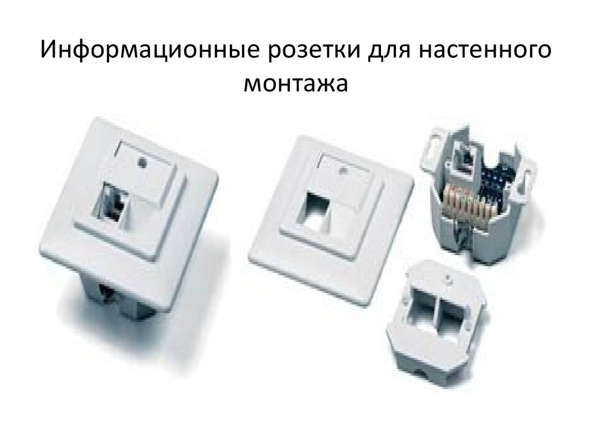
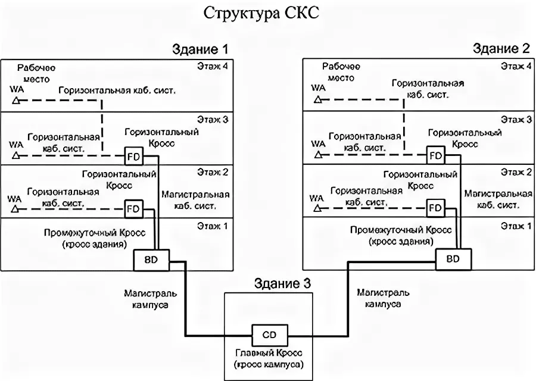
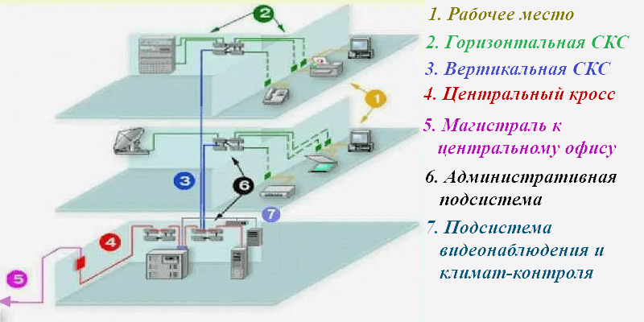

<strong>Кратко</strong>
<table><tr><td>

**Краткое содержание главы I «Общие сведения о СКС»**

**1.1. История и стандарты**

- Идея СКС предложена AT&T в 1983 г. Первая универсальная система — IBM (2-парный экранированный кабель 150 Ом, 9 типов кабеля). Из-за цены и узкой специализации широкого распространения не получила.
- 1985 — EIA начала разработку стандарта; 1988 — подключилась TIA; 1990 — TIA/EIA-569 (кабельные пути); 1991 — TIA/EIA-568 (структура и требования), TSB36 (категории UTP), TSB40 (разъёмы); 1993 — TIA/EIA-606 (администрирование); 1994 — TIA/EIA-607 (заземление); 1995 — TIA/EIA-568A (исключён коаксиал, разрешены одномодовые волокна), TSB72 (централизованное администрирование), TSB75 (открытые офисы); 1998 — TSB95 (Gigabit Ethernet); 1999 — TIA/EIA-570A (оптические разъёмы).
- Международные: ISO/IEC 11801 (1995, ред. 2000), EN 50173 (CENELEC), ISO/IEC 14763-1/2/3 (администрирование, планирование, тестирование), CEI/IEC 61935-1 (тестирование электрических линий).
- В России ГОСТа на СКС нет; используются международные и американские стандарты, а также ПУЭ и отдельные ГОСТы.

**1.2. Структура СКС**

- **Топология** — древовидная (иерархическая звезда). Узлы — коммутационное оборудование (дистрибьюторы) в технических помещениях.
- **Технические помещения**: аппаратные (сетевое оборудование коллективного пользования — АТС, серверы) и кроссовые (КВМ, КЗ, КЭ). В СКС одна КВМ; в каждом здании не более одной КЗ; допускается совмещение КВМ с КЗ, КЗ с КЭ.
- **Подсистемы** (по ISO/IEC 11801): внешних магистралей (между зданиями, до 1500 м), внутренних магистралей (внутри здания, до 500 м), горизонтальная (КЭ — ИР, до 90 м). Дополнительно выделяют подсистему рабочего места (не входит в СКС).
- **Коммутация** — только ручная (шнуры и перемычки); СКС не зависит от электропитания.
- **Администрирование**: многоточечное (классическая иерархическая звезда, переключение минимум двух шнуров) и одноточечное (все розетки к одному помещению, для небольших сетей).
- **Кабели**: симметричные (100, 120, 150 Ом; экранированные и неэкранированные) и волоконно-оптические (одномодовые и многомодовые). Коаксиальные кабели исключены из новых стандартов.

**1.3. Классы, категории и длины**

- **Классы приложений** (ISO/IEC 11801): A (до 100 кГц), B (до 1 МГц), C (до 16 МГц), D (до 100 МГц), оптический.
- **Категории кабелей и разъёмов**: 3 (16 МГц), 4 (20 МГц), 5 (100 МГц), 5е (100 МГц, Gigabit Ethernet), 6 (250 МГц), 7 (600 МГц). Категории 6 и 7 — классы E и F.
- **Соответствие**: категория 3 → класс C; категория 5 → класс D; категория 6 → класс E; категория 7 → класс F.
- **Максимальные длины**: горизонтальный кабель — 90 м, тракт — 100 м; внутренняя магистраль — 500 м; внешняя магистраль — 1500 м (до 2000 м суммарно); одномодовые волокна — до 3000 м. Шнуры в горизонтальной подсистеме — до 10 м (для электрических), в кроссовых магистралях — до 20 м, оконечные — до 30 м.

**1.4. Дополнительные варианты топологии**

- **Горизонтальная подсистема**: прямое соединение, точка перехода (ТП), многопользовательская розетка (MUTO), консолидационная точка (CP). Для открытых офисов: MUTO (до 20 м оконечный шнур, формула W = (102 – H)/1,2 – 7) и CP.
- **Централизованное администрирование** (TSB72): одноуровневая топология на оптике, вариант с одним межсоединением (до 300 м) и без межсоединений (до 90 м). Позволяет сосредоточить активное оборудование в одном месте.

**1.5. Принцип Cable Sharing**

- Использование 4-парного кабеля для одновременной передачи сигналов нескольких приложений (2, 3 или 4). Официально допускается ISO/IEC 11801 и EN 50173. Требует специальных элементов: Y-адаптеры, балуны, разветвительные шнуры, сдвоенные розеточные модули. Наиболее эффективен в сетях небольшого и среднего размера. В России мало популярен из-за ориентации на TIA/EIA-568A и отсутствия рынка SOHO.

**1.6. Гарантийная поддержка**

- **Гарантия на компоненты** (базовая) — 5 лет (иногда до 20).
- **Системная гарантия** — 15–16 лет для категории 5, до 20–25 лет для более высоких категорий. Условия: только разрешённые компоненты, соответствие стандартам, авторизованный персонал.
- **Гарантия работы приложений** — поддержка конкретных приложений.
- **Обобщённая гарантия** — расширение списка приложений, увеличение длины базовой линии, нулевой уровень ошибок.
- Сертификат выдаётся на СКС или её владельца; гарантийный ремонт выполняет инсталлятор.

**1.7. Выводы**

- СКС — основа информационной инфраструктуры предприятия, реализуется по иерархическому звездообразному принципу.
- Интеграция оптических и электрических линий обеспечивает поддержку современных и перспективных приложений.
- Максимальная дальность — 3000 м, пропускная способность — 1 Гбит/с и выше.
- Стандартизованные варианты построения позволяют адаптировать СКС к любым условиям.
- Гарантированный срок эксплуатации — 15 лет и более.

</td></tr></table>

# Глава I. Общие сведения о СКС

## 1.1. Историческая справка о происхождении СКС и развитии стандартов

Идея создания структурированной кабельной системы как основы слаботочной кабельной разводки здания была высказана специалистами фирмы AT&T (ныне Lucent Technologies) в 1983 году [10].

> Структурированная кабельная система (СКС) — <mark><strong>универсальная кабельная система здания или комплекса зданий, построенная по иерархическому звездообразному принципу и предназначенная для передачи сигналов различных слаботочных приложений (данные, телефония, системы безопасности и др.) по единой кабельной инфраструктуре.</strong></mark>

Первая достаточно удачная попытка создания универсальной кабельной системы для построения офисных информационных систем была предпринята корпорацией IBM. В 80-е годы специалистами этой компании на основе 2-парного экранированного симметричного кабеля с волновым сопротивлением 150 Ом была разработана система IBM, предназначенная для обеспечения функционирования сетей Token Ring, серверов AS/400, терминалов 3270 и других аналогичных устройств. Спецификация кабельной части системы IBM включала в себя 9 различных «типов» кабеля (табл. 1.1). Интересно, что сама IBM никогда не производила компоненты своей кабельной системы — этим по фирменным спецификациям IBM занимаются другие компании. Из девяти возможных вариантов кабелей наибольшую популярность получили типы 1 и 6. Они до сих пор продолжают применяться в сетях Token Ring, хотя последние несколько лет IBM рекомендует использовать для этого кабели категории 3, 4 или 5 с 8-контактными модульными разъемами. Поддержка функционирования устройств с коаксиальным и твинаксиальным интерфейсами обеспечивалась включением в состав системы развитой номенклатуры балунов.

> Балун (balun, от balanced–unbalanced) — согласующее устройство, предназначенное для перехода между симметричной (витая пара) и несимметричной (коаксиальный кабель) линиями передачи.

**Таблица 1.1. Типы кабелей по спецификации IBM**

| Тип кабеля | Конструкция                                                                                                                                          |
|------------|------------------------------------------------------------------------------------------------------------------------------------------------------|
| Тип 1      | 2 экранированные витые пары из монолитных проводников (22 AWG, 150 Ом) в общем внешнем экране в виде оплётки                                         |
| Тип 2      | 2 экранированные (22 AWG, 150 Ом) и 4 неэкранированные (22 AWG, до 1 МГц) витые пары из монолитных проводников в общем внешнем экране в виде оплётки |
| Тип 3      | 4 неэкранированные (22 или 24 AWG, до 1 МГц) витые пары из монолитных проводников                                                                    |
| Тип 4      | Не специфицирован                                                                                                                                    |
| Тип 5      | Два многомодовых оптических волокна                                                                                                                  |
| Тип 6      | Коммутационный кабель. 2 экранированные витые пары из многожильных проводников (26 AWG) в общем внешнем экране                                       |
| Тип 7      | Не специфицирован                                                                                                                                    |
| Тип 8      | Плоский кабель для прокладки под ковровыми покрытиями. 2 неперевитые экранированные пары из монолитных проводников (26 AWG)                          |
| Тип 9      | 2 пары из монолитных или многопроволочных проводников (26 AWG)                                                                                       |

В силу ряда причин, основными из которых являются высокая цена, низкая технологичность монтажа, ориентированность в основном на продукты IBM и трудности интегрирования в современные сетевые структуры[^1], <mark><strong>эта кабельная система не получила широкого распространения.</strong></mark>

[^1]: Не все производители активного сетевого оборудования гарантируют его нормальное функционирование в среде с волновым сопротивлением 150 Ом. Таким образом, кабельная система IBM не обеспечивает полной универсальности и независимости от приложений.

В 1985 году Ассоциация электронной промышленности США (Electronic Industries Association — EIA) приступила к созданию стандарта для телекоммуникационных кабельных систем зданий. Подготовку нормативной документации выполняло несколько рабочих групп:

- TR41.8.1 — рабочая группа по кабельным системам офисных и промышленных зданий;
- TR41.8.2 — рабочая группа по кабельным системам жилых зданий и зданий офисного типа с низким коэффициентом использования полезной площади;
- TR41.8.3 — рабочая группа по кабельным каналам для телекоммуникационных кабелей;
- TR41.8.4 — рабочая группа по магистральным кабельным системам жилых зданий и зданий офисного типа с низким коэффициентом использования полезной площади;
- TR41.8.5 — рабочая группа по формализации терминов и определений;
- TR41.7.2 — рабочая группа по заземлению и строительным решениям;
- TR41.7.3 — рабочая группа по электромагнитной совместимости.

В 1988 году к работе по стандартизации подключилась Ассоциация телекоммуникационной промышленности США (Telecommunications Industry Association — TIA). 

В 1989 году известная американская исследовательская организация Underwriters Laboratories (UL) совместно с фирмой Anixter разработали новую классификацию кабелей на витых парах. В её основу было положено понятие «уровень». Толкование уровней представлено в табл. 1.2.

**Таблица 1.2. Классификация витых пар по уровням**

| Тип кабеля | Максимальная частота сигнала | Типовые приложения |
|---|---|---|
| Уровень 1 | Нет требований | Цепи питания и низкоскоростной обмен данными |
| Уровень 2 | До 1 МГц | Голосовые каналы связи и системы безопасности |
| Уровень 3 | До 16 МГц | Локальные сети Token Ring и Ethernet 10BaseT |
| Уровень 4 | До 20 МГц | Локальные сети Token Ring и Ethernet 10BaseT |
| Уровень 5 | До 100 МГц | Локальные сети со скоростью передачи данных до 100 Мбит/с |

Результатом деятельности рабочей группы TR41.8.1 стал стандарт телекоммуникационных кабельных систем коммерческих зданий TIA/EIA-568, который был одобрен в июле 1991 года. Этот документ определял структуру кабельной системы и требования к характеристикам кабелей и разъёмов, применяемых для её построения. Для построения системы допускалось использование кабелей из неэкранированных витых пар с волновым сопротивлением 100 Ом и экранированных витых пар с сопротивлением 150 Ом, а также 50-омных коаксиальных кабелей и многомодовых волоконно-оптических кабелей. Документ не сертифицировал волоконно-оптический разъём [13].

В ноябре 1991 года рабочая группа TR41.8.1 выпустила дополнительные спецификации на симметричные электрические кабели из неэкранированных витых пар — технический бюллетень TIA/EIA TSB-36 [14]. В этом документе впервые вводилось понятие категорий кабелей из неэкранированных витых пар, которые были определены практически в полном соответствии с уровнями по классификации UL и Anixter (табл. 1.3). Фактически произошла только смена термина, и классификация по уровням перестала применяться. Первые два уровня витых пар для низкоскоростных приложений в бюллетене TSB-36 не специфицированы.

> Категория кабеля — классификационная характеристика симметричного кабеля на витых парах, определяющая максимальную частоту сигнала, на которую рассчитан данный кабель, и соответствующий набор нормируемых электрических параметров.

**Таблица 1.3. Соответствие различных стандартов [12]**

| Наименование | Международные | Американские | Европейские |
|---|---|---|---|
| Общие характеристики кабельной системы | ISO/IEC 11801 | TIA/EIA 568A | EN 50173 |
| Планирование, инсталляция и администрирование | ISO/IEC 14763-1, ISO/IEC 14763-2 | TIA/EIA-569, TIA/EIA-606, TIA/EIA-607 | prEN 50174 |
| Испытания | — | TSB-67 | — |
| Прокладка кабеля | CD 14763-3, CD 14763-4 | TIA/EIA-569A | — |

В другом дополнении к стандарту TIA/EIA-568 — техническом бюллетене TIA/EIA TSB-40 [15] — были описаны дополнительные спецификации на разъёмы для кабелей из неэкранированных витых пар. Они также подразделялись на категории 3, 4 и 5. Бюллетень предписывал использовать разъёмы категорией не ниже категории кабелей, на которые они устанавливались.

В октябре 1995 года увидела свет вторая редакция стандарта TIA/EIA-568 — TIA/EIA-568A, — которая включала в себя и уточняла все основные положения технических спецификаций бюллетеней TSB-36 и TSB-40. Наиболее существенное отличие от предшествующего документа состояло в том, что применение коаксиального кабеля не рекомендовалось для построения вновь создаваемых СКС и одновременно было разрешено использование одномодовых волоконно-оптических кабелей в магистральных подсистемах.

В январе 1993 года был одобрен ещё один важный нормативный документ, подготовленный рабочей группой TR41.8.3, — TIA/EIA-606 «Стандарт на администрирование телекоммуникационной инфраструктуры коммерческих зданий» [16]. Стандарт определяет правила ведения документации по СКС на этапе эксплуатации — маркировка, ведение записей, правила оформления схем, отчёты и т.д. Документ рекомендовал ведение документации в электронном виде.

Ещё один смежный стандарт — TIA/EIA-607 — принимается в августе 1994 года. Он включает в себя требования к различным устройствам заземления, применяемым в здании. Традиционно основным назначением системы заземления было обеспечение безопасности эксплуатации электроустановок, то есть защита человека от поражения электрическим током. Стандарт TIA/EIA-607 определяет дополнительные требования к организации систем заземления, выполнение которых является необходимым условием обеспечения эффективной и надёжной передачи электрических сигналов по СКС. Документы TIA/EIA-568A, TIA/EIA-569, TIA/EIA-606 и TIA/EIA-607 являются национальными стандартами США.

Быстрое совершенствование средств волоконно-оптической техники, снижение её стоимости и массовое внедрение в состав кабельной проводки зданий офисного типа позволили применять при построении СКС структуры с так называемым централизованным администрированием. Переход к этому принципу позволяет существенно упростить процесс администрирования СКС. Возможные варианты и правила их построения описаны в техническом бюллетене TSB-72, изданном в октябре 1995 года.

В августе 1996 года появляется технический бюллетень TSB-75, который существенно расширил возможности проектировщиков и служб эксплуатации кабельной системы так называемых открытых офисов.

В сентябре 1998 года был принят технический бюллетень TSB-95, в котором содержалась информация о дополнительных контролируемых параметрах канала категории 5. Соответствие этих параметров норме является необходимым условием обеспечения нормальной работы приложения Gigabit Ethernet.

В мае 1999 года подкомитет по стандартизации TR42.2 утвердил стандарт TIA/EIA-570A, нормирующий оптические разъёмы, используемые в абонентских розетках. Согласно этому нормативному документу в новых СКС на рабочих местах наряду с разъёмами типа SC допускалась установка малогабаритных разъёмов нового поколения.

К 2000 году подкомитет TR42 ассоциации TIA опубликовал ряд приложений к стандарту TIA/EIA-568A, которые, вероятнее всего, без каких-либо существенных изменений войдут в новую редакцию американского стандарта (рабочее название TIA/EIA-568B). Так, в частности, дополнение 1 задаёт количественные ограничения на параметры delay и skew. В дополнении 5 определены характеристики улучшенной категории 5е, которые превосходят нормы упомянутого выше технического бюллетеня TSB-95.

Параллельно с TIA/EIA работу над стандартизацией СКС вели Международная организация по стандартизации (ISO) и Международная электротехническая комиссия (IEC). В 1995 году они выпустили совместный документ — стандарт ISO/IEC 11801 «Информационные технологии. Универсальная кабельная система для зданий и территории Заказчика». Его содержание имеет непринципиальные отличия от стандарта TIA/EIA-568A, связанные в основном со структурой документа, с различной терминологией и с глубиной проработки некоторых положений. Дополнительно отметим, что стандарт ISO/IEC 11801 допускает применение витых пар с волновым сопротивлением в 120 Ом и многомодовых оптических кабелей с волокнами 50/125, популярных в некоторых европейских странах.

Европейская организация по стандартизации CENELEC подготовила свой стандарт EN 50173[^2], окончательная редакция которого увидела свет в августе 1995 года. Его англоязычная версия в содержательной своей части практически является копией международного стандарта ISO/IEC 11801.

[^2]: EN — Europe Norm.

Стандарты ISO/IEC и CENELEC постоянно развиваются и дополняются. Наиболее значительные изменения в этой области за последнее время произошли в 1999–2000 годах, когда была принята целая группа новых нормативно-технических документов.

В начале 2000 года увидела свет дополненная редакция стандарта ISO/IEC 11801, в которой введён ряд новых параметров и уточнены значения традиционных параметров отдельных компонентов и трактов на основе витых пар. Выполнение требований, изложенных в этом нормативном документе, обеспечивает передачу в горизонтальной подсистеме информационных потоков сетевых интерфейсов Gigabit Ethernet и аналогичных им.

В 1999 году принимается стандарт ISO/IEC 14763-1 [17], являющийся аналогом американского стандарта TIA/EIA-606 и определяющий правила администрирования кабельной системы.

Процедуры тестирования электрических кабельных линий различных видов, построенных в соответствии со стандартом ISO/IEC 11801, нормирует стандарт CEI/IEC 61935-1 [18]. Аналогичный документ ISO/IEC TR 14763-3 [19] задаёт процедуры тестирования волоконно-оптических кабельных линий.

Документ ISO/IEC TR 14763-2 [20] регламентирует процесс разработки и создания кабельной разводки, начиная с планирования и составления спецификации и заканчивая организацией проведения монтажных работ и составления спецификации.

Все три основных стандарта достаточно близки друг к другу и подробно нормируют основной комплекс вопросов, связанных с построением СКС (табл. 1.3). Определённые отличия непринципиального характера имеются как в перечне допустимой для построения СКС элементной базе (табл. 1.4) и предельно допустимых параметрах отдельных компонентов, так и в терминологии и глубине освещения некоторых вопросов. На практике именно из-за последнего обстоятельства в различных ситуациях приходится пользоваться как международным стандартом ISO/IEC 11801, так и американским стандартом TIA/EIA-568A, а также дополняющими его техническими бюллетенями TSB. Тем не менее можно констатировать, что за прошедшие десять лет удалось в значительной степени преодолеть имеющиеся первоначальные различия: известные на середину 2000 года версии основных нормативно-технических документов СКС отличаются друг от друга значительно меньше. Общая структура СКС показана на рис. 1.1.

**Таблица 1.4. Основные отличия между стандартами [21]**

| Параметр | ISO/IEC 11801 | EN 50173 | TIA/EIA-568A |
|---|---|---|---|
| Поддерживаемый кабель | UTP, FTP, STP | UTP, FTP, STP | UTP, STP |
| Кабель с $Z_в = 120$ Ом | Допускается | Допускается | Не допускается |
| Диаметр проводника, мм | 0,40–0,65 | 0,40–0,6 | 0,511–0,643 |
| Число пар в горизонтальном кабеле | 2 или 4 | 2 или 4 | 4 |
| Категория компонентов | 3, 4 и 5 | 3 и 5 | 3, 4 и 5 |
| Затухание кабелей для шнуров | Больше на 50% | Больше на 50% | Больше на 20% |
| Оптоволокно 62,5/125 | Основное | Основное | Основное |
| Оптоволокно 50/125 | Альтернативное | Альтернативное | Не допускается |
| Экранированное гнездо | Допускается | Допускается | Не допускается |
| Категории кабелей рабочего места | 5 + 3 | 5 + 5 | 5 + 3 |

Кроме международных стандартов в ряде европейских стран действуют свои национальные нормативные документы, учитывающие требования местной промышленности, исторические традиции, законодательные акты смежных областей и другие особенности. Ссылки на такие документы могут встречаться в сопроводительной технической документации в случае поступления оборудования СКС в рамках реализации комплексных проектов. Так, в своей практической деятельности авторам данной монографии приходилось достаточно часто сталкиваться со ссылками на нормы DIN/VDE, так как кабельная система ICCS достаточно активно и в течение длительного времени — вплоть до продажи в начале 2000 года этого направления бизнеса американской фирме Corning — продвигалась на российском рынке немецким концерном Siemens. По данным сервера www.cabletesting.com, своя нормативная база, ориентированная в основном на положения американских стандартов, имеется в Австралии и Новой Зеландии. Сразу же отметим, что известные авторам данной работы национальные нормы не имеют принципиальных расхождений с международными, европейскими и американскими стандартами. Эти документы отличаются главным образом используемой терминологией и глубиной проработки отдельных положений. Поэтому в дальнейшем они специально не рассматриваются и упоминаются только в случае необходимости.

К сожалению, по состоянию на середину 2000 года в России только разворачивалась работа по созданию национального стандарта по телекоммуникационным кабельным системам, которые можно рассматривать как аналог соответствующих зарубежных. Поэтому излагаемый далее материал базируется на международных стандартах и национальных стандартах США. Отечественными нормативными документами, дополнительно использованными при написании этой работы, являются Правила устройства электроустановок (ПУЭ), а также некоторые ГОСТы по правилам выполнения проектных работ, оформления проектной документации и тестированию кабельных изделий.

## 1.2. Структура СКС

### 1.2.1. Топология СКС

<mark><strong>В основу любой структурированной кабельной системы положена древовидная топология, которую иногда называют также структурой иерархической звезды.</strong></mark> Обобщённая структурная схема СКС изображена на рис. 1.2. Узлами структуры являются коммутационное оборудование различного вида (в соответствии с терминологией стандарта ISO/IEC 11801 — дистрибьютор, distributor), которое обычно устанавливается в технических помещениях и соединяется друг с другом и с информационными розетками на рабочих местах электрическими и оптическими кабелями.

<strong>улосные обозначения</strong>
<table><tr><td>

1. информационная розетка: 

КВМ, КЗ и КЭ — это типы кроссовых помещений в структурированной кабельной системе (СКС). Они представляют собой узлы, через которые проходят кабели системы и осуществляется коммутация соединений.

2. КВМ — кроссовая внешних магистралей. В неё сходятся кабели внешней магистрали, которые подключают отдельные кроссовые здания (КЗ).

3. КЗ — кроссовая здания. В неё заводятся внутренние магистральные кабели, которые подключают кроссовые этажей (КЭ).

4. КЭ — кроссовая этажа. К ней горизонтальными кабелями подключены розеточные модули информационных розеток рабочих мест.

Особенности организации
- Во всей СКС может быть только одна КВМ.
- В каждом здании может находиться не более одной КЗ.
- Допускается объединение КВМ с КЗ, если они расположены в одном здании.
- Аналогично КЗ может быть совмещена с КЭ, если они расположены на одном этаже.
- При малой плотности рабочих мест на этаже или его части допускается подключение к КЭ горизонтальных кабелей смежных этажей.

</td></tr></table>

Вот как выглядит декомпозиция:

Или вот карсивая картинка:

> Дистрибьютор (distributor) — коммутационное оборудование, устанавливаемое в техническом помещении и предназначенное для подключения и переключения кабелей СКС.

<mark><strong>Стандарты не регламентируют тип коммутационного оборудования, определяя только его параметры.</strong></mark> Для монтажа и дальнейшей эксплуатации коммутационного оборудования необходимы технические помещения. Все кабели, входящие в технические помещения, обязательно заводятся на коммутационное оборудование, на котором осуществляются все необходимые подключения и переключения в процессе строительства и текущей эксплуатации кабельной системы. Это обеспечивает гибкость СКС, возможность лёгкой переконфигурации и адаптируемости под конкретное приложение.

Основой для применения именно иерархической звездообразной топологии является возможность её использования для поддержки работы всех основных сетевых приложений (см. табл. 1.5). Из данных таблицы следует вывод о том, что топология рассматриваемого вида является той платформой, которая обеспечивает функционирование современных средств передачи данных.

**Таблица 1.5. Логическая и физическая топология современных сетей передачи данных**

| Протокол              | Логическая топология | Физическая топология |
|-----------------------|----------------------|----------------------|
| Token Ring            | Кольцо               | Кольцо, звезда       |
| High Speed Token Ring | Кольцо               | Кольцо, звезда       |
| FDDI                  | Кольцо               | Кольцо, звезда       |
| Ethernet              | Шина                 | Шина, звезда         |
| Fast Ethernet         | Шина                 | Звезда               |
| Gigabit Ethernet      | Шина                 | Звезда               |
| ATM                   | Виртуальный канал    | Кольцо, звезда       |

### 1.2.2. Технические помещения

Технические помещения, необходимые для построения СКС и информационной системы предприятия, в целом делятся на аппаратные и кроссовые.

> Аппаратная — техническое помещение, в котором наряду с коммутационным оборудованием СКС располагается сетевое оборудование коллективного пользования (АТС, серверы, концентраторы).

Если основной объём установленных в этом помещении технических средств составляет оборудование ЛВС, то его иногда называют серверной, а если учрежденческая АТС и системы внешних телекоммуникаций — узлом связи. Аппаратные оборудуются фальшполами, системами пожаротушения, кондиционирования и контроля доступа.

> Кроссовая — помещение, в котором размещается коммутационное оборудование СКС, сетевое и другое вспомогательное оборудование.

Желательно её размещение вблизи вертикального стояка, оборудование телефоном и системой контроля доступа. При этом уровень оснащения кроссовой оборудованием инженерного обеспечения её функционирования в целом является более низким по сравнению с аппаратными. Кроссовые на практике достаточно часто называют просто техническими (этажными) помещениями, встречается также наименование «хабовые».

Аппаратная может быть совмещена с кроссовой здания (КЗ). В этом случае его сетевое оборудование может подключаться непосредственно к коммутационному оборудованию СКС. Если аппаратная расположена отдельно, то её сетевое оборудование подключается к локально расположенному коммутационному оборудованию или к обычным информационным розеткам рабочих мест. В кроссовую внешних магистралей (КВМ) сходятся кабели внешней магистрали, подключающие к ней КЗ. В КЗ заводятся внутренние магистральные кабели, подключающие к ним кроссовые этажей (КЭ). К КЭ, в свою очередь, горизонтальными кабелями подключены информационные розетки рабочих мест. В качестве дополнительных связей, увеличивающих гибкость и живучесть системы, допускается прокладка внешних магистральных кабелей между КЗ и внутренних магистральных кабелей между КЭ (пример изображён на рис. 1.1).

Во всей СКС может быть только одна КВМ, а в каждом здании может присутствовать не более одной КЗ. Допускается объединение КВМ с КЗ, если они расположены в одном здании. Аналогично КЗ может быть совмещена с КЭ, если они расположены на одном этаже. Если плотность рабочих мест на этаже или его части мала, то в качестве исключения допускается подключение к КЭ горизонтальных кабелей смежных этажей. Пример структуры СКС с привязкой к зданиям приведён на рис. 1.3.

### 1.2.3. Подсистемы СКС

В самом общем случае СКС, согласно международному стандарту ISO/IEC 11801, включает в себя три подсистемы (рис. 1.2):

- **Подсистема внешних магистралей** (campus backbone cabling, магистраль комплекса зданий) или, по терминологии некоторых СКС европейских производителей, первичная подсистема — состоит из внешних магистральных кабелей между КВМ и КЗ, коммутационного оборудования в КВМ и КЗ, к которому подключаются внешние магистральные кабели, и коммутационных шнуров и/или перемычек в КВМ. Подсистема внешних магистралей является основой для построения сети связи между компактно расположенными на одной территории зданиями (campus). На практике эта подсистема достаточно часто имеет физическую кольцевую топологию, что дополнительно обеспечивает увеличение надёжности за счёт наличия резервных кабельных трасс. Из этих же соображений подсистема внешних магистралей иногда реализуется по двойной кольцевой топологии. Если СКС устанавливается автономно только в одном здании, то подсистема внешних магистралей отсутствует;
- **Подсистема внутренних магистралей** (building backbone cabling), называемая в некоторых СКС магистральной системой здания, вертикальной или вторичной подсистемой, — содержит проложенные между КЗ и КЭ внутренние магистральные кабели, подключённое к ним коммутационное оборудование в КЗ и КЭ, а также коммутационные шнуры и/или перемычки в КЗ. Кабели рассматриваемой подсистемы фактически связывают между собой отдельные этажи здания и/или пространственно разнесённые помещения в пределах одного здания. Если СКС обслуживает один этаж, то подсистема внутренних магистралей может отсутствовать;
- **Горизонтальная подсистема** (horizontal cabling), иногда называемая третичной подсистемой, — образована внутренними горизонтальными кабелями между КЭ и информационными розетками рабочих мест, самими информационными розетками, коммутационным оборудованием в КЭ, к которому подключаются горизонтальные кабели, и коммутационными шнурами и/или перемычками в КЭ. В составе горизонтальной проводки допускается использование одной точки перехода, в которой происходит изменение типа прокладываемого кабеля (например, переход на плоский кабель для прокладки под ковровым покрытием с эквивалентными передаточными характеристиками).

> Точка перехода (transition point, ТП) — элемент горизонтальной подсистемы СКС, в котором происходит соединение двух кабелей различных типов с эквивалентными передаточными характеристиками.

Рассматриваемое здесь деление СКС на отдельные подсистемы применяется независимо от вида или формы реализации сети, то есть оно будет одинаковым, например, для офисной и производственной сети.

Иногда из соображений удобства проектирования и эксплуатационного обслуживания применяется более мелкое дробление оборудования СКС на отдельные подсистемы. Так, например, элементы подключения сетевого оборудования к СКС в кроссовой выделяются в отдельную административную подсистему, а шнуры, адаптеры и другие элементы, необходимые на рабочих местах, образуют отдельную подсистему рабочего места и т.д.

В самом общем случае СКС, согласно действующим редакциям международных нормативно-технических документов, включает в себя восемь компонентов:

- линейно-кабельное оборудование подсистемы внешних магистралей;
- коммутационное оборудование подсистемы внешних магистралей;
- линейно-кабельное оборудование подсистемы внутренних магистралей;
- коммутационное оборудование подсистемы внутренних магистралей;
- линейно-кабельное оборудование горизонтальной подсистемы;
- коммутационное оборудование горизонтальной подсистемы;
- точки перехода;
- информационные розетки.

В подавляющем большинстве случаев подключение к СКС сетевого оборудования производится с помощью коммутационного шнура. В некоторых ситуациях кроме шнура может понадобиться адаптер, обеспечивающий согласование сигнальных и механических параметров оптических или электрических интерфейсов (разъёмов) СКС и сетевого оборудования. Например, адаптеры применяются для подключения к СКС сетевого оборудования с интерфейсами V.24 (RS-232C), устройств кабельного телевидения, систем IBM AS/400 с терминалами 5250, терминальных контроллеров IBM 3274 и терминалов 3270, а также дополнительных приложений, которые разрабатывались для других кабельных систем.

Подсистема рабочего места обеспечивает подключение сетевого оборудования на рабочих местах. Применяемое для её реализации оборудование целиком и полностью зависит от конкретного приложения. Она не является частью СКС и выходит за рамки действия стандартов ISO/IEC 11801 и TIA/EIA-568A, хотя эти нормативные документы накладывают на её параметры и характеристики определённые ограничения, более подробно обсуждаемые ниже.

### 1.2.4. Коммутация в СКС

Принципиальная особенность любой СКС состоит в том, что коммутация в ней, в отличие от электронных АТС и сетевого компьютерного оборудования, всегда производится вручную коммутационными шнурами и/или перемычками. Наиболее важным следствием такого подхода является то, что функционирование СКС принципиально не зависит от состояния электропитающей сети. Введение в состав СКС элементов электронной или электромеханической коммутации немедленно влечёт за собой обязательное использование в оборудовании штатного источника электропитания. С экономической и технической точек зрения такое решение абсолютно неоправданно на нынешнем этапе развития техники: среднее количество переключений одного порта в действующей системе составляет единицы раз в год, а источник питания обладает существенно меньшей эксплуатационной надёжностью по сравнению с пассивными компонентами, образующими кабельную систему. Оборотной стороной отказа от применения штатного источника электропитания можно назвать:

- необходимость использования коммутационных шнуров, которые существенно ухудшают массогабаритные показатели коммутационного оборудования и требуют применения специальных мер для решения задач администрирования;
- невозможность введения в состав СКС штатных коммутаторов, контроллеров, датчиков и другого аналогичного оборудования, что снижает удобство эксплуатации, увеличивает время поиска неисправности, затрудняет текущую диагностику и т.д.

Известны лишь отдельные доведённые до серийного производства разработки, направленные на внедрение активных компонентов в некоторые подсистемы СКС. Однако они носят вспомогательный характер (опрос состояния портов, индикация, коммутация сигналов низкоскоростных приложений), не затрагивают процесс передачи информационных сигналов и не нормируются действующими стандартами и предложениями по их перспективным редакциям.

### 1.2.5. Принципы администрирования СКС

Принципы администрирования (иначе управления) СКС целиком и полностью определяются её структурой. Различают одноточечное и многоточечное администрирование.

> Многоточечное администрирование — управление СКС, построенной по классической архитектуре иерархической звезды, при котором для изменения конфигурации требуется переключение минимум двух шнуров.

Основным признаком этого варианта является необходимость выполнения переключения минимум двух шнуров в общем случае изменения конфигурации. Использование данного принципа гарантирует наибольшую гибкость управления и возможность адаптации СКС для поддержки новых приложений.

> Одноточечное администрирование — управление СКС, при котором все информационные розетки рабочих мест соединены напрямую с единственным техническим помещением.

Архитектура одноточечного администрирования применяется в тех ситуациях, когда требуется максимально упростить управление кабельной системой. Принципиально может использоваться только для СКС, установленных в одном здании и не имеющих магистральной подсистемы. Её основным признаком является прямое соединение всех информационных розеток рабочих мест с единственным техническим помещением. Несложно убедиться в том, что одноточечное администрирование может быть использовано только в небольших сетях и упрощает процесс управления кабельной системой благодаря выполнению всех коммутаций шнурами в одном месте.

### 1.2.6. Кабели СКС

Одним из удачных способов повышения технико-экономической эффективности кабельных систем офисных зданий является минимизация типов кабелей, применяемых для их построения. В СКС согласно международному стандарту ISO/IEC 11801 допускается использование только:

- симметричных электрических кабелей на основе витой пары с волновым сопротивлением 100, 120 и 150 Ом в экранированном и неэкранированном исполнении;
- одномодовых и многомодовых оптических кабелей.

Электрические кабели используются в основном для создания горизонтальной разводки. По ним передаются как телефонные сигналы и низкоскоростные данные, так и данные высокоскоростных приложений. Применение оптических решений в горизонтальной подсистеме в настоящее время встречается достаточно редко, хотя их доля растёт очень быстрыми темпами (решения в рамках концепции fiber to the desk). В подсистеме внутренних магистралей электрические и оптические кабели применяются одинаково часто, причём электрические кабели предназначены для передачи главным образом телефонных сигналов и данных с тактовыми частотами до 1 МГц, тогда как оптические кабели обеспечивают передачу данных высокоскоростных приложений. На внешних магистралях оптические кабели играют доминирующую роль.

> Fiber to the desk (FTTD) — концепция построения горизонтальной подсистемы СКС на волоконно-оптическом кабеле, доведённом до рабочего места.

Для перехода с электрического кабеля на оптический в процессе передачи данных со скоростью 10 Мбит/с и выше в технических помещениях устанавливается соответствующее сетевое оборудование (преобразователи среды или трансиверы [6]), которые обычно обслуживают групповое устройство (концентратор системы передачи данных, выносной модуль АТС, контроллер инженерной системы здания и т.д.). Прямое использование волоконно-оптического кабеля для передачи телефонных сигналов и низкоскоростных данных на современном этапе развития техники является экономически нецелесообразным и применяется в тех ситуациях, когда другие решения невозможны или же выдвигаются особые требования в отношении защиты информации от несанкционированного доступа. Поэтому для улучшения технико-экономической эффективности сети в целом процесс преобразования низкоскоростного электрического сигнала в оптический обычно совмещается с мультиплексированием.

Для построения горизонтальной подсистемы стандартами допускается применение экранированного и неэкранированного кабелей. Экранированный симметричный кабель потенциально обладает лучшими электрическими, а в некоторых случаях и прочностными характеристиками по сравнению с неэкранированным. Однако этот кабель является очень критичным к качеству выполнения монтажа и заземления, имеет заметно большую стоимость и худшие массогабаритные показатели. Поэтому пока основным кабелем для передачи электрических сигналов по СКС, по крайней мере в нашей стране, являются кабели на основе неэкранированных витых пар[^3]. Как было отмечено выше, стандарты разрешают строить СКС на электрических кабелях с волновым сопротивлением 100, 120 и 150 Ом. При этом две последние разновидности кабелей часто обладают заметно лучшими характеристиками. Однако в силу целого ряда причин технического и экономического плана они не получили широкого распространения в нашей стране.

[^3]: Экранированные конструкции играют превалирующую роль только в некоторых странах отличающейся «зелёными» настроениями Европы, например в Германии.

Многомодовые волоконно-оптические кабели используются в основном в качестве основы подсистемы внутренних магистралей. Одномодовые волоконно-оптические кабели рекомендуется применять только для построения длинных внешних магистралей.

Коаксиальные кабели не включаются в число разрешённых к применению в новых стандартах и исключаются из очередных редакций старых стандартов. Это объясняется низкой надёжностью сетей, построенных на их основе, невысокой технологичностью и более высокой стоимостью по сравнению с кабелями на основе витых пар.

Для обеспечения возможности работы по СКС сетевой аппаратуры с коаксиальным и триаксиальным интерфейсом используется широкая номенклатура адаптеров различных видов.

## 1.3. Понятие классов и категорий и их связь с длинами кабельных трасс

### 1.3.1. Классы приложений, категории кабелей и разъёмов СКС

Действующая редакция стандарта ISO/IEC 11801 подразделяет все виды приложений, которые могут обмениваться данными по витым парам, на 4 класса — A, B, C и D (табл. 1.6). Класс A считается низшим классом, а класс D — высшим. Для приложений каждого класса определяется соответствующий класс линии связи, который задаёт предельные электрические характеристики линии, необходимые для нормальной работы приложений соответствующего и более низкого класса (табл. 1.7). К приложениям оптического класса относятся те из них, которые используют в качестве среды передачи сигнала оптический кабель. На момент принятия стандарта ширина полосы пропускания для таких приложений не являлась ограничивающим фактором.

> Класс приложения — классификационная характеристика приложений, обменивающихся данными по витым парам, определяющая максимальную частоту сигнала и соответствующие требования к линии связи.

Интересно также отметить, что стандарт ISO/IEC 11801 не предполагает приложений и линий с максимальной частотой передачи 20 МГц, соответствующих 4-й категории разъёмов и кабелей. Это обусловлено отсутствием популярных сетевых приложений с максимальными частотами сигнала от 16 до 20 МГц.

В некоторых европейских странах иногда практикуется введение дополнительных классов приложений. Так, например, в немецкоязычной технической литературе приложения с верхней граничной частотой 200 МГц иногда называют приложениями класса D+, тогда как приложения с граничной частотой 300 МГц обозначаются приложениями класса D++.

Стандарты ISO/IEC 11801 и TIA/EIA-568A в дополнение к кабелям специфицируют по категориям разъёмы. Категории определяются максимальной частотой сигнала, на которую рассчитаны соответствующие разъёмы и кабели (табл. 1.8). Кабели и разъёмы более высоких категорий поддерживают все приложения, рассчитанные на работу по кабелям более низких категорий.

**Таблица 1.6. Классы приложений по ISO/IEC 11801**

| Класс линии | Определение и приложения |
|---|---|
| A | Телефонные каналы и низкочастотный обмен данными. Максимальная частота сигнала — 100 кГц |
| B | Приложения со средней скоростью обмена. Максимальная частота сигнала — 1 МГц |
| C | Приложения с высокой скоростью обмена. Максимальная частота сигнала — 16 МГц |
| D | Приложения с очень высокой скоростью обмена. Максимальная частота сигнала — 100 МГц |
| Оптический | Приложения, использующие в качестве среды передачи сигнала оптический кабель. Частоты 10 МГц и выше |

**Таблица 1.7. Соответствие категорий кабелей и соединителей классам приложений**

| TIA/EIA-568A | ISO/IEC 11801 | EN 50173 | ISO/IEC 11801 |
|---|---|---|---|
| Кабели и соединители | Кабели и соединители | Кабели и соединители | Приложения |
| — | — | — | A |
| — | — | — | B |
| Категория 3 | Категория 3 | Категория 3 | C |
| Категория 4 | Категория 4 | — | — |
| Категория 5 | Категория 5 | Категория 5 | D |
| — | Категория 6 | — | E |
| — | Категория 7 | — | F |

В сентябре 1997 года IEC начала работу по стандартизации двух новых классов приложений E и F, а также компонентов СКС для категорий 6 и 7[^4]. Параллельно производится работа над так называемой улучшенной категорией 5 (категорией 5+ или 5е) с верхней граничной частотой нормировки параметров в 100 МГц. Последняя фактически фиксирует достигнутый на конец 90-х годов уровень техники и одновременно нормирует ряд параметров, соблюдение которых обеспечивает возможность работы перспективного приложения Gigabit Ethernet. Ожидается, что результаты проведённых исследований войдут в новые редакции действующих в настоящее время стандартов ISO/IEC 11801 и TIA/EIA-568A. Работа в этом направлении обосновывается необходимостью поддержки перспективной сетевой аппаратуры АТМ 155 и 622 Мбит/с, а также Gigabit Ethernet 1000 Мбит/с.

[^4]: В качестве базы для стандарта категории 7 был принят немецкий стандарт DIN 44312-5.

**Таблица 1.8. Категории кабелей и разъёмов**

| Категория кабеля и разъёма | Максимальная частота сигнала | Типовые приложения |
|---|---|---|
| Категория 3 | До 16 МГц | Локальные сети Token Ring и Ethernet 10BaseT, голосовые каналы и другие низкочастотные приложения |
| Категория 4 | До 20 МГц | Локальные сети Token Ring и Ethernet 10BaseT |
| Категория 5 | До 100 МГц | Локальные сети со скоростью передачи данных до 100 Мбит/с |
| Категория 5е | До 100 МГц | Локальные сети со скоростью передачи данных до 1000 Мбит/с |
| Категория 6 | До 250 МГц | Локальные сети со скоростью передачи данных до 1000 Мбит/с |
| Категория 7 | До 600 МГц | Локальные сети со скоростью передачи данных до 1000 Мбит/с |

Приложения класса E и компоненты СКС категории 6 первоначально имели нормируемые характеристики до частоты 200 МГц, которая впоследствии была увеличена до 250 МГц. Необходимость расширения частотного диапазона гарантируемых параметров была обусловлена требованием обеспечения потенциальной возможности поддержки функционирования двухпарных вариантов интерфейсов Gigabit Ethernet. Класс F и компоненты категории 7 рассчитываются на частоты до 600 МГц. Выбор последнего значения не в последнюю очередь обусловлен широким распространением аппаратуры АТМ со скоростью передачи 622 Мбит/с, а также необходимостью поддержки передачи сигналов многоканального аналогового телевидения с верхней граничной частотой 550 МГц. Основные отличия между линиями связи различных категорий приводятся в табл. 1.9. Подробное обсуждение приведённых в них параметров производится в разделе 2.1.3. Здесь укажем только, что таблица наглядно демонстрирует рост требований к качеству по мере перехода к более высокой категории.

**Таблица 1.9. Параметры пропускной способности каналов различных категорий на частоте 100 МГц [12, 22]**

| Параметр | Категория 5 TIA/EIA-568A | TSB-95 | ISO/IEC 11801 | Категория 6 | Категория 7 |
|---|---|---|---|---|---|
| Частотный диапазон, МГц | 1–100 | 1–100 | 1–100 | 1–250 | 1–600 |
| Затухание, дБ | 24 | 24 | 24 | 21,7 (36) | 20,8 (54,1) |
| NEXT, дБ | 27,1 | 27,1 | 27,1 | 39,9 (33,1) | 62,1 (51) |
| PS-NEXT, дБ | — | — | 24,1 | 37,1 (30,2) | 59,1 (48) |
| ACR, дБ | 3,1 | 3,1 | 3,1 | 18,2 (–2,9) | 41,3 (–3,1) |
| PS-ACR, дБ | — | — | 0,1 | 15,4 (–5,8) | 38,3 (–6,1) |
| EL-FEXT, дБ | — | 17 | 17,0 | 23,2 (15,3) | ffs* |
| PS-FEXT, дБ | — | 14,4 | 14,4 | 20,2 (12,3) | ffs |
| Возвратные потери, дБ | — | 8 | 10 | 12 (8) | 14,1 (8,7) |
| Задержка распространения, нс | — | 548 | 548 | 548 (546) | 504 (501) |
| skew, нс | — | 50 | 50 | 50 | 20 |

\* ffs — for future study — для будущего изучения в соответствующем комитете по стандартизации. В скобках указаны значения на верхней рабочей частоте.

Для построения трактов категории 6 используются кабели всех типов (экранированные и неэкранированные). В качестве соединителя применяется, в основном, модульный разъём. Существуют также разработки на других типах разъёмов, наиболее известными из которых являются разъёмы типов 110 и 210. Линии категории 7 при современном состоянии уровня техники могут быть реализованы только на кабеле с экранированными парами. В настоящее время серийные разъёмы модульного типа позволяют обеспечить характеристики проекта нормативных документов категорий 7 только для внешних пар контактов 1/2 и 7/8, что сопровождается потерей универсальности. Имеется несколько опытных разработок разъёмов с улучшенными параметрами, которые в перспективе могут быть использованы в линиях категории 7. Тем не менее ряд аналитиков считает, что совершенствование модульного разъёма для его адаптации к работе на высоких частотах лишено смысла и необходимо переходить на новую конструкцию. Окончательное решение о выборе типа разъёма трактов категории 7 комитетами по стандартизации по состоянию на середину 1999 года не принято. Более подробная информация об известных разработках в этой области приводится далее в разделе 3.2.6.

Ниже не будем останавливаться на классах линий A и B, построение которых не представляет никаких трудностей на современной элементной базе. Малый интерес специалистов по СКС к этим линиям обусловлен тем, что они не поддерживают работу наиболее массовой на сегодняшний день сетевой аппаратуры Ethernet, то есть на упомянутых линиях нельзя построить универсальную СКС. Точно так же в дальнейшем специально подробно не обсуждаются линии категорий 5е, 6 и 7, которые по состоянию на середину 1999 года официально не стандартизированы.

Линии электрической связи СКС должны быть собраны из кабелей и других компонентов с характеристиками не хуже той категории, на которую они рассчитаны. Данное правило имеет также и обратное действие в отношении категорий до 5е включительно: линия связи, собранная из компонентов определённой категории, поддерживает работу всех приложений своего и более низкого классов.

Стандарты ISO/IEC 11801 и TIA/EIA-568A определяют, что линии связи СКС будут соответствовать требованиям определённой ими категории при соблюдении следующих трёх условий[^5]:

- технические характеристики всех кабелей, разъёмов и соединительных шнуров этой линии соответствуют требованиям этой категории или превышают их;
- линия связи спроектирована с учётом требований стандартов (то есть соблюдены ограничения на длины кабелей, количество точек коммутации и т.д.);
- монтаж выполнен в полном соответствии с требованиями перечисленных выше стандартов.

[^5]: Достигнутый на сегодняшний день уровень техники позволяет распространить данное правило и на категорию 5е.

### 1.3.2. Ограничения на длины кабелей и шнуров СКС

Стандарты ISO/IEC 11801 и TIA/EIA-568A устанавливают ограничения на максимальные длины кабелей и соединительных шнуров горизонтальной и магистральных подсистем. Длины кабелей указаны на рис. 1.4 и приведены в табл. 1.10. Дополнительно ещё раз подчеркнём, что максимальные длины электрических кабельных линий для передачи сигнала указанного класса приведены для случая построения этих линий из симметричного кабеля и других компонентов с категорией не ниже указанной.

**Таблица 1.10. Максимальные длины кабельных трактов в зависимости от типа кабеля и класса приложения**

| Среда передачи сигнала | Класс приложений A | B | C | D | Оптика |
|---|---|---|---|---|---|
| Симметричный кабель категории 3 | 2 км | 200 м | 100 м* | — | — |
| Симметричный кабель категории 4 | 3 км | 260 м | 150 м | — | — |
| Симметричный кабель категории 5 | 3 км | 260 м | 160 м | — | — |
| Симметричный кабель 150 Ом | 3 км | 400 м | 250 м | — | — |
| Многомодовый оптический кабель | — | — | — | — | 2 км |
| Одномодовый оптический кабель | — | — | — | — | 3 км** |

\* Под длиной 100 м понимается суммарная длина горизонтального кабеля (до 90 м) и шнуров всех разновидностей.
\** 3 км — ограничение, формально наложенное стандартом. Не является физическим ограничением для одномодовых волоконных световодов.

Длина кабеля горизонтальной подсистемы установлена равной 90 м (плюс 10 м на соединительные шнуры). Выбор именно этого значения произведён, исходя из возможностей витой пары как направляющей системы электромагнитных колебаний передавать сигналы наиболее массовых (на момент принятия стандартов) высокоскоростных приложений типа Fast Ethernet. Учитывались достигнутый технический уровень элементной базы и применяемые схемотехнические решения приёмо-передатчиков современного сетевого оборудования. Не последнюю роль при выборе именно этого значения максимальной длины играли архитектурные особенности типовых офисных зданий.

В случае реализации горизонтальной разводки на волоконно-оптическом кабеле длина кабельной трассы ограничена величиной 90 м из тех соображений, что она гарантированно позволяет выполнить ограничения протокольного характера сетей Fast Ethernet по максимальному диаметру коллизионного домена.

Основным назначением подсистемы внутренних магистралей является объединение в единое целое технических помещений в пределах одного здания. Соответственно, максимальная длина кабеля такой магистрали устанавливается стандартами равной 500 м[^6].

[^6]: Данное требование не является чрезмерно завышенным, как это может показаться на первый взгляд. Так, в практике авторов имелся случай реализации СКС в здании длиной 400 м.

И наконец, подсистема внешних магистралей, которая объединяет отдельные здания, согласно стандарту ISO/IEC 11801 может включать в себя кабели максимальной длиной 1,5 км. Дополнительно оговаривается, что максимальная длина магистральных кабелей между кроссовой этажа и кроссовой внешних магистралей не может превышать 2000 м (500 м кабеля внутренней и 1500 м кабеля внешней магистрали) при условии применения коммутационных и оконечных шнуров стандартной длины. В случае использования одномодового кабеля указанное значение может быть увеличено до 3000 м. При современном состоянии уровня волоконно-оптической техники с использованием обычной серийной аппаратуры это расстояние может быть равным 100 и более километрам. Однако при необходимости обеспечения связи на столь большие расстояния стандартами предполагается, что для передачи информации будут использоваться линии и каналы связи общего пользования различных телекоммуникационных операторов.

Длины коммутационных и оконечных шнуров зависят от выбранной схемы подключения сетевого оборудования[^7], типа среды передачи сигнала и подсистемы СКС, к которой относится данный конкретный шнур или их совокупность. Согласно стандарту ISO/IEC 11801 в редакции 2000 года максимальная суммарная длина кабелей шнуров в горизонтальной подсистеме составляет:

- 9 м в случае схемы коммутационного подключения для электрического кабеля;
- 10 м в случае схемы коммутационного соединения для электрического кабеля;
- 10 м при любой схеме подключения в волоконно-оптическом варианте.

[^7]: Подробная информация о вариантах подключения оборудования содержится в разделе 10.3.5.1.

Отметим, что в редакции 1995 года этого стандарта максимальная суммарная длина шнуров независимо от варианта составляла 10 м, то есть произошло определённое ужесточение нормативных требований.

Максимальная длина коммутационного шнура, применяемого в кроссовых магистральных подсистем (КЗ и КВМ), согласно стандарту ISO/IEC 11801 равна 20 м. Длина оконечных шнуров, предназначенных для подключения сетевого оборудования в этих технических помещениях, не должна превышать 30 м.

## 1.4. Дополнительные варианты топологического построения СКС

Ниже рассматриваются дополнительные возможности построения горизонтальной подсистемы и подсистемы внутренних магистралей, часть из которых не вошла в основные действующие стандарты по СКС. По состоянию на середину 1999 года они нормируются только техническими бюллетенями TIA/EIA и, по мнению большинства специалистов по СКС, без каких-либо принципиальных изменений их основные положения будут введены в новые редакции стандартов. Наличие этих вариантов существенно расширяет свободу выбора проектировщика и позволяет значительно увеличить технико-экономическую эффективность кабельной системы в ряде случаев.

### 1.4.1. Варианты построения горизонтальной подсистемы СКС

Горизонтальная подсистема СКС при её реализации на кабелях из витых пар может быть построена по четырём различным схемам, которые приведены на рис. 1.5. Наиболее часто применяется первая из них, которая образована непрерывным кабелем максимальной длиной 90 м, соединяющим информационную розетку ИР и коммутационную панель в кроссовой этажа КЭ. Во втором варианте тракт передачи образуется из кабелей двух различных типов, но с эквивалентными передаточными характеристиками. Эти кабели соединяются между собой в так называемой точке перехода ТП (transition point). Согласно международному стандарту ISO/IEC 11801 здесь возможны две комбинации типов таких кабелей: «многопарный + четырёхпарный» и «круглый + плоский» с одинаковым количеством пар (на практике это четыре пары). Американский стандарт TIA/EIA-568A трактует точку перехода более узко: в ТП согласно этому нормативно-техническому документу происходит соединение плоского кабеля с круглым.

Точка перехода реализуется на обычном коммутационном оборудовании, однако его запрещается использовать для выполнения операций администрирования кабельной системы и для подключения активных сетевых устройств любого назначения. В соответствии с этим в точке перехода никогда не должны применяться коммутационные и оконечные шнуры.

Последние два варианта построения горизонтальной подсистемы СКС ориентированы, в первую очередь, на применение в так называемых открытых офисах (open offices или open space offices), то есть в рабочих помещениях большой площади, которые разделены на отдельные секции специализированной мебелью или лёгкими некапитальными перегородками. Общим отличительным признаком таких офисов являются частые перемещения сотрудников и изменения конфигураций рабочих мест, а также наличие явно выраженной зонной группировки отдельных рабочих мест. В открытых офисах могут применяться многопользовательские телекоммуникационные розетки MUTO (Multi-User Telecommunication Outlet) и консолидационные точки CP (consolidation point). Оба варианта стандартизированы техническим бюллетенем TSB-75 [23] и адаптируют рассмотренные выше решения на случай открытого офиса (см. табл. 1.11).

**Таблица 1.11. Аналогии между различными вариантами организации горизонтальной подсистемы**

| Тип офиса | Прямое соединение | Многопользовательское соединение |
|---|---|---|
| Обычный офис | Обычный проброс | Точка перехода |
| Открытый офис | Многопользовательская розетка | Консолидационная точка |

Под многопользовательской розеткой MUTO понимается розетка, которая обслуживает нескольких пользователей. Такой элемент выделяется в отдельный вид оборудования (см. далее раздел 3.3.4) и устанавливается на колоннах и стенах здания, под фальшполом, в напольных коробках и, достаточно редко, в пространстве между капитальным и подвесным потолками. Максимальная длина $W$ оконечного шнура, соединяющего розетку MUTO с сетевым оборудованием на рабочем месте, не должна превышать 20 м и вычисляется следующим образом:

$$W = \frac{102 - H}{1{,}2} - 7 \text{ м}, \quad W \leq 20 \text{ м} \tag{1.1}$$

где $H$ — длина горизонтального кабеля.

Коэффициент 1,2 учитывает повышенное затухание сигнала в кабеле соединительного шнура с гибкими многопроволочными проводниками (см. далее раздел 3.1.4). Постоянный коэффициент 7 определяет максимальную длину коммутационных шнуров в кроссовой. График зависимости длины коммутационного шнура от длины горизонтального кабеля приведён на рис. 1.6. Анализ формулы (1.1) показывает, что при максимальной длине оконечного шнура в 20 м длина горизонтального кабеля не должна превышать 70 м.

Таким образом, суммарная длина оконечного и коммутационного шнуров в открытом офисе может достигать 27 м против 10 м в случае обычного офиса, что сопровождается заметным увеличением гибкости кабельной системы. При этом за счёт соответствующей корректировки длины горизонтального кабеля в сторону уменьшения максимальное суммарное затухание тракта передачи сигнала в обоих случаях оказывается одинаковым.

Консолидационная точка CP[^8] в открытом офисе является прямым аналогом точки перехода традиционной топологии. От неё к отдельным розеткам рабочего места протягиваются короткие отрезки горизонтального кабеля, которые являются продолжением основного кабеля сегмента. Решения на основе CP рекомендуется применять в тех случаях, когда перемещения сотрудников возможны, но не столь часты по сравнению с розетками MUTO.

[^8]: Иногда данный элемент СКС называют точкой консолидации.

Аналогично традиционной кабельной разводке в любой горизонтальной линии открытого офиса запрещается использование более одной точки перехода в виде розеток MUTO и CP, а в консолидационной точке не допускается подключение активного оборудования и выполнения операций администрирования.

### 1.4.2. Топологии с централизованным администрированием

Системы с централизованным администрированием определены в техническом бюллетене TSB-72 [24] и относятся к случаю построения разводки внутри одного здания полностью на оптическом кабеле. Основная идея, заложенная в этом документе, состоит в предоставлении проектировщику СКС возможности отказа в данной ситуации от жёсткого деления кабельной разводки на горизонтальную подсистему и подсистему внутренних магистралей с их объединением в единое целое и переход, за счёт этого, от двухуровневой звездообразной топологии к простой одноуровневой.

Применение принципа централизованного администрирования позволяет:

- значительно увеличить управляемость ЛВС за счёт появления возможности формирования любых заранее заданных рабочих групп на физическом уровне без использования виртуальных соединений;
- сосредоточить всё активное оборудование в одном месте, что увеличивает защищённость от несанкционированного доступа к информации, уменьшает потребности в высокоскоростных каналах и упрощает процедуру проведения эксплуатационных измерений;
- значительно сократить или даже полностью (в некоторых случаях) отказаться от выделенных помещений для кроссовых этажей.

Актуальность практического использования централизованного администрирования резко возросла в связи с массовым внедрением в широкую инженерную практику волоконно-оптической техники передачи сигналов, которая не накладывает на длины высокоскоростных каналов физического 90-метрового ограничения витой пары.

Согласно бюллетеню TSB-72 кабельные системы рассматриваемого вида могут быть построены с использованием одного межсоединения и без него. Вариант с одним соединением позволяет сохранить прежнюю телекоммуникационную инфраструктуру здания, так как кроссовое оборудование для его реализации размещается в помещениях, зарезервированных первоначальным проектом под кроссовые этажей. Этот вариант возможен в двух разновидностях. Первую из них можно назвать схемой ответвления [25]. Согласно этой схеме до кроссовых доводится магистральный кабель, дальнейшая разводка выполняется абонентским кабелем, который соединяется с магистральным неразъёмным соединителем. Вторая разновидность получила в [24] название пассивной коммутационной панели. В соответствии с данной схемой предусматривается процесс коммутации с использованием обычного коммутационного шнура. Максимальное расстояние от информационной розетки до кроссовой этажа в рассматриваемом варианте составляет 90 м. Это позволяет сохранить преемственность с TIA/EIA-568A в отношении горизонтальной проводки, также обеспечивает лёгкость возврата к стандартной двухуровневой топологии. Максимальная длина канала с межсоединением выбрана равной 300 м из соображений получения на кабеле с волокном типа 62,5/125 пропускной способности канала связи 1 Гбит/с, то есть поддержки наиболее скоростных на сегодняшний день приложений типа Gigabit Ethernet и Fiber Channel. По аналогии со структурами на электрическом кабеле, в которых применяются точки перехода различного вида, какое-либо активное оборудование в месте размещения кросса не устанавливается.

Упомянутое выше в разделе 1.3.2 ограничение протокольного характера сетей Fast Ethernet разработчиками TSB-72 считается в данном случае малосущественным, вероятно, из-за сравнительно малой распространённости волоконно-оптической аппаратуры стандарта 100BaseFX, работающей в режиме разделения полосы пропускания.

При построении СКС без межсоединений длина любого канала опять же из соображений обеспечения преемственности ограничена значением 90 м. Это ощутимо сужает возможности организации системы с централизованным администрированием в ряде офисных зданий, однако в пределе позволяет обойтись вообще без выделенных кроссовых этажей. Если же они предусматриваются проектом, то говорят о проходной схеме и в кроссовых рекомендуют выделять места для хранения свёрнутого в бухты запаса кабелей и установки коммутационного оборудования.

Отметим также некоторые дополнительные ограничения и рекомендации бюллетеня TSB-72:

- в точке межсоединения не рекомендуется смешивать разъёмные и неразъёмные соединители волоконных световодов;
- основным типом разъёмного оптического соединителя считается SC в одиночном или дуплексном вариантах;
- неразъёмные соединители могут выполняться как сваркой, так и с помощью механических сплайсов;
- в вариантах с одним межсоединением в случае выполнения промежуточных неразъёмных соединений световодов допускается использовать различные типы кабелей на горизонтальном и магистральном участках;
- идентификация и маркировка отдельных волокон и соединителей должна выполняться в соответствии с правилами стандарта TIA/EIA-606.

## 1.5. Принцип Cable Sharing

Основным типом кабеля горизонтальной подсистемы современной СКС является 4-парный симметричный кабель, имеющий четыре различных варианта конструктивного исполнения (см. далее раздел 3.1.2). Большинство наиболее распространённых в настоящее время среднескоростных (Ethernet 10BaseT, Token Ring) и высокоскоростных (Fast Ethernet 100BaseTX, TP-PMD, ATM) приложений требуют для работы только две витые пары. Остальные две пары не используются и некоторыми типами сетевых интерфейсов просто замыкаются на землю, то есть для них являются фактически бесполезными. Уровень электрических характеристик горизонтальных кабелей, требуемый действующими редакциями стандартов и практически достигнутый на сегодняшний день, принципиально позволяет передавать по таким кабелям сигналы одновременно нескольких (двух, а в некоторых случаях трёх или даже четырёх) приложений с пренебрежимо малым уровнем влияния друг на друга. Подобное техническое решение по использованию горизонтального кабеля представляет собой адаптацию методов использования магистральных кабелей на область горизонтальной разводки и называется принципом разделения или расщепления кабеля (cable sharing). Это решение официально допускается для практического применения стандартами ISO/IEC 11801 и EN 50173.

> Cable sharing (разделение кабеля) — принцип использования горизонтального 4-парного кабеля для одновременной передачи сигналов нескольких приложений по разным парам одного кабеля.

Для практической реализации принципа cable sharing разработан и внедрён в серийное производство достаточно большой набор различных специализированных элементов, которые подробно рассмотрены далее и могут быть разделены на следующие группы:

- Y-адаптеры (см. раздел 3.4.2), а также сдвоенные и строенные балуны (см. раздел 3.4.2);
- двойные адаптерные вставки (см. раздел 3.2.2);
- разветвительные шнуры (см. раздел 3.4);
- монтажные шнуры специального вида (см. раздел 3.4.1);
- сдвоенные и строенные розеточные модули, позволяющие выполнять на них разводку одного кабеля.

Все перечисленные выше решения, за исключением последних двух, позволяют, в случае необходимости, легко вернуться к стандартному 4-парному варианту организации горизонтального участка тракта передачи электрического сигнала, то есть не затрагивают свойство универсальности кабельной системы.

Стандарты не выдвигают никаких особых требований к оборудованию, используемому для реализации рассматриваемого принципа, за исключением применения отличительной маркировки розеток.

Сразу же отметим, что наиболее адаптированы для передачи сигналов одновременно двух приложений горизонтальные кабели с так называемой четвёрочной скруткой (см. раздел 3.1.2), которые фактически представляют собой два одинаковых элемента, заключённых в общую оболочку. Однако в силу целого ряда причин эти кабели не получили широкого распространения и выпускаются только единичными производителями техники для СКС.

Использование обсуждаемого принципа организации СКС наиболее выгодно в сетях небольшого и среднего размера, в основном, по двум причинам:

- затраты на горизонтальную проводку составляют относительно большую величину — одновременная передача по одному кабелю сигналов двух приложений обеспечивает заметную экономию капитальных финансовых затрат на организацию сети;
- в таких сетях задача применения сверхвысокоскоростных приложений типа Gigabit Ethernet, требующих для своей работы одновременно четырёх пар, является существенно менее актуальной из-за относительно меньшего объёма передаваемой информации; в таких условиях ожидаемая проблема нехватки трактов передачи сигналов отодвигается на неопределённо далёкую перспективу.

Отметим, что принцип cable sharing получил достаточно большое распространение в некоторых европейских странах, где он используется существенно чаще по сравнению с решениями на основе двухпарных кабелей. Однако по состоянию на середину 2000 года данное решение мало популярно в Российской Федерации. Укажем на следующие причины такого положения дел:

- значительная доля российских СКС строится в соответствии с требованиями стандарта TIA/EIA-568A, который не допускает одновременную передачу сигналов двух приложений по одному горизонтальному кабелю;
- принцип cable sharing наиболее эффективен в системах с индивидуальной экранировкой отдельных пар, которые по причинам экономического характера устанавливаются существенно реже систем без такой экранировки (большая стоимость элементной базы и трудоёмкость монтажа не компенсируется экономией затрат за счёт меньшего количества прокладываемых кабелей);
- в нашей стране в настоящее время практически отсутствует рынок SOHO и домашних сетей, где самым широким образом применяется передача различных высокоскоростных и широкополосных сигналов в одном горизонтальном кабеле.

Относительно большое распространение в нашей стране имеет только решение на основе Y-адаптера или функционально аналогичной ему адаптерной вставки некоторых СКС, которые применяется для передачи по одному кабелю сигналов Ethernet 10BaseT и аналогового телефона в небольших и достаточно часто несертифицируемых сетях.

## 1.6. Гарантийная поддержка современных СКС

Современная СКС является сложным высокотехнологичным продуктом, рассчитанным на эксплуатацию в течение продолжительного времени. В этой связи особо важное значение приобретает система гарантий производителя СКС на свою продукцию и установленную систему. Действующие редакции стандартов не предписывают каких-либо жёстких правил в этой области, и только стандарт ISO/IEC 11801 рекомендует устанавливать продолжительность гарантии не менее чем в 10 лет. Указанное значение выбрано не в последнюю очередь из-за того, что среднестатистический срок между двумя косметическими ремонтами в зданиях офисного типа, после которого обычно производится перекладка кабельной системы, составляет примерно 9 лет. На основании этого в дальнейшем рассматриваются принципы и методы гарантийной поддержки, сложившиеся в отрасли на правах стандартов де-факто.

В настоящее время производители СКС применяют различные виды гарантий. Их можно разделить на четыре основные группы (рис. 1.8).

> Гарантия на компоненты (базовая гарантия) — гарантия того, что все компоненты кабельной системы не имеют производственных дефектов и при использовании по назначению в соответствии с ТУ не потеряют своих потребительских качеств на протяжении определённого периода времени с момента покупки.

Классическим видом гарантии является гарантия на компоненты, или базовая гарантия. Она означает, что все компоненты кабельной системы не имеют производственных дефектов и при использовании по назначению в соответствии с ТУ не потеряют своих потребительских качеств на протяжении определённого периода времени с момента покупки. Обычный срок гарантии на компоненты составляет пять лет; в последнее время наметилась тенденция увеличения этого значения: например, Lucent Technologies предоставляет на продукты серии Gigaspeed 20-летнюю гарантию данного вида. Условием получения базовой гарантии является приобретение компонента по официальным каналам в порядке, установленном производителем СКС.

> Системная (расширенная) гарантия — гарантия, предоставляемая на спроектированную и установленную по всем правилам СКС; под ней понимается соответствие характеристик смонтированной системы требованиям стандартов.

Расширенная, или системная, гарантия предоставляется на спроектированную и установленную по всем правилам СКС. Под ней понимается соответствие характеристик смонтированной системы требованиям стандартов. Основная масса производителей определяет срок этого вида гарантии на системы категории 5 в 15–16 лет. Системам, характеристики которых превышают требования категории 5, гарантийный срок обычно увеличивается до 20 лет, а некоторыми производителями даже до 25 лет. Основные принципы предоставления системной гарантии могут быть сформулированы следующим образом:

- применение в составе системы исключительно компонентов, официально разрешённых для установки в данную конкретную СКС. На использование компонентов, не входящих в официальный перечень разрешённых, в каждом конкретном случае должно быть получено отдельное разрешение производителя;
- построение системы в полном соответствии с требованиями действующих редакций стандартов, то есть без превышения длины кабельных трасс и шнуров, количества соединителей в тракте и т.д.;
- соответствие количества циклов соединения-разъединения разъёмов значению, задаваемому стандартами;
- проектирование и построение системы только прошедшим соответствующее обучение и авторизованным персоналом; все изменения и дополнения также должны производиться только авторизованным персоналом[^9].

[^9]: Отметим, что данное положение не затрагивает процесс переключения оконечных и коммутационных шнуров, так как в противном случае нормальная эксплуатация кабельной системы становится невозможной. Перечень действий, которые может совершать на установленной СКС обслуживающий персонал, как правило, подробно указан в гарантийном обязательстве компании-производителе кабельной системы.

Некоторые производители СКС выдвигают также дополнительные требования, сводящиеся к необходимости предоставления протоколов измерений, использованию для тестирования только измерительных приборов из определённого перечня и т.д.

Из приведённого выше несложно убедиться в том, что системная гарантия включает в себя также базовую и даже усиливает её (имеется в виду увеличение гарантийного срока). Кажущаяся на первый взгляд нелогичность этого положения (гарантия на всю систему целиком превышает по продолжительности гарантию на любой её компонент) объясняется тем, что кабель в смонтированной системе не подвергается значительным механическим нагрузкам в процессе прокладки, то есть гарантированно эксплуатируется в существенно менее жёстких условиях.

> Гарантия работы приложений — гарантия способности правильно смонтированной и установленной СКС (то есть СКС, уже имеющей системную гарантию) поддерживать работу тех или иных приложений.

Под гарантией работы приложений понимается способность правильно смонтированной и установленной СКС (то есть СКС, уже имеющей системную гарантию) поддерживать работу тех или иных приложений. Гарантия работы приложений в классическом смысле была достаточно популярной на ранних этапах развития техники СКС, когда на рынке предлагалось большое количество типов оборудования, созданного изначально без учёта возможности работы по структурированной кабельной проводке.

В конце 90-х годов в среде производителей СКС чётко наметилась тенденция предоставления специальных вариантов гарантии работы приложений, которые назовём в данном случае обобщённой гарантией[^10]. Гарантия этого вида юридически закрепляет улучшение производителем определённых параметров предлагаемого решения свыше уровня стандартов. Гарантии этой группы имеют три разновидности. Первая из них основана на списке приложений, куда часто включаются такие из них, которые формально не могут поддерживаться стандартной СКС данной конкретной категории. Иногда она предоставляется на поддержку функционирования любого приложения, аппаратура которого изначально спроектирована для работы по СКС той или иной категории. Вторая разновидность расширенной гарантии предполагает возможность увеличения длины так называемого тракта или канала (см. далее раздел 12.2) свыше задаваемых стандартом 100 м (компании BICC и ITT NS&S) для конкретных приложений из определённого списка. И наконец, третья разновидность обобщённой гарантии заключается в том, что производитель СКС (например, фирмы Krone и Hubbell) гарантирует нулевой уровень ошибок при функционировании одного или нескольких определённых приложений. Обоснованием такого подхода является тот факт, что появление ошибок приводит к необходимости повторной трансляции кадров, сопровождающейся резким снижением эффективной скорости передачи информации (см. табл. 1.12).

[^10]: Возможно, более правильно было бы назвать её расширенной, но этот термин в соответствии с традициями, сложившимися в области техники СКС, уже употребляется как синоним системной гарантии.

**Таблица 1.12. Зависимость эффективной скорости передачи данных от интенсивности повторной передачи кадров [26]**

| Интенсивность повторной передачи кадров, % | Эффективная скорость передачи данных, Мбит/с |
|---|---|
| 0 | 100 |
| 1 | 20 |
| 2 | 4 |
| 3 | 0,8 |
| 4 | 0,16 |
| 5 | 0,032 |

Изложенное показывает, что в общем случае гарантия работы приложений показывает потребителю лишь уровень запасов, который разработчик конкретной СКС заложил в свою систему, то есть степень превышения требований стандартов, причём применительно только к какому-либо конкретному приложению или их более или менее обширной группе. На основании этого заявляемая некоторыми авторами (см., например, [27]) бессмысленность гарантии на компоненты и системной гарантии без гарантии работы приложений не имеет под собой каких-либо серьёзных оснований, так как современное сетевое оборудование создаётся «под СКС», а не наоборот.

Документом, подтверждающим наличие у СКС гарантии того или иного вида, является сертификат производителя установленного им образца. Сертификат может выдаваться как на собственно СКС, установленную по конкретному адресу (например, АйТи и Lucent), так и владельцу СКС (естественно, что в этом случае требуется переоформление при смене владельца; примерами являются ITT NS&S, RIT Technologies, Molex). К сертификату прикладывается регистрационный документ с более или менее полным описанием системы, который может быть дополнен схематическим планом её структуры, а также результатами её инструментального тестирования (если эта процедура проводится согласно правилам установки СКС).

Гарантийный ремонт обычно выполняется компанией-инсталлятором конкретной СКС, что в некоторых случаях является одним из условий заключения соответствующего партнёрского соглашения между производителем СКС и системным интегратором. В тех случаях, когда эта компания в силу каких-либо причин не может выполнить работы, производитель поручает их проведение другому местному партнёру или же выполняет их самостоятельно.

Гарантийный ремонт не производится при неправильной эксплуатации, превышении нагрузки, механических повреждениях и повреждениях в результате стихийных бедствий, применении неразрешённых компонентов и в других аналогичных случаях.

Дополнительные сведения о различных аспектах предоставления и реализации гарантийной поддержки содержатся в обзоре [28].

## 1.7. Выводы

Структурированная кабельная система является основой информационно-вычислительной и телекоммуникационной инфраструктуры любого современного предприятия начиная от небольшой фирмы с несколькими сотрудниками и кончая корпорацией, в которой работает несколько десятков тысяч человек.

Современная СКС реализуется по иерархическому звездообразному принципу и состоит в общем случае из нескольких подсистем с детально стандартизованными на международном уровне параметрами и интерфейсом, взаимодействующих между собой по определённым правилам. Интеграция в одной системе волоконно-оптических и электрических кабельных линий связи на основе симметричного кабеля даёт возможность обеспечить средой передачи основную массу современных и перспективных видов сетевой аппаратуры. Кабельные тракты СКС, созданные на основе серийных компонентов, обеспечивают максимальную дальность связи 3000 м и информационную пропускную способность 1 Гбит/с и выше.

Наличие ряда стандартизованных вариантов построения горизонтальной подсистемы СКС существенно расширяет возможности адаптации к конкретным местным условиям. Это даёт возможность получения оптимального по критерию технико-экономической эффективности решения для основной массы офисных помещений как в зданиях старой постройки, так и в специально спроектированных бизнес-центрах.

Заложенная в стандарты функциональная гибкость позволяет при необходимости легко расширить область применения СКС за пределы офисных зданий и создавать кабельные системы как на производстве, так и в бытовом секторе.

Достигнутый технический уровень элементной базы и обеспечиваемое обученными специалистами качество проектирования и монтажа позволяет производителю гарантировать безотказную работу смонтированной кабельной системы на протяжении 15 лет и более. В свою очередь, это означает, что правильно установленная СКС работает на протяжении всего времени между двумя капитальными ремонтами офисного здания.

## FAQ

**Что такое СКС?**
Структурированная кабельная система — универсальная кабельная инфраструктура здания или комплекса зданий, построенная по иерархическому звездообразному принципу и предназначенная для передачи сигналов различных слаботочных приложений по единой кабельной системе.

**Когда и кем была предложена идея СКС?**
Идея была высказана специалистами фирмы AT&T (ныне Lucent Technologies) в 1983 году.

**Какая топология лежит в основе СКС?**
Древовидная топология, которую также называют структурой иерархической звезды.

**Из каких подсистем состоит СКС?**
Из трёх подсистем: внешних магистралей, внутренних магистралей и горизонтальной.

**Чем отличаются классы приложений от категорий кабелей?**
Классы (A, B, C, D, E, F) описывают приложения и требования к линиям связи, а категории (3, 4, 5, 5е, 6, 7) — характеристики кабелей и разъёмов по максимальной частоте сигнала.

**Какая максимальная длина горизонтального кабеля в СКС?**
90 м, плюс до 10 м на соединительные шнуры.

**Что такое cable sharing?**
Принцип использования горизонтального 4-парного кабеля для одновременной передачи сигналов нескольких приложений по разным парам одного кабеля.

**Какие виды гарантий применяются для СКС?**
Гарантия на компоненты (базовая), системная (расширенная), гарантия работы приложений и обобщённая гарантия.

**Какой срок гарантии рекомендует стандарт ISO/IEC 11801?**
Не менее 10 лет.

**Почему коаксиальные кабели исключены из новых стандартов?**
Из-за низкой надёжности сетей на их основе, невысокой технологичности и более высокой стоимости по сравнению с кабелями на витых парах.